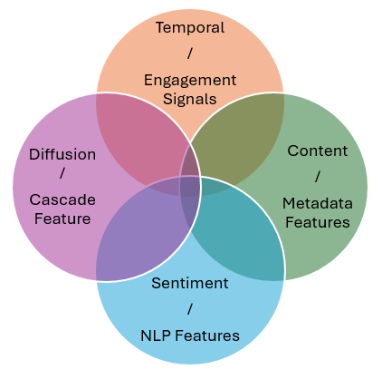

# 1. Introduction
## 1.1 Background and Relevance of Social Media Trend Detection

Social media platforms are major spaces for the rapid spread of information, opinions, and public discussion. Through reposts, comments, likes, and hashtags, topics can attract attention quickly and provide real-time signals of changing public interest. Detecting these trends early has practical value in areas such as marketing, journalism, public opinion monitoring, and finance. In financial contexts especially, sudden shifts in online discussion and sentiment may shape investor attention, influence expectations, and contribute to short-term market reactions.

## 1.2 Trend Emergence as a Research Problem

Despite its importance, identifying trend emergence at an early stage remains difficult. Social media activity is highly dynamic, noisy, and often short-lived. Many discussions produce brief spikes in attention before fading, while others develop into sustained trends with broader influence. In this review, trend emergence refers to the point at which a topic begins to move beyond ordinary background discussion and shows signs of sustained growth in attention, engagement, or diffusion. This differs from popularity prediction, which mainly estimates the eventual level of attention that content will receive.

<figure align="center">
  
  <figcaption>Figure 1: Trend Lifecycle.</figcaption>
</figure>

Recent research also suggests that online trends should be understood as part of a broader lifecycle rather than as isolated popularity outcomes. Wang and Huberman [6] show that collective attention follows identifiable temporal dynamics, while Kong et al. [7] describe popularity as evolving through stages such as emergence, growth, peak, and decline. Yuan and Li [8] further indicate that early stages of popularity evolution may contain signals that appear before large-scale diffusion. From this perspective, trend emergence is the earliest phase of a broader process, making it distinct from studies that focus mainly on final popularity or later-stage spread.

## 1.3 Scope of the Review and Research Gap
This literature review examines key methodological approaches relevant to this problem, including early popularity prediction, machine learning and content-based forecasting, sentiment analysis, and information diffusion research. 

<figure align="center">
  
  <figcaption>Figure 2: Early Trend Detection Methodologies.</figcaption>
</figure>
 
Together, these studies show that online behaviour can be predicted from temporal, behavioural, semantic, and structural signals. However, much of the literature focuses on predicting eventual popularity rather than detecting the earliest stage of trend formation. Many studies also rely on a single category of features, and relatively little attention has been given to finance-specific trend emergence. This review therefore evaluates the strengths and limitations of existing approaches and identifies the research gaps that support a predictive modelling project focused on the early detection of finance-related social media trends.