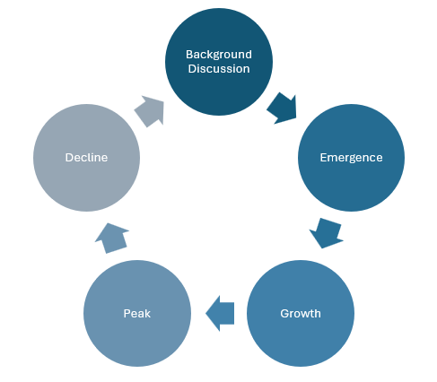

# 1. Introduction

## 1.1 Background and Relevance of Social Media Trend Detection

Social media platforms are major spaces for the rapid spread of information, opinions, and public discussion. Through reposts, comments, likes, and hashtags, topics can attract attention quickly and provide real-time signals of changing public interest. Detecting these trends early has practical value in areas such as marketing, journalism, public opinion monitoring, and finance. In financial contexts especially, sudden shifts in online discussion and sentiment may shape investor attention, influence expectations, and contribute to short-term market reactions.

## 1.2 Trend Emergence as a Research Problem

Despite its importance, identifying trend emergence at an early stage remains difficult. Social media activity is highly dynamic, noisy, and often short-lived. Many discussions produce brief spikes in attention before fading, while others develop into sustained trends with broader influence. In this review, trend emergence refers to the point at which a topic begins to move beyond ordinary background discussion and shows signs of sustained growth in attention, engagement, or diffusion. This differs from popularity prediction, which mainly estimates the eventual level of attention that content will receive.

<figure align="center">
  
  <figcaption>Figure 1: Trend Lifecycle.</figcaption>
</figure>

Recent research also suggests that online trends should be understood as part of a broader lifecycle rather than as isolated popularity outcomes. Wang and Huberman [6] show that collective attention follows identifiable temporal dynamics, while Kong et al. [7] describe popularity as evolving through stages such as emergence, growth, peak, and decline. Yuan and Li [8] further indicate that early stages of popularity evolution may contain signals that appear before large-scale diffusion. From this perspective, trend emergence is the earliest phase of a broader process, making it distinct from studies that focus mainly on final popularity or later-stage spread.

## 1.3 Scope of the Review and Research Gap
This literature review examines key methodological approaches relevant to this problem, including early popularity prediction, machine learning and content-based forecasting, sentiment analysis, and information diffusion research. 

<figure align="center">
  
  <figcaption>Figure 2: Early Trend Detection Methodologies.</figcaption>
</figure>
 
Together, these studies show that online behaviour can be predicted from temporal, behavioural, semantic, and structural signals. However, much of the literature focuses on predicting eventual popularity rather than detecting the earliest stage of trend formation. Many studies also rely on a single category of features, and relatively little attention has been given to finance-specific trend emergence. This review therefore evaluates the strengths and limitations of existing approaches and identifies the research gaps that support a predictive modelling project focused on the early detection of finance-related social media trends.

# 2. Early Popularity Prediction Foundations

## 2.1 Early Popularity Prediction as a Foundation

One of the earliest foundations of research relevant to social media trend prediction is early popularity prediction. Although it is not identical to trend emergence detection, it established the important idea that early user behaviour may contain signals about future online outcomes. This provides a useful starting point for understanding how initial activity can be analysed to anticipate later growth.

## 2.2 Temporal Patterns and Early Engagement Signals

A key contribution in this area came from Szabo and Huberman [1], who examined whether measurements collected shortly after publication could predict future popularity on platforms such as YouTube and Digg. Their results showed very strong correlations between early and later popularity, suggesting that online attention growth is not entirely random. The study also demonstrated that relatively simple statistical models could generate accurate forecasts by using early engagement data within short observation windows. This was important because it showed that predictive modelling could rely on measurable behavioural patterns rather than purely retrospective description.

## 2.3 Behavioural and Social Interaction Dynamics

Alongside temporal analysis, Lerman and Hogg [2] highlighted the role of behavioural and social dynamics. Their work suggested that popularity depends not only on the accumulation of views or votes, but also on how users discover, share, and respond to content within a social platform. This perspective is relevant to trend emergence because it emphasises that collective attention develops through interaction between users, content, and platform structures. It also supports the idea that predictive models may benefit from combining multiple behavioural indicators.

## 2.4 Contributions and Limitations for Trend Emergence Research

Together, these studies made two important contributions: they demonstrated that early online behaviour contains predictive signals, and they helped shift research toward forecasting rather than description. However, both studies mainly focused on eventual popularity rather than the earliest stage of trend emergence. They also relied largely on temporal and engagement-based indicators, giving limited attention to sentiment, semantic meaning, or domain-specific context. These limitations are important in finance-related environments, where public reaction and emotional tone may strongly influence whether a discussion develops into an emerging trend.

# 3. Machine Learning and Content-Based Prediction

## 3.1 Expanding Prediction Beyond Early Engagement

As social media prediction research developed, methods moved beyond simple temporal popularity measures toward machine learning approaches that used a wider range of predictive features. This shift was important because online attention is shaped not only by early engagement, but also by characteristics of the content itself. As a result, prediction increasingly came to rely on combining behavioural signals with structured information about source, topic, and language.

## 3.2 Content and Metadata as Predictive Features

A key example of this development is Bandari et al. [3], who examined whether the popularity of news stories could be predicted using content and metadata features before substantial user engagement had occurred. Their study included variables such as publication source, category, subjectivity, and named entities. The results showed that these features could classify articles into popularity categories with approximately 84% accuracy, although predicting exact popularity values remained more difficult. This was a significant contribution because it suggested that predictive signals may exist even before strong diffusion begins.

## 3.3 Methodological Contribution of Early Machine Learning

The study also marked an important methodological transition from simple correlation-based forecasting to more flexible machine learning pipelines based on feature extraction, model training, and classification. It broadened understanding of online attention by showing that popularity may depend not only on how users respond, but also on how information is framed and presented. This supports the idea that predictive models should include multiple feature types rather than relying on a single indicator.

## 3.4 Relevance and Limitations for Trend Emergence Research

Despite these advances, early machine learning approaches still focused mainly on popularity outcomes rather than the earliest stage of trend emergence. They also depended heavily on manually engineered features and offered limited insight into sentiment, contextual meaning, or how discussions spread through networks. These limitations are especially important in finance-related environments, where emotional tone and public reaction may strongly influence whether a discussion develops into an emerging trend.

# 4. NLP and Sentiment Analysis in Social Media Prediction

## 4.1 From Behavioural Signals to Textual Meaning

As social media platforms became important spaces for opinion sharing and public discussion, researchers began exploring whether the linguistic and emotional content of online posts could improve prediction. This led to the growing use of natural language processing (NLP) and sentiment analysis in social media research. Unlike earlier approaches focused mainly on engagement counts or temporal growth, sentiment-based methods attempt to capture what users are expressing and how they feel.

## 4.2 Sentiment and Collective Mood as Predictive Signals

A key study in this area is Bollen et al. [4], which examined whether public mood measured from Twitter could predict movements in the Dow Jones Industrial Average. Using nearly ten million tweets, the authors analysed multiple emotional dimensions, including Calm, Alert, Sure, Vital, Kind, and Happy, rather than relying only on simple positive–negative sentiment. Their results showed that some mood states, especially Calm, were associated with market movements several days in advance. When these signals were used in a neural-network model, the study reported approximately 87.6% directional prediction accuracy.

## 4.3 Contribution to Predictive Modelling Research

This study was important because it showed that social media content may contain predictive signals beyond simple popularity or engagement measures. It helped establish sentiment analysis as a major strand of predictive modelling research and demonstrated the value of transforming unstructured text into quantitative features. The paper also suggested that richer emotional representations may be more useful than simple polarity measures, which is especially relevant in finance-related environments where optimism, fear, and uncertainty often shape discussion dynamics.

## 4.4 Relevance and Limitations for Trend Emergence Research

Despite its influence, the study has clear limitations. It focused on market prediction rather than direct trend emergence, and its lexicon-based methods had limited ability to capture sarcasm, context, or financial jargon. The findings also do not establish causation, since external events may influence both social media mood and market outcomes. Nevertheless, the study remains highly relevant because it supports the inclusion of sentiment-based features as part of a broader framework for detecting early signals in finance-related social media discussions.

# 5. Information Diffusion and Cascade Prediction

As social media research developed, scholars increasingly recognised that popularity and trend emergence are shaped not only by individual interactions or content characteristics, but also by the ways in which information spreads through networks of users. This led to growing interest in information diffusion and cascade prediction, which examine how posts, discussions, or topics propagate across social media platforms over time. These approaches are especially relevant to trend emergence because trends often develop through expanding patterns of sharing and participation rather than through isolated popularity events.

An influential study in this area is Cheng et al. (2014), Can Cascades Be Predicted? The authors investigated whether large information cascades on Facebook could be predicted from early observations of diffusion behaviour. In this context, a cascade refers to the process by which information spreads from user to user through reposting or sharing, sometimes reaching very large audiences. By analysing millions of cascades, the study examined whether signals observed in the early stages of spread could predict whether a cascade would continue to grow substantially.

This work is important because it extended predictive modelling beyond simple popularity estimation toward the structural dynamics of information spread. Earlier studies such as Szabo and Huberman (2010) focused mainly on correlations between early and later popularity levels, whereas Cheng et al. emphasised how content moves through social networks and how diffusion behaviour influences large-scale spread. This perspective is highly relevant to trend emergence research because emerging trends are often characterised not only by increasing attention, but also by accelerating propagation across connected groups of users.

A major strength of the study is its large-scale empirical foundation. By examining millions of cascades, the authors were able to identify recurring diffusion patterns and demonstrate that early structural signals can improve predictive performance. The paper also showed that predictive accuracy increases substantially once models observe the first stages of cascade growth. This supports the broader idea that early diffusion behaviour contains meaningful predictive information, which aligns closely with the current project’s interest in identifying signals before trends become fully established.

Another important contribution is the study’s emphasis on multiple feature categories related to diffusion. Rather than relying only on content characteristics, the analysis considered temporal growth patterns, network structure, and user interaction behaviour. This strengthens the broader argument that predictive models benefit from integrating several dimensions of social media activity rather than depending on a single feature type. In particular, the study shows that trend formation is influenced not only by how popular content appears, but also by how it spreads socially between users.

However, the study also has several limitations when considered in relation to a practical student project. One major limitation is its dependence on large-scale platform data and detailed network structure. Cascade prediction often requires access to user relationships, resharing paths, and network connectivity, which may be difficult or impossible to obtain from publicly available datasets or APIs because of privacy restrictions and platform limitations. This makes full diffusion-based modelling difficult to reproduce outside large industrial research settings.

A second limitation concerns computational complexity. Graph-based diffusion models may offer strong predictive performance, but they can also require substantial infrastructure, processing power, and specialised data pipelines. These demands may exceed the scope of smaller academic projects. In addition, the study focuses mainly on whether cascades become large, rather than on the semantic meaning or sentiment of the content being shared. As a result, diffusion-based approaches alone may explain how information spreads, but not fully why particular discussions gain momentum or how emotional reactions contribute to their development.

The study is also platform-specific. Because it focuses on Facebook sharing cascades, its findings may not generalise directly to other environments such as Twitter or Reddit, where user behaviour, interaction mechanisms, and content formats differ. This is particularly important in the finance domain, where online discussion often develops through short posts, rapid reactions, and sentiment-driven commentary rather than through the same sharing patterns observed on Facebook. The study therefore provides useful conceptual insights, but its direct applicability across platforms remains limited.

Despite these limitations, Cheng et al. (2014) offers important support for the current project. The study reinforces the idea that trend emergence involves dynamic spread behaviour rather than isolated popularity measurements alone. It also supports the inclusion of temporal growth and engagement acceleration features within predictive modelling systems. At the same time, the practical constraints of full-scale diffusion modelling help justify a more manageable approach for the present project, which focuses on temporal, engagement, and sentiment-based features rather than attempting full graph reconstruction or industrial-scale cascade analysis.

Overall, diffusion and cascade prediction research expanded the understanding of social media trends by showing that the structure and dynamics of information spread play a central role in determining whether online discussions develop into large-scale phenomena. These studies demonstrate that predictive modelling benefits from considering not only popularity and content, but also the social propagation processes that shape how trends evolve. For this reason, diffusion research provides an important theoretical foundation for understanding trend emergence as a dynamic and socially distributed process, even when its full methodological complexity is not adopted directly.

# 6. Comparative Analysis and Research Gap

The literature reviewed demonstrates that predicting social media behaviour is a well-established research area, with previous studies approaching the problem from several different perspectives. Early popularity prediction research focused primarily on temporal engagement patterns, later machine learning studies introduced content-based and metadata features, sentiment analysis research explored emotional and textual signals, and diffusion studies examined how information spreads through social networks. Together, these studies provide important theoretical and methodological foundations for understanding how online trends develop and how predictive models can be constructed.

One clear pattern across the literature is the growing complexity of predictive approaches over time. Early studies such as Szabo and Huberman (2010) and Lerman (2010) mainly relied on temporal engagement behaviour and early interaction measurements. These studies demonstrated that early popularity signals can strongly correlate with later outcomes, establishing the idea that online attention follows partially predictable growth patterns. However, these approaches treated prediction largely as a popularity estimation problem and relied heavily on engagement counts without deeply analysing the semantic meaning or contextual characteristics of online discussions.

Later research introduced machine learning and feature engineering approaches that expanded prediction beyond simple temporal measurements. Bandari et al. (2012), for example, demonstrated that content features and metadata characteristics can contribute valuable predictive information alongside interaction behaviour. This represented an important transition because it showed that trend-related behaviour may be influenced not only by how users interact with content, but also by the structure, topic, and linguistic properties of the content itself. Compared to earlier popularity prediction studies, machine learning approaches therefore provided more flexible predictive frameworks capable of integrating multiple feature categories.

Research involving sentiment analysis further expanded predictive modelling by introducing semantic and emotional understanding of social media discussions. Bollen et al. (2011) showed that collective mood extracted from Twitter data may contain predictive behavioural signals related to financial activity. This work highlighted the importance of textual meaning and emotional dynamics within social media environments, suggesting that public sentiment can influence or reflect emerging collective behaviour. This represents a major difference from purely engagement-based prediction because it considers not only how much users interact, but also what users are expressing emotionally and semantically.

At the same time, diffusion and cascade prediction studies such as Cheng et al. (2014) demonstrated that trend formation is also influenced by how information spreads through networks of users. These approaches focused on structural propagation dynamics rather than only individual engagement measurements or textual content. By analysing resharing patterns and cascade growth behaviour, diffusion research provided deeper understanding of how discussions expand into large-scale social phenomena. This introduced a network-oriented perspective that complements temporal, engagement-based, and sentiment-based approaches.

Although these studies provide valuable insights, several important limitations and research gaps remain. One major limitation is that many previous studies focus primarily on predicting eventual popularity rather than detecting trend emergence during its earliest stages. Predicting whether content will become highly popular is related to, but not identical to, identifying whether a discussion is beginning to emerge as a trend. Trend emergence detection requires identifying subtle acceleration patterns and behavioural shifts before large-scale popularity has fully developed. Existing literature often focuses more strongly on final popularity outcomes than on this earlier prediction stage.

Another important limitation is that many studies rely heavily on a single category of predictive features. Early popularity prediction research focused mainly on temporal engagement signals, sentiment studies focused primarily on textual mood analysis, and diffusion research concentrated on network propagation behaviour. While these approaches individually provide useful insights, real-world social media trends are likely influenced by the interaction of multiple factors simultaneously. Temporal growth, engagement behaviour, sentiment shifts, and diffusion dynamics may all contribute to trend emergence together rather than independently. This creates a need for more integrated predictive modelling approaches.

Practical implementation challenges also appear repeatedly throughout literature. Several advanced approaches, particularly large-scale diffusion and industrial recommendation systems, depend on extensive datasets, detailed network structures, or computational resources that may be difficult to reproduce within smaller academic projects. For example, cascade prediction methods often require detailed graph-based user relationship data that may not be publicly accessible due to privacy and platform restrictions. Similarly, industrial-scale systems such as those developed by large technology companies may involve infrastructure and datasets beyond the scope of student-level research. These limitations highlight the importance of designing predictive systems that remain both academically meaningful and practically achievable.

Another gap in the literature is the relatively limited focus on finance-related trends emergence specifically. While Bollen et al. (2011) examined social media mood in relation to financial markets, much of the broader literature studies general popularity or information diffusion without concentrating specifically on financial discussion trends. Financial social media environments may behave differently from general entertainment or news-sharing platforms because they are strongly influenced by speculation, public sentiment, rapid reactions to events, and collective behavioural dynamics. This creates opportunities for more focused predictive modelling research within finance-related online discussions.

The literature therefore supports the direction of the proposed project in several ways. First, previous studies justify the use of temporal and engagement-based features for identifying early behavioural signals. Second, machine learning and sentiment analysis research support integrating textual and semantic information into predictive models. Third, diffusion research demonstrates the importance of analysing how discussions spread dynamically across online environments. However, the limitations identified across the literature also suggest the need for a more practical and integrated predictive modelling approach.

The proposed project aims to address these gaps by developing a predictive model focused specifically on early-stage social media trend emergence within the finance domain. Rather than relying on only one predictive dimension, the project intends to combine temporal, engagement, and sentiment-based features within a manageable machine learning framework. In contrast to large-scale industrial systems or highly complex graph-based diffusion models, the project also prioritises practical feasibility while still incorporating concepts established in previous research. Through this approach, the project seeks to build upon the strengths of earlier studies while addressing some of their limitations regarding feature integration, early-stage prediction, and practical implementation scope.

# 7. Conclusion

The literature reviewed in this survey demonstrates that social media prediction has evolved through several important stages, beginning with early popularity prediction research and later expanding into machine learning, sentiment analysis, and diffusion modelling approaches. Together, these studies provide a strong theoretical and methodological foundation for understanding how online discussions develop, spread, and potentially evolve into large-scale trends.

Early popularity prediction research, particularly the work of Szabo and Huberman (2010) and Lerman (2010), established that early engagement behaviour and temporal growth patterns contain valuable predictive information. These studies showed that online attention is not entirely random and that early user interaction measurements can help estimate future popularity outcomes. However, these approaches mainly focused on popularity magnitude and relied heavily on engagement-based indicators without incorporating deeper semantic understanding or multi-dimensional feature integration.

Machine learning and content-based prediction research, represented by Bandari et al. (2012), expanded predictive modelling beyond simple temporal analysis by introducing feature engineering approaches using content and metadata characteristics. This demonstrated that predictive systems could benefit from combining multiple types of information rather than relying on a single predictive signal. Meanwhile, sentiment analysis research such as Bollen et al. (2011) introduced the importance of emotional and semantic information within social media discussions, showing that collective mood and textual sentiment may also provide predictive insights, particularly within finance-related environments.

Diffusion and cascade prediction studies, including Cheng et al. (2014), further extended this understanding by examining how information spreads through social networks. These studies demonstrated that trend formation is influenced not only by content popularity or sentiment, but also by dynamic propagation behaviour and user interaction structures. This research highlighted the importance of considering social diffusion processes when analysing how online trends emerge and expand.

Despite these advances, the literature also reveals several important limitations. Many previous studies focus primarily on predicting eventual popularity rather than detecting early-stage trend emergence. In addition, many approaches depend heavily on a single category of features, such as temporal engagement, sentiment, or diffusion structure, rather than integrating multiple predictive dimensions together. Some advanced methods also require large-scale industrial datasets, extensive network information, or computational resources that may not be practical for smaller academic projects.

These gaps justify the direction of the proposed project. The project aims to build upon previous research by developing a predictive modelling approach focused specifically on the early detection of finance-related social media trend emergence. Rather than relying on only one predictive perspective, the project intends to combine temporal, engagement, and sentiment-based features within a manageable machine learning framework. This approach attempts to balance academic relevance, practical feasibility, and methodological integration while remaining achievable within the scope of a student project.

Overall, the literature suggests that early trend detection is a realistic and meaningful research problem, but also one that remains challenging due to the dynamic and multi-dimensional nature of social media behaviour. By combining insights from early popularity prediction, machine learning, sentiment analysis, and diffusion research, the proposed project aims to contribute a practical predictive modelling approach for understanding and identifying emerging financial discussions on social media platforms.

# 8. References

[1] Gabor Szabo and Bernardo A. Huberman. 2010. Predicting the popularity of online content. Communications of the ACM 53, 8 (2010), 80–88. https://doi.org/10.1145/1787234.1787254

[2] Kristina Lerman and Tad Hogg. 2010. Using a model of social dynamics to predict popularity of news. In Proceedings of the 19th International Conference on World Wide Web (WWW '10). ACM, New York, NY, USA, 621–630. https://doi.org/10.1145/1772690.1772758

[3] Roozbeh Bandari, Sitaram Asur, and Bernardo A. Huberman. 2012. The pulse of news in social media: Forecasting popularity. In Proceedings of the International AAAI Conference on Web and Social Media, Vol. 6, No. 1. AAAI Press, 26–33.

[4] Johan Bollen, Huina Mao, and Xiao-Jun Zeng. 2011. Twitter mood predicts the stock market. Journal of Computational Science 2, 1 (2011), 1–8. https://doi.org/10.1016/j.jocs.2010.12.007

[5] Justin Cheng, Lada Adamic, P. Alex Dow, Jon Kleinberg, and Jure Leskovec. 2014. Can cascades be predicted? In Proceedings of the 23rd International Conference on World Wide Web (WWW '14). ACM, New York, NY, USA, 925–936. https://doi.org/10.1145/2566486.2567997

[6] Chunyan Wang and Bernardo A. Huberman. 2012. Long trend dynamics in social media. EPJ Data Science 1, 1 (2012), Article 2. https://doi.org/10.1140/epjds2

[7] Qingqing Kong, Wei Mao, Guangxing Chen, and Daniel Zeng. 2018. Exploring trends and patterns of popularity stage evolution in social media. IEEE Transactions on Systems, Man, and Cybernetics: Systems 48, 12 (2018), 2408–2420. https://doi.org/10.1109/TSMC.2017.2719279

[8] Dongyuan Yuan and Yan Li. 2025. Discovering and early predicting popularity evolution patterns of social media emergency information. Aslib Journal of Information Management 77, 1 (2025), 115–137. https://doi.org/10.1108/AJIM-06-2024-0288
