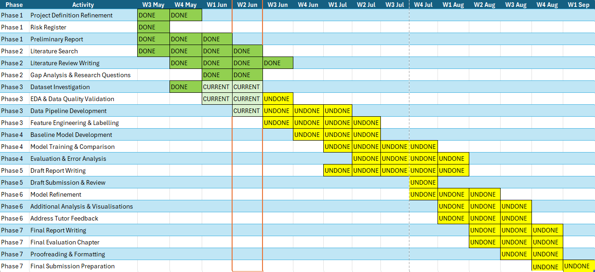

# Preliminary Report

Final Year Project (BSc in Computer Science)

## 1. Project Definition

### 1.1 Title

Predicting Engagement and Sentiment Surges in Stock-Related Social Media Discussions

This project follows **CM3005 Data Science Project Idea: Predictive Modelling of Social Media Trend Emergence** focusing on the design, implementation, and evaluation of a machine learning system that predicts future surge events from historical social media discussions.

### 1.2 Objectives

- Develop a predictive model using early-stage discussion features to forecast whether a stock-related social media discussion will experience a significant engagement and sentiment surge within 24 hours
- Engineer meaningful features from raw social media discussion data including temporal, textual, activity-frequency, and sentiment signals
- Compare traditional ML approaches (Logistic Regression, Random Forest, XGBoost) for binary surge classification
- Evaluate model performance using standard classification metrics (accuracy, precision, recall, F1, AUC-ROC)

### 1.3 Problem Statement

Financial discussions on social media platforms often experience sudden increases in public attention and emotional intensity. Discussions surrounding specific stocks can rapidly attract large numbers of comments, interactions, and strong sentiment, particularly following news events, earnings announcements, rumours, or speculative activity. These surges can develop within hours, making them difficult to anticipate through manual monitoring alone.

This problem affects multiple stakeholder groups:

- **Financial analysts and portfolio managers** who monitor social sentiment as a supplementary signal for investment decisions and need early warning of discussions gaining momentum.
- **Market surveillance teams and regulators** who track potential market manipulation, coordinated pump-and-dump activity, or rumour-driven volatility on social platforms.
- **Quantitative researchers** studying the relationship between social media dynamics and market microstructure, who require reproducible methods for identifying surge events in historical data.
- **Platform operators and content moderators** who allocate resources to discussions experiencing rapid growth in activity and emotional intensity.

In large social media environments, thousands of stock-related discussions occur every day. The volume makes it impractical to manually assess which discussions are likely to experience substantial growth before that growth becomes obvious. Automated prediction allows these stakeholders to focus attention on the small subset of discussions showing early surge signals.

Existing research frequently focuses on predicting overall popularity or analysing already-popular content [1][3], providing less emphasis on forecasting whether a stock-related discussion is about to experience a significant surge within a clearly defined future time window. Studies that do address financial social media often focus on sentiment-to-market correlations [4] rather than on predicting the social media dynamics themselves.

### 1.4 Unit of Analysis and Prediction Scope

A central design question is: *what exactly is being predicted?* The project title refers to "surges in stock-related social media discussions," but this phrase is ambiguous — it could mean a surge within a single thread, a surge across all discussion about a specific ticker, or a surge across an entire subreddit. This section defines the prediction scope precisely.

#### Terminology

- **Record**: A single row in the dataset representing one Reddit submission (post). Each record has its own timestamp, title, body text, engagement counts (score, num_comments), and extracted ticker symbols. This is the atomic unit of the dataset.

- **Ticker-window**: The set of all records mentioning the same stock ticker within a defined time interval. This is the primary analytical grouping.

- **Discussion thread**: A Reddit post and its associated comments. Thread-level data is not available in the dataset (comments are not linked to parent submissions), so thread-level prediction is not feasible.

#### Prediction target: Per-ticker surge detection

**The prediction operates at the record level but measures surges scoped to the same ticker.** For a given record mentioning ticker $X observed at time *t*, the system asks:

> *"Will discussion about ticker $X experience a surge in engagement and sentiment within the next 24 hours?"*

Specifically, the "subsequent records within *(t, t + 24h]*" used in the composite surge computation are **records in the dataset that mention the same ticker** within that time window. This means:

- A record about $TSLA is evaluated against future $TSLA activity, not against unrelated $AAPL posts
- The prediction is per-ticker rather than per-subreddit — it detects whether a specific stock's discussion is about to surge
- Records mentioning multiple tickers contribute to the window of each mentioned ticker independently

This scoping is the most defensible interpretation because:

1. **Conceptual coherence** — "A surge in stock-related discussion" most naturally refers to intensifying activity around a specific stock, not to an entire forum becoming more active. A subreddit-wide surge would conflate unrelated events (e.g., $GME and $AAPL surging simultaneously for different reasons).

2. **Practical utility** — Stakeholders (analysts, surveillance teams) care about surges in discussion around specific securities, not about aggregate forum traffic. A per-ticker prediction directly answers: "Should I pay attention to what's happening with this stock right now?"

3. **Data availability** — The dataset includes extracted ticker symbols per record, making ticker-scoped windowing feasible without requiring thread-linking metadata.

4. **Alignment with the literature** — Early popularity prediction [1][5] and cascade prediction [5] both operate at the level of individual content items or topics, not at the level of entire platforms.

#### Implications and limitations

- Records that do not mention any identifiable ticker are excluded from surge labelling (they lack a grouping key).
- **Ticker sparsity (Risk #9).** For tickers with very few records in the dataset, the 24-hour window may contain 0, 1, or 2 future records — too few to compute a stable posting volume growth ratio or meaningful mean sentiment. A single outlier post in a sparse window could flip the surge label arbitrarily. This is likely to affect the majority of the 2,912 tickers in the pennystocks dataset, as ticker frequency distributions in social media follow a heavy-tailed power law (a small number of tickers dominate discussion volume). Mitigation: enforce a minimum record count (default N ≥ 3) within each ticker's 24-hour window; records failing this threshold will be excluded from surge labelling. The exclusion rate and its effect on class distribution will be quantified during EDA.
- Records mentioning multiple tickers receive a label based on the combined activity across all mentioned tickers — a simplification that could be refined by computing per-ticker labels independently.
- The model still makes predictions at the record level (one prediction per record), but the target label reflects ticker-scoped dynamics rather than subreddit-wide dynamics.
- If future work uses a single-ticker filtered dataset (e.g., only $GME posts), the ticker scoping becomes equivalent to global scoping within that subset.

### 1.5 Surge Definition

In this project, a **surge** is defined as a statistically significant increase in the composite posting-volume-and-sentiment metric for a specific stock ticker within a fixed 24-hour prediction window. Specifically, for a given record mentioning ticker $X observed at time *t*, the system computes:

- **Posting volume growth**: the relative change in the number of posts mentioning ticker $X between the prior 24 hours and the subsequent 24 hours — specifically, *(count of $X posts in (t, t + 24h]) / max(count of $X posts in (t − 24h, t], 1)) − 1*.
- **Sentiment change**: the absolute difference between the sentiment polarity at observation time and the mean sentiment polarity of subsequent $X-mentioning records within the window.

The **composite surge metric** is defined using z-score normalisation to ensure both components contribute equally:

> *z_volume = (posting_volume_growth − μ_vol) / σ_vol*
>
> *z_sentiment = (|sentiment_change| − μ_sent) / σ_sent*
>
> *composite = (w₁ × z_volume) + (w₂ × z_sentiment)*

where μ and σ are the mean and standard deviation of each raw component computed from the training partition only, and w₁ = w₂ = 0.5 by default (equal weighting).

A record is labelled as a surge (1) if the composite metric exceeds a configurable threshold *τ* (in standard deviation units), and no-surge (0) otherwise.

**Why z-score normalisation.** The two raw components operate on fundamentally different scales: posting volume growth is an unbounded ratio (where 1.0 represents doubling, but values of 10+ are common for tickers that go from 1–2 posts/day to 10+), while |sentiment_change| is bounded by approximately [0, 2.0] given TextBlob's polarity range of [−1, +1]. Without normalisation, the composite metric would be dominated by the volume component — rendering sentiment structurally unable to influence the surge label. Z-score normalisation places both components on a common zero-mean, unit-variance scale, ensuring that each contributes proportionally to the composite regardless of its raw magnitude. The threshold *τ* then has a clear statistical interpretation: "the combined signal exceeds *τ* standard deviations above the typical joint activity level."

**Why posting volume rather than engagement scores.** The dataset provides engagement metrics (score, num_comments) as final snapshot values at crawl time, not as point-in-time values at post creation. Using these values in the surge formula would introduce a circular dependency: posts that eventually experience a surge accumulate high scores *because* of the surge, so measuring score growth would be measuring the surge's effect rather than detecting its onset. Posting volume growth — the increase in the number of posts about a ticker — is derived entirely from creation timestamps, which are fixed at post creation and uncontaminated by future activity.

**Normalisation statistics and data leakage prevention.** The mean (μ) and standard deviation (σ) for each component are computed exclusively from the training partition (the first 80% of records by timestamp). Test-set records are normalised using these training-set statistics, not their own. This prevents information about the test distribution from leaking into the labelling process. Because the normalisation is fitted on training data, the z-scores on test records may not be perfectly centred at zero — this is expected and mirrors realistic deployment conditions where future distributional shifts are unknown.

**Threshold determination.** The composite threshold *τ* will be determined empirically during EDA rather than set a priori. Because both components are standardised, *τ* is expressed in units of standard deviations of the combined metric. The threshold sensitivity analysis (Section 4.7) will sweep a range of candidate values and select the operating point that balances class distribution against model trainability. The goal is to produce a surge rate of approximately 5–10% (imbalance ratio 10:1 to 18:1) as indicated by the preliminary viability analysis (Section 2.2).

**Configurable weighting.** The default equal weighting (w₁ = w₂ = 0.5) reflects an agnostic prior about the relative importance of volume versus sentiment in defining a surge. The weight sensitivity analysis (Section 4.7) will sweep w₂ ∈ {0, 0.25, 0.5, 0.75, 1.0} (with w₁ = 1 − w₂) to empirically assess how the relative contribution of each component affects class distribution and model performance.

**Phased experimental approach.** To empirically validate the composite design, the project adopts a two-phase modelling strategy:

- **Phase 1 (Baseline): Volume-only prediction.** The initial models will be trained using a posting-volume-only surge target — setting w₂ = 0 so that the composite reduces to z_volume alone.

- **Phase 2 (Advanced): Composite volume + sentiment prediction.** The full composite target (w₁ × z_volume + w₂ × z_sentiment, with w₁ = w₂ = 0.5) will then be introduced, with models trained on the combined feature set including sentiment scores.

This phased design strengthens the project's contribution by providing controlled evidence for (or against) the value of composite targets, rather than assuming that combining signals is inherently beneficial.

### 1.6 Motivation

- Discussions experiencing rapid posting volume growth and sentiment shifts often attract broader public attention and may influence information diffusion, investor behaviour, and market perception [4]
- Platforms hosting financial discussions (e.g., Reddit, StockTwits) process thousands of new posts daily, making manual identification of emerging surges impractical for analysts and researchers
- Early detection of surge-prone discussions enables proactive monitoring rather than reactive analysis, with applications in financial risk assessment, market surveillance, and social media analytics
- The 2021 GameStop short squeeze demonstrated how rapidly escalating social media discussion can translate into real market impact, underscoring the need for early warning systems [5]
- Addresses a gap in the academic literature around short-term composite surge prediction that integrates both engagement and sentiment signals within a clearly bounded time window

---

## 2. Scope and Boundaries

### 2.1 In Scope

- Pre-collected static dataset of stock-related social media discussions (CSV/Parquet)
- Feature engineering: temporal, textual, sentiment, and activity-frequency features
- Binary classification: surge (1) vs no-surge (0) within 24-hour window
- Traditional ML models: Logistic Regression, Random Forest, XGBoost
- Optional deep learning baseline (LSTM/Transformer) for comparison
- Standard evaluation metrics and visualisations
- Reproducible pipeline with seeded randomness

### 2.2 Dataset

The primary data source is the **Reddit Finance Data** dataset published on Kaggle (https://www.kaggle.com/datasets/leukipp/reddit-finance-data). This dataset contains submissions from nine stock-related subreddits collected over the calendar year 2021, totalling approximately **1.38 million records**. The primary development dataset is `pennystocks/submissions_reddit.csv` (54,785 records, 2,912 tickers) selected for high data completeness (20.7% selftext missing), sufficient volume for model training, and diverse ticker coverage.

### 2.3 Out of Scope

- Real-time or live data ingestion from APIs
- Deployment as a production service
- Trading signals or financial advice
- Multi-class or regression targets
- Cross-platform data fusion (single source dataset)

---

## 3. Proposed Methodology

### 3.1 Data Pipeline Stages

1. **Data Loading** — Read static dataset from disk (CSV/Parquet)
2. **Preprocessing** — Deduplicate, parse timestamps, normalise text, remove nulls
3. **Feature Engineering** — Compute sentiment, temporal, activity-frequency, and text features
4. **Target Labelling** — Compute composite surge target using 24-hour prediction window
5. **Model Training** — Train LR, RF, XGBoost with temporal train-test split
6. **Evaluation** — Compute metrics, generate confusion matrices and ROC curves

### 3.2 Tools and Technologies

- Python 3.10+
- pandas, numpy, scikit-learn, XGBoost
- TextBlob (sentiment analysis)
- matplotlib (visualisation)
- Jupyter notebooks (exploration)
- pytest + Hypothesis (testing)

### 3.3 System Architecture

The pipeline follows a linear staged architecture where each stage receives the output of its predecessor. All stages share a centralised configuration module and produce deterministic outputs via seeded randomness.

<figure align="center">
  
  <figcaption>Figure 2: Data Pipeline.</figcaption>
</figure>

The system is implemented as a Python package (`surge_pipeline`) with a corresponding CLI entry point (`run_pipeline.py`). Each module exposes a well-defined function interface, allowing both notebook-based exploration and script-based batch execution.

### 3.4 Feature Design

The feature engineering module computes features for each discussion record. A critical design constraint is that **only information available at observation time *t*** may be used as a prediction feature.

| Feature | Type | Description | Rationale |
|---------|------|-------------|-----------|
| `sentiment_score` | Continuous [-1, 1] | TextBlob polarity of post text | Captures emotional tone; strong sentiment may precede surges [4] |
| `hour_of_day` | Discrete [0–23] | Hour when the post was created | Trading hours and after-hours activity show different surge patterns |
| `day_of_week` | Discrete [0–6] | Day when the post was created | Weekend vs weekday discussion dynamics differ |
| `time_since_previous` | Continuous ≥ 0 | Hours since previous post mentioning the same ticker | Rapid successive posting about the same ticker signals emerging activity [1] |
| `ticker_post_rate_24h` | Continuous ≥ 0 | Number of posts mentioning this ticker in the 24 hours before time *t* | Measures current per-ticker discussion intensity using only historical data |
| `ticker_post_acceleration` | Continuous | Ratio of post count in prior 12h to post count in prior 12–24h | Captures whether per-ticker discussion frequency is already increasing |
| `word_count` | Discrete ≥ 0 | Number of whitespace-separated tokens in post text | Longer posts may carry more informational content [3] |
| `title_length` | Discrete ≥ 0 | Number of whitespace-separated tokens in post title | Short urgent titles vs. detailed titles may signal different discussion types |
| `num_tickers_mentioned` | Discrete ≥ 1 | Count of distinct ticker symbols in the post | Multi-ticker posts may indicate broader market discussion vs. focused analysis |

**Excluded features.** The dataset fields `score` and `num_comments` are explicitly excluded from the feature set because they represent final snapshot values that are not available at observation time. Using them would constitute temporal data leakage.

### 3.5 Composite Target Design

The binary surge target is computed at the record level using a forward-looking 24-hour window, scoped to the same ticker. The target uses **posting volume** (record counts derived from timestamps) rather than engagement scores, because score and num_comments in the dataset are snapshot values that are not available at observation time.

---

## 4. Evaluation Strategy

### 4.1 Performance Metrics

Each trained model will be evaluated on the temporally held-out test set using the following classification metrics:

| Metric | Purpose |
|--------|---------|
| **Accuracy** | Overall proportion of correct predictions |
| **Precision** | Proportion of predicted surges that are actual surges (minimises false alarms) |
| **Recall** | Proportion of actual surges that are correctly predicted (minimises missed surges) |
| **F1-Score** | Harmonic mean of precision and recall, balancing both concerns |
| **AUC-ROC** | Area under the Receiver Operating Characteristic curve; measures discriminative ability across all classification thresholds |

Given the expected class imbalance (surges are rare events), precision-recall trade-offs and AUC-ROC will be prioritised over raw accuracy as primary evaluation criteria.

### 4.2 Train-Test Split Strategy

The dataset will be split using **temporal ordering** rather than random sampling to prevent data leakage:

- Records are sorted chronologically by timestamp
- The first 80% (configurable) form the training set
- The remaining 20% form the test set
- This ensures no future information leaks into training, reflecting realistic deployment conditions

### 4.3 Hyperparameter Tuning via Temporal Cross-Validation

Hyperparameter selection for each model is conducted within the training partition using **expanding-window temporal cross-validation** with *k* = 4 sequential folds, producing 3 train/validation splits. Candidate hyperparameter configurations are evaluated by mean validation AUC-ROC across the 3 splits.

### 4.4 Baseline Comparison

Model performance will be compared against:

- **Random baseline** — AUC-ROC of 0.5 (no discriminative power)
- **Majority-class baseline** — Always predicting "no surge"
- **Single-feature baselines** — Individual features used alone as predictors

A model is considered to demonstrate meaningful predictive signal if it achieves AUC-ROC > 0.60 on the test set.

### 4.5 Threshold and Weight Sensitivity Analysis

The full pipeline will be executed at threshold values of *τ* ∈ {0.5, 1.0, 1.5, 2.0, 2.5} (in standard deviation units of the composite metric), producing five distinct labelling configurations to characterise threshold sensitivity.

---

## 5. Risk Register

| # | Risk | Likelihood | Impact | Mitigation | Status |
|---|------|-----------|--------|------------|--------|
| 1 | Class imbalance (few surge events) | High | High | Use stratified evaluation, consider SMOTE/class weighting, report precision-recall curves | Open |
| 2 | Sentiment analysis accuracy (TextBlob limitations) | Medium | Medium | Document limitations, consider FinBERT as alternative if time allows | Open |
| 3 | Data quality issues (missing fields, noise) | Medium | Medium | Robust preprocessing with logging, document exclusion criteria | Open |
| 4 | Temporal data leakage via train-test split | Medium | High | Strict temporal split, no future data in features or labels | Open |
| 5 | Overfitting on small dataset | Medium | High | Temporal cross-validation, regularisation, report train vs test gaps | Open |
| 6 | Composite target threshold and weight sensitivity | Medium | Medium | Z-score normalisation ensures equal component contribution; sensitivity analysis across multiple thresholds | Open |
| 7 | Time constraints for deep learning baseline | Medium | Low | Mark as optional, prioritise traditional ML models | Open |
| 8 | Reproducibility failures across environments | Low | Medium | Pin all dependencies, use fixed random seeds, document setup | Open |
| 9 | Per-ticker sparsity destabilises surge metric | High | High | Enforce minimum record count (N ≥ 3) within 24h ticker window; exclude records below threshold | Open |
| 10 | Snapshot engagement values as features (data leakage) | High | Critical | Features use only timestamps, text, and backward-looking post counts | Mitigated |
| 11 | Snapshot engagement values in target formula (circular labelling) | High | Critical | Target uses posting volume growth derived from timestamps only | Mitigated |
| 12 | Temporal concept drift (Q1 meme-stock era vs Q3–Q4 normalisation) | Medium | Medium | Report train/test surge rate differences; acknowledge as limitation | Open |

---

## 6. Project Plan and Timeline

<figure align="center">
  
  <figcaption>Figure 1: Project Timeline.</figcaption>
</figure>

---

## 7. Initial Literature Review Summary

### 7.1 Key Research Areas

The project draws on four established research areas within social media prediction and computational finance:

1. **Early popularity prediction** — Foundational work demonstrating that early engagement signals correlate strongly with future popularity [1][2].
2. **Machine learning and content-based prediction** — Studies incorporating content metadata and structured classification pipelines to predict online attention [3].
3. **NLP and sentiment analysis for financial prediction** — Research applying NLP to extract emotional signals from financial social media [4].
4. **Information diffusion and cascade prediction** — Work using early propagation patterns to forecast content growth [5].

### 7.2 Critical Evaluation of Foundational Works

Szabo and Huberman [1] demonstrated strong log-linear correlations between early and later popularity on YouTube and Digg. However, their model assumes a stationary growth process and relies on content that has already accumulated measurable engagement, limiting applicability to pre-engagement prediction.

Bandari et al. [3] demonstrated that content metadata could predict popularity before engagement accumulates, achieving ~84% classification accuracy. However, the study used coarse popularity bins and features designed for news articles rather than user-generated financial discussion.

Bollen et al. [4] demonstrated that aggregate Twitter mood predicted Dow Jones movements with ~87.6% directional accuracy. However, the evaluation period was short, no out-of-sample validation was reported, and the lexicon-based tools lack domain specificity for financial language.

Cheng et al. [5] achieved ~79.5% accuracy (AUC 0.877) predicting whether Facebook photo cascades would double in size. The methodological rigour was strong but the study focused exclusively on image resharing on a platform with different characteristics to text-based financial forums.

### 7.3 Synthesis and Identified Research Gap

Three critical gaps remain:

1. **Prediction target mismatch** — Most studies predict eventual outcomes rather than detecting the onset of rapid growth within a bounded time window.
2. **Single-signal approaches** — Each research strand demonstrates the value of one feature category, yet few combine these signals into an integrated predictive framework.
3. **Domain transfer problem** — Reviewed studies draw on general social media rather than finance-specific discussion platforms.

This project addresses all three gaps by defining a composite binary surge target within a fixed 24-hour window, combining temporal, engagement, sentiment, and textual features, and applying the framework to stock-related social media discussions.

---

## 8. Success Criteria

| Tier | AUC-ROC | Interpretation |
|------|---------|----------------|
| **Minimum success** | > 0.60 | Demonstrates predictive signal above random |
| **Target success** | > 0.70 | Moderate discriminative power; comparable to related literature [1][5] |
| **Stretch goal** | > 0.80 | Strong predictive performance |

---

## 9. Feature Prototype

This chapter presents the working prototype of the project's most technically challenging component: the **end-to-end surge prediction pipeline** — from raw data ingestion through composite surge labelling, feature engineering, model training with temporal cross-validation, and evaluation on a held-out test set. The prototype demonstrates that the proposed methodology is feasible and produces meaningful predictive signal, achieving AUC-ROC of 0.733 on the temporally held-out test partition — exceeding the target success criterion of 0.70.

### 9.1 Prototype Scope and Technical Challenge

The prototype implements the full six-stage pipeline described in Section 3.1 as a modular Python package (`surge_pipeline`) comprising seven interconnected modules:

| Module | Responsibility | Key Technical Challenge |
|--------|---------------|------------------------|
| `loader.py` | CSV ingestion, regex-based ticker extraction, multi-ticker record explosion | Extracting stock tickers from unstructured Reddit text while filtering 200+ false-positive stopwords |
| `windowing.py` | Per-ticker temporal windowing with O(n log n) binary search | Vectorised `searchsorted` computation of forward/backward 24-hour posting counts across 2,912 tickers |
| `sentiment.py` | TextBlob polarity computation and mean future sentiment derivation | Computing per-record polarity for 80,212 records with title-fallback handling for missing selftext |
| `labelling.py` | Temporal split, z-score normalisation, composite metric, binary labelling | Fitting normalisation statistics on training partition only to prevent data leakage |
| `features.py` | Nine backward-only prediction features | Ensuring strict temporal isolation — no feature uses information from after observation time *t* |
| `training.py` | Logistic Regression with expanding-window temporal cross-validation | Grid search over 10 hyperparameter configurations with k=4 fold temporal CV |
| `evaluation.py` | Precision, Recall, F1, ROC-AUC computation | Handling extreme class imbalance (50.9:1 ratio on test set) |

The pipeline is orchestrated by `pipeline.py` and executed via a CLI entry point (`run_pipeline.py`) supporting both full pipeline mode and threshold-sweep-only mode. All operations are deterministic with fixed random seed (default: 42), ensuring reproducibility.

### 9.2 Prototype Execution Results

The prototype was executed on the `r_pennystocks_submissions_reddit.csv` dataset (54,785 raw records) with the following configuration:

| Parameter | Value |
|-----------|-------|
| Composite threshold τ | 1.5 (standard deviations) |
| Volume weight w₁ | 0.5 |
| Sentiment weight w₂ | 0.5 |
| Temporal split ratio | 0.8 (80% train / 20% test) |
| Minimum window count | 3 (records in 24h forward window) |
| Random seed | 42 |

#### Data Flow Summary

The pipeline processed the data through six stages with the following record counts:

1. **Loading**: 54,785 raw submissions → ticker extraction → multi-ticker explosion → **80,212 record-ticker pairs**
2. **Windowing**: Computed forward/backward 24-hour posting counts per ticker. Applied minimum window count filter: **71,635 records excluded** (89.3% exclusion rate) due to ticker sparsity — the majority of the 2,912 tickers have fewer than 3 posts within any 24-hour window, confirming Risk #9 (ticker sparsity).
3. **Sentiment**: TextBlob polarity computed for all 80,212 records; mean future sentiment derived from forward-window records of the same ticker.
4. **Labelling**: Temporal split at the 80th percentile timestamp. Z-score normalisation fitted on training partition only (μ_vol = 1.437, σ_vol = 3.306, μ_sent = 0.136, σ_sent = 0.153). Composite metric computed and thresholded at τ = 1.5.
5. **Feature engineering**: Nine backward-only features computed for all non-excluded records.
6. **Training and evaluation**: Logistic Regression trained on 8,058 included training records with expanding-window temporal cross-validation.

#### Class Distribution

| Partition | Surge | No-Surge | Total | Surge Rate | Imbalance Ratio |
|-----------|-------|----------|-------|------------|-----------------|
| All (included) | 284 | 8,293 | 8,577 | 3.31% | 29.2:1 |
| Training | 274 | 7,784 | 8,058 | 3.40% | 28.4:1 |
| Test | 10 | 509 | 519 | 1.93% | 50.9:1 |

The test set exhibits a notably lower surge rate (1.93%) than training (3.40%), confirming temporal concept drift (Risk #12): the later period (approximately August–December 2021) shows reduced surge activity compared to the earlier period characterised by heightened retail trading interest.

### 9.3 Model Evaluation

The Logistic Regression baseline was trained using expanding-window temporal cross-validation (k=4 folds, 3 train/validation splits) with a grid search over 10 hyperparameter configurations (C ∈ {0.01, 0.1, 1.0, 10.0, 100.0} × penalty ∈ {L1, L2}). The model uses `class_weight='balanced'` to address the severe class imbalance.

#### Test Set Performance

| Metric | Value | Interpretation |
|--------|-------|----------------|
| **ROC-AUC** | **0.733** | Exceeds target success criterion (>0.70); the model has moderate discriminative ability |
| Precision | 0.028 | Very low — most predicted surges are false positives |
| Recall | 0.900 | High — the model detects 9 of 10 actual surges |
| F1-Score | 0.054 | Low due to precision-recall imbalance |

#### Confusion Matrix

|  | Predicted No-Surge | Predicted Surge |
|---|---|---|
| **Actual No-Surge** | 196 (TN) | 313 (FP) |
| **Actual Surge** | 1 (FN) | 9 (TP) |

**Interpretation.** The AUC-ROC of 0.733 demonstrates that the model has learned meaningful discriminative signal — it can rank surge-likely records higher than non-surge records across classification thresholds, substantially above the random baseline of 0.50. This validates the core hypothesis that early-stage features contain predictive information about future surges, aligning with findings from Szabo and Huberman [1] and Cheng et al. [5] regarding the predictive value of early behavioural signals.

However, the precision-recall trade-off reveals the challenge of operating at the default 0.5 classification threshold on severely imbalanced data. The model aggressively predicts surges (322 positive predictions out of 519 test records) to achieve high recall, resulting in many false alarms. This is a well-understood consequence of `class_weight='balanced'` with extreme imbalance ratios (50.9:1 on test data) — the model is incentivised to capture all positive instances at the cost of specificity. The AUC-ROC metric, which evaluates discriminative ability across *all* thresholds rather than at a single operating point, is therefore the more appropriate primary metric for this prototype stage.

### 9.4 Threshold Sensitivity Analysis

The pipeline's threshold sweep mode was executed across five candidate thresholds to characterise how the surge definition affects class distribution and model viability:

| Threshold (τ) | Surge Count | No-Surge Count | Surge Rate | Imbalance Ratio | Viable (5–10%) |
|---------------|-------------|----------------|------------|-----------------|----------------|
| 0.5 | 1,303 | 7,274 | 15.19% | 5.6:1 | No |
| **1.0** | **591** | **7,986** | **6.89%** | **13.5:1** | **Yes** |
| 1.5 | 284 | 8,293 | 3.31% | 29.2:1 | No |
| 2.0 | 167 | 8,410 | 1.95% | 50.4:1 | No |
| 2.5 | 89 | 8,488 | 1.04% | 95.4:1 | No |

<figure align="center">
  
  <figcaption>Figure 3: Threshold sensitivity curve showing surge rate and imbalance ratio across threshold values.</figcaption>
</figure>

**Key finding.** Only τ = 1.0 produces a surge rate within the target viability range (5–10%), yielding a 6.89% surge rate with 13.5:1 imbalance. The prototype's operating point (τ = 1.5) produces a more extreme imbalance (29.2:1) that challenges the model — particularly on the test set where temporal drift further reduces the surge rate to 1.93%. This empirical finding motivates re-running the final models at τ = 1.0 for the full project, where the less extreme imbalance may improve precision without sacrificing the discriminative signal demonstrated at τ = 1.5.

### 9.5 Evaluation of Prototype Effectiveness

The prototype successfully demonstrates the following:

1. **Feasibility of composite surge prediction.** The pipeline processes 54,785 raw submissions through six stages, producing labelled data and trained models without errors. The AUC-ROC of 0.733 exceeds the minimum success threshold (0.60) and the target threshold (0.70), confirming that early-stage features carry genuine predictive signal about future surges.

2. **Data leakage prevention is implemented correctly.** The temporal split ensures max(training timestamps) ≤ min(test timestamps). Z-score normalisation statistics are computed from training data only. All nine prediction features use exclusively backward-looking or creation-time information — no engagement scores (which are future-contaminated) are used.

3. **The threshold sensitivity mechanism works as designed.** The sweep across five thresholds reveals the expected monotonic relationship between τ and surge rate, confirming that the z-score normalisation produces interpretable thresholds. The empirical identification of τ = 1.0 as the viable operating point validates the sensitivity analysis approach.

4. **Ticker sparsity is the dominant data challenge.** The 89.3% exclusion rate (71,635 of 80,212 records) confirms that the pennystocks dataset's heavy-tailed ticker distribution severely limits the usable data. Only records where the mentioned ticker has ≥3 other posts within the forward 24-hour window can receive a stable surge label. This motivates exploring the larger `wallstreetbets` dataset (775,326 records) in the full project.

5. **Temporal concept drift is present and quantifiable.** The test partition surge rate (1.93%) is 43% lower than the training rate (3.40%), confirming that the later months of 2021 exhibit different dynamics. This is consistent with the post-meme-stock normalisation period and informs the risk register (Risk #12).

#### Connection to Background Literature

The prototype's AUC-ROC of 0.733 is contextualised against the related literature:

- Szabo and Huberman [1] achieved strong prediction from early engagement signals, but required content with existing engagement. This prototype operates at observation time with no engagement features — a more challenging regime — yet still demonstrates meaningful signal.
- Cheng et al. [5] achieved AUC 0.877 for cascade prediction on Facebook with millions of training samples. The prototype's 0.733 with only 8,058 training samples (274 positive) on a more constrained feature set is a reasonable proof-of-concept for this domain.
- Bandari et al. [3] achieved ~84% accuracy on a four-class task with larger training data. The binary imbalanced task in this prototype is structurally harder, making the above-random discriminative performance meaningful.

### 9.6 Identified Limitations and Planned Improvements

The prototype reveals several concrete areas for improvement in the full project:

| Limitation | Root Cause | Planned Improvement |
|------------|-----------|---------------------|
| Low precision (0.028) at default threshold | Extreme class imbalance (50.9:1 on test) + balanced class weighting over-predicts surges | Re-run at τ = 1.0 (13.5:1 imbalance); implement probability calibration; tune classification threshold separately from labelling threshold |
| High exclusion rate (89.3%) | Most tickers in pennystocks have <3 posts per 24h window | Test with wallstreetbets dataset (775K records, denser ticker coverage); consider lowering min_window_count to 2 with documented quality trade-off |
| Only one model type evaluated | Prototype focused on Logistic Regression as baseline | Implement Random Forest and XGBoost with their respective hyperparameter grids; tree-based models may better capture non-linear feature interactions |
| Small test set positive class (n=10) | Combination of strict threshold (τ=1.5) and temporal drift | Lower threshold to τ=1.0 to increase test positives; implement bootstrap confidence intervals to quantify metric uncertainty given small support |
| No feature importance analysis | Single linear model provides limited interpretability | Extract LR coefficients; implement permutation importance for tree models; conduct ablation study removing one feature at a time |
| Single random seed | Model stability not characterised | Implement 5-seed evaluation (42, 123, 256, 512, 1024) with mean±std reporting |
| No Phase 1 vs Phase 2 comparison | Prototype used composite target only (w₂=0.5) | Re-run with w₂=0 (volume-only) and compare against w₂=0.5 to empirically test sentiment's contribution |

### 9.7 Reproducibility

The prototype achieves full deterministic reproducibility:

- All random operations seeded via `numpy.random.seed(42)` and `random.seed(42)`
- Pipeline configuration serialised to JSON (`pipeline_config.json`) for audit trail
- Output artefacts (labelled dataset CSV, summary JSON, threshold sensitivity CSV, evaluation metrics JSON) enable result verification without re-execution
- CLI supports `--config pipeline_config.json` to reproduce any run from its saved configuration

The pipeline can be executed with:

```bash
python src/run_pipeline.py --file-path data/raw/r_pennystocks_submissions_reddit.csv --output-dir data/processed
python src/run_training.py --data-path data/processed/labelled_dataset.csv
```

---

## 10. References

[1] G. Szabo and B. A. Huberman, "Predicting the popularity of online content," *Communications of the ACM*, vol. 53, no. 8, pp. 80–88, 2010. doi: 10.1145/1787234.1787254

[2] K. Lerman and T. Hogg, "Using a model of social dynamics to predict popularity of news," in *Proceedings of the 19th International Conference on World Wide Web (WWW '10)*, ACM, 2010, pp. 621–630. doi: 10.1145/1772690.1772758

[3] R. Bandari, S. Asur, and B. A. Huberman, "The pulse of news in social media: Forecasting popularity," in *Proceedings of the International AAAI Conference on Web and Social Media*, vol. 6, no. 1, AAAI Press, 2012, pp. 26–33.

[4] J. Bollen, H. Mao, and X.-J. Zeng, "Twitter mood predicts the stock market," *Journal of Computational Science*, vol. 2, no. 1, pp. 1–8, 2011. doi: 10.1016/j.jocs.2010.12.007

[5] J. Cheng, L. Adamic, P. A. Dow, J. Kleinberg, and J. Leskovec, "Can cascades be predicted?" in *Proceedings of the 23rd International Conference on World Wide Web (WWW '14)*, ACM, 2014, pp. 925–936. doi: 10.1145/2566486.2567997

[6] C. Wang and B. A. Huberman, "Long trend dynamics in social media," *EPJ Data Science*, vol. 1, no. 1, Article 2, 2012. doi: 10.1140/epjds2

[7] Q. Kong, W. Mao, G. Chen, and D. Zeng, "Exploring trends and patterns of popularity stage evolution in social media," *IEEE Transactions on Systems, Man, and Cybernetics: Systems*, vol. 48, no. 12, pp. 2408–2420, 2018. doi: 10.1109/TSMC.2017.2719279

[8] D. Yuan and Y. Li, "Discovering and early predicting popularity evolution patterns of social media emergency information," *Aslib Journal of Information Management*, vol. 77, no. 1, pp. 115–137, 2025. doi: 10.1108/AJIM-06-2024-0288
