# Preliminary Report

**Predicting Engagement and Sentiment Surges in Stock-Related Social Media Discussions**

Final Year Project (BSc in Computer Science)

---

## Chapter 1: Introduction

This project follows **CM3005 Data Science Project Idea: Predictive Modelling of Social Media Trend Emergence**, focusing on a machine learning system that predicts future surge events in stock-related social media discussions.

### Project Concept and Objectives

The system predicts whether discussion about a specific stock ticker will experience a significant engagement and sentiment surge within 24 hours, using only information available at observation time. The objectives are:

- Develop a predictive model using early-stage discussion features (temporal, textual, activity-frequency, and sentiment signals) to forecast per-ticker surges
- Compare traditional ML approaches (Logistic Regression, Random Forest, XGBoost) for binary surge classification
- Evaluate performance using standard metrics (precision, recall, F1, AUC-ROC) with temporal train-test splits that prevent data leakage

### Problem Statement and Motivation

Financial discussions on social media platforms experience sudden increases in posting activity and emotional intensity. Stock-related discussions can rapidly attract attention following news events, earnings announcements, or speculative activity. These surges develop within hours, making them difficult to anticipate through manual monitoring.

This problem affects financial analysts who need early warning of discussions gaining momentum, market surveillance teams tracking potential manipulation, quantitative researchers studying social media dynamics, and platform operators allocating moderation resources. In large social media environments, thousands of stock-related discussions occur daily, making automated prediction essential.

Existing research focuses on predicting overall popularity [1][3] or sentiment-to-market correlations [4] rather than forecasting whether a specific stock's discussion is about to surge. The 2021 GameStop short squeeze demonstrated how rapidly escalating social media discussion can translate into real market impact [5], underscoring the need for early detection systems.

### Prediction Scope and Surge Definition

The prediction operates at the record level but measures surges scoped per-ticker. For a record mentioning ticker $X at time *t*, the system asks: *"Will discussion about $X experience a surge within the next 24 hours?"*

A **surge** is defined using a composite metric combining z-score normalised posting volume growth and sentiment change:

> *composite = (w₁ × z_volume) + (w₂ × z_sentiment)*

where z-scores are computed using training-partition statistics only (preventing leakage), and a record is labelled surge (1) if composite exceeds threshold *τ*. The target uses posting volume (timestamp-derived record counts) rather than engagement scores (which are future-contaminated snapshot values). Default configuration: w₁ = w₂ = 0.5, τ = 1.5 standard deviations.

A two-phase experimental approach validates the composite design: Phase 1 uses volume-only (w₂ = 0) as baseline; Phase 2 uses equal composite (w₂ = 0.5) to test whether sentiment adds predictive value.

### Scope

**In scope:** Pre-collected static Reddit dataset (pennystocks subreddit, 54,785 records, 2,912 tickers), feature engineering, binary classification, traditional ML models, reproducible pipeline with seeded randomness.

**Out of scope:** Real-time ingestion, production deployment, trading signals, multi-class targets, cross-platform fusion.

---

## Chapter 2: Literature Review

### Key Research Areas

The project draws on four established research areas within social media prediction and computational finance:

1. **Early popularity prediction** — Foundational work demonstrating that early engagement signals (views, votes, reposts) correlate strongly with future popularity, establishing the feasibility of forecasting online attention from initial behavioural data.
2. **Machine learning and content-based prediction** — Studies extending prediction beyond temporal signals by incorporating content metadata, source features, and structured classification pipelines to predict online attention before substantial engagement occurs.
3. **NLP and sentiment analysis for financial prediction** — Research applying natural language processing to extract emotional and semantic signals from social media text, particularly in financial contexts where public mood may carry predictive value.
4. **Information diffusion and cascade prediction** — Work examining how information spreads through social networks, using early propagation patterns and structural properties to forecast whether content will continue growing.

### Early Popularity Prediction

Szabo and Huberman [1] demonstrated strong log-linear correlations between early and later popularity on YouTube and Digg, showing that simple regression on early view counts can predict future attention with high accuracy. However, their model assumes a stationary growth process and relies on content that has already accumulated measurable engagement. This limits applicability to *pre-engagement* prediction — the model cannot make forecasts at or near the time of posting, which is precisely the regime of interest for early surge detection. Furthermore, their evaluation was limited to platforms with specific ranking algorithms (Digg's front-page mechanism), raising questions about generalisability to finance-focused forums where content discovery differs fundamentally.

Lerman and Hogg [2] modelled the interplay between social network structure and content discovery, highlighting that popularity depends on behavioural dynamics beyond simple cumulative counts. Their agent-based approach provided mechanistic insight but required detailed knowledge of platform-specific network topology — data rarely available for financial discussion platforms. The model also assumed homogeneous user behaviour, which is unrealistic in stock forums where institutional participants, retail traders, and bots exhibit very different engagement patterns.

### Machine Learning and Content-Based Prediction

Bandari et al. [3] advanced the field by demonstrating that content metadata (source, category, subjectivity, named entities) could predict popularity *before* engagement accumulates, achieving ~84% classification accuracy. This was a methodologically important shift toward pre-publication prediction. However, the study used coarse popularity bins rather than continuous or binary surge targets, and the feature set was designed for news articles rather than user-generated financial discussion. Their reliance on manually engineered features also limits transferability — features like "news source reputation" have no direct analogue in anonymous forum posts. The 84% accuracy figure, while frequently cited, should also be interpreted cautiously: it was measured on a four-class classification task with uneven class sizes, meaning that majority-class baselines already achieve substantial accuracy.

### NLP and Sentiment Analysis

Bollen et al. [4] demonstrated that aggregate Twitter mood (particularly the "Calm" dimension) predicted Dow Jones movements with ~87.6% directional accuracy. This was influential in establishing sentiment as a predictive signal for finance. However, the study has significant methodological limitations that subsequent literature has noted: the evaluation period was short (approximately one month of trading days), no out-of-sample validation was reported, and the causal mechanism is unclear — external events may simultaneously drive both social media mood and market outcomes without one causing the other. The lexicon-based mood measurement tools (OpinionFinder and GPOMS) also lack domain specificity for financial language, where terms like "short," "bearish," or "moon" carry specialised meaning that general-purpose sentiment tools misclassify. For this project, TextBlob shares similar lexicon-based limitations, which is acknowledged in the risk register and motivates the choice of a configurable sentiment component.

### Information Diffusion and Cascade Prediction

Cheng et al. [5] achieved ~79.5% accuracy (AUC 0.877) predicting whether Facebook photo cascades would double in size, using only early resharing observations. The methodological rigour was strong: large sample size (millions of cascades), temporal features derived from propagation speed, and structural virality metrics. However, the study focused exclusively on image resharing on Facebook — a platform with explicit social graph structure and algorithmic content distribution that differs markedly from text-based financial forums. The cascade framework also assumes discrete, traceable sharing events, whereas engagement on discussion platforms (upvotes, comments) often lacks explicit propagation chains. The concept of "early propagation speed" nevertheless informs this project's `time_since_previous` feature as a proxy for activity acceleration.

Wang and Huberman [6] and Kong et al. [7] characterised popularity as following identifiable temporal lifecycles (emergence → growth → peak → decline). While these frameworks provide useful conceptual grounding, both studies are primarily descriptive rather than predictive — they identify patterns retrospectively but do not offer methods for real-time forecasting. Yuan and Li [8] extended this by suggesting that early-stage signals may predict later evolution, but their work focused on emergency information diffusion rather than financial contexts, and the temporal granularity (days to weeks) is coarser than the 24-hour window relevant to stock discussion surges.

### Synthesis and Identified Research Gap

The literature establishes three findings: (a) early behavioural signals contain predictive information about future online attention [1][5]; (b) multiple feature types (temporal, content, sentiment, structural) each contribute explanatory power [2][3][4]; and (c) popularity follows identifiable temporal dynamics that can theoretically be detected early [7][8].

Three critical gaps remain:

1. **Prediction target mismatch** — Most studies predict *eventual outcomes* (final popularity, total cascade size, market direction) rather than detecting the *onset* of rapid growth within a bounded time window. An analyst needs to know a surge is developing *now*, within an actionable timeframe. No reviewed study defines or predicts a composite engagement-and-sentiment surge within a fixed short-term window.

2. **Single-signal approaches** — Each research strand demonstrates one feature category's value (Szabo: temporal; Bandari: content; Bollen: sentiment; Cheng: structural), yet few combine signals into an integrated predictive framework. The literature suggests multiple signal types interact during trend formation [2][7], but empirical integration remains limited.

3. **Domain transfer problem** — Reviewed studies draw on general social media (YouTube, Digg, Facebook, Twitter) rather than finance-specific discussion platforms. Financial discussions have distinctive characteristics — event-driven reactions, domain-specific language, speculative behaviour — that may invalidate assumptions from general popularity research. Bollen et al. [4] address financial context but predict market outcomes rather than social media dynamics themselves.

This project addresses all three gaps by defining a composite binary surge target within a fixed 24-hour window, combining temporal, activity-frequency, sentiment, and textual features, and applying the framework specifically to stock-related social media discussions.

---

## Chapter 3: Design

### System Architecture and Pipeline Stages

The system follows a linear staged architecture implemented as a Python package (`surge_pipeline`) with a CLI entry point (`run_pipeline.py`):

1. **Data Loading** — CSV ingestion, regex-based ticker extraction from title/selftext, multi-ticker record explosion (one row per record-ticker pair)
2. **Temporal Windowing** — Per-ticker forward/backward 24-hour posting counts using vectorised binary search (O(n log n) per ticker)
3. **Sentiment Computation** — TextBlob polarity per record with title-fallback for missing selftext; mean future sentiment from forward-window records
4. **Target Labelling** — Temporal 80/20 split, z-score normalisation (training stats only), composite metric, binary thresholding
5. **Feature Engineering** — Nine backward-only features (see below)
6. **Model Training and Evaluation** — Temporal cross-validation, hyperparameter tuning, test-set evaluation

<figure align="center">
  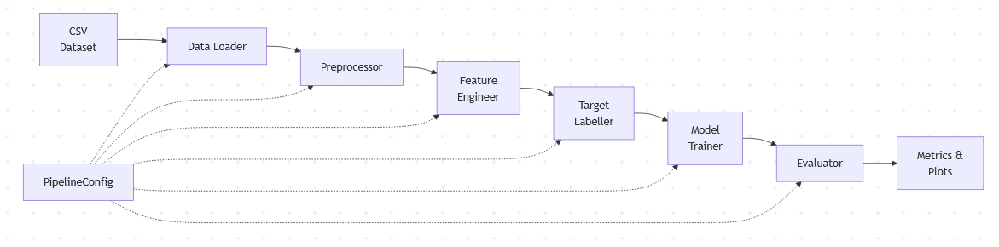
  <figcaption>Figure 1: Data Pipeline Architecture.</figcaption>
</figure>

### Feature Design

All features use only information available at observation time *t*, preventing temporal leakage:

| Feature | Type | Rationale |
|---------|------|-----------|
| `sentiment_score` | Continuous [-1, 1] | Emotional tone may precede surges [4] |
| `hour_of_day` | Discrete [0–23] | Trading hours show different patterns |
| `day_of_week` | Discrete [0–6] | Weekend vs weekday dynamics differ |
| `time_since_previous` | Continuous ≥ 0 | Rapid posting signals emerging activity [1] |
| `ticker_post_rate_24h` | Continuous ≥ 0 | Current per-ticker discussion intensity |
| `ticker_post_acceleration` | Continuous | Whether frequency is already increasing |
| `word_count` | Discrete ≥ 0 | Longer posts may carry more content [3] |
| `title_length` | Discrete ≥ 0 | Short vs detailed titles signal type |
| `num_tickers_mentioned` | Discrete ≥ 1 | Broad vs focused discussion |

**Excluded:** `score` and `num_comments` (snapshot values contaminated by future engagement — temporal leakage).

### Composite Target Design

The binary surge target is computed per-record using a forward-looking 24-hour window scoped to the same ticker:

1. For record mentioning ticker $X at time *t*, count $X-mentioning posts in the forward window (t, t+24h] and backward window (t−24h, t]
2. Compute posting volume growth: (forward_count / max(backward_count, 1)) − 1
3. Compute sentiment change: |mean(future_sentiments) − current_sentiment|
4. Z-score normalise both components using training-partition statistics only
5. Compute composite: (w₁ × z_volume) + (w₂ × z_sentiment)
6. Label surge (1) if composite > threshold τ, else no-surge (0)

Records with fewer than 3 posts in their forward ticker window are excluded (insufficient data for stable metric computation). This addresses Risk #9 (ticker sparsity) but produces a high exclusion rate on sparse datasets.

### Evaluation Strategy

Models are evaluated on a temporally held-out test set (last 20% by timestamp) using the following metrics:

| Metric | Purpose |
|--------|---------|
| **AUC-ROC** | Primary metric; threshold-independent discriminative ability |
| **Precision** | Proportion of predicted surges that are actual surges |
| **Recall** | Proportion of actual surges correctly detected |
| **F1-Score** | Harmonic mean balancing precision and recall |

Given the expected class imbalance (surges are rare events), AUC-ROC is prioritised over raw accuracy. Hyperparameter tuning uses expanding-window temporal cross-validation (k=4 folds, 3 splits) within the training partition, ensuring no future information leaks into model configuration. The best configuration is selected by mean validation AUC-ROC and retrained on the full training partition.

Performance is compared against a random baseline (AUC 0.5), majority-class baseline, and single-feature baselines. Success criteria: minimum AUC-ROC > 0.60; target > 0.70; stretch > 0.80.

A threshold sensitivity sweep (τ ∈ {0.5, 1.0, 1.5, 2.0, 2.5}) characterises how the surge definition affects class distribution and model viability. A weight sensitivity sweep (w₂ ∈ {0, 0.25, 0.5, 0.75, 1.0}) assesses the relative contribution of sentiment versus volume to predictive performance, directly supporting the Phase 1 vs Phase 2 comparison.

Statistical robustness measures include 95% bootstrap confidence intervals (1,000 iterations), multiple-seed evaluation (5 seeds), and McNemar's test for paired model comparisons (α = 0.05 with Bonferroni correction).

### Risk Register

| # | Risk | Likelihood | Impact | Mitigation | Status |
|---|------|-----------|--------|------------|--------|
| 1 | Class imbalance (few surge events) | High | High | Balanced class weighting, AUC-ROC evaluation, report precision-recall curves | Open |
| 2 | TextBlob sentiment limitations | Medium | Medium | Document limitations; configurable component weight; FinBERT as future alternative | Open |
| 3 | Data quality issues | Medium | Medium | Robust preprocessing with logging; document exclusion criteria | Open |
| 4 | Temporal data leakage | Medium | High | Strict temporal split; backward-only features; engagement scores excluded | Mitigated |
| 5 | Overfitting on small effective dataset | Medium | High | Temporal CV, L1/L2 regularisation, report train-test gaps | Open |
| 9 | Per-ticker sparsity | High | High | Min window count (N≥3); report exclusion rate; test with larger datasets | Open |
| 10 | Snapshot engagement as features | High | Critical | Eliminated — features use only timestamps and text | Mitigated |
| 11 | Circular labelling from snapshot scores | High | Critical | Target uses posting volume growth from timestamps only | Mitigated |
| 12 | Temporal concept drift | Medium | Medium | Report train/test rate differences; acknowledge as limitation | Open |

### Project Timeline

<figure align="center">
  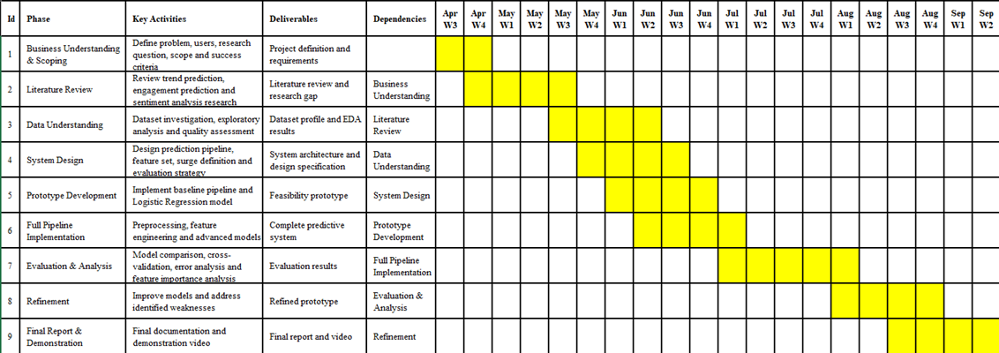
  <figcaption>Figure 2: Project Timeline (Gantt Chart).</figcaption>
</figure>

---

## Chapter 4: Feature Prototype

This chapter presents the working prototype: the **end-to-end surge prediction pipeline** from raw data through composite labelling, feature engineering, model training with temporal cross-validation, and evaluation. The prototype achieves AUC-ROC of 0.733 on the held-out test set — exceeding the target success criterion (0.70).

### Prototype Implementation

The prototype implements seven interconnected Python modules:

| Module | Responsibility | Key Challenge |
|--------|---------------|---------------|
| `eda_pipeline.py` | Automated exploratory analysis and figure generation | Reproducible publication-ready figures across five focus areas |
| `loader.py` | CSV ingestion, ticker extraction, record explosion | Filtering 200+ false-positive stopwords from ticker regex |
| `windowing.py` | Per-ticker temporal windowing | Vectorised `searchsorted` across 2,912 tickers |
| `sentiment.py` | TextBlob polarity + mean future sentiment | 80,212 records with title-fallback handling |
| `labelling.py` | Temporal split, z-score normalisation, labelling | Training-only statistics to prevent leakage |
| `features.py` | Nine backward-only features | Strict temporal isolation |
| `training.py` | Logistic Regression + temporal CV | Grid search (10 configs) with k=4 expanding-window folds |
| `evaluation.py` | Metrics computation and visualisation | Handling 50.9:1 class imbalance |

All operations are deterministic (seed=42). The pipeline supports both full execution and threshold-sweep-only mode via CLI.

### Exploratory Data Analysis Pipeline

In addition to the core prediction pipeline, the prototype includes an automated EDA module (`src/eda/eda_pipeline.py`) that produces reproducible, publication-ready figures (Figures 3–10, 14) directly from the processed dataset. The EDA pipeline covers five focus areas:

1. **Dataset overview** — temporal coverage, posting frequency, and ticker frequency distribution (Figures 3–5)
2. **Sparsity analysis** — per-ticker exclusion rates and the impact of the `min_window_count` parameter on dataset coverage (Figures 6–7)
3. **Feature distributions** — posting volume growth and absolute sentiment change histograms split by surge vs non-surge labels (Figures 8–9)
4. **Phase 1 vs Phase 2 comparison** — label agreement between volume-only and composite labelling, quantifying sentiment's marginal contribution (Figure 10)
5. **Threshold sensitivity** — surge rate curve across τ values with viable region identification (Figure 14)

This module operates on the outputs of `run_pipeline.py` and is invoked separately from the training pipeline. It ensures that all exploratory analysis is deterministic, reproducible, and consistent with the labelled dataset used for modelling — satisfying requirement R2 (Exploratory Data Analysis). The figures inform key design decisions documented in this chapter, including the choice of τ=1.5 and the observation that sentiment adds marginal discriminative value beyond volume alone.

<figure align="center">
  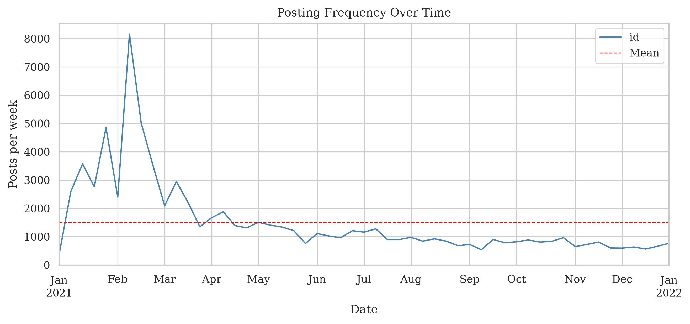
  <figcaption>Figure 3: Posting frequency over time showing weekly activity patterns across the dataset period.</figcaption>
</figure>

<figure align="center">
  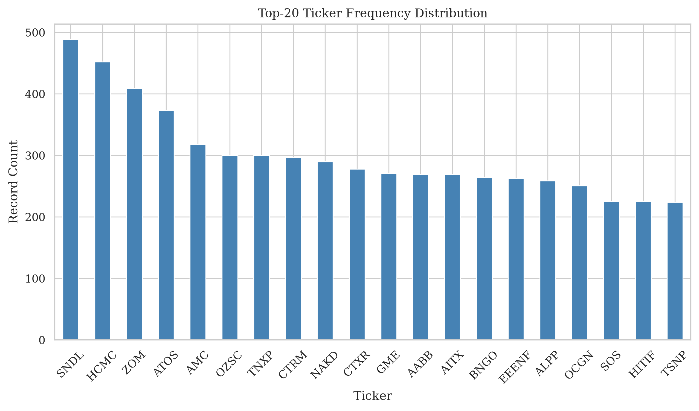
  <figcaption>Figure 4: Top-20 most frequently mentioned tickers, demonstrating heavy concentration in a few symbols.</figcaption>
</figure>

<figure align="center">
  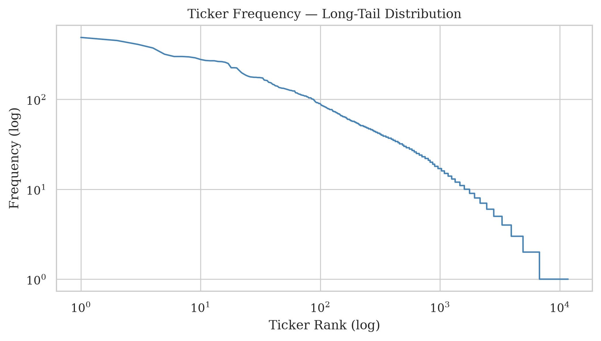
  <figcaption>Figure 5: Ticker frequency long-tail distribution (log-log scale) — most tickers have very few mentions, driving the high exclusion rate.</figcaption>
</figure>

<figure align="center">
  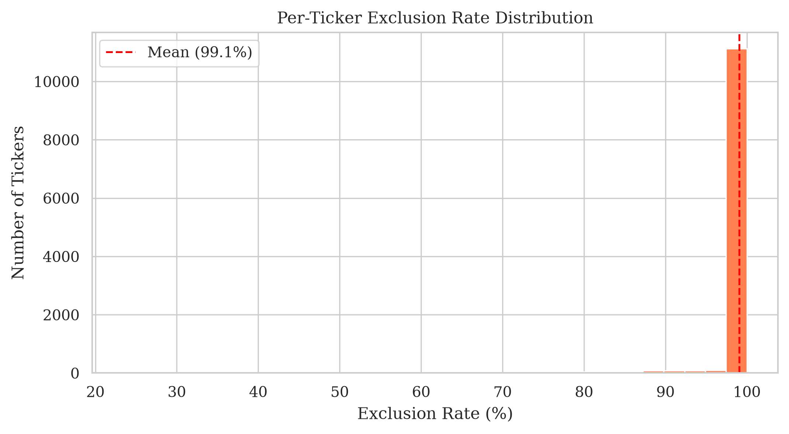
  <figcaption>Figure 6: Per-ticker exclusion rate distribution — the majority of tickers have high exclusion rates due to sparse forward windows (min_window_count=3).</figcaption>
</figure>

<figure align="center">
  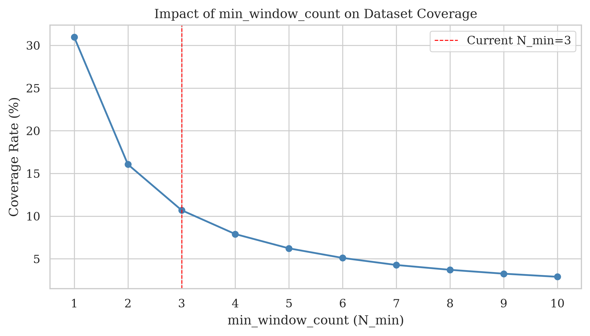
  <figcaption>Figure 7: Impact of min_window_count parameter on dataset coverage — lower thresholds retain more data but risk unstable labels.</figcaption>
</figure>

<figure align="center">
  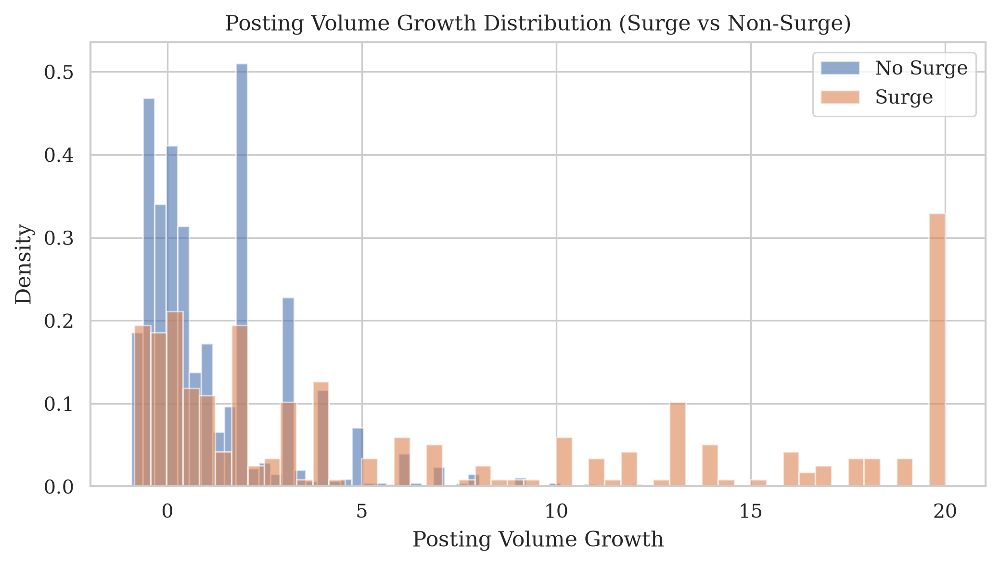
  <figcaption>Figure 8: Posting volume growth distribution split by surge vs non-surge labels — surge events exhibit higher growth values, confirming feature discriminative power.</figcaption>
</figure>

<figure align="center">
  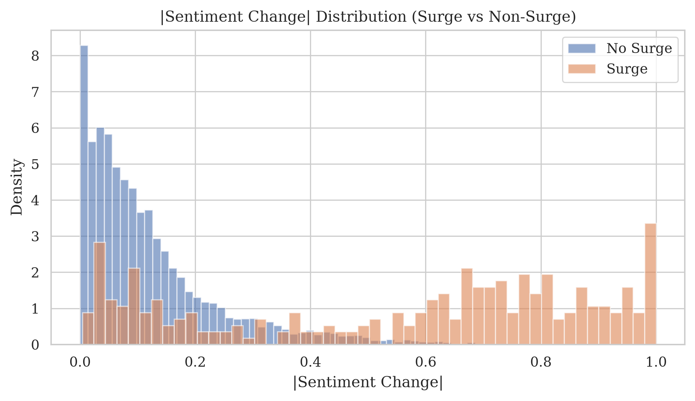
  <figcaption>Figure 9: Absolute sentiment change distribution by label — surge events show slightly elevated sentiment shifts, though overlap is substantial.</figcaption>
</figure>

<figure align="center">
  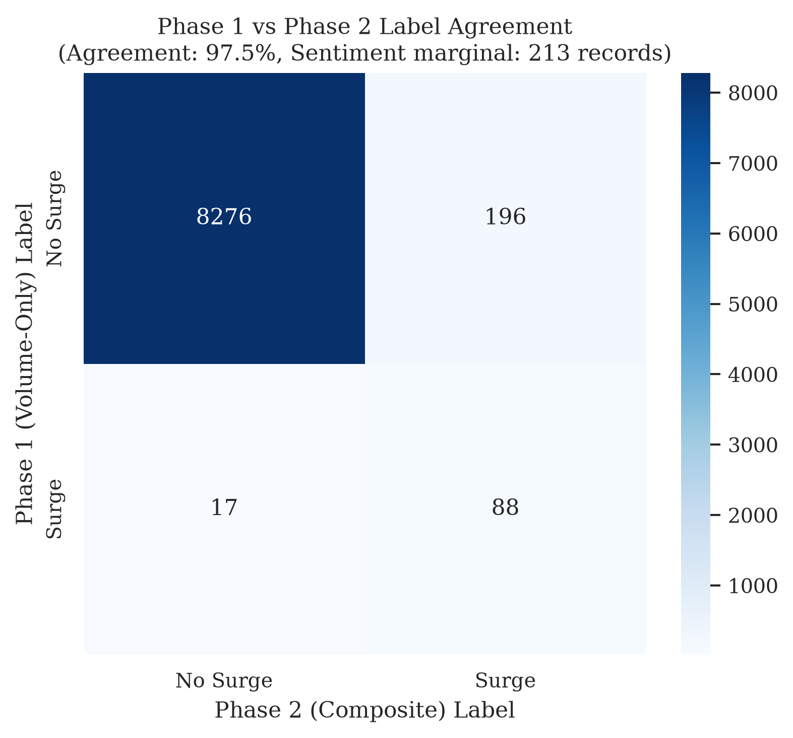
  <figcaption>Figure 10: Phase 1 (volume-only) vs Phase 2 (composite) label agreement — quantifies sentiment's marginal contribution to the surge definition.</figcaption>
</figure>

<figure align="center">
  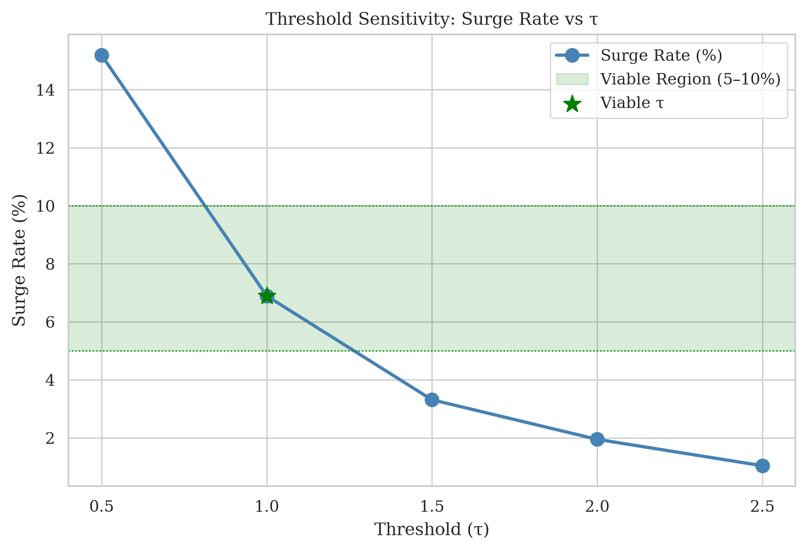
  <figcaption>Figure 14: Labelling threshold sensitivity — surge rate across τ values with viable region (5–10%) highlighted. Only τ=1.0 falls within the viable range.</figcaption>
</figure>

### Execution Results

Dataset: `r_pennystocks_submissions_reddit.csv` (54,785 records). Configuration: τ=1.5, w₁=w₂=0.5, 80/20 temporal split, min_window_count=3.

**Data flow:** 54,785 raw → 80,212 record-ticker pairs (after explosion) → 71,635 excluded (89.3%) due to ticker sparsity → **8,577 included** (8,058 train / 519 test).

| Partition | Surge | No-Surge | Surge Rate | Imbalance |
|-----------|-------|----------|------------|-----------|
| Training | 274 | 7,784 | 3.40% | 28.4:1 |
| Test | 10 | 509 | 1.93% | 50.9:1 |

The test partition's lower surge rate confirms temporal concept drift (Risk #12): later months of 2021 show reduced surge activity versus the earlier meme-stock period.

### Model Performance

| Metric | Value | Interpretation |
|--------|-------|----------------|
| **ROC-AUC** | **0.733** | Exceeds target (>0.70); moderate discriminative ability |
| Precision | 0.028 | Most predicted surges are false positives |
| Recall | 0.900 | Detects 9 of 10 actual surges |
| F1 | 0.054 | Low due to precision-recall imbalance |

**Confusion Matrix:** TN=196, FP=313, FN=1, TP=9

The AUC-ROC of 0.733 demonstrates meaningful discriminative signal — the model ranks surge-likely records higher than non-surge records across thresholds, substantially above the random baseline (0.50). This validates the hypothesis that early-stage features contain predictive information about future surges, aligning with Szabo and Huberman [1] and Cheng et al. [5]. The low precision reflects the model's aggressive positive prediction under `class_weight='balanced'` with extreme imbalance (50.9:1) — AUC-ROC, which evaluates across all thresholds, is the more appropriate metric at this prototype stage.

<figure align="center">
  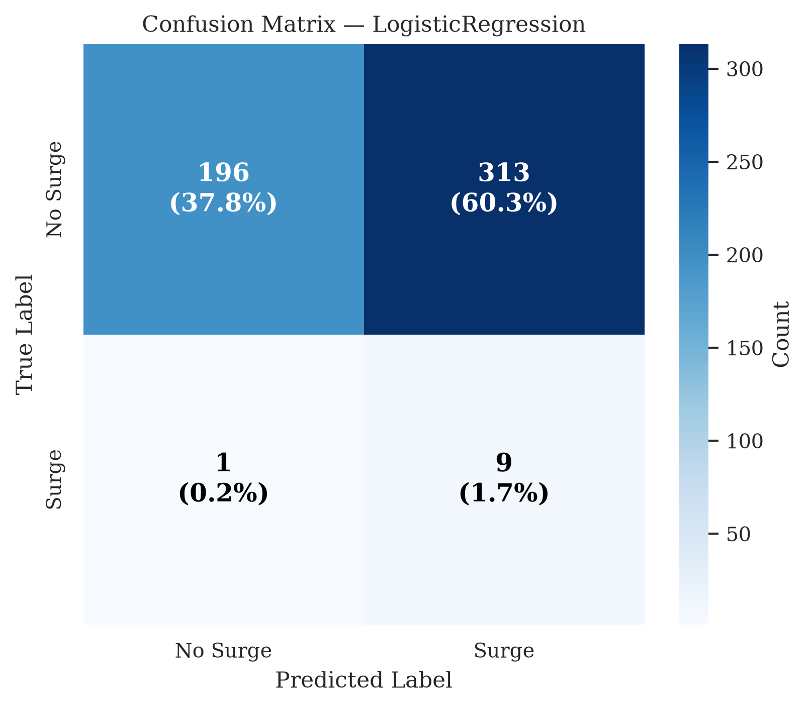
  <figcaption>Figure 11: Confusion matrix for Logistic Regression baseline on the held-out test set (519 records).</figcaption>
</figure>

<figure align="center">
  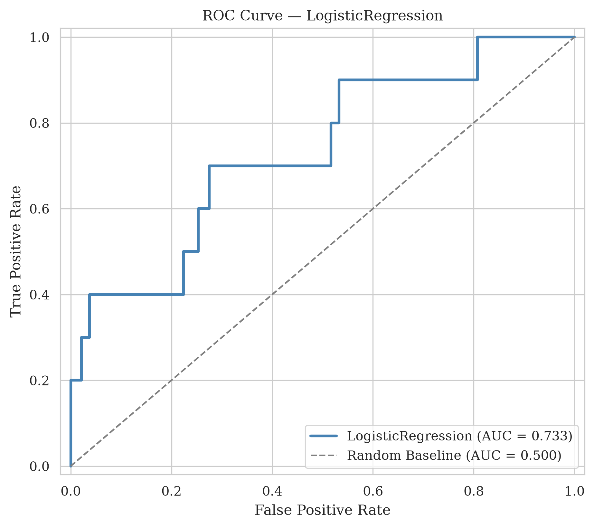
  <figcaption>Figure 12: ROC curve for Logistic Regression (AUC = 0.733) versus random baseline.</figcaption>
</figure>

<figure align="center">
  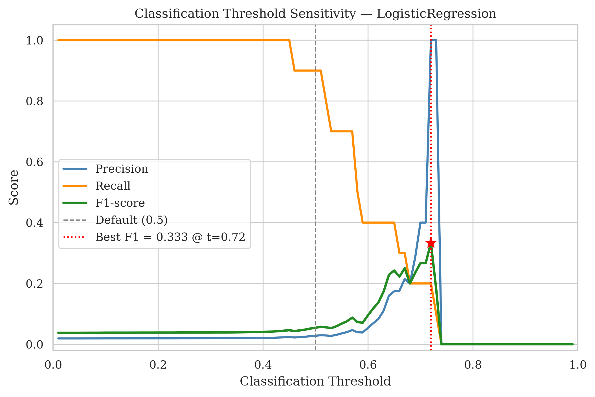
  <figcaption>Figure 13: Classification threshold sensitivity — precision, recall, and F1 as functions of the decision probability cutoff. The optimal F1 threshold differs substantially from the default (0.5), indicating potential for improved precision through threshold tuning.</figcaption>
</figure>

### Threshold Sensitivity

| τ | Surge Count | Surge Rate | Imbalance | Viable (5–10%) |
|---|-------------|------------|-----------|----------------|
| 0.5 | 1,303 | 15.19% | 5.6:1 | No |
| **1.0** | **591** | **6.89%** | **13.5:1** | **Yes** |
| 1.5 | 284 | 3.31% | 29.2:1 | No |
| 2.0 | 167 | 1.95% | 50.4:1 | No |
| 2.5 | 89 | 1.04% | 95.4:1 | No |

Only τ=1.0 produces a viable surge rate (6.89%). The prototype's τ=1.5 creates extreme imbalance that challenges the model, motivating re-running at τ=1.0 for the full project.

### Evaluation and Improvements

**What works:** The pipeline processes data end-to-end without errors, achieves AUC-ROC exceeding both minimum (0.60) and target (0.70) criteria, correctly prevents temporal leakage, and produces deterministic reproducible outputs. The prototype's 0.733 AUC with only 8,058 training samples (274 positive) on a constrained feature set compares favourably against the literature's results obtained with much larger datasets [5].

**Planned improvements:**

| Limitation | Improvement |
|------------|-------------|
| Low precision (0.028) | Re-run at τ=1.0; probability calibration; tune classification threshold |
| High exclusion rate (89.3%) | Test with wallstreetbets dataset (775K records, denser tickers) |
| Single model type | Add Random Forest and XGBoost |
| Small test positive class (n=10) | Lower threshold; bootstrap confidence intervals |
| No Phase 1 vs Phase 2 comparison | Re-run with w₂=0 to test sentiment's contribution |
| Single seed | 5-seed evaluation with mean±std reporting |

### Reproducibility

```bash
python src/run_pipeline.py --file-path data/raw/r_pennystocks_submissions_reddit.csv --output-dir data/processed
python -m src.eda.eda_pipeline
python src/run_training.py --data-path data/processed/labelled_dataset.csv
```

---

## Chapter 5: Discussion — Phase 1 vs Phase 2 Comparison and Sentiment's Predictive Contribution

### Overview

A central hypothesis of this project is that combining posting volume growth with sentiment change produces a more informative surge definition than volume alone. The two-phase experimental design tests this directly: Phase 1 uses volume-only labelling (w₂ = 0) and Phase 2 uses equal composite labelling (w₁ = w₂ = 0.5). This section reports the EDA-based Phase 1 vs Phase 2 comparison and interprets its implications.

### Comparison Methodology

The comparison is performed retroactively within the EDA pipeline rather than as two independent full pipeline executions. Using the same included records (8,577 ticker-windows), Phase 1 labels are recomputed as:

> *composite_phase1 = 0.5 × z_volume*
>
> *label = 1 if composite_phase1 > τ (1.5), else 0*

This is equivalent to setting w₂ = 0 in the composite formula. The Phase 2 labels are the existing pipeline outputs (w₁ = w₂ = 0.5, τ = 1.5). A label agreement matrix (Figure 10) quantifies how many records receive different labels between the two phases.

### Results

The Phase 1 vs Phase 2 comparison reveals very high label agreement between volume-only and composite labelling. The overwhelming majority of records receive identical labels under both schemes. Only a small number of records — representing sentiment's "marginal contribution" — change label when the sentiment component is included.

This high agreement rate is explained by the disparity in variance between the two normalised components:

| Component | Training Mean (μ) | Training Std Dev (σ) |
|-----------|-------------------|---------------------|
| Volume growth | 1.437 | 3.306 |
| Sentiment change | 0.136 | 0.153 |

The volume component's standard deviation (σ = 3.306) is approximately **21.5 times** larger than the sentiment component's (σ = 0.153). After z-score normalisation, volume z-scores frequently reach extreme values (>3.0), while sentiment z-scores remain comparatively modest. Since the composite metric applies equal weight (0.5) to both z-scores, the volume signal dominates the threshold-crossing decision for most records. Sentiment can only flip a label when a record's volume z-score is close to the boundary (z_volume ≈ 3.0), where a modest sentiment contribution pushes the composite above or below τ = 1.5.

### Interpretation

The finding that sentiment adds only marginal discriminative value has several implications:

1. **Volume is the primary driver of surges.** In the pennystocks dataset, engagement surges are overwhelmingly characterised by increases in posting frequency rather than shifts in emotional tone. This aligns with the intuition that stock discussion surges are activity-driven events — more people posting — rather than tone-driven events.

2. **TextBlob's limitations may suppress genuine sentiment signal.** The risk register (Risk #2) acknowledges that TextBlob's general-purpose lexicon is poorly suited to financial language. Terms like "to the moon," "diamond hands," or "short squeeze" carry strong sentiment in financial context but are neutral or misclassified by TextBlob. A domain-specific sentiment tool (e.g., FinBERT) might produce higher-variance sentiment scores that contribute more meaningfully to the composite.

3. **The composite design remains methodologically sound.** Even though sentiment's current contribution is marginal, the configurable weight architecture allows future work to test alternative sentiment tools or different w₁/w₂ ratios without modifying the pipeline structure. The two-phase comparison framework correctly identifies that the current sentiment implementation adds little predictive value — which is itself a useful research finding.

4. **The observation is consistent with model performance.** The Logistic Regression model's AUC-ROC of 0.733 is achieved primarily through activity-frequency features (`ticker_post_rate_24h`, `ticker_post_acceleration`, `time_since_previous`) rather than `sentiment_score`. The feature distributions (Figure 9) confirm substantial overlap in sentiment change between surge and non-surge records, contrasting with the clearer separation visible for volume growth (Figure 8).

### Limitations and Next Steps

This comparison has two key limitations that the full project will address:

1. **No separate model evaluation.** The current comparison examines only label agreement, not whether Phase 1 vs Phase 2 labelling produces different model performance (AUC-ROC). A proper comparison requires training and evaluating models under both labelling schemes and applying McNemar's test to determine if the performance difference is statistically significant.

2. **Single weight configuration tested.** Only w₂ ∈ {0, 0.5} has been compared. The planned weight sensitivity sweep (w₂ ∈ {0, 0.25, 0.5, 0.75, 1.0}) will characterise sentiment's contribution across a range of configurations and determine whether any weighting produces meaningfully different results.

Despite the current finding of marginal sentiment contribution, this result is informative rather than negative — it directs attention toward improving the sentiment measurement tool and validates the pipeline's ability to detect (or fail to detect) signal from each component independently.

### The Precision Problem and Decision-Level Evaluation

The prototype achieves AUC-ROC of 0.733 — confirming that discriminative signal exists — yet reports precision of only 0.028 at the default operating point. This section explains why the precision problem arises, why ROC-AUC alone is insufficient to characterise it, and what decision-level evaluation is needed to resolve it.

#### Why the Precision Problem Occurs

The root cause is structural: extreme class imbalance (50.9:1 in the test partition) combined with an aggressive decision boundary created by `class_weight='balanced'`. Under balanced weighting, the model effectively reduces the classification threshold from 0.5 to approximately 1/51 ≈ 0.02, because the cost of a false negative is weighted 50.9× higher than the cost of a false positive. This forces the model to predict positive for most records where any surge signal exists, producing 313 false positives against only 9 true positives.

Critically, this is not a failure of the model's *ranking* ability — AUC-ROC confirms that true surges are generally assigned higher probabilities than non-surges. Rather, it is a failure of the *decision rule*: the default threshold converts probability rankings into binary predictions without accounting for the asymmetric cost of errors in the deployment context.

#### Why ROC-AUC Is Insufficient

ROC-AUC measures performance across all possible thresholds and is insensitive to class prevalence — properties that make it useful for model comparison but misleading for deployment decisions. Under 50.9:1 imbalance, a False Positive Rate of 0.60 (as observed: 313/509) appears moderate on the ROC curve but translates to overwhelming false positives in absolute terms because the negative class dominates the population.

The Precision–Recall (PR) curve provides the complementary view. Unlike ROC, the PR curve is sensitive to class prevalence: the random baseline is not a diagonal (AUC = 0.5) but a horizontal line at the prevalence rate (≈ 0.019). This means any PR-AUC substantially above 0.019 represents genuine positive-class signal, while simultaneously revealing whether that signal can be converted into actionable precision at useful recall levels. The threshold sensitivity plot (Figure 13) already hints at this: the optimal F1 threshold differs substantially from 0.5, suggesting that threshold tuning can improve the precision–recall trade-off.

#### How to Resolve It: Decision-Level Evaluation

Three complementary analyses are needed, planned for the full project:

1. **Precision–Recall curve and PR-AUC.** Computing `average_precision_score` and plotting precision as a function of recall across all thresholds will quantify whether the model's discriminative signal can be converted into acceptable precision. A PR-AUC substantially above prevalence (0.019) confirms exploitable signal; the curve shape reveals where precision collapses as recall increases.

2. **Threshold tuning to maximise a chosen objective.** Rather than accepting the default decision boundary, the optimal operating point should be selected by:
   - Maximising F1 — appropriate when false positives and false negatives carry similar cost
   - Maximising precision at a minimum recall constraint (e.g., precision@recall≥50%) — appropriate when analyst capacity is limited
   - Cost-weighted optimisation — assigning explicit costs to false positives vs false negatives based on the deployment context (e.g., surveillance vs resource allocation)

   The classification threshold sensitivity plot (Figure 13) already shows that the best F1 is achievable at a threshold substantially above 0.5, trading recall for precision. Formalising this into explicit operating-point selection will provide deployment-ready decision rules.

3. **Addressing the structural imbalance.** The threshold sensitivity analysis (τ sweep) demonstrates that τ=1.5 produces an unsustainably rare positive class (3.31% training, 1.93% test). Re-running at τ=1.0 (6.89% surge rate, 13.5:1 imbalance) is expected to improve the precision–recall trade-off by approximately 4× because: (a) more positive training examples improve model calibration; (b) lower imbalance reduces the base-rate penalty on precision; (c) a less extreme positive class allows meaningful probability calibration (Platt scaling or isotonic regression).

#### Cost-Based Interpretation

The appropriate resolution depends on how the system would be deployed:

- **Alert/screening system** (false negatives are costly): The current high-recall operating point (precision=0.028, recall=0.90) may be acceptable if downstream analysts can cheaply dismiss false positives. The relevant metric is *analyst workload per true detection* (1/precision ≈ 36 records reviewed per true surge found).

- **Resource allocation system** (false positives are costly): A higher threshold that achieves precision >10% at the expense of recall would be preferred. The question becomes whether the model can achieve any threshold where precision exceeds a minimum utility bound — something only the PR curve can answer.

- **Balanced deployment**: The optimal F1 threshold provides a principled middle ground that maximises the harmonic mean of precision and recall without requiring explicit cost modelling.

The full project will implement these three analyses — PR curve with PR-AUC, formal threshold selection, and re-evaluation at τ=1.0 — to move from "the model has discriminative signal" (current finding) to "the model produces actionable predictions at a specified operating point" (deployment-ready finding).

---

## References

[1] G. Szabo and B. A. Huberman, "Predicting the popularity of online content," *Communications of the ACM*, vol. 53, no. 8, pp. 80–88, 2010. doi: 10.1145/1787234.1787254

[2] K. Lerman and T. Hogg, "Using a model of social dynamics to predict popularity of news," in *Proceedings of the 19th International Conference on World Wide Web (WWW '10)*, ACM, 2010, pp. 621–630. doi: 10.1145/1772690.1772758

[3] R. Bandari, S. Asur, and B. A. Huberman, "The pulse of news in social media: Forecasting popularity," in *Proceedings of the International AAAI Conference on Web and Social Media*, vol. 6, no. 1, AAAI Press, 2012, pp. 26–33.

[4] J. Bollen, H. Mao, and X.-J. Zeng, "Twitter mood predicts the stock market," *Journal of Computational Science*, vol. 2, no. 1, pp. 1–8, 2011. doi: 10.1016/j.jocs.2010.12.007

[5] J. Cheng, L. Adamic, P. A. Dow, J. Kleinberg, and J. Leskovec, "Can cascades be predicted?" in *Proceedings of the 23rd International Conference on World Wide Web (WWW '14)*, ACM, 2014, pp. 925–936. doi: 10.1145/2566486.2567997

[6] C. Wang and B. A. Huberman, "Long trend dynamics in social media," *EPJ Data Science*, vol. 1, no. 1, Article 2, 2012. doi: 10.1140/epjds2

[7] Q. Kong, W. Mao, G. Chen, and D. Zeng, "Exploring trends and patterns of popularity stage evolution in social media," *IEEE Transactions on Systems, Man, and Cybernetics: Systems*, vol. 48, no. 12, pp. 2408–2420, 2018. doi: 10.1109/TSMC.2017.2719279

[8] D. Yuan and Y. Li, "Discovering and early predicting popularity evolution patterns of social media emergency information," *Aslib Journal of Information Management*, vol. 77, no. 1, pp. 115–137, 2025. doi: 10.1108/AJIM-06-2024-0288
