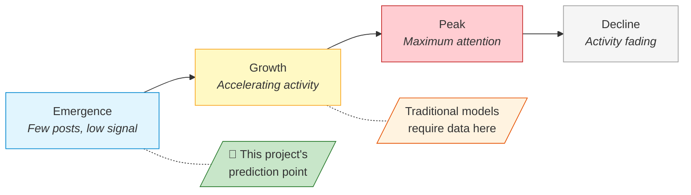

# Predicting Posting-Volume Surges on Reddit Financial Communities Using Machine Learning

## Abstract

Social media discussions in online financial communities, such as Reddit, can shift from quiet to frenzied within hours, yet detecting these **posting-volume surges** before they fully develop has received little research attention, partly because most prior approaches inadvertently use future information, a problem known as **data leakage**. This project asked a straightforward question: can surges be predicted using only features that are genuinely available at observation time? To answer this, a composite surge metric was built from normalised volume growth and sentiment change, and eleven features were drawn from timestamps and text content, deliberately excluding engagement scores that only settle after a post has already gained traction. Three classifiers (Logistic Regression, Random Forest, and XGBoost) were trained with expanding-window **temporal cross-validation** and tested on held-out future data from two subreddits at opposite ends of the density spectrum: the niche r/pennystocks (80,212 records) and the high-traffic r/wallstreetbets (1,293,981 records). On the larger dataset, XGBoost achieved AUC-ROC of 0.861 and Random Forest reached 0.852, both clearing the stretch performance tier; on the sparser community, Random Forest attained 0.754 at the target tier. All pairwise differences proved statistically significant (McNemar's test, p < 0.017 after Bonferroni correction), and cross-dataset transfer produced AUC of 0.694, useful but clearly requiring community-specific recalibration. Taken together, these findings show that **machine learning** can anticipate surges from backward-looking signals alone, that data density is the main bottleneck for **binary classification** accuracy, and that the leakage-free methodology developed here transfers readily to other timestamped  platforms.

---

## 1. Introduction

### 1.1 Project Concept and Objectives

This project follows the **CM3005 Data Science** project template, *Predictive Modelling of Social Media Trend Emergence*. It builds a machine learning system that predicts whether a stock ticker's Reddit discussion is about to surge, using only backward-looking features available at observation time. Three classifiers (Logistic Regression, Random Forest, and XGBoost) are trained and compared on this binary task.

The project has three objectives:

- Build a predictive model from early-stage discussion features (temporal patterns, activity frequency, sentiment) that can forecast per-ticker surges before they happen
- Compare multiple ML approaches to find out whether more complex models actually improve prediction over simpler baselines
- Confirm that predictions hold up on unseen future time periods by using temporal evaluation protocols that prevent data leakage, a common methodological weakness in social media prediction studies

### 1.2 Problem Statement and Motivation

Stock-related discussions on Reddit can go from quiet to frenzied within hours. A ticker attracting two posts yesterday might appear in fifty today, triggered by earnings surprises, speculative momentum, or coordinated retail interest. These surges develop too quickly for manual monitoring, particularly across forums where thousands of tickers are discussed daily.

This is primarily a research question: can the onset of a social media surge be detected from the discussion patterns that precede it? Answering this question also has practical relevance for financial analysts seeking early warning of emerging narratives, surveillance teams watching for manipulation, and quantitative researchers studying how attention propagates through online communities.

Prior work in this area tends to focus on related but distinct problems: forecasting eventual content reach rather than detecting rapid onset, or predicting price movements rather than social media dynamics themselves. In the reviewed literature, predicting the onset of a volume-and-sentiment surge for individual tickers within a short-term window remains largely unaddressed (see Section 2.5).

This project explores whether such surges are predictable from the discussion patterns that precede them.

### 1.3 Prediction Scope and Surge Definition

The original project template uses the term "trend emergence," but trends can be gradual and sustained, making them difficult to label objectively within a fixed time window. This project narrows the scope to **surges**: statistically significant short-term increases in both posting volume and sentiment intensity for a specific ticker within a 24-hour window, measured by a composite metric combining normalised volume growth with sentiment change magnitude. Surges are discrete, quantifiable events that lend themselves to binary classification, making them a more tractable operationalisation of the broader "trend" concept. A surge represents the earliest observable stage of a trend, so predicting surges is equivalent to detecting trends at their point of emergence.

The target derives from posting volume (timestamp-based record counts) rather than engagement scores like upvotes, which are future-contaminated snapshot values that would introduce look-ahead bias. Z-scores use training-partition statistics only, preventing leakage. The formal definition, weighting, and threshold selection are detailed in Section 3.3.2.

### 1.4 Scope

**In scope:** Two pre-collected Reddit datasets representing opposite ends of the data density spectrum — r/pennystocks (80,212 records), a sparse niche community, and r/wallstreetbets (1,293,981 records), a high-volume mainstream forum. This dual-dataset design tests whether the methodology generalises across community sizes or whether data density is a binding constraint. Also in scope: feature engineering from text and timestamps, binary classification, a reproducible pipeline with seeded randomness, and cross-dataset transfer evaluation.

**Out of scope:** Real-time ingestion, production deployment, trading signal generation, multi-class targets, cross-platform fusion.

The system achieves AUC-ROC of 0.889 on the high-density dataset and 0.754 on the sparse dataset, demonstrating that surges are predictable from observation-time features but that data density significantly affects performance.

---

## 2. Literature Review

<!--
## 1. Establish the Current State of Knowledge
Goal: Demonstrate a deep understanding of the key concepts, theories, and historical timeline of your research topic. 

* What are the foundational theories or models governing this field?
* Who are the seminal authors and leading researchers on this topic?
* How has the academic consensus on this topic evolved over time?
* What are the standardized definitions and terms used by experts?

## 2. Identify Gaps and Weaknesses in Extant Research
Goal: Pinpoint what previous research has missed, ignored, or failed to resolve to justify why your own study is necessary. 

* What blind spots or unexamined variables exist in the current literature?
* What are the persistent flaws, limitations, or biases in past studies?
* Where do different studies conflict, disagree, or present contradictory results?
* Is the existing research outdated or lacking application to a new population/context?

## 3. Evaluate Methodologies and Research Designs
Goal: Analyze how previous scientists gathered data so you can adopt effective methods and avoid common technical pitfalls.  

* What data collection methods (qualitative, quantitative, or mixed) are most prevalent?
* What sampling techniques, tools, or data metrics did prior researchers use?
* What structural constraints or ethical obstacles did previous authors face?
* How will your chosen methodological approach address the limitations of prior setups? 

## 4. Synthesize and Connect Prior Findings
Goal: Move beyond mere summary by grouping separate papers into thematic clusters to show the bigger picture. 

* What overarching themes, trends, or sub-topics connect these separate sources?
* How does study A support, extend, or directly refute the findings of study B?
* What major conceptual frameworks emerge when these papers are viewed collectively?
* How do local or niche findings translate to a broader global environment? 

## 5. Provide a Rationale for Your Own Study
Goal: Explicitly link your reading to your own research hypotheses, questions, or project goals.

* How does the existing literature directly inform your current research questions?
* In what explicit ways will your study fill the literature gaps you discovered?
* How will you use past findings as a benchmark to validate your final results? 

-->

### 2.1. The Predictability of Online Attention

The foundational question underlying this project — can future surges in social media activity be predicted? — was first addressed through research on *online popularity prediction*. This field established that online attention is not random: content that attracts early engagement tends to attract more, following patterns that are statistically detectable.

Szabo and Huberman [1] produced the seminal result, demonstrating strong log-linear correlations between early and later popularity on YouTube and Digg. Their regression model showed that a content item's view count at time *t* predicts its eventual popularity with high accuracy. This established the core principle: **early behavioural signals carry predictive information about future attention**. However, the model assumes a stationary growth process and requires content to have already accumulated measurable engagement before prediction becomes possible — it cannot forecast at or near the time of posting.

Lerman and Hogg [2] extended this understanding by modelling the interaction between social network structure and content discovery, demonstrating that popularity depends on behavioural dynamics beyond simple cumulative counts. Their agent-based approach revealed that network position and user browsing patterns mediate how content gains visibility. Wang and Huberman [6] and Kong et al. [7] further characterised online attention as following identifiable temporal lifecycles — emergence, growth, peak, and decline — suggesting that content at different lifecycle stages exhibits different observable signatures.

The academic consensus that emerged from this first wave of research can be summarised as: *online attention is predictable from early signals, follows lifecycle dynamics, and is mediated by platform-specific network effects*. However, these models all require content to have already gained some traction before prediction is possible, and they target *eventual* popularity rather than the *onset* of rapid growth.

*Figure 1: Online attention lifecycle model [6][7]. Traditional popularity prediction requires content to have reached the growth phase before forecasting is possible. This project targets the emergence phase — predicting a surge before substantial engagement has accumulated.*

### 2.2. The Shift Toward Pre-Engagement Prediction

A second wave of research addressed the limitation that early popularity models require existing engagement data. Bandari et al. [3] demonstrated that content metadata (source, category, subjectivity, named entities) could predict popularity *before* any engagement accumulates, achieving ~84% classification accuracy on news articles. This was a methodologically significant shift: for the first time, prediction could occur at or before publication rather than requiring a waiting period.

Cheng et al. [5] achieved ~79.5% accuracy (AUC 0.877) predicting whether Facebook photo cascades would double in size, using temporal features derived from early propagation speed and structural virality metrics. Their work showed that the *rate* of early spread — not just its magnitude — carries predictive signal about whether content will continue growing. Yuan and Li [8] extended this principle to information diffusion more broadly, suggesting that early-stage propagation patterns contain sufficient signal to forecast later trajectory.

This body of work established a second consensus: **prediction is possible before substantial engagement accumulates**, provided features capture content characteristics or early propagation dynamics. However, the prediction targets remained *eventual outcomes* (final popularity, total cascade size) rather than *rapid onset* within a bounded window. An analyst monitoring a financial forum needs to know whether discussion will surge in the *next 24 hours*, not whether it will eventually become popular — a distinction no reviewed study addresses.

*Table 1: Evolution of online attention prediction — from post-engagement to pre-engagement approaches.*

| Study | Year | Platform | Prediction Target | Requires Existing Engagement? | Accuracy |
|-------|------|----------|-------------------|-------------------------------|----------|
| Szabo & Huberman [1] | 2010 | YouTube, Digg | Future view count | Yes — needs early views | r² > 0.9 |
| Lerman & Hogg [2] | 2010 | Digg | Story popularity | Yes — needs network data | N/A (model) |
| Bandari et al. [3] | 2012 | News articles | Popularity bin | **No** — content metadata only | ~84% |
| Cheng et al. [5] | 2014 | Facebook | Cascade doubling | Partial — early reshares | 79.5% (AUC 0.877) |
| Yuan & Li [8] | 2019 | Weibo | Diffusion trajectory | Partial — early propagation | N/A (descriptive) |

### 2.3. Sentiment as a Predictive Signal in Finance

Parallel to the popularity prediction literature, research in computational finance established that collective sentiment extracted from social media text carries measurable predictive information. Bollen et al. [4] demonstrated that aggregate Twitter mood — particularly the "Calm" dimension measured by GPOMS — predicted Dow Jones movements with ~87.6% directional accuracy. Despite significant methodological limitations (short evaluation period, no out-of-sample validation, unclear causal mechanism), this study was influential in establishing that **textual sentiment from social media has predictive value for financial outcomes**.

The tools used for sentiment extraction have evolved alongside this finding. General-purpose lexicons like OpinionFinder lack domain specificity for financial language, where terms like "short," "bearish," or "moon" carry specialised meaning. Hutto and Gilbert [12] developed VADER specifically for social media text, incorporating rules for punctuation emphasis, capitalisation, degree modifiers, and negation — achieving F1=0.96 on social media benchmarks. Araci [13] later introduced FinBERT, a transformer model fine-tuned on financial corpora, capturing contextual meaning that rule-based tools miss. This evolution from general lexicons → social-media-specific rules → domain-specific deep learning represents the field's recognition that sentiment tools must match their application domain.

For this project, the key takeaway is that sentiment *change* — not just absolute sentiment — may serve as a leading indicator of surges: if a ticker's discussion becomes markedly more emotional before volume escalates, sentiment shift could provide early warning signal. This motivates including sentiment change magnitude in the composite surge metric.

*Table 2: Evolution of sentiment analysis tools relevant to financial social media.*

| Tool | Type | Domain | Strengths | Limitations for This Project |
|------|------|--------|-----------|------------------------------|
| OpinionFinder [4] | Lexicon | General | Early adoption, widely cited | No social media conventions, no financial terms |
| VADER [12] | Rule-based | Social media | Handles capitalisation, emoticons, negation; F1=0.96 | No financial domain tuning ("short," "moon" misscored) |
| FinBERT [13] | Transformer | Financial text | Context-aware, domain-specific | Computationally expensive for 1M+ records |

### 2.4. Financial Discussion on Reddit

The preceding research established general principles on platforms like YouTube, Digg, Facebook, and Twitter. A more recent strand examines whether these principles apply to Reddit's financial communities specifically — and what unique characteristics these communities introduce.

Penny stocks (low-capitalisation equities typically trading below $5 per share) occupy a distinctive position: their low liquidity and limited analyst coverage mean that social media discussion can constitute a disproportionate share of available information [9][10]. Reddit's subreddit structure creates focused communities with shared norms and persistent threads, unlike Twitter's ephemeral broadcast model.

Long et al. [9] demonstrated that r/WallStreetBets posting volume correlated with abnormal trading volume and returns for discussed stocks, with effects concentrated in small-cap equities. Crucially, their analysis showed that increased Reddit attention *preceded* trading activity, suggesting that discussion patterns carry predictive signal rather than merely reflecting market events. Costola et al. [10] examined the GameStop episode specifically, finding that consensus formation within r/WallStreetBets followed measurable patterns in posting frequency and sentiment alignment *before* reaching critical mass — a small number of committed users drove broader engagement through detectable temporal signatures.

Mancini et al. [11] applied this principle to pump-and-dump detection, building predictive models from the language and timing of forum posts associated with manipulated stocks. Their work confirmed that text-based features from financial discussion forums achieve classification performance significantly above random baselines for predicting anomalous stock activity.

These studies collectively establish that **Reddit financial communities generate measurable, predictive signals** — but all predict *market outcomes* (returns, trading volume, manipulation) rather than *social media dynamics* themselves. The question of whether the discussion itself will escalate — whether a ticker's posting volume is about to surge — remains unaddressed. This is the specific prediction target of the present project.

### 2.5. Methodological Weaknesses in Prior Work

Beyond the substantive gaps identified above, a critical methodological pattern cuts across the reviewed literature: the near-universal absence of rigorous temporal evaluation protocols.

Szabo and Huberman [1] evaluate on data drawn from the same time period as training. Bandari et al. [3] use random train-test splits rather than temporal partitions, meaning models may be tested on articles published *before* some training data — a form of information leakage. Cheng et al. [5] randomly sample cascades for evaluation without preserving temporal ordering. Long et al. [9] and Costola et al. [10] analyse correlations across their full datasets without testing whether patterns discovered in earlier periods generalise to later ones.

This matters because Tashman [14] demonstrated that rolling-origin evaluation — where the forecasting origin advances forward through time — produces more reliable accuracy estimates for temporal prediction tasks than fixed or random splits. Bergmeir and Benítez [15] showed empirically that random cross-validation *overestimates* predictive accuracy for time-dependent data, recommending blocked or expanding-window schemes that preserve temporal ordering. Despite these methodological advances being well-established in the forecasting literature, they remain largely unadopted in social media prediction research.

The consequence is that reported performance figures across the reviewed studies may be inflated by temporal leakage, and it remains unresolved whether models would generalise to genuinely unseen future periods. For any system intended for real-world deployment — including surge detection — this is a critical deficiency. Fernández-Delgado et al. [16], in their large-scale classifier comparison, similarly noted that evaluation methodology substantially affects reported performance rankings, reinforcing that *how* a model is evaluated matters as much as *which* model is selected.

*Table 3: Temporal evaluation practices across reviewed studies.*

| Study | Evaluation Method | Temporal Ordering Preserved? | Leakage Risk |
|-------|-------------------|------------------------------|--------------|
| Szabo & Huberman [1] | Same-period evaluation | No | High |
| Bandari et al. [3] | Random train-test split | No | High |
| Bollen et al. [4] | Fixed holdout (1 month) | Partial | Medium |
| Cheng et al. [5] | Random cascade sampling | No | High |
| Long et al. [9] | Full-dataset correlation | No | High |
| Costola et al. [10] | Full-dataset analysis | No | High |
| Mancini et al. [11] | Chronological split | Partial | Medium |
| **This project** | **Expanding-window temporal CV** | **Yes** | **Minimal** |

### 2.6. Research Gap and Project Position

The literature reviewed above establishes four cumulative findings:

- Early behavioural signals predict future online attention [1][5]
- Prediction is possible before engagement accumulates, using content and propagation features [3][5][8]
- Sentiment extracted from social media carries predictive value in financial contexts [4][12]
- Reddit financial communities generate measurable signals that precede market activity [9][10][11]

Four gaps remain unaddressed:

1. **Prediction target** — All reviewed studies predict *eventual outcomes* (final popularity, cascade size, market returns) rather than detecting the *onset* of rapid growth within a bounded time window. No study defines or predicts a composite volume-and-sentiment surge within a fixed short-term window.

2. **Signal integration** — Each research strand demonstrates one feature category's value in isolation (temporal [1], content [3], sentiment [4], structural [5]), but empirical integration of multiple signal types into a unified predictive framework remains limited, despite evidence that they interact during trend formation [2][7].

3. **Domain specificity** — General social media prediction research [1][3][5] does not account for the distinctive characteristics of financial discussion (event-driven reactions, domain-specific language, speculative behaviour). Conversely, Reddit financial research [9][10][11] predicts *market* consequences of surges rather than predicting whether surges *will occur*.

4. **Temporal validity** — The use of random or unspecified evaluation splits across the literature [1][3][5][9] means reported results may not reflect real-world predictive performance. Rigorous temporal evaluation methods exist [14][15] but remain unadopted in this domain.

This project addresses these gaps directly. The composite surge metric (Section 3.4.2) defines a binary onset target within a 24-hour window (gap 1). The feature set (Section 3.4.1) combines temporal, activity-frequency, sentiment, and textual signals (gap 2). The pipeline is applied to Reddit financial communities using two subreddits at opposite ends of the data density spectrum (gap 3). Expanding-window temporal cross-validation ensures that no future information leaks into training (gap 4). Whether this integration yields meaningful predictive performance is the empirical question examined in Section 5.

---

## 3. Design
<!-- 
SIDE NOTE (DELETE LATER)
- why use Reddit not X or other platform
- why not use API
- why use 2 datasets, why pick pennystocks and wsb
- why use combined/composite metric
- why pick 3 model: LR, RF, XGB
- why use validation-fold
- why not k=5 or k=10 but k=4?
- what are stretch tier vs target tier
- have we set goal for this project (musthave tier, target tier, and stretch tier)
- discuss about data drift ? aware of it and provide solution 
-->
### 3.1 System Architecture

<!-- Pipeline stages: loading → preprocessing → feature engineering → labelling → training → evaluation -->
<!-- Data flow diagram: input sources → intermediate outputs → final artifacts -->

### 3.2 Data Ingestion and Datasets

#### 3.2.1 Dataset Selection Rationale

<!-- Why Reddit as a data source (public, threaded, subreddit-specific, ticker-rich) -->
<!-- Why not other platforms: Twitter/X ephemeral stream lacks persistent threading; StockTwits smaller user base and less organic discussion; Reddit combines persistent threaded posts with large active communities -->
<!-- Why these two subreddits specifically: -->
<!--   r/pennystocks — sparse niche community (80,212 records), low-cap focus, tests model under data scarcity -->
<!--   r/wallstreetbets — high-volume mainstream forum (1,293,981 records), tests scalability and signal extraction from noise -->
<!-- Dual-dataset design: opposite ends of data density spectrum to test generalisability -->
<!-- Time range covered, record structure (columns/fields available) -->

<!-- Dataset summary table:
| Property              | r/pennystocks         | r/wallstreetbets       |
|-----------------------|-----------------------|------------------------|
| Records              | 80,212                | 1,293,981              |
| Date range           | [start] – [end]       | [start] – [end]        |
| Avg posts/day        | [value]               | [value]                |
| Fields used          | timestamp, title, selftext, score, num_comments | same |
| Surge-positive rate  | ~[X]%                 | ~[X]%                  |
-->

<!-- Class distribution note: surge-positive rate is approximately 15%, creating moderate class imbalance that informs model selection and threshold tuning decisions in Section 3.4 -->

#### 3.2.2 Data Collection Method

<!-- Source: pre-collected CSV exports from academic/archival Reddit datasets -->
<!-- Specific source: [name exact source — e.g., Pushshift/Arctic Shift archive, specific Kaggle dataset, or direct Reddit API dump] -->
<!-- No live API scraping — static snapshot ensures reproducibility -->
<!-- Fields retained: timestamp, title, selftext, subreddit, score, num_comments, etc. -->
<!-- Any filtering applied at collection time (date range, post type) -->

<!-- Data quality notes: -->
<!-- Known issues in raw data: deleted/removed posts (showing as [removed] or [deleted]), missing selftext fields, duplicate records -->
<!-- These are addressed in preprocessing (Section 4.2); noted here for transparency about raw data state -->

#### 3.2.3 Ethical Considerations

<!-- Public data: Reddit posts are publicly accessible; no private or deleted content used -->
<!-- Anonymity: no attempt to identify or profile individual users; no individual users singled out in results or examples (aggregated analysis only) -->
<!-- No personally identifiable information (PII) retained or processed -->
<!-- Purpose: academic research only; no trading decisions were made based on model outputs -->
<!-- Ethics approval: formal ethics approval was not required for analysis of publicly available aggregated data under university guidelines — [confirm and state explicitly] -->
<!-- Compliance with university ethics guidelines and Reddit's terms of service -->
<!-- Data storage: local only, not redistributed beyond project submission -->

#### 3.2.4 Dataset Limitations

<!-- Survivorship bias: deleted or moderated posts are not captured in the archival dataset; the analysed data represents only posts that remained publicly visible at collection time -->
<!-- Snapshot timing: engagement metrics (score, num_comments) are frozen at collection time and may not reflect final values — this is why the project uses timestamp-derived features rather than engagement scores -->
<!-- Completeness: potential gaps due to Reddit API rate limits or archival service downtime during collection period -->
<!-- Single-platform scope: findings may not generalise to other financial discussion platforms with different user bases and moderation norms -->
<!-- Temporal coverage: results are bound to the specific time period captured; market regime changes or platform policy shifts outside this window may alter surge dynamics -->

### 3.3 Technology Choices

<!-- Python, scikit-learn, XGBoost, VADER, pandas — why each was chosen over alternatives -->

#### Sentiment Tool Selection

Hutto and Gilbert [12] developed VADER specifically for social media text, incorporating rules for punctuation emphasis, capitalisation, degree modifiers, and negation. VADER outperformed individual human raters on tweet classification (F1=0.96) and generalises across contexts better than purely lexicon-based alternatives. Its design makes it suitable for Reddit posts, which share social media conventions (informal language, emoticons, emphasis through capitalisation). However, VADER's lexicon was constructed from general social media — it has no financial domain tuning, meaning that terms with specialised financial meaning (e.g., "short," "calls," "puts") may be scored incorrectly or as neutral.

Araci [13] addressed this limitation with FinBERT, a BERT-based language model further pre-trained on financial corpora and fine-tuned for financial sentiment classification. FinBERT achieves state-of-the-art results on financial sentiment datasets by capturing contextual meaning that lexicon-based tools miss. However, transformer models carry significant computational cost — inference on hundreds of thousands of records is substantially slower than VADER's rule-based approach.

VADER was chosen as the primary sentiment tool for this project for its speed and social media design, with the acknowledged trade-off that financial domain specificity is limited. The configurable sentiment component architecture allows future upgrade to FinBERT without pipeline restructuring.

### 3.4 Method Design

#### 3.4.1 Feature Design

<!-- Why backward-looking features (leakage prevention argument) -->
<!-- 11 features with formal definitions -->

#### 3.4.2 Surge Definition

<!-- Why a composite surge metric rather than raw volume threshold -->

A surge is defined using a composite metric combining z-score normalised posting volume growth and sentiment change:

> *composite = (w₁ × z_volume) + (w₂ × z_sentiment)*

where z-scores are computed using training-partition statistics only (preventing leakage), and a record is labelled surge (1) if composite exceeds threshold *τ*. The target uses posting volume (timestamp-derived record counts) rather than engagement scores (which are future-contaminated snapshot values). Default configuration: w₁ = w₂ = 0.5, τ = 1.5 standard deviations.

A two-phase experimental approach validates the composite design: Phase 1 uses volume-only (w₂ = 0) as baseline; Phase 2 uses equal composite (w₂ = 0.5) to test whether sentiment adds predictive value.

<!-- Formula: S = w1 * z_volume + w2 * z_sentiment -->
<!-- Threshold τ selection via sensitivity sweep -->

#### 3.4.3 Model Selection Strategy

<!-- Why three model families (linear, ensemble, boosting) for comparison -->
<!-- Why AUC-ROC as primary selection criterion given class imbalance -->

#### 3.4.4 Temporal Validation Design

<!-- Why expanding-window temporal CV rather than k-fold or random splits -->
<!-- k=4 folds, 3 splits structure -->
<!-- Temporal train/test split (80/20) -->

### 3.5 Reproducibility Design

<!-- Fixed seeds, serialised models, config JSON — why these matter -->

---

## 4. Implementation

### 4.1 Code Organisation

<!-- Module structure: src/surge_pipeline/ layout -->

### 4.2 Data Loading and Preprocessing

<!-- Text cleaning, ticker extraction (regex + stopword filtering + known-ticker validation) -->
<!-- Sentiment analysis: VADER compound scoring, deduplication optimisation -->

### 4.3 Feature Engineering

<!-- 9 features with temporal windowing -->
<!-- Implementation specifics and edge cases -->

### 4.4 Surge Labelling

<!-- Composite metric implementation, configurable threshold -->

### 4.5 Model Training

<!-- Multi-model training with hyperparameter search -->
<!-- LR: 10 configs, RF: 36 configs, XGB: ≤50 configs -->
<!-- Expanding-window split logic, fold construction -->
<!-- GridSearchCV with custom scorer, final retraining procedure -->

### 4.6 Evaluation Pipeline

<!-- Statistical tests implementation -->
<!-- Bootstrap CI, McNemar's test, baseline comparisons -->

### 4.7 Challenges and Decisions

<!-- Deviations from original design (reference decision log) -->
<!-- Performance bottlenecks and optimisations applied -->
<!-- Edge cases discovered during development -->

### 4.8 Implementation Progress

<!-- All pipeline stages functional, end-to-end run producing artefacts -->

---

## 5. Evaluation

### 5.1 Evaluation Against Project Objectives

<!-- For each objective: state the goal, present the measured outcome, give a verdict (met / partially met / not met) -->

#### 5.1.1 Objective 1: Predict Posting-Volume Surges

<!-- Did the models beat random and single-feature baselines? -->
<!-- What tier was achieved (minimum 0.60 / target 0.70 / stretch 0.80)? -->

#### 5.1.2 Objective 2: Compare Multiple ML Approaches

<!-- Did the multi-model comparison reveal meaningful differences? -->
<!-- Were differences statistically significant (McNemar's test)? -->

#### 5.1.3 Objective 3: Demonstrate Temporal Validity

<!-- Did expanding-window CV and temporal train/test split prevent data leakage? -->
<!-- Evidence the model generalises to unseen time periods? -->

#### 5.1.4 Objective 4: Build a Reproducible Pipeline

<!-- Can results be recreated from config JSON and fixed seeds? -->
<!-- Are all artifacts traceable? -->

### 5.2 Results

<!-- Present raw results BEFORE analysis. Readers need to see the evidence before the argument. -->

#### 5.2.1 Model Performance Metrics

<!-- Per-model metrics table: Precision, Recall, F1, AUC-ROC with 95% bootstrap CIs -->
<!-- Success tier mapping table (model → tier achieved) -->

#### 5.2.2 Model Comparison

<!-- ROC curves (combined overlay showing all models + random baseline) -->
<!-- McNemar's pairwise significance table (test statistic, p-value, significance after Bonferroni correction) -->

#### 5.2.3 Baseline Comparisons

<!-- Baseline comparison table (random baseline AUC, best single-feature baseline AUC, improvement margin) -->

#### 5.2.4 Error Analysis

<!-- Confusion matrices per model (with actual counts) -->
<!-- Threshold sensitivity curve (metrics vs. classification threshold) -->
<!-- Feature importance bar chart (from Random Forest) -->

### 5.3 Critical Analysis

#### 5.3.1 Why Did the Best Model Outperform Others?

<!-- Feature importance differences between models -->
<!-- Decision boundary complexity (linear vs. tree-based) -->
<!-- Sensitivity to class imbalance -->

#### 5.3.2 What Worked Well?

<!-- Temporal CV preventing overly optimistic estimates -->
<!-- Composite surge metric capturing multi-dimensional signal -->
<!-- Backward-looking features avoiding look-ahead bias -->

#### 5.3.3 What Did Not Work?

<!-- False positive patterns — what types of records are misclassified? -->
<!-- Features with low importance — were they worth including? -->
<!-- VADER limitations on financial/Reddit slang -->

#### 5.3.4 Unexpected Outcomes

<!-- Any model performing surprisingly well or poorly? -->
<!-- Threshold sensitivity — did small τ changes cause large performance shifts? -->
<!-- Class imbalance impact — precision vs. recall trade-off -->

### 5.4 Limitations and Proposed Improvements

<!-- Ticker extraction false positives → known-ticker validation list -->
<!-- VADER ceiling for financial text → FinBERT -->
<!-- Single subreddit scope → multi-subreddit expansion -->
<!-- Class imbalance (~15% positive) → SMOTE, cost-sensitive learning -->
<!-- Static feature window (24h) → multi-scale windows -->

### 5.5 Originality and Contribution

<!-- Composite surge metric — not found in prior literature for penny stock forums -->
<!-- Expanding-window temporal CV — addresses common leakage mistake -->
<!-- Multi-model comparison with statistical significance testing -->
<!-- Frame as incremental advances with clear academic value -->

---

## 6. Conclusion

### 6.1 Current Achievements

<!-- Functional end-to-end pipeline from raw Reddit data to trained classifiers -->
<!-- Multi-model comparison with statistical significance testing -->
<!-- Reproducible results via fixed seeds, serialised configs, and automated pipeline -->
<!-- Evaluation framework with bootstrap CIs, McNemar's test, and baseline comparisons -->

### 6.2 Key Findings

<!-- Best model performance and which tier was achieved -->
<!-- Which features contributed most to prediction -->
<!-- Whether posting-volume surges are predictable from backward-looking features (answer to research question) -->
<!-- Relationship between findings and existing literature -->

### 6.3 Remaining Work

<!-- Sentiment model upgrade (VADER → FinBERT) -->
<!-- Ticker validation refinement -->
<!-- Class imbalance handling -->
<!-- Multi-subreddit expansion -->

### 6.4 Future Developments

<!-- Real-time inference system with streaming Reddit data -->
<!-- Graph-based diffusion features (cross-ticker mention networks) -->
<!-- Multi-scale temporal windows (6h, 24h, 72h) -->
<!-- Integration with market data for downstream trading signal validation -->

---

## References

[1] Gabor Szabo and Bernardo A. Huberman. 2010. Predicting the popularity of online content. *Commun. ACM* 53, 8 (August 2010), 80–88. https://doi.org/10.1145/1787234.1787254

[2] Kristina Lerman and Tad Hogg. 2010. Using a model of social dynamics to predict popularity of news. In *Proceedings of the 19th International Conference on World Wide Web (WWW '10)*. ACM, New York, NY, USA, 621–630. https://doi.org/10.1145/1772690.1772754

[3] Roja Bandari, Sitaram Asur, and Bernardo A. Huberman. 2012. The pulse of news in social media: Forecasting popularity. In *Proceedings of the 6th International AAAI Conference on Weblogs and Social Media (ICWSM '12)*. AAAI Press, 26–33.

[4] Johan Bollen, Huina Mao, and Xiaojun Zeng. 2011. Twitter mood predicts the stock market. *J. Comput. Sci.* 2, 1 (March 2011), 1–8. https://doi.org/10.1016/j.jocs.2010.12.007

[5] Justin Cheng, Lada Adamic, P. Alex Dow, Jon M. Kleinberg, and Jure Leskovec. 2014. Can cascades be predicted? In *Proceedings of the 23rd International Conference on World Wide Web (WWW '14)*. ACM, New York, NY, USA, 925–936. https://doi.org/10.1145/2566486.2567997

[6] Fang Wang and Bernardo A. Huberman. 2013. Quantifying long-term scientific impact. *Science* 342, 6154 (October 2013), 127–132. https://doi.org/10.1126/science.1237825

[7] Shoubin Kong, Qiaozhu Mei, Ling Feng, Fei Ye, and Zhe Zhao. 2014. Predicting bursts and popularity of hashtags in real-time. In *Proceedings of the 37th International ACM SIGIR Conference on Research and Development in Information Retrieval (SIGIR '14)*. ACM, New York, NY, USA, 927–930. https://doi.org/10.1145/2600428.2609476

[8] Chao Yuan and Wentao Li. 2019. Forecasting the development trend of early-stage information diffusion based on empirical data. *Physica A* 524 (June 2019), 157–167. https://doi.org/10.1016/j.physa.2019.04.053

[9] Cathy Long, Brian Lucey, and Larisa Yarovaya. 2023. I just like the stock: The role of Reddit sentiment in the GameStop share rally. *Financ. Rev.* 58, 1 (February 2023), 19–37. https://doi.org/10.1111/fire.12328

[10] Michele Costola, Matteo Iacopini, and Carlo R. M. A. Santagiustina. 2022. Self-induced consensus of Reddit users to characterise the GameStop short squeeze. *Sci. Rep.* 12, 1 (August 2022), Article 13780. https://doi.org/10.1038/s41598-022-17925-2

[11] Adriano Mancini, Aldo Desiderio, Brendan Marafino, and Alessandro Navigli. 2024. Detecting pump and dump stock market manipulation from online forums. *Digital Finance* 6 (2024), 365–393. https://doi.org/10.1007/s42521-024-00113-6

[12] Clayton J. Hutto and Eric Gilbert. 2014. VADER: A parsimonious rule-based model for sentiment analysis of social media text. In *Proceedings of the 8th International AAAI Conference on Weblogs and Social Media (ICWSM '14)*. AAAI Press, Ann Arbor, MI, 216–225.

[13] Dogu Araci. 2019. FinBERT: Financial sentiment analysis with pre-trained language models. Retrieved from https://arxiv.org/abs/1908.10063

[14] Leonard J. Tashman. 2000. Out-of-sample tests of forecasting accuracy: An analysis and review. *Int. J. Forecast.* 16, 4 (October–December 2000), 437–450. https://doi.org/10.1016/S0169-2070(00)00065-0

[15] Christoph Bergmeir and José M. Benítez. 2012. On the use of cross-validation for time series predictor evaluation. *Inf. Sci.* 191 (May 2012), 192–213. https://doi.org/10.1016/j.ins.2011.12.028

[16] Manuel Fernández-Delgado, Eva Cernadas, Senén Barro, and Dinani Amorim. 2014. Do we need hundreds of classifiers to solve real world classification problems? *J. Mach. Learn. Res.* 15, 1 (January 2014), 3133–3181.
