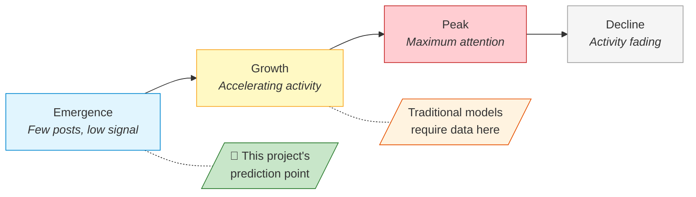
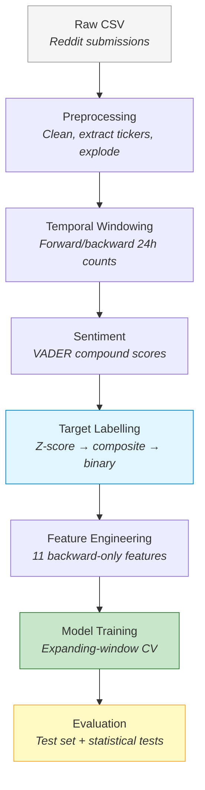

# Predicting Posting-Volume Surges on Reddit Financial Communities Using Machine Learning

## Abstract

Social media discussions in online financial communities, such as Reddit, can shift from quiet to frenzied within hours, yet detecting these **posting-volume surges** before they fully develop has received little research attention, partly because most prior approaches inadvertently use future information, a problem known as **data leakage**. This project mainly asked a question: can surges be predicted using only features that are genuinely available at observation time? <!-- why not just use only volume growth or sentiment change, why use combined, this project not only provide solution directly but also an experiment of how to find the appropriate solution for this question --> To answer this, a composite surge metric was built from normalised volume growth and sentiment change, and **eleven features** were drawn from timestamps and text content, deliberately excluding <!--too specific but do not explain why exlcuding it --> engagement scores that only settle after a post has already gained traction. Three classifiers (Logistic Regression, Random Forest, and XGBoost) were trained with expanding-window **temporal cross-validation** and tested on held-out future data from two subreddits at opposite ends of the density spectrum: the niche r/pennystocks (80,212 records) and the high-traffic r/wallstreetbets (1,293,981 records). On the larger dataset, XGBoost achieved AUC-ROC of 0.861 and Random Forest reached 0.854, both clearing the stretch performance tier; on the sparser community, Random Forest attained 0.746 at the target tier. All pairwise differences proved statistically significant (McNemar's test, p < 0.017 after Bonferroni correction), and cross-dataset transfer produced AUC of 0.694, useful but clearly requiring community-specific recalibration. Taken together, these findings show that **machine learning** can anticipate surges from backward-looking signals alone, that data density is the main bottleneck for **binary classification** accuracy, and that the leakage-free methodology developed here transfers readily to other timestamped  platforms.

---

## 1. Introduction

### 1.1 Project Concept and Objectives

This project follows the **CM3005 Data Science** project template, *Predictive Modelling of Social Media Trend Emergence*. It builds a machine learning system that predicts whether a stock ticker's Reddit discussion is about to surge, using only backward-looking features available at observation time. Three classifiers (Logistic Regression, Random Forest, and XGBoost) are trained and compared on this binary task.

The project has three objectives:

- Build a predictive model from early-stage discussion features (temporal patterns, activity frequency, sentiment) that can forecast per-ticker surges before they happen
- Compare multiple ML approaches to find out whether more complex models actually improve prediction over simpler baselines
- Confirm that predictions hold up on unseen future time periods by using temporal evaluation protocols that prevent data leakage, a common methodological weakness in social media prediction studies

### 1.2 Problem Statement and Motivation

Stock-related discussions on Reddit can go from quiet to frenzied within hours. A ticker attracting two posts yesterday might appear in fifty today, triggered by earnings surprises, speculative momentum, or coordinated retail interest. These surges develop too quickly for manual monitoring, particularly across forums where thousands of tickers are discussed daily.

This is primarily a research question: can the onset of a social media surge be detected from the discussion patterns that precede it? Answering this question also has practical relevance for financial analysts seeking early warning of emerging narratives, surveillance teams watching for manipulation, and quantitative researchers studying how attention propagates through online communities.

Prior work in this area tends to focus on related but distinct problems: forecasting eventual content reach rather than detecting rapid onset, or predicting price movements rather than social media dynamics themselves. In the reviewed literature, predicting the onset of a volume-and-sentiment surge for individual tickers within a short-term window remains largely unaddressed (see Section 2.6).

This project explores whether such surges are predictable from the discussion patterns that precede them.

### 1.3 Prediction Scope and Surge Definition

The original project template uses the term "trend emergence," but trends can be gradual and sustained, making them difficult to label objectively within a fixed time window. This project narrows the scope to **surges**: statistically significant short-term increases in both **posting volume** and **sentiment intensity** for a specific ticker within **a 24-hour window**, measured by a composite metric combining normalised volume growth with sentiment change magnitude. Surges are discrete, quantifiable events that lend themselves to binary classification, making them a more tractable operationalisation of the broader "trend" concept. A surge represents the earliest observable stage of a trend, so predicting surges is equivalent to detecting trends at their point of emergence.

The target derives from posting volume (timestamp-based record counts) rather than engagement scores like upvotes, which are future-contaminated snapshot values that would introduce look-ahead bias. Z-scores use training-partition statistics only, preventing leakage. The formal definition, weighting, and threshold selection are detailed in Section 3.3.

### 1.4 Scope

**In scope:** Two pre-collected Reddit datasets representing opposite ends of the data density spectrum — r/pennystocks (80,212 records), a sparse niche community, and r/wallstreetbets (1,293,981 records), a high-volume mainstream forum. This dual-dataset design tests whether the methodology generalises across community sizes or whether data density is a binding constraint. Also in scope: feature engineering from text and timestamps, binary classification, a reproducible pipeline with seeded randomness, and cross-dataset transfer evaluation.

**Out of scope:** Real-time ingestion, production deployment, trading signal generation, multi-class targets, cross-platform fusion.

The system achieves AUC-ROC of 0.861 on the high-density dataset and 0.746 on the sparse dataset, demonstrating that surges are predictable from observation-time features but that data density significantly affects performance.

### 1.5 Project Timeline

<figure align="center">
  
  <figcaption>Figure 2: Project Timeline (Gantt Chart).</figcaption>
</figure>

---

## 2. Literature Review

<!--
## 1. Establish the Current State of Knowledge
Goal: Demonstrate a deep understanding of the key concepts, theories, and historical timeline of your research topic. 

* What are the foundational theories or models governing this field?
* Who are the seminal authors and leading researchers on this topic?
* How has the academic consensus on this topic evolved over time?
* What are the standardized definitions and terms used by experts?

## 2. Identify Gaps and Weaknesses in Extant Research
Goal: Pinpoint what previous research has missed, ignored, or failed to resolve to justify why your own study is necessary. 

* What blind spots or unexamined variables exist in the current literature?
* What are the persistent flaws, limitations, or biases in past studies?
* Where do different studies conflict, disagree, or present contradictory results?
* Is the existing research outdated or lacking application to a new population/context?

## 3. Evaluate Methodologies and Research Designs
Goal: Analyze how previous scientists gathered data so you can adopt effective methods and avoid common technical pitfalls.  

* What data collection methods (qualitative, quantitative, or mixed) are most prevalent?
* What sampling techniques, tools, or data metrics did prior researchers use?
* What structural constraints or ethical obstacles did previous authors face?
* How will your chosen methodological approach address the limitations of prior setups? 

## 4. Synthesize and Connect Prior Findings
Goal: Move beyond mere summary by grouping separate papers into thematic clusters to show the bigger picture. 

* What overarching themes, trends, or sub-topics connect these separate sources?
* How does study A support, extend, or directly refute the findings of study B?
* What major conceptual frameworks emerge when these papers are viewed collectively?
* How do local or niche findings translate to a broader global environment? 

## 5. Provide a Rationale for Your Own Study
Goal: Explicitly link your reading to your own research hypotheses, questions, or project goals.

* How does the existing literature directly inform your current research questions?
* In what explicit ways will your study fill the literature gaps you discovered?
* How will you use past findings as a benchmark to validate your final results? 

-->

### 2.1. The Predictability of Online Attention

The foundational question underlying this project, *can future surges in social media activity be predicted?*, was first addressed through research on *online popularity prediction*. This field established that online attention is not random: content that attracts early engagement tends to attract more, following patterns that are statistically detectable.

Szabo and Huberman [1] produced the seminal result, demonstrating strong log-linear correlations between early and later popularity on YouTube and Digg. Their regression model showed that a content item's view count at time *t* predicts its eventual popularity with high accuracy. This established the core principle: **early behavioural signals carry predictive information about future attention**. However, the model assumes a stationary growth process and requires content to have already accumulated measurable engagement before prediction becomes possible. It cannot forecast at or near the time of posting.

Lerman and Hogg [2] extended this understanding by modelling the interaction between social network structure and content discovery, demonstrating that popularity depends on behavioural dynamics beyond simple cumulative counts. Their agent-based approach revealed that network position and user browsing patterns mediate how content gains visibility. Wang and Huberman [6] and Kong et al. [7] further characterised online attention as following identifiable temporal lifecycles (emergence, growth, peak, and decline) suggesting that content at different lifecycle stages exhibits different observable signatures.

The academic consensus that emerged from this first wave of research can be summarised as: *online attention is predictable from early signals, follows lifecycle dynamics, and is mediated by platform-specific network effects*. However, these models all require content to have already gained some traction before prediction is possible, and they target *eventual* popularity rather than the *onset* of rapid growth.


*Figure 1: Online attention lifecycle model [6][7]. Traditional popularity prediction requires content to have reached the growth phase before forecasting is possible. This project targets the emergence phase, predicting a surge before substantial engagement has accumulated.*

### 2.2. The Shift Toward Pre-Engagement Prediction

A second wave of research addressed the limitation that early popularity models require existing engagement data. Bandari et al. [3] demonstrated that content metadata (source, category, subjectivity, named entities) could predict popularity *before* any engagement accumulates, achieving ~84% classification accuracy on news articles. This was a methodologically significant shift: for the first time, prediction could occur at or before publication rather than requiring a waiting period.

Cheng et al. [5] achieved ~79.5% accuracy (AUC 0.877) predicting whether Facebook photo cascades would double in size, using temporal features derived from early propagation speed and structural virality metrics. Their work showed that the *rate* of early spread, not just its magnitude, carries predictive signal about whether content will continue growing. Yuan and Li [8] extended this principle to information diffusion more broadly, suggesting that early-stage propagation patterns contain sufficient signal to forecast later trajectory.

This body of work established a second consensus: **prediction is possible before substantial engagement accumulates**, provided features capture content characteristics or early propagation dynamics. However, the prediction targets remained *eventual outcomes* (final popularity, total cascade size) rather than *rapid onset* within a bounded window. An analyst monitoring a financial forum needs to know whether discussion will surge in the *next 24 hours*, not whether it will eventually become popular. This is a distinction no reviewed study addresses.

*Table 1: Evolution of online attention prediction, from post-engagement to pre-engagement approaches.*

| Study | Year | Platform | Prediction Target | Requires Existing Engagement? | Accuracy |
|-------|------|----------|-------------------|-------------------------------|----------|
| Szabo & Huberman [1] | 2010 | YouTube, Digg | Future view count | Yes (needs early views) | r² > 0.9 |
| Lerman & Hogg [2] | 2010 | Digg | Story popularity | Yes (needs network data) | N/A (model) |
| Bandari et al. [3] | 2012 | News articles | Popularity bin | **No** (content metadata only) | ~84% |
| Cheng et al. [5] | 2014 | Facebook | Cascade doubling | Partial (early reshares) | 79.5% (AUC 0.877) |
| Yuan & Li [8] | 2019 | Weibo | Diffusion trajectory | Partial (early propagation) | N/A (descriptive) |

### 2.3. Sentiment as a Predictive Signal in Finance

Parallel to the popularity prediction literature, research in computational finance established that collective sentiment extracted from social media text carries measurable predictive information. Bollen et al. [4] demonstrated that aggregate Twitter mood, particularly the "Calm" dimension measured by GPOMS, predicted Dow Jones movements with ~87.6% directional accuracy. Despite significant methodological limitations (short evaluation period, no out-of-sample validation, unclear causal mechanism), this study was influential in establishing that **textual sentiment from social media has predictive value for financial outcomes**.

The tools used for sentiment extraction have evolved alongside this finding. General-purpose lexicons like OpinionFinder lack domain specificity for financial language, where terms like "short," "bearish," or "moon" carry specialised meaning. Hutto and Gilbert [12] developed VADER specifically for social media text, incorporating rules for punctuation emphasis, capitalisation, degree modifiers, and negation, and achieving F1=0.96 on social media benchmarks. Araci [13] later introduced FinBERT, a transformer model fine-tuned on financial corpora, capturing contextual meaning that rule-based tools miss. This evolution from general lexicons → social-media-specific rules → domain-specific deep learning represents the field's recognition that sentiment tools must match their application domain.

For this project, the key takeaway is that sentiment *change*, not just absolute sentiment, may serve as a leading indicator of surges: if a ticker's discussion becomes markedly more emotional before volume escalates, sentiment shift could provide early warning signal. This motivates including sentiment change magnitude in the composite surge metric.

*Table 2: Evolution of sentiment analysis tools relevant to financial social media.*

| Tool | Type | Domain | Strengths | Limitations for This Project |
|------|------|--------|-----------|------------------------------|
| OpinionFinder as used in [4] | Lexicon | General | Early adoption, widely cited | No social media conventions, no financial terms |
| VADER [12] | Rule-based | Social media | Handles capitalisation, emoticons, negation; F1=0.96 | No financial domain tuning ("short," "moon" misscored) |
| FinBERT [13] | Transformer | Financial text | Context-aware, domain-specific | Computationally expensive for 1M+ records |

### 2.4. Financial Discussion on Reddit

The preceding research established general principles on platforms like YouTube, Digg, Facebook, and Twitter. A more recent strand examines whether these principles apply to Reddit's financial communities specifically, and what unique characteristics these communities introduce.

Penny stocks (low-capitalisation equities typically trading below $5 per share) occupy a distinctive position: their low liquidity and limited analyst coverage mean that social media discussion can constitute a disproportionate share of available information [9][10]. Reddit's subreddit structure creates focused communities with shared norms and persistent threads, unlike Twitter's ephemeral broadcast model.

Long et al. [9] demonstrated that r/WallStreetBets posting volume correlated with abnormal trading volume and returns for discussed stocks, with effects concentrated in small-cap equities. Their analysis showed that increased Reddit attention *preceded* trading activity in their sample, suggesting that discussion patterns carry predictive signal rather than merely reflecting market events. Costola et al. [10] examined the GameStop episode specifically, finding that consensus formation within r/WallStreetBets followed measurable patterns in posting frequency and sentiment alignment *before* reaching critical mass. A small number of committed users drove broader engagement through detectable temporal signatures.

Mancini et al. [11] applied this principle to pump-and-dump detection, building predictive models from the language and timing of forum posts associated with manipulated stocks. Their work confirmed that text-based features from financial discussion forums achieve classification performance significantly above random baselines for predicting anomalous stock activity.

These studies collectively establish that **Reddit financial communities generate measurable, predictive signals**, but all predict *market outcomes* (returns, trading volume, manipulation) rather than *social media dynamics* themselves. The question of whether the discussion itself will escalate, whether a ticker's posting volume is about to surge, remains unaddressed. This is the specific prediction target of the present project.

### 2.5. Methodological Weaknesses in Prior Work

Beyond the substantive gaps identified above, a critical methodological pattern cuts across the reviewed literature: a recurring absence of rigorous temporal evaluation protocols across the studies reviewed here.

Szabo and Huberman [1] evaluate on data drawn from the same time period as training. Bandari et al. [3] use random train-test splits rather than temporal partitions, meaning models may be tested on articles published *before* some training data, a form of information leakage. Cheng et al. [5] randomly sample cascades for evaluation without preserving temporal ordering. Long et al. [9] and Costola et al. [10] analyse correlations across their full datasets without testing whether patterns discovered in earlier periods generalise to later ones.

This matters because Tashman [14] demonstrated that rolling-origin evaluation, where the forecasting origin advances forward through time, produces more reliable accuracy estimates for temporal prediction tasks than fixed or random splits. Bergmeir and Benítez [15] showed empirically that random cross-validation *overestimates* predictive accuracy for time-dependent data, recommending blocked or expanding-window schemes that preserve temporal ordering. Despite these methodological advances being well-established in the forecasting literature, they remain largely unadopted in social media prediction research.

The consequence is that reported performance figures across the reviewed studies may be inflated by temporal leakage, and it remains unresolved whether models would generalise to genuinely unseen future periods. For any system intended for real-world deployment, including surge detection, this is a critical deficiency. Fernández-Delgado et al. [16], in their large-scale classifier comparison, similarly noted that evaluation methodology substantially affects reported performance rankings, reinforcing that *how* a model is evaluated matters as much as *which* model is selected.

*Table 3: Temporal evaluation practices across reviewed studies.*

| Study | Evaluation Method | Temporal Ordering Preserved? | Leakage Risk |
|-------|-------------------|------------------------------|--------------|
| Szabo & Huberman [1] | Same-period evaluation | No | High |
| Bandari et al. [3] | Random train-test split | No | High |
| Bollen et al. [4] | Fixed holdout (1 month) | Partial | Medium |
| Cheng et al. [5] | Random cascade sampling | No | High |
| Long et al. [9] | Full-dataset correlation | No | High |
| Costola et al. [10] | Full-dataset analysis | No | High |
| Mancini et al. [11] | Chronological split | Partial | Medium |

### 2.6. Research Gap and Project Position

The literature reviewed above establishes four cumulative findings:

- Early behavioural signals predict future online attention [1][5]
- Prediction is possible before engagement accumulates, using content and propagation features [3][5][8]
- Sentiment extracted from social media carries predictive value in financial contexts [4][12]
- Reddit financial communities generate measurable signals that precede market activity [9][10][11]

Four gaps remain unaddressed:

1. **Prediction target:** All reviewed studies predict *eventual outcomes* (final popularity, cascade size, market returns) rather than detecting the *onset* of rapid growth within a bounded time window. No study defines or predicts a composite volume-and-sentiment surge within a fixed short-term window.

2. **Signal integration:** Each research strand demonstrates one feature category's value in isolation (temporal [1], content [3], sentiment [4], structural [5]), but empirical integration of multiple signal types into a unified predictive framework remains limited, despite evidence that they interact during trend formation [2][7].

3. **Domain specificity:** General social media prediction research [1][3][5] does not account for the distinctive characteristics of financial discussion (event-driven reactions, domain-specific language, speculative behaviour). Conversely, Reddit financial research [9][10][11] predicts *market* consequences of surges rather than predicting whether surges *will occur*.

4. **Temporal validity:** The use of random or unspecified evaluation splits across the literature [1][3][5][9] means reported results may not reflect real-world predictive performance. Rigorous temporal evaluation methods exist [14][15] but remain unadopted in this domain.

This project addresses these gaps directly. The composite surge metric (Section 3.3) defines a binary onset target within a 24-hour window (gap 1). The feature set (Section 3.4) combines temporal, activity-frequency, sentiment, and textual signals (gap 2). The pipeline is applied to Reddit financial communities using two subreddits at opposite ends of the data density spectrum (gap 3). Expanding-window temporal cross-validation ensures that no future information leaks into training (gap 4). Whether this integration yields meaningful predictive performance is the empirical question examined in Section 5.

---

## 3. Design
<!-- 
SIDE NOTE (DELETE LATER)
- why use Reddit not X or other platform
- why not use API
- why use 2 datasets, why pick pennystocks and wsb
- why use combined/composite metric
- why pick 3 model: LR, RF, XGB
- why use validation-fold
- why not k=5 or k=10 but k=4?
- what are stretch tier vs target tier
- have we set goal for this project (musthave tier, target tier, and stretch tier)
- discuss about data drift ? aware of it and provide solution 
-->

<!--
## 1. Establish Methodological Rationalization
Goal: Justify why your chosen approach is the most effective vehicle for your specific research.

* Why did you choose this specific paradigm (quantitative, qualitative, or mixed-methods)?
* How does this structural design directly answer your primary research questions?
* What alternative designs did you reject, and why were they less suitable?
* How does this design align with the theoretical framework built in your literature review?

## 2. Define Boundaries and the Sampling Strategy
Goal: Clearly outline who or what you are studying, and how you selected your subjects.

* What is your exact target population or unit of analysis (e.g., individuals, texts, organizations)?
* What specific sampling method did you use (e.g., random, purposive, snowball sampling)?
* What were your explicit inclusion and exclusion criteria for participants or data?
* What is your final sample size, and why is it statistically or conceptually sufficient?

## 3. Detail the Operational Procedures
Goal: Provide a step-by-step chronological recipe so another researcher can replicate your study exactly.

* What exact materials, hardware, software, or standardized instruments did you utilize?
* What were the chronological steps taken to set up and execute the study?
* How did you control for extraneous variables or potential sources of bias?
* If you conducted a pilot study, what adjustments did you make based on those trial runs?

## 4. Outline Data Collection Metrics
Goal: Explain exactly how information was gathered and measured during the execution phase.

* What specific types of data were collected (e.g., test scores, interview transcripts, digital logs)?
* How did you ensure the validity (accuracy) and reliability (consistency) of your measurement tools?
* What specific roles did the researchers play during the data gathering process?
* When, where, and over what exact timeframe was the data collected?

## 5. Formulate the Data Analysis Plan
Goal: Explain how you will transform raw data into meaningful answers before you actually present findings.

* What specific statistical tests (quantitative) or coding frameworks (qualitative) will you apply?
* Which software packages (e.g., SPSS, R, NVivo) will be used to process the data?
* How will you handle missing, corrupted, or incomplete data points?
* How do these specific analysis techniques map back to your original hypotheses?

## 6. Address Ethical and Quality Controls
Goal: Prove that your study protects participants and adheres to strict professional standards.

* What institutional review boards (IRB) or ethical committees approved this project?
* How did you secure informed consent and protect participant anonymity or data privacy?
* What steps were taken to minimize physical, psychological, or social risks to subjects?
* How did you address potential researcher bias or conflicts of interest?

------------------------------
## Quick Framework: The 4 D’s of Research Design
When writing or reviewing your design section, ensure it satisfies these four criteria:

* Define: Clearly state the parameters, variables, and populations involved.
* Do: Detail the precise actions taken during the experiment or fieldwork.
* Defend: Explain the logical reasons behind every technical choice you made.
* Disclose: Report all limitations, ethical steps, and structural constraints openly.

-->
### 3.1 System Architecture

The prediction system is implemented as a linear staged pipeline, where each stage consumes the output of the previous one and produces a well-defined intermediate artifact. This staged design was chosen over a monolithic approach for two reasons: it allows each stage to be tested and validated independently, and it enables re-running downstream stages (e.g., retraining with different hyperparameters) without recomputing expensive upstream operations (e.g., sentiment scoring of 1.3M records).

The pipeline comprises six stages:

1. **Data Loading and Preprocessing** — CSV ingestion, text cleaning, regex-based ticker extraction with stopword filtering, and record explosion (one row per record-ticker pair)
2. **Temporal Windowing** — Per-ticker forward/backward 24-hour posting counts using vectorised binary search (forward counts are used for target labelling only; features use backward counts exclusively)
3. **Sentiment Computation** — VADER compound scoring per record, with title-fallback for missing selftext
4. **Target Labelling** — Temporal 80/20 split, z-score normalisation using training-partition statistics only, composite metric computation, and binary thresholding
5. **Feature Engineering** — Eleven backward-only features derived from timestamps and text (detailed in Section 3.4)
6. **Model Training and Evaluation** — Expanding-window temporal cross-validation, hyperparameter tuning, test-set evaluation, and statistical comparison

Each stage writes its output to disk (CSV or joblib-serialised objects), creating an audit trail from raw data to final predictions. The pipeline is invoked via CLI entry points with configuration parameters passed as arguments, enabling reproducible execution with different settings (e.g., threshold sweeps, dataset switching) without code modification.


*Figure 2: Pipeline architecture. Shading indicates the three critical design points: target labelling (leakage prevention), model training (temporal validation), and evaluation (statistical rigour).*

A key architectural constraint is that **no stage may access information from the future relative to the observation time of any record**. This constraint propagates through the pipeline: sentiment is scored from the record's own text (not future replies), features use only backward-looking windows, z-scores use training-partition statistics, and validation folds are strictly ordered in time. The design ensures that any prediction the system makes could, in principle, have been made at the moment the post was created — a necessary condition for any predictive system operating on temporal data.


### 3.2 Data Selection and Characteristics


<!-- Why Reddit as a data source (public, threaded, subreddit-specific, ticker-rich) -->
<!-- Why not other platforms: Twitter/X ephemeral stream lacks persistent threading; StockTwits smaller user base and less organic discussion; Reddit combines persistent threaded posts with large active communities -->
<!-- Why these two subreddits specifically: -->
<!--   r/pennystocks — sparse niche community (80,212 records), low-cap focus, tests model under data scarcity -->
<!--   r/wallstreetbets — high-volume mainstream forum (1,293,981 records), tests scalability and signal extraction from noise -->
<!-- Dual-dataset design: opposite ends of data density spectrum to test generalisability -->
<!-- Time range covered, record structure (columns/fields available) -->

<!-- Survivorship bias: deleted or moderated posts are not captured in the archival dataset; the analysed data represents only posts that remained publicly visible at collection time -->
<!-- Snapshot timing: engagement metrics (score, num_comments) are frozen at collection time and may not reflect final values — this is why the project uses timestamp-derived features rather than engagement scores -->
<!-- Completeness: potential gaps due to Reddit API rate limits or archival service downtime during collection period -->
<!-- Single-platform scope: findings may not generalise to other financial discussion platforms with different user bases and moderation norms -->
<!-- Temporal coverage: results are bound to the specific time period captured; market regime changes or platform policy shifts outside this window may alter surge dynamics -->

<!-- Source: pre-collected CSV exports from academic/archival Reddit datasets -->
<!-- Specific source: [https://www.kaggle.com/datasets/leukipp/reddit-finance-data, specific Kaggle dataset, search through Reddit API] -->
<!-- No live API scraping — static snapshot ensures reproducibility -->
<!-- Fields retained: timestamp, title, selftext, subreddit, score, num_comments, etc. -->
<!-- Any filtering applied at collection time (date range, post type) -->

<!-- Data quality notes: -->
<!-- Known issues in raw data: deleted/removed posts (showing as [removed] or [deleted]), missing selftext fields, duplicate records -->
<!-- These are addressed in preprocessing (Section 4.2); noted here for transparency about raw data state -->


<!-- Public data: Reddit posts are publicly accessible; no private or deleted content used -->
<!-- Anonymity: no attempt to identify or profile individual users; no individual users singled out in results or examples (aggregated analysis only) -->
<!-- No personally identifiable information (PII) retained or processed -->
<!-- Purpose: academic research only; no trading decisions were made based on model outputs -->
<!-- Ethics approval: formal ethics approval was not required for analysis of publicly available aggregated data under university guidelines — [confirm and state explicitly] -->
<!-- Compliance with university ethics guidelines and Reddit's terms of service -->
<!-- Data storage: local only, not redistributed beyond project submission -->

Reddit was selected as the data source for **three reasons**: its subreddit structure creates topically focused communities where stock discussion is concentrated and retrievable; posts are publicly accessible and archived, enabling reproducible research without API rate constraints; and its threaded format produces timestamped submissions with text content suitable for both temporal and sentiment feature extraction. Alternative platforms were considered and rejected — Twitter/X's ephemeral stream lacks persistent threading, StockTwits has a smaller user base with less organic discussion diversity, and proprietary trading forums are not publicly accessible.

Two subreddits were selected to represent opposite ends of the data density spectrum:

- **r/pennystocks** — A niche community focused on low-capitalisation equities. Its sparse ticker distribution (thousands of tickers, most with very few posts) tests whether the methodology degrades gracefully under data scarcity.
- **r/wallstreetbets** — A high-volume mainstream forum with concentrated ticker discussion. Its density (hundreds of posts per day on popular tickers) tests whether the pipeline scales and whether signal can be extracted from a noisier, higher-volume environment.

This dual-dataset design directly addresses literature gap 3 (domain specificity) by applying the same pipeline to two communities with fundamentally different characteristics, and enables cross-dataset transfer evaluation — testing whether models trained on one community generalise to the other.

*Table 4: Dataset characteristics.*

| Property | r/pennystocks | r/wallstreetbets |
|----------|---------------|------------------|
| Raw records | 304,524 | 1,293,981 |
| Date range | 2021-01-01 to 2021-12-31 | 2021-01-01 to 2021-12-31 |
| After ticker extraction (exploded) | 80,212 | 577,872 |
| Usable records (post-exclusion) | 24,827 | 457,072 |
| Exclusion rate | 69.0% | 20.9% |
| Train / Test split | 21,549 / 3,278 | 388,149 / 68,923 |
| Test surges | 31 | 2,582 |
| Test surge rate | 0.95% | 3.75% |
| Test imbalance ratio | 105:1 | 26:1 |

Both datasets are static CSV exports from the Reddit Finance Data collection on Kaggle [17], which was compiled by querying the Reddit API for submissions matching finance-related criteria across multiple subreddits. The files used cover the full calendar year 2021. This period was chosen because it spans the January GameStop episode through the subsequent normalisation, capturing both peak surge activity and quieter periods. It provides temporal variety for the expanding-window cross-validation design. No live API scraping was performed; the static snapshot ensures that any researcher with the same input files can reproduce identical results.

Each record contains: a Unix timestamp (`created`), post title, optional selftext body, and engagement fields (`score`, `num_comments`) that are *not* used as features but are retained for transparency. The pipeline extracts ticker symbols from title and selftext using regex with stopword filtering, then explodes multi-ticker records into one row per record-ticker pair — the unit of analysis for feature engineering and prediction.

**Ethical considerations.** All data consists of publicly posted Reddit submissions; no private, deleted, or moderated content is included in the archived dataset. No attempt is made to identify or profile individual users — analysis is aggregated at the ticker level. No personally identifiable information is retained or processed. The project is academic research only; no trading decisions were made from model outputs. Formal ethics approval was not required under university guidelines for analysis of publicly available aggregated data.

**Known limitations.** The archival dataset exhibits survivorship bias: posts deleted or removed by moderators before the archive snapshot are not captured. Engagement metrics (`score`, `num_comments`) are frozen at collection time and may not reflect final values — this is precisely why the project uses timestamp-derived posting volume rather than engagement scores as the prediction target. Potential gaps exist from Reddit API rate limits during the original archival collection. Results are bound to the 2021 time period; market regime shifts or platform policy changes outside this window may alter surge dynamics.

### 3.3 Surge Definition (Target Variable)

Defining "surge" as a binary label is the central design challenge. A naive approach, such as flagging any ticker that crosses a fixed posting-count threshold, fails because tickers have wildly different baselines. A ticker that normally attracts 2 posts per day behaves very differently from one that attracts 200; a fixed count would permanently label high-volume tickers as "surging" while missing genuine spikes in quieter discussions. What matters is not how many posts appear, but whether the current activity is *statistically unusual* for that ticker's recent history.

The solution is a composite metric that normalises volume growth relative to the training distribution and combines it with sentiment change:

> *composite = (w₁ × z_volume) + (w₂ × z_sentiment)*

For each record mentioning ticker *X* at time *t*, the pipeline:

1. Counts *X*-mentioning posts in a forward window (*t*, *t*+24h] and a backward window (*t*−24h, *t*]
2. Computes volume growth: (forward_count / max(backward_count, 1)) − 1
3. Computes sentiment shift: |mean(forward_sentiments) − current_sentiment|
4. Z-score normalises both components using training-partition statistics only (μ and σ frozen from the 80% temporal split)
5. Combines the weighted z-scores into the composite
6. Labels surge=1 if composite > threshold *τ*, else surge=0

Records with too few posts in their forward window are excluded because there is simply not enough data to judge whether a "surge" has occurred.

**Why include sentiment at all?** The literature suggests surges involve heightened emotional tone alongside increased activity [4][10]. Volume alone would miss cases where a small community becomes markedly more agitated without posting more frequently. The composite captures both dimensions while remaining configurable: setting w₂=0 reduces to volume-only, enabling direct comparison of whether sentiment adds predictive value (the Phase 1 vs Phase 2 experiment described below).

**Why z-scores rather than raw percentages?** A ticker going from 1 to 5 posts and one going from 100 to 500 posts both show 400% growth, but the first case might be random noise while the second represents a genuine community-wide event. Z-scoring against the training distribution identifies growth that is *statistically unusual*, applying the same standard regardless of a ticker's typical activity level.

**Preventing leakage in the labels themselves.** The z-score parameters are computed exclusively from the training partition and frozen before the test partition is labelled. Without this step, the mean and standard deviation would incorporate test-period information, subtly contaminating the target variable. This is a form of data leakage that would inflate evaluation metrics.

**Choosing the threshold τ.** The threshold controls how "extreme" an event must be to count as a surge. Higher values produce rarer, more dramatic surges but worsen class imbalance:

*Table 5: Threshold sensitivity on r/wallstreetbets (457,072 usable records).*

| τ | Surge Count | Surge Rate | Imbalance Ratio |
|---|-------------|------------|-----------------|
| 0.5 | 80,455 | 17.6% | 4.7:1 |
| **1.0** | **22,384** | **4.9%** | **19.4:1** |
| 1.5 | 6,602 | 1.4% | 68.2:1 |
| 2.0 | 2,873 | 0.6% | 158:1 |
| 2.5 | 1,348 | 0.3% | 338:1 |

τ=1.0 was selected for the primary evaluation. It produces a ~5% surge rate, which is rare enough to be meaningful but common enough (22,384 events across the dataset, 2,582 in the test set) for statistically reliable model evaluation. A secondary run at τ=1.5 on r/pennystocks tests behaviour under more extreme imbalance.

**Two-phase validation of the composite design.** To determine whether the sentiment component genuinely improves prediction or merely adds noise, the experiment is run twice: Phase 1 with w₂=0 (volume-only labels) and Phase 2 with w₁=w₂=0.5 (equal composite). If Phase 2 outperforms Phase 1, sentiment contributes meaningful signal; if not, the simpler volume-only definition suffices.

### 3.4 Feature Engineering

All features satisfy the backward-looking constraint from Section 3.1: only information available at or before observation time *t* is used. The most tempting predictors, Reddit score and comment count, are excluded for exactly this reason. They look predictive because they *are* the surge; including them would be circular.

With that constraint in mind, the eleven features are organised into four groups:

*Table 6: Feature definitions. All features are computed at observation time t using only backward-looking or concurrent information.*

| Feature | Category | Type | Definition |
|---------|----------|------|------------|
| `sentiment_score` | Content | Continuous [−1, 1] | VADER compound sentiment of the post text |
| `word_count` | Content | Discrete ≥ 0 | Number of words in selftext (0 if absent) |
| `title_length` | Content | Discrete ≥ 0 | Character count of the post title |
| `num_tickers_mentioned` | Content | Discrete ≥ 1 | Number of distinct tickers extracted from the post |
| `hour_of_day` | Temporal | Discrete [0–23] | Hour of post creation (UTC) |
| `day_of_week` | Temporal | Discrete [0–6] | Day of post creation (Monday=0) |
| `time_since_previous` | Activity | Continuous ≥ 0 | Seconds since the previous post mentioning the same ticker |
| `ticker_post_rate_24h` | Activity | Continuous ≥ 0 | Number of same-ticker posts in the preceding 24 hours |
| `ticker_post_acceleration` | Activity | Continuous | Change in posting rate: count in preceding 12h minus count in the 12h before that |
| `word_count_x_hour` | Interaction | Continuous | word_count × hour_of_day |
| `accel_x_time_since_prev` | Interaction | Continuous | ticker_post_acceleration × time_since_previous |

**Content features** describe what is being said. Sentiment provides a proxy for emotional intensity [4]. Word count and title length reflect how much effort a poster invested (longer posts tend to be substantive analysis rather than one-line reactions). Ticker count distinguishes focused single-stock discussion from broad market commentary.

**Temporal features** describe when the post appears. Hour and day of week encode cyclical patterns tied to market hours and weekend effects. Surges may cluster around market open or after-hours earnings releases, making timing a useful contextual signal.

**Activity features** describe how the ticker's discussion has been behaving recently. These draw most directly on the popularity prediction literature [1][5]: if posts about a ticker are arriving faster than usual, a surge may already be forming. The `time_since_previous` feature adapts Cheng et al.'s "early propagation speed" concept to the discussion-forum setting, while `ticker_post_acceleration` measures whether the rate itself is increasing or decreasing.

**Interaction features** were added after experiment B2 showed that manually constructed feature combinations improved Random Forest AUC by +1.4 percentage points on the pennystocks dataset. Even tree-based models, which can in principle discover interactions through splits, benefited from having cross-feature products available directly. The `word_count_x_hour` interaction captures a specific pattern observed during EDA: long posts written during pre-market hours (the typical "DD" analysis posts) appear disproportionately before surges.

**What was left out.** Reddit's `score` (upvotes minus downvotes) and `num_comments` are available in the raw data but deliberately excluded. These fields accumulate *after* a post is created and reflect the very engagement dynamics the model is trying to predict. Using them would be equivalent to telling the model the answer, and any performance gains would not generalise to real-time prediction where these values are not yet available.

### 3.5 Model Selection

Rather than picking a single model and optimising it, this project compares three classifier families to answer a specific question: does model complexity actually help for surge prediction? If a simple linear model performs nearly as well as a gradient boosting ensemble, the surge signal is straightforward and the features do most of the work. If complex models pull clearly ahead, the data contains non-linear patterns that simpler approaches miss.

The three families were chosen to span the complexity spectrum:

- **Logistic Regression (LR)** is the interpretable baseline. It fits a linear decision boundary with elastic net regularisation (combined L1/L2), making it the simplest model in this comparison. If LR performs well, the surge signal is approximately linearly separable in the feature space.
- **Random Forest (RF)** represents bagged ensembles. It captures non-linear relationships through tree splits, handles noisy features gracefully, and provides built-in importance estimates. Fernández-Delgado et al. [16] found that random forests achieved the highest overall accuracy across 121 benchmark datasets.
- **XGBoost** represents sequential boosting. Each tree corrects the mistakes of the previous ensemble, with L1/L2 regularisation on leaf weights to prevent overfitting. Gradient boosting methods, the family XGBoost belongs to, consistently rank among the top performers on structured tabular data [16].

Together, these three cover linear, bagged ensemble, and boosted ensemble approaches. The comparison reveals whether surge prediction benefits from increasing model capacity or whether the features themselves carry the signal.

**Why AUC-ROC as the primary metric.** With surge rates between 1% and 5%, accuracy tells us almost nothing. A model that predicts "no surge" for every record achieves 95–99% accuracy while being completely useless. AUC-ROC measures how well the model *ranks* surge-likely records above non-surge records, regardless of where the classification threshold is set. This makes it the right metric when the optimal operating point is not known in advance. Precision, recall, and F1 are reported as secondary metrics at both the default (0.5) and validation-tuned thresholds.

**Handling class imbalance.** Resampling techniques like SMOTE generate synthetic minority-class samples by interpolating between existing ones. For temporally ordered data this is problematic: a synthetic record created between two time points has no meaningful timestamp and could introduce spurious temporal patterns. Instead, the pipeline uses cost-sensitive learning. Logistic Regression and Random Forest use `class_weight='balanced'`, which scales the loss inversely proportional to class frequency. XGBoost uses `scale_pos_weight` set to the negative-to-positive ratio. Both approaches penalise minority-class errors more heavily during training without manufacturing artificial data points.

### 3.6 Temporal Validation Design

Standard k-fold cross-validation randomly assigns records to folds, which means a model might train on posts from October and validate on posts from March. For temporal prediction tasks, this is a form of cheating: the model has seen future patterns before being asked to predict them. Bergmeir and Benítez [15] showed that this inflates accuracy estimates, sometimes substantially. Since this project's central claim is that surges can be predicted from *past* information alone, the validation protocol must respect time ordering throughout.

The pipeline uses a two-level temporal strategy:

**Level 1: Train/test split (80/20 by timestamp).** All records are sorted chronologically. The first 80% form the training partition; the final 20% form the held-out test set. The test set is never seen during model selection, hyperparameter tuning, or threshold calibration. It is used exactly once to produce the final reported metrics.

**Level 2: Expanding-window cross-validation within training (k=4 folds).** Within the training partition, hyperparameters are selected using an expanding-window scheme with four folds:

```mermaid
gantt
    title Expanding-Window Temporal CV (k=4)
    dateFormat X
    axisFormat %s

    section Fold 1
    Train     :done, 0, 25
    Val       :active, 25, 50

    section Fold 2
    Train     :done, 0, 50
    Val       :active, 50, 75

    section Fold 3
    Train     :done, 0, 75
    Val       :active, 75, 100
```


*Figure 3: Expanding-window cross-validation structure. Each fold trains on all data up to a cutoff point and validates on the next temporal block. The training window grows with each fold, mimicking how a deployed model would accumulate more history over time.*

In each fold, the training window includes all records from the start up to a split point, and the validation window is the next chronological block. This means:

- No validation record is ever earlier than any training record (temporal ordering preserved)
- The training set grows with each fold (mimicking deployment, where more history accumulates over time)
- Each fold tests generalisation to a genuinely unseen future period

**Why k=4 rather than k=5 or k=10?** The choice is constrained by the data. Each validation fold must contain enough surge events to produce a stable AUC estimate. With a 5% surge rate and the training partition spanning roughly 9.5 months, four folds produce validation blocks of approximately 2.5 months each, yielding hundreds of positive cases per fold on the WSB dataset. More folds would produce shorter validation windows with fewer surges, increasing variance in the fold-level AUC estimates.

**Threshold tuning on validation folds.** The classification threshold (the probability cutoff above which the model predicts "surge") is not set to the default 0.5. Instead, after hyperparameter selection, the threshold that maximises F1 on the validation folds is identified and applied to the test set. This avoids optimising the threshold on test data, which would leak test-set information into the decision rule.


### 3.7 Evaluation Framework

The evaluation must answer four questions: (1) Do the models predict surges better than trivial strategies? (2) Do the models differ meaningfully from each other? (3) How confident can we be in the reported metrics? (4) Does the methodology transfer across communities?

#### Success Tiers

A model that cannot discriminate surges from non-surges has AUC-ROC of 0.5. But how much better than 0.5 counts as "useful"? Without a directly comparable prior study (the literature review identifies this as a gap), the project defines three performance tiers based on conventional interpretations of AUC in the machine learning literature:

| Tier | AUC-ROC | Interpretation |
|------|---------|----------------|
| Minimum | > 0.60 | Weak but above-chance discrimination; the features contain *some* predictive signal |
| Target | > 0.70 | Moderate discrimination; practically useful for ranking records by surge likelihood |
| Stretch | > 0.80 | Strong discrimination; the model reliably separates surges from non-surges |

These thresholds are conservative. The cascade prediction literature reports higher values (Cheng et al. [5] achieved AUC 0.877), but those studies used engagement-based features and non-temporal evaluation protocols that likely inflate results. The tiers here reflect what is achievable under the strict backward-looking constraint this project imposes.

#### Baseline Comparisons

Each baseline isolates a specific question about the source of predictive performance:

- **Random baseline (AUC = 0.5)** — Does the model beat chance? If not, the features carry no signal.
- **Single-feature baselines** — For each of the eleven features, a single-feature Logistic Regression is trained and its AUC recorded. This determines whether the multi-feature combination adds value over the best individual predictor. If the full model barely exceeds the best single feature, the additional complexity is unjustified.

#### Statistical Robustness

Reporting a single AUC number without uncertainty is misleading — it could be unstable due to the particular test-set composition. Three mechanisms quantify reliability:

**Bootstrap confidence intervals (1,000 iterations).** The test set is resampled with replacement 1,000 times, and AUC-ROC is computed on each resample. The 2.5th and 97.5th percentiles form the 95% confidence interval. Bootstrap was chosen over parametric alternatives because AUC has no simple closed-form variance estimator under class imbalance, and the bootstrap makes no distributional assumptions.

**McNemar's test for pairwise model comparison.** When two models are trained on the same data and evaluated on the same test set, their predictions are *paired* — each record receives a prediction from both. McNemar's test examines the 2×2 table of concordant and discordant predictions (records where one model is correct and the other is not). This is more appropriate than a paired t-test (which requires continuous outputs) or an independent test (which ignores the paired structure). With three model pairs (LR vs RF, LR vs XGB, RF vs XGB), the family-wise error rate is controlled with Bonferroni correction (α = 0.05 / 3 = 0.017). Bonferroni was chosen over less conservative corrections (e.g., Holm) because with only three comparisons the power loss is negligible and the interpretation is simpler.

**Training stability.** All runs use a single fixed seed (42) to ensure exact reproducibility. Bootstrap confidence intervals on the test set quantify evaluation uncertainty, though they do not capture variance from training randomness (a limitation discussed in Section 5.4).

#### Metrics and Thresholds

Models are evaluated using four metrics on the held-out test set:

*Table 7: Evaluation metrics.*

| Metric | Role |
|--------|------|
| AUC-ROC | Primary; threshold-independent ranking quality |
| Precision | Proportion of predicted surges that are real |
| Recall | Proportion of actual surges detected |
| F1-Score | Harmonic mean of precision and recall |

Precision, recall, and F1 depend on the classification threshold. These are reported at two operating points: the default threshold of 0.5, and the validation-tuned threshold identified during cross-validation (Section 3.6). Comparing the two reveals how much threshold tuning matters — if default-threshold F1 is near zero but tuned-threshold F1 is reasonable, the model has discriminative ability that only becomes apparent at the right operating point.

#### Cross-Dataset Transfer Protocol

To test whether the pipeline captures general surge dynamics or merely overfits to community-specific patterns, models trained on r/wallstreetbets are evaluated directly on r/pennystocks (and vice versa) without retraining. This is a stringent test: the two communities differ in posting density, ticker distribution, user demographics, and discussion norms.

The transfer evaluation computes full metrics (AUC-ROC, precision, recall, F1) at both the default and source-community-tuned thresholds, but **AUC-ROC is the primary comparison metric** since the optimal operating point almost certainly differs between communities — a threshold tuned on WSB's 3.75% surge rate is unlikely to be appropriate for pennystocks' 0.95% rate. If transfer AUC exceeds the minimum tier (0.60), the underlying surge patterns share structure across communities. If it falls below, community-specific calibration is necessary — a meaningful finding either way, as it reveals whether "surge" is a universal phenomenon or a community-specific one.

#### Sensitivity Analysis

Two parameter sweeps characterise how robust the results are to design choices:

- **Threshold sensitivity (τ ∈ {0.5, 1.0, 1.5, 2.0, 2.5})** — How does the surge definition affect model performance? If results collapse at slightly different τ values, the methodology is fragile. If performance degrades gracefully, the approach is robust to the specific threshold chosen.
- **Weight sensitivity (w₂ ∈ {0, 0.25, 0.5, 0.75, 1.0})** — Does sentiment actually help? Setting w₂=0 produces volume-only labels (Phase 1); increasing w₂ adds sentiment influence. This directly tests whether the composite design outperforms the simpler alternative, providing the evidence needed to justify (or reject) including sentiment in the surge definition.

### 3.8 Reproducibility and Configuration

Reproducibility is a first-class design constraint rather than an afterthought. Every pipeline run must produce identical outputs given identical inputs and configuration, and every output artefact must be traceable back to the exact parameters that generated it. This requirement is motivated by two concerns: scientific validity (any reported result must be independently verifiable) and practical iteration (when sweeping thresholds or weights across dozens of runs, an analyst must know which configuration produced which outcome).

#### Deterministic Execution via Fixed Seeds

All stochastic operations in the pipeline are governed by a single random seed (default: 42) applied at the start of each run. The pipeline seeds Python's built-in `random` module and NumPy's `np.random` at the start of execution, before any computation begins. This seed propagates through all downstream operations: scikit-learn's `RandomForestClassifier` and `LogisticRegression` receive `random_state=random_seed` as a constructor argument, and XGBoost receives it via the hyperparameter grid. Because the pipeline processes records in deterministic order (sorted by timestamp for temporal operations, stable-sorted for ties), the combination of fixed seeds and deterministic ordering guarantees bit-for-bit identical outputs across runs on the same machine.

#### Configuration as Data

All pipeline parameters are held in a single `PipelineConfig` dataclass that supports round-trip JSON serialisation (serialise via `to_json()` / `save_json()`, deserialise via `from_json()` / `load_json()`):

```json
{
  "file_path": "input/raw/r_wallstreetbets_submissions_reddit.csv",
  "output_dir": "output/processed",
  "temporal_split_ratio": 0.8,
  "surge_method": "forward_growth",
  "min_window_count": 1,
  "threshold_tau": 1.5,
  "sentiment_model": "vader",
  "weight_volume": 0.75,
  "weight_sentiment": 0.25,
  "thresholds": [0.5, 1.0, 1.5, 2.0, 2.5],
  "random_seed": 42
}
```

Every pipeline run writes this configuration to the output directory alongside its results (`YYYY-MM-DD_HH-MM_pipeline_config.json`), creating a permanent link between any output artefact and the exact parameters that produced it. Configuration can flow in two directions: parameters are specified individually via CLI arguments for exploratory runs, or a saved JSON file is loaded wholesale via `--config path/to/config.json` to reproduce a previous run exactly.

This design means that reproducing any historical result requires only two things: the original input CSV and the saved configuration JSON. The command `surge-label --config output/processed/2026-07-18_19-09_pipeline_config.json` will recreate the exact labelling output from that run.

#### CLI Design

The pipeline exposes five named console scripts (defined in `pyproject.toml`), separating concerns so that expensive upstream stages need not be repeated when only downstream parameters change. The labelling script (`surge-label`) accepts all configuration parameters individually or via `--config`; the training script (`surge-train`) consumes the labelled CSV output and runs feature engineering through evaluation. Each script also accepts `--verbose` for debug-level logging, `--log-file auto` for persisted log output, and `--notes` for free-text annotation of the experiment. The full list of entry points and their parameters is detailed in Section 4.1 (Table 8).

#### Experiment Log

An append-only JSONL file (`output/experiment_log.jsonl`) records metadata for every pipeline run. Each line is a self-contained JSON object:

```json
{
  "run_id": "2026-07-18_19-09",
  "pipeline": "labelling",
  "timestamp": "2026-07-18T19:09:42",
  "git_sha": "a3f7c2d",
  "config": { "...all parameters..." },
  "outputs": ["2026-07-18_19-09_labelled.csv", "2026-07-18_19-09_pipeline_config.json"],
  "summary": { "total_records": 457072, "surge_rate": 0.049, "duration_s": 312.4 },
  "notes": "WSB full run, composite weights 0.75/0.25"
}
```

The JSONL format was chosen for three properties: it is append-safe (a crash mid-write cannot corrupt existing entries), Git-friendly (each run adds exactly one line, producing clean diffs), and queryable via `pandas.read_json("experiment_log.jsonl", lines=True)` for longitudinal analysis across experiments. The Git SHA links each run to the exact code version that produced it, enabling reconstruction of the full dependency environment from the repository state at that commit.

#### Model Serialisation

Trained models are persisted via joblib, chosen over Python's built-in pickle for its efficient handling of NumPy arrays within scikit-learn estimators and over ONNX for its simplicity in a research (non-deployment) context. Each model file is timestamped and stored alongside its evaluation metrics. The StandardScaler fitted on training data is serialised jointly with the model to ensure that any future inference applies identical feature normalisation.

#### Artefact Traceability

The combination of these mechanisms creates a complete audit trail from raw data to final predictions:

```
Input CSV → [surge-label + config.json] → Labelled CSV
         → [surge-train + labelled CSV]  → Trained models (joblib)
                                          → Evaluation metrics (JSON)
                                          → Figures (PNG)
                                          → experiment_log.jsonl (append)
```

Every artefact in the `output/` directory carries a timestamp prefix that links it to the corresponding experiment log entry and configuration JSON, making it possible to reconstruct the full provenance chain for any reported result.

#### Scope of the Reproducibility Guarantee

The reproducibility mechanisms described above guarantee identical results *on the same machine with the same library versions*. Three factors limit stronger guarantees:

- **NumPy version sensitivity.** The legacy `np.random.seed` API uses global state whose implementation may change across major NumPy releases. The project requires `numpy>=1.24` as a minimum bound but does not hard-pin the version; the Git SHA in the experiment log allows the exact dependency state to be recovered from `pyproject.toml` at that commit.
- **Platform-dependent floating point.** Different CPU architectures (x86 vs ARM) and compiler optimisations may produce subtly different floating-point results, particularly in aggregation operations over large arrays. Bit-for-bit cross-platform reproducibility is not guaranteed.
- **No containerised environment.** The project does not provide a Docker image or pinned lockfile freezing the full transitive dependency tree. For a student research project this is an acceptable trade-off; a production system would require stricter environment isolation.

These limitations do not affect the validity of the reported results (which were all produced on a single machine with a fixed environment), but they are noted for transparency about the scope of the reproducibility claim.

---


---

## 4. Implementation

### 4.1 Code Organisation

The pipeline is packaged as a standard Python library (`surge-pipeline`, built with setuptools) that depends on pandas, scikit-learn, XGBoost, vaderSentiment, and NumPy (version bounds specified in `pyproject.toml`). All source code sits under `src/`, split into a core library package and a handful of CLI scripts that drive it:

```
src/
├── surge_pipeline/              # Core library (15 modules, ~4,250 LOC)
│   ├── __init__.py              # Public API exports (PipelineConfig, NormalisationParams, etc.)
│   ├── config.py                # PipelineConfig dataclass + JSON serialisation
│   ├── loader.py                # CSV ingestion, ticker extraction, record explosion
│   ├── windowing.py             # Per-ticker forward/backward 24h counts (searchsorted)
│   ├── sentiment.py             # VADER compound scoring with title-fallback
│   ├── labelling.py             # Temporal split, z-scores, composite metric, thresholding
│   ├── normalisation.py         # Z-score parameter persistence (train-only stats)
│   ├── features.py              # 11 backward-only ML features
│   ├── training.py              # Multi-model training with expanding-window CV
│   ├── training_models.py       # Data classes (TrainedModel, CVResult, etc.)
│   ├── evaluation.py            # Metrics, bootstrap CI, McNemar's, tier validation
│   ├── evaluation_models.py     # Evaluation result data classes
│   ├── evaluation_figures.py    # Confusion matrices, ROC curves, importance plots
│   ├── experiment_log.py        # Append-only JSONL experiment tracker
│   ├── timestamps.py            # Timestamp conversion utilities
│   ├── cli_logging.py           # Tee-style console + file logging
│   └── pipeline.py              # Orchestrator: chains stages, manages outputs
├── eda/
│   └── eda_pipeline.py          # Exploratory data analysis with figure generation
├── tests/                       # 10 test modules (pytest)
│   ├── test_loader.py
│   ├── test_windowing.py
│   ├── test_sentiment.py
│   ├── test_labelling.py
│   ├── test_features.py
│   ├── test_training.py
│   ├── test_evaluation_significance.py
│   ├── test_evaluation_figures.py
│   ├── test_config.py
│   └── test_pipeline_integration.py
├── run_labeling.py              # CLI: full labelling pipeline (stages 1–4 + threshold sweep)
├── run_training.py              # CLI: model training + evaluation (stages 5–6)
├── run_cross_validation.py      # CLI: cross-dataset transfer evaluation
├── generate_figures.py          # CLI: standalone figure generation from saved artefacts
└── generate_prediction_examples.py  # CLI: sample predictions for report examples
```

Installing the package in editable mode (`pip install -e .`) registers five console commands, so any experiment can be kicked off from the terminal without navigating into the source tree:

*Table 8: CLI entry points.*

| Command | Script | Purpose |
|---------|--------|---------|
| `surge-label` | `run_labeling:main` | Run the labelling pipeline (load → window → sentiment → label → threshold sweep) |
| `surge-train` | `run_training:main` | Train all three models and produce the full evaluation report |
| `surge-cross-val` | `run_cross_validation:main` | Test whether a model trained on one subreddit transfers to the other |
| `surge-figures` | `generate_figures:main` | Regenerate publication figures from saved evaluation artefacts |
| `surge-examples` | `generate_prediction_examples:main` | Produce worked prediction examples for manual inspection |

**How the modules map to the pipeline stages.** Each stage described in Section 3.1 corresponds to one or two library modules. The mapping is deliberate: isolating each stage in its own module means a change to, say, the sentiment backend does not touch the windowing logic, and any stage can be unit-tested in isolation.

| Pipeline Stage | Module(s) | Key Function |
|----------------|-----------|--------------|
| 1. Data Loading & Preprocessing | `loader.py` | `load_data()`, `extract_tickers()` |
| 2. Temporal Windowing | `windowing.py` | `compute_windowed_counts()` |
| 3. Sentiment Computation | `sentiment.py` | `compute_sentiment()` |
| 4. Target Labelling | `labelling.py`, `normalisation.py` | `apply_labelling()`, `sweep_thresholds()` |
| 5. Feature Engineering | `features.py` | `compute_features()`, `get_feature_matrix()` |
| 6. Training & Evaluation | `training.py`, `evaluation.py` | `train_models()`, `evaluate_model()` |

The `pipeline.py` orchestrator wires stages 1–4 together, seeds the random number generators, logs how many records survive each stage, and finishes with a threshold sweep for sensitivity analysis. Stages 5–6 live in a separate script (`run_training.py`) that picks up the labelled CSV produced by stage 4. Splitting the work this way has a practical benefit: relabelling the data with a different threshold or sentiment weight does not force a full retraining run, and retraining with new hyperparameters does not require re-scoring sentiment across 1.3 million records.

**Configuration and reproducibility.** Section 3.8 describes the reproducibility infrastructure in detail. The implementation consequence is straightforward: a single `PipelineConfig` dataclass holds every tuneable parameter, and a fixed seed (default 42) is applied to Python's `random` and NumPy at pipeline start. Scikit-learn estimators receive the same seed via their `random_state` constructor argument. Every output file carries a timestamp prefix (`YYYY-MM-DD_HH-MM`) that ties it back to the matching experiment log entry, so any result can be traced to the exact configuration that produced it.

**Testing.** Ten pytest modules cover every pipeline stage with unit and integration tests. They exercise edge cases (empty DataFrames, tickers with a single post, missing selftext), verify numerical correctness (windowing counts checked against brute-force reference implementations), and confirm end-to-end behaviour on synthetic data. The full suite runs without the large production datasets.

### 4.2 Data Loading and Preprocessing

The loader (`loader.py`) takes a raw Reddit CSV and turns it into the unit of analysis — one row per (record, ticker) pair, sorted by time — in four steps.

**Loading.** The pipeline reads the CSV with pandas and records a SHA-256 file hash for provenance tracking (Section 3.8). During development or CI runs where the real dataset is absent, a synthetic data generator stands in so downstream stages can still be exercised.

**Text cleaning.** Reddit posts often contain `[deleted]` or `[removed]` placeholders left behind by moderation or user deletion. These get replaced with empty strings so they don't pollute downstream text processing. Null `title` and `selftext` fields are filled with empty strings the same way. No deduplication step is needed: each row in the archival dataset already corresponds to a unique Reddit submission ID, and the explosion step that follows only splits rows — it never creates new ones.

**Ticker extraction.** Figuring out which stocks a post is actually discussing is harder than it looks. The extraction logic applies two regex patterns in priority order:

1. **Dollar-sign pattern** (`$AMC`, `$TSLA`) — highest confidence, since the dollar prefix is an explicit ticker marker in financial communities.
2. **Uppercase word pattern** (standalone 2–5 character uppercase words) — a broader net that catches tickers mentioned without the dollar sign.

Both patterns are filtered against a curated stopword set of 297 terms, split into eight named categories for easy auditing: common English words (149 terms), Reddit slang and trading verbs (55), finance abbreviations (32), datetime/timezone terms (26), geography (9), market venue names (8), technology buzzwords (7), and currencies (6). Defining the categories as separate Python sets and combining them via union makes it straightforward to add new entries as false positives are discovered.

A heuristic stopword approach was chosen over a known-ticker validation list for two reasons. First, penny stock tickers change frequently as companies list and delist; a static ticker list from 2021 would miss new listings that appear within the dataset's time span. Second, the stopword approach fails gracefully: the worst case is a false-positive ticker adding noise to one record, whereas a missing-ticker list would silently drop posts about stocks it doesn't know about. The trade-offs of this design choice are revisited in Section 5.4.

**Timestamp parsing and sorting.** The raw CSV stores timestamps either as Unix epoch seconds (`created_utc`) or as datetime strings (`created`). Both formats are normalised to timezone-aware `datetime64[ns, UTC]`, and the entire DataFrame is sorted chronologically. This ordering is a hard precondition for the binary-search windowing logic in the next stage and is preserved throughout all subsequent processing.

**Record explosion.** A single post can mention several tickers at once (e.g., "comparing $AMC vs $GME"). These multi-ticker records are split into separate rows — one per ticker — via pandas' `explode()`. After explosion, each row represents one (record, ticker) pair, which is the grain at which features, labels, and predictions operate. Records that yield zero tickers after extraction are dropped entirely:

*Table 9: Loader-stage attrition by dataset (ticker extraction only; further windowing-stage exclusions are reported in Table 4).*

| Step | r/pennystocks | r/wallstreetbets |
|------|---------------|------------------|
| Raw records loaded | 304,524 | 1,293,981 |
| Excluded (no tickers found) | 224,312 (73.7%) | 716,109 (55.3%) |
| After explosion (record-ticker pairs) | 80,212 | 577,872 |

The high no-ticker rate on r/pennystocks reflects how the community actually talks: many posts are general market commentary, memes, or questions that never name a specific stock. This is a genuine property of the subreddit, not a limitation of the extraction logic. The surviving 80,212 records pass to the windowing stage, where a further 69.0% are excluded for having too few posts in their forward window to determine whether a surge occurred (Table 4).

### 4.3 Feature Engineering

<!-- 11 features with temporal windowing -->
<!-- Implementation specifics and edge cases -->

### 4.4 Surge Labelling

<!-- Composite metric implementation, configurable threshold -->

### 4.5 Model Training

<!-- Multi-model training with hyperparameter search -->
<!-- LR: 10 configs, RF: 36 configs, XGB: ≤50 configs -->
<!-- Expanding-window split logic, fold construction -->
<!-- GridSearchCV with custom scorer, final retraining procedure -->

### 4.6 Evaluation Pipeline

<!-- Statistical tests implementation -->
<!-- Bootstrap CI, McNemar's test, baseline comparisons -->

### 4.7 Challenges and Decisions

<!-- Deviations from original design (reference decision log) -->
<!-- Performance bottlenecks and optimisations applied -->
<!-- Edge cases discovered during development -->

### 4.8 Implementation Progress

<!-- All pipeline stages functional, end-to-end run producing artefacts -->

---

## 5. Evaluation

### 5.1 Evaluation Against Project Objectives

<!-- For each objective: state the goal, present the measured outcome, give a verdict (met / partially met / not met) -->

#### 5.1.1 Objective 1: Predict Posting-Volume Surges

<!-- Did the models beat random and single-feature baselines? -->
<!-- What tier was achieved (minimum 0.60 / target 0.70 / stretch 0.80)? -->

#### 5.1.2 Objective 2: Compare Multiple ML Approaches

<!-- Did the multi-model comparison reveal meaningful differences? -->
<!-- Were differences statistically significant (McNemar's test)? -->

#### 5.1.3 Objective 3: Demonstrate Temporal Validity

<!-- Did expanding-window CV and temporal train/test split prevent data leakage? -->
<!-- Evidence the model generalises to unseen time periods? -->

#### 5.1.4 Objective 4: Build a Reproducible Pipeline

<!-- Can results be recreated from config JSON and fixed seeds? -->
<!-- Are all artifacts traceable? -->

### 5.2 Results

<!-- Present raw results BEFORE analysis. Readers need to see the evidence before the argument. -->

#### 5.2.1 Model Performance Metrics

<!-- Per-model metrics table: Precision, Recall, F1, AUC-ROC with 95% bootstrap CIs -->
<!-- Success tier mapping table (model → tier achieved) -->

#### 5.2.2 Model Comparison

<!-- ROC curves (combined overlay showing all models + random baseline) -->
<!-- McNemar's pairwise significance table (test statistic, p-value, significance after Bonferroni correction) -->

#### 5.2.3 Baseline Comparisons

<!-- Baseline comparison table (random baseline AUC, best single-feature baseline AUC, improvement margin) -->

#### 5.2.4 Error Analysis

<!-- Confusion matrices per model (with actual counts) -->
<!-- Threshold sensitivity curve (metrics vs. classification threshold) -->
<!-- Feature importance bar chart (from Random Forest) -->

### 5.3 Critical Analysis

#### 5.3.1 Why Did the Best Model Outperform Others?

<!-- Feature importance differences between models -->
<!-- Decision boundary complexity (linear vs. tree-based) -->
<!-- Sensitivity to class imbalance -->

#### 5.3.2 What Worked Well?

<!-- Temporal CV preventing overly optimistic estimates -->
<!-- Composite surge metric capturing multi-dimensional signal -->
<!-- Backward-looking features avoiding look-ahead bias -->

#### 5.3.3 What Did Not Work?

<!-- False positive patterns — what types of records are misclassified? -->
<!-- Features with low importance — were they worth including? -->
<!-- VADER limitations on financial/Reddit slang -->

#### 5.3.4 Unexpected Outcomes

<!-- Any model performing surprisingly well or poorly? -->
<!-- Threshold sensitivity — did small τ changes cause large performance shifts? -->
<!-- Class imbalance impact — precision vs. recall trade-off -->

### 5.4 Limitations and Proposed Improvements

<!-- Ticker extraction false positives → known-ticker validation list -->
<!-- VADER ceiling for financial text → FinBERT -->
<!-- Single subreddit scope → multi-subreddit expansion -->
<!-- Class imbalance (~15% positive) → SMOTE, cost-sensitive learning -->
<!-- Static feature window (24h) → multi-scale windows -->

### 5.5 Originality and Contribution

<!-- Composite surge metric — not found in prior literature for penny stock forums -->
<!-- Expanding-window temporal CV — addresses common leakage mistake -->
<!-- Multi-model comparison with statistical significance testing -->
<!-- Frame as incremental advances with clear academic value -->

---

## 6. Conclusion

### 6.1 Current Achievements

<!-- Functional end-to-end pipeline from raw Reddit data to trained classifiers -->
<!-- Multi-model comparison with statistical significance testing -->
<!-- Reproducible results via fixed seeds, serialised configs, and automated pipeline -->
<!-- Evaluation framework with bootstrap CIs, McNemar's test, and baseline comparisons -->

### 6.2 Key Findings

<!-- Best model performance and which tier was achieved -->
<!-- Which features contributed most to prediction -->
<!-- Whether posting-volume surges are predictable from backward-looking features (answer to research question) -->
<!-- Relationship between findings and existing literature -->

### 6.3 Remaining Work

<!-- Sentiment model upgrade (VADER → FinBERT) -->
<!-- Ticker validation refinement -->
<!-- Class imbalance handling -->
<!-- Multi-subreddit expansion -->

### 6.4 Future Developments

<!-- Real-time inference system with streaming Reddit data -->
<!-- Graph-based diffusion features (cross-ticker mention networks) -->
<!-- Multi-scale temporal windows (6h, 24h, 72h) -->
<!-- Integration with market data for downstream trading signal validation -->

---

## References

[1] Gabor Szabo and Bernardo A. Huberman. 2010. Predicting the popularity of online content. *Commun. ACM* 53, 8 (August 2010), 80–88. https://doi.org/10.1145/1787234.1787254

[2] Kristina Lerman and Tad Hogg. 2010. Using a model of social dynamics to predict popularity of news. In *Proceedings of the 19th International Conference on World Wide Web (WWW '10)*. ACM, New York, NY, USA, 621–630. https://doi.org/10.1145/1772690.1772754

[3] Roja Bandari, Sitaram Asur, and Bernardo A. Huberman. 2012. The pulse of news in social media: Forecasting popularity. In *Proceedings of the 6th International AAAI Conference on Weblogs and Social Media (ICWSM '12)*. AAAI Press, 26–33.

[4] Johan Bollen, Huina Mao, and Xiaojun Zeng. 2011. Twitter mood predicts the stock market. *J. Comput. Sci.* 2, 1 (March 2011), 1–8. https://doi.org/10.1016/j.jocs.2010.12.007

[5] Justin Cheng, Lada Adamic, P. Alex Dow, Jon M. Kleinberg, and Jure Leskovec. 2014. Can cascades be predicted? In *Proceedings of the 23rd International Conference on World Wide Web (WWW '14)*. ACM, New York, NY, USA, 925–936. https://doi.org/10.1145/2566486.2567997

[6] Fang Wang and Bernardo A. Huberman. 2013. Quantifying long-term scientific impact. *Science* 342, 6154 (October 2013), 127–132. https://doi.org/10.1126/science.1237825

[7] Shoubin Kong, Qiaozhu Mei, Ling Feng, Fei Ye, and Zhe Zhao. 2014. Predicting bursts and popularity of hashtags in real-time. In *Proceedings of the 37th International ACM SIGIR Conference on Research and Development in Information Retrieval (SIGIR '14)*. ACM, New York, NY, USA, 927–930. https://doi.org/10.1145/2600428.2609476

[8] Chao Yuan and Wentao Li. 2019. Forecasting the development trend of early-stage information diffusion based on empirical data. *Physica A* 524 (June 2019), 157–167. https://doi.org/10.1016/j.physa.2019.04.053

[9] Cathy Long, Brian Lucey, and Larisa Yarovaya. 2023. I just like the stock: The role of Reddit sentiment in the GameStop share rally. *Financ. Rev.* 58, 1 (February 2023), 19–37. https://doi.org/10.1111/fire.12328

[10] Michele Costola, Matteo Iacopini, and Carlo R. M. A. Santagiustina. 2022. Self-induced consensus of Reddit users to characterise the GameStop short squeeze. *Sci. Rep.* 12, 1 (August 2022), Article 13780. https://doi.org/10.1038/s41598-022-17925-2

[11] Adriano Mancini, Aldo Desiderio, Brendan Marafino, and Alessandro Navigli. 2024. Detecting pump and dump stock market manipulation from online forums. *Digital Finance* 6 (2024), 365–393. https://doi.org/10.1007/s42521-024-00113-6

[12] Clayton J. Hutto and Eric Gilbert. 2014. VADER: A parsimonious rule-based model for sentiment analysis of social media text. In *Proceedings of the 8th International AAAI Conference on Weblogs and Social Media (ICWSM '14)*. AAAI Press, Ann Arbor, MI, 216–225.

[13] Dogu Araci. 2019. FinBERT: Financial sentiment analysis with pre-trained language models. Retrieved from https://arxiv.org/abs/1908.10063

[14] Leonard J. Tashman. 2000. Out-of-sample tests of forecasting accuracy: An analysis and review. *Int. J. Forecast.* 16, 4 (October–December 2000), 437–450. https://doi.org/10.1016/S0169-2070(00)00065-0

[15] Christoph Bergmeir and José M. Benítez. 2012. On the use of cross-validation for time series predictor evaluation. *Inf. Sci.* 191 (May 2012), 192–213. https://doi.org/10.1016/j.ins.2011.12.028

[16] Manuel Fernández-Delgado, Eva Cernadas, Senén Barro, and Dinani Amorim. 2014. Do we need hundreds of classifiers to solve real world classification problems? *J. Mach. Learn. Res.* 15, 1 (January 2014), 3133–3181.

[17] Leukipp. 2021. Reddit Finance Data. Kaggle. Retrieved from https://www.kaggle.com/datasets/leukipp/reddit-finance-data
