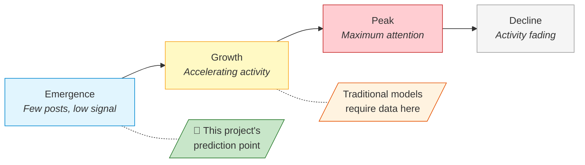
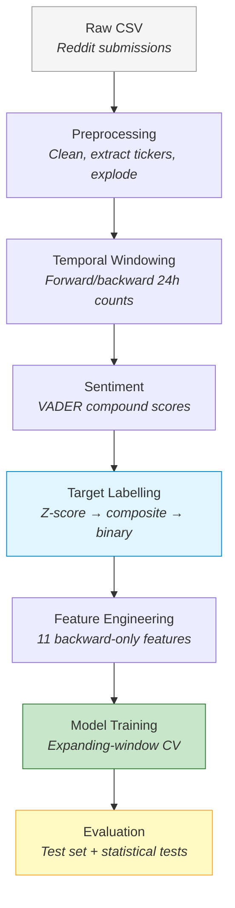

# Predicting Posting-Volume Surges on Reddit Financial Communities Using Machine Learning

## Abstract

Social media discussions in online financial communities can shift from quiet to frenzied within hours, yet predicting these posting-volume surges before they fully develop remains largely unaddressed. A recurring methodological weakness compounds the gap: many prior approaches inadvertently use future information, making reported results unreliable. The central question is: *can surges be predicted using only features that are genuinely available at observation time?* To answer this, a composite surge metric combining normalised volume growth with sentiment change was defined to capture multifaceted surges, and predictive features were engineered exclusively from information available at observation time. Three classifiers ranging from simple to complex (**Logistic Regression, Random Forest, and XGBoost**) were trained with expanding-window temporal cross-validation and tested on held-out future data from two subreddits at opposite ends of the density spectrum: the niche **r/pennystocks** (80,212 records) and the high-traffic **r/wallstreetbets** (1,293,981 records). The best model XGBoost achieved AUC-ROC of 0.892 on the high-volume community and Random Forest reached 0.753 on the sparse one, suggesting that data density, not model choice, is the binding constraint. All pairwise differences proved statistically significant (McNemar's test, p < 0.001 after Bonferroni correction), and cross-dataset transfer produced AUC of 0.684, useful but requiring community-specific recalibration. In short, our findings highlight that machine learning models can predict surges using only past signals, where success is driven by data availability rather than architectural complexity. Furthermore, because this evaluation framework cleanly separates the past from the future at each step, it can easily be applied across other time-indexed platforms.

---

## 1. Introduction

### 1.1 Project Concept and Objectives

This project follows the **CM3005 Data Science** project template, *Predictive Modelling of Social Media Trend Emergence*. The template asks whether data-driven models can predict when trends emerge on social media platoformss; this project instantiates that brief by targeting posting-volume surges on Reddit financial communities. It builds a machine learning system that predicts whether a stock ticker's Reddit discussion is about to surge, using only backward-looking features available at observation time. Three classifiers (Logistic Regression, Random Forest, and XGBoost) are trained and compared on this task.

The project has three objectives:

- Build a predictive model from early-stage discussion features (temporal patterns, activity frequency, sentiment) that can forecast per-ticker surges before they happen
- Compare multiple ML approaches to find out whether more complex models actually improve prediction over simpler baselines
- Confirm that predictions hold up on unseen future time periods by using temporal evaluation protocols that prevent data leakage, a common methodological weakness in social media prediction studies

The underlying hypothesis is that backward-looking temporal and textual features carry sufficient signal to discriminate surges from baseline activity, and that predictive performance scales with data density rather than model complexity.

### 1.2 Problem Statement and Motivation

Stock-related discussions on Reddit can go from quiet to frenzied within hours. A ticker attracting two posts yesterday might appear in fifty today, triggered by earnings surprises, speculative momentum, or coordinated retail interest. These surges develop too quickly for manual monitoring, particularly across forums where thousands of tickers are discussed daily.

This is primarily a research question: Can we spot a social media surge before it happens by looking at early discussion patterns? The answer holds practical value for financial analysts seeking early warning of emerging narratives, surveillance teams watching for manipulation, and quantitative researchers studying how how attention spreads through digital communities. For instance, a compliance team monitoring covered stocks could use an automated system to flag early surge signals, allowing analysts to focus on the top five or ten high-risk tickers instead of manually scanning thousands of threads.

Previous research focuses on related but different problems: forecasting eventual content reach rather than a sudden surge, or predicting price movements rather than social media dynamics themselves. Current research rarely addresses how to predict sudden, short-term spikes in volume and sentiment for specific stock tickers (see Section 2.6).

This project examines whether upcoming surges can be predicted from early discussion patterns. Standard rule-based heuristics, such as flagging a ticker when volume exceeds +2σ. They are insufficient for this task because they cannot capture non-linear interactions across diverse data streams. To overcome these limitations, we propose a learning-based approach that integrates temporal, textual, and sentiment features into a unified predictive framework.

### 1.3 Prediction Scope and Surge Definition

1.3 Prediction Scope and Surge Definition

The original project template uses the term "trend emergence," but trends can be gradual and sustained, making them difficult to label objectively within a fixed time window. This project specifically focuses on surges, defined as statistically significant, short-term spikes in both **posting volume** and **sentiment intensity** for a ticker **within a 24-hour window**. These events are identified using a composite metric that combines normalized volume growth with the magnitude of sentiment shift. Tracking volume metrics alone miss moments when discussion sentiment intensifies without a matching spike in post count. Blending both signals reveals a richer, more structured event (see Section 5.2.5). Because surges are discrete and quantifiable, they can be framed as a binary classification problem, providing a more practical way to model the concept of a 'trend'. Since surges mark the beginning of a trend, predicting a surge effectively means catching a trend right as it emerges.

We base our target on timestamped post volume rather than engagement metrics like upvotes, as post-hoc scores introduce look-ahead bias. To measure volume spikes consistently, features are standardized using Z-scores are calculated using training-set statistics alone to prevent data leakage. Section 3.3 outlines the formal definitions, weighting, and threshold choices.

### 1.4 Scope

This study evaluates binary surge classification across two archival 2021 Reddit datasets identified during separated exploratory data analysis: **r/pennystocks** (80,212 expanded records) and **r/wallstreetbets** (577,872 expanded records). Using strictly **backward-looking features**, we train and evaluate three classifier families (Logistic Regression, Random Forest, and XGBoost) to predict 24-hour ticker surges. Model performance is assessed using an 80/20 chronological holdout split alongside 4-fold expanding-window cross-validation, supported by statistical evaluations including bootstrap confidence intervals, McNemar's pairwise tests, and single-feature baselines. Finally, we assess model generalizability through cross-dataset transfer experiments between communities, using a fully deterministic pipeline with fixed seed values to ensure end-to-end reproducibility.

Several technical and analytical domains fall outside the scope of this work. The study excludes real-time data ingestion and production deployment, operating strictly on static historical datasets. Furthermore, all analyses are conducted at the ticker-record level; individual user behaviors, comment networks, and cross-platform channels (such as X or StockTwits) are not evaluated. Finally, the target is restricted to binary surge classification, explicitly excluding multi-class or regression targets, as well as trading signals, financial advice, or causal claims regarding market impact.

### 1.5 Report Structure

The remainder of this report is organised as follows. Section 2 reviews the literature on online attention prediction, financial sentiment, and Reddit-specific research, identifying the gaps this project addresses. Section 3 details the design: surge definition, feature engineering, model selection, and temporal validation. Section 4 describes the implementation, including code organisation and decisions driven by empirical findings. Section 5 presents results, statistical validation, critical analysis, and limitations. Section 6 concludes with key findings and future directions. The project timeline (Gantt chart) is provided in Appendix A.

---

## 2. Literature Review

<!--
## 1. Establish the Current State of Knowledge
Goal: Demonstrate a deep understanding of the key concepts, theories, and historical timeline of your research topic. 

* What are the foundational theories or models governing this field?
* Who are the seminal authors and leading researchers on this topic?
* How has the academic consensus on this topic evolved over time?
* What are the standardized definitions and terms used by experts?

## 2. Identify Gaps and Weaknesses in Extant Research
Goal: Pinpoint what previous research has missed, ignored, or failed to resolve to justify why your own study is necessary. 

* What blind spots or unexamined variables exist in the current literature?
* What are the persistent flaws, limitations, or biases in past studies?
* Where do different studies conflict, disagree, or present contradictory results?
* Is the existing research outdated or lacking application to a new population/context?

## 3. Evaluate Methodologies and Research Designs
Goal: Analyze how previous scientists gathered data so you can adopt effective methods and avoid common technical pitfalls.  

* What data collection methods (qualitative, quantitative, or mixed) are most prevalent?
* What sampling techniques, tools, or data metrics did prior researchers use?
* What structural constraints or ethical obstacles did previous authors face?
* How will your chosen methodological approach address the limitations of prior setups? 

## 4. Synthesize and Connect Prior Findings
Goal: Move beyond mere summary by grouping separate papers into thematic clusters to show the bigger picture. 

* What overarching themes, trends, or sub-topics connect these separate sources?
* How does study A support, extend, or directly refute the findings of study B?
* What major conceptual frameworks emerge when these papers are viewed collectively?
* How do local or niche findings translate to a broader global environment? 

## 5. Provide a Rationale for Your Own Study
Goal: Explicitly link your reading to your own research hypotheses, questions, or project goals.

* How does the existing literature directly inform your current research questions?
* In what explicit ways will your study fill the literature gaps you discovered?
* How will you use past findings as a benchmark to validate your final results? 

-->

### 2.1. The Predictability of Online Attention

Predicting trends broadly involves analyzing time-series data, applying deep learning sequence models, tracking how information spreads through networks, and detecting unscheduled events automatically. This review focuses specifically on supervised tabular classification using hand-crafted features to predict binary outcomes, distinguishing it from sequence modeling, graph methods, learned representations, and continuous trajectory forecasting. The seventeen sources reviewed here (Section 7) were selected because they directly inform the three decisions this project makes: *what to predict* (popularity and surge onset literature), *what signals to use* (sentiment and content features), and *how to evaluate rigorously* (temporal validation methods). A fourth strand, Reddit-specific financial research, confirms that this platform contains distinct, predictable signals.

The foundational question underlying this project, *can future surges in social media activity be predicted?*, was first addressed through research on **online popularity prediction**. This literature demonstrated that online attention is not random: *content that attracts early engagement tends to attract more, following patterns that are statistically detectable*.

Szabo and Huberman [1] produced the seminal result in this domain, demonstrating strong linear correlations between early and later popularity on YouTube and Digg. Their regression model showed that a content item's view count at time *t* predicts its eventual popularity with high accuracy. This established the core principle: early behavioural signals carry predictive information about future attention. However, because the model assumes a stationary growth process, it requires content to have already accumulated measurable engagement before prediction becomes possible. It cannot forecast at or near the time of posting.

Lerman and Hogg [2] extended this understanding by modelling the interaction between social network structure and content discovery, demonstrating that popularity depends on behavioural dynamics beyond simple cumulative counts. Their agent-based approach revealed that network position and user browsing patterns mediate how content gains visibility. Wang and Huberman [6] and Kong et al. [7] further characterised online attention as following identifiable temporal lifecycles (emergence, growth, peak, and decline) suggesting that content at different lifecycle stages exhibits different observable signatures. Kong et al. [7] specifically addressed *burst* detection for hashtags in real-time, but their approach operates at the hashtag level with contemporaneous features. It detects bursts as they happen rather than predicting them before onset, and works at a platform-wide granularity rather than per-entity (ticker) level.

The academic consensus that emerged from this first wave of research can be summarised as: *online attention is predictable from early signals, follows lifecycle dynamics, and is mediated by platform-specific network effects*. However, these models all require content to have already gained some traction before prediction is possible, and they target *eventual* popularity rather than the *onset* of rapid growth. Furthermore, a key tension exists within these findings: Szabo and Huberman [1] show that early popularity strongly predicts final outcome, yet Cheng et al. [5] later found that cascade prediction accuracy plateaus after the initial phase. This suggests that predictability diminishes once content leaves the emergence stage, which is precisely the window this project targets.


*Figure 1: Online attention lifecycle model [6][7]. Traditional popularity prediction requires content to have reached the growth phase before forecasting is possible. This project targets the emergence phase, predicting a surge before substantial engagement has accumulated.*

### 2.2. The Shift Toward Pre-Engagement Prediction

A second wave of research addressed the limitation that early popularity models require existing engagement data. Bandari et al. [3] demonstrated that content metadata (source, category, subjectivity, named entities) could predict popularity *before* any engagement accumulates, achieving ~84% classification accuracy on news articles. This was a methodologically significant shift: for the first time, prediction could occur at or before publication rather than requiring a waiting period.

Cheng et al. [5] achieved ~79.5% accuracy (AUC 0.877) predicting whether Facebook photo cascades would double in size, using temporal features derived from early propagation speed and structural virality metrics. Their work showed that the *rate* of early spread, not just its magnitude, carries predictive signal about whether content will continue growing. Yuan and Li [8] extended this principle to information diffusion more broadly, suggesting that early-stage propagation patterns contain sufficient signal to forecast later trajectory.

This body of work established a second consensus: **prediction is possible before substantial engagement accumulates**, provided features capture content characteristics or early propagation dynamics. However, the prediction targets remained *eventual outcomes* (final popularity, total cascade size) rather than *rapid onset* within a bounded window. An analyst monitoring a financial forum needs to know whether discussion will surge in the *next 24 hours*, not whether it will eventually become popular. This is a distinction no reviewed study addresses.

*Table 1: Evolution of online attention prediction, from post-engagement to pre-engagement approaches.*

| Study | Year | Platform | Prediction Target | Requires Existing Engagement? | Accuracy |
|-------|------|----------|-------------------|-------------------------------|----------|
| Szabo & Huberman [1] | 2010 | YouTube, Digg | Future view count | Yes (needs early views) | r² > 0.9 |
| Lerman & Hogg [2] | 2010 | Digg | Story popularity | Yes (needs network data) | N/A (model) |
| Bandari et al. [3] | 2012 | News articles | Popularity bin | **No** (content metadata only) | ~84% |
| Cheng et al. [5] | 2014 | Facebook | Cascade doubling | Partial (early reshares) | 79.5% (AUC 0.877) |
| Yuan & Li [8] | 2019 | Weibo | Diffusion trajectory | Partial (early propagation) | N/A (descriptive) |

### 2.3. Sentiment as a Predictive Signal in Finance

Parallel to the popularity prediction literature, research in computational finance established that collective sentiment extracted from social media text carries measurable predictive information. Bollen et al. [4] demonstrated that aggregate Twitter mood, particularly the "Calm" dimension measured by GPOMS, predicted Dow Jones movements with ~87.6% directional accuracy. Despite significant methodological limitations (short evaluation period, no out-of-sample validation, unclear causal mechanism), this study was influential in establishing that **textual sentiment from social media has predictive value for financial outcomes**.

The tools used for sentiment extraction have evolved alongside this finding. General-purpose lexicons like OpinionFinder lack domain specificity for financial language, where terms like "short," "bearish," or "moon" carry specialised meaning. Hutto and Gilbert [12] developed VADER specifically for social media text, incorporating rules for punctuation emphasis, capitalisation, degree modifiers, and negation, and achieving F1=0.96 on social media benchmarks. Araci [13] later introduced FinBERT, a transformer model fine-tuned on financial corpora, capturing contextual meaning that rule-based tools miss. This evolution from general lexicons → social-media-specific rules → domain-specific deep learning represents the field's recognition that sentiment tools must match their application domain.

For this project, the key takeaway is that sentiment *change*, not just absolute sentiment, may serve as a leading indicator of surges: if a ticker's discussion becomes markedly more emotional before volume escalates, sentiment shift could provide early warning signal. This motivates including sentiment change magnitude in the composite surge metric.

*Table 2: Evolution of sentiment analysis tools relevant to financial social media.*

| Tool | Type | Domain | Strengths | Limitations for This Project |
|------|------|--------|-----------|------------------------------|
| OpinionFinder as used in [4] | Lexicon | General | Early adoption, widely cited | No social media conventions, no financial terms |
| VADER [12] | Rule-based | Social media | Handles capitalisation, emoticons, negation; F1=0.96 | No financial domain tuning ("short," "moon" misscored) |
| FinBERT [13] | Transformer | Financial text | Context-aware, domain-specific | Computationally expensive for 1M+ records |

### 2.4. Financial Discussion on Reddit

The preceding research established general principles on platforms like YouTube, Digg, Facebook, and Twitter. A more recent strand examines whether these principles apply to Reddit's financial communities specifically, and what unique characteristics these communities introduce.

Penny stocks (low-capitalisation equities typically trading below $5 per share) occupy a distinctive position: their low liquidity and limited analyst coverage mean that social media discussion can constitute a disproportionate share of available information [9][10]. Reddit's subreddit structure creates focused communities with shared norms and persistent threads, unlike Twitter's ephemeral broadcast model.

Long et al. [9] demonstrated that r/WallStreetBets posting volume correlated with abnormal trading volume and returns for discussed stocks, with effects concentrated in small-cap equities. Their analysis showed that increased Reddit attention *preceded* trading activity in their sample, suggesting that discussion patterns carry predictive signal rather than merely reflecting market events. Costola et al. [10] examined the GameStop episode specifically, finding that consensus formation within r/WallStreetBets followed measurable patterns in posting frequency and sentiment alignment *before* reaching critical mass. A small number of committed users drove broader engagement through detectable temporal signatures.

Mancini et al. [11] applied this principle to pump-and-dump detection, building predictive models from the language and timing of forum posts associated with manipulated stocks. Their work confirmed that text-based features from financial discussion forums achieve classification performance significantly above random baselines for predicting anomalous stock activity.

These studies collectively establish that **Reddit financial communities generate measurable, predictive signals**, but all predict *market outcomes* (returns, trading volume, manipulation) rather than *social media dynamics* themselves. Notably, these findings connect back to earlier work: Costola et al.'s consensus formation patterns [10] parallel the network-mediated discovery dynamics that Lerman and Hogg [2] described on Digg, while Long et al.'s observation that posting volume *precedes* trading activity [9] echoes Cheng et al.'s finding [5] that early propagation speed predicts later growth. The question of whether the discussion itself will escalate, whether a ticker's posting volume is about to surge, remains unaddressed. This is the specific prediction target of the present project.

### 2.5. Methodological Weaknesses in Prior Work

Beyond the substantive gaps identified above, a critical methodological pattern cuts across the reviewed literature: a recurring absence of rigorous temporal evaluation protocols across the studies reviewed here.

Szabo and Huberman [1] evaluate on data drawn from the same time period as training. Bandari et al. [3] use random train-test splits rather than temporal partitions, meaning models may be tested on articles published *before* some training data, a form of information leakage. Cheng et al. [5] randomly sample cascades for evaluation without preserving temporal ordering. Long et al. [9] and Costola et al. [10] analyse correlations across their full datasets without testing whether patterns discovered in earlier periods generalise to later ones.

This matters because Tashman [14] demonstrated that rolling-origin evaluation, where the forecasting origin advances forward through time, produces more reliable accuracy estimates for temporal prediction tasks than fixed or random splits. Bergmeir and Benítez [15] showed empirically that random cross-validation *overestimates* predictive accuracy for time-dependent data, recommending blocked or expanding-window schemes that preserve temporal ordering. Despite these methodological advances being well-established in the forecasting literature, they remain largely unadopted in social media prediction research.

The consequence is that reported performance figures across the reviewed studies may be inflated by temporal leakage, and it remains unresolved whether models would generalise to genuinely unseen future periods. For any system intended for real-world deployment, including surge detection, this is a critical deficiency. Fernández-Delgado et al. [16], in their large-scale classifier comparison, similarly noted that evaluation methodology substantially affects reported performance rankings, reinforcing that *how* a model is evaluated matters as much as *which* model is selected.

*Table 3: Temporal evaluation practices across reviewed studies.*

| Study | Evaluation Method | Temporal Ordering Preserved? | Leakage Risk |
|-------|-------------------|------------------------------|--------------|
| Szabo & Huberman [1] | Same-period evaluation | No | High |
| Bandari et al. [3] | Random train-test split | No | High |
| Bollen et al. [4] | Fixed holdout (1 month) | Partial | Medium |
| Cheng et al. [5] | Random cascade sampling | No | High |
| Long et al. [9] | Full-dataset correlation | No | High |
| Costola et al. [10] | Full-dataset analysis | No | High |
| Mancini et al. [11] | Chronological split | Partial | Medium |

### 2.6. Research Gap and Project Position

The literature reviewed above establishes four cumulative findings:

- Early behavioural signals predict future online attention [1][5]
- Prediction is possible before engagement accumulates, using content and propagation features [3][5][8]
- Sentiment extracted from social media carries predictive value in financial contexts [4][12]
- Reddit financial communities generate measurable signals that precede market activity [9][10][11]

Four gaps remain unaddressed:

1. **Prediction target:** All reviewed studies predict *eventual outcomes* (final popularity, cascade size, market returns) rather than detecting the *onset* of rapid growth within a bounded time window. No study was found that defines or predicts a composite volume-and-sentiment surge within a fixed short-term window for individual entities.

2. **Signal integration:** Each research strand demonstrates one feature category's value in isolation (temporal [1], content [3], sentiment [4], structural [5]), but empirical integration of multiple signal types into a unified predictive framework remains limited, despite evidence that they interact during trend formation [2][7].

3. **Domain specificity:** General social media prediction research [1][3][5] does not account for the distinctive characteristics of financial discussion (event-driven reactions, domain-specific language, speculative behaviour). Conversely, Reddit financial research [9][10][11] predicts *market* consequences of surges rather than predicting whether surges *will occur*.

4. **Temporal validity:** The use of random or unspecified evaluation splits across the literature [1][3][5][9] means reported results may not reflect real-world predictive performance. Rigorous temporal evaluation methods exist [14][15] but remain unadopted in this domain.

This project addresses these gaps directly. The composite surge metric (Section 3.3) defines a binary onset target within a 24-hour window (gap 1). The feature set (Section 3.4) combines temporal, activity-frequency, sentiment, and textual signals (gap 2). The pipeline is applied to Reddit financial communities using two subreddits at opposite ends of the data density spectrum (gap 3). Expanding-window temporal cross-validation ensures that no future information leaks into training (gap 4). Whether this integration yields meaningful predictive performance is the empirical question examined in Section 5.

---

## 3. Design

<!-- 
SIDE NOTE (DELETE LATER)
- why use Reddit not X or other platform
- why not use API
- why use 2 datasets, why pick pennystocks and wsb
- why use combined/composite metric
- why pick 3 model: LR, RF, XGB
- why use validation-fold
- why not k=5 or k=10 but k=4?
- what are stretch tier vs target tier
- have we set goal for this project (musthave tier, target tier, and stretch tier)
- discuss about data drift ? aware of it and provide solution 
-->

<!--
## 1. Establish Methodological Rationalization
Goal: Justify why your chosen approach is the most effective vehicle for your specific research.

* Why did you choose this specific paradigm (quantitative, qualitative, or mixed-methods)?
* How does this structural design directly answer your primary research questions?
* What alternative designs did you reject, and why were they less suitable?
* How does this design align with the theoretical framework built in your literature review?

## 2. Define Boundaries and the Sampling Strategy
Goal: Clearly outline who or what you are studying, and how you selected your subjects.

* What is your exact target population or unit of analysis (e.g., individuals, texts, organizations)?
* What specific sampling method did you use (e.g., random, purposive, snowball sampling)?
* What were your explicit inclusion and exclusion criteria for participants or data?
* What is your final sample size, and why is it statistically or conceptually sufficient?

## 3. Detail the Operational Procedures
Goal: Provide a step-by-step chronological recipe so another researcher can replicate your study exactly.

* What exact materials, hardware, software, or standardized instruments did you utilize?
* What were the chronological steps taken to set up and execute the study?
* How did you control for extraneous variables or potential sources of bias?
* If you conducted a pilot study, what adjustments did you make based on those trial runs?

## 4. Outline Data Collection Metrics
Goal: Explain exactly how information was gathered and measured during the execution phase.

* What specific types of data were collected (e.g., test scores, interview transcripts, digital logs)?
* How did you ensure the validity (accuracy) and reliability (consistency) of your measurement tools?
* What specific roles did the researchers play during the data gathering process?
* When, where, and over what exact timeframe was the data collected?

## 5. Formulate the Data Analysis Plan
Goal: Explain how you will transform raw data into meaningful answers before you actually present findings.

* What specific statistical tests (quantitative) or coding frameworks (qualitative) will you apply?
* Which software packages (e.g., SPSS, R, NVivo) will be used to process the data?
* How will you handle missing, corrupted, or incomplete data points?
* How do these specific analysis techniques map back to your original hypotheses?

## 6. Address Ethical and Quality Controls
Goal: Prove that your study protects participants and adheres to strict professional standards.

* What institutional review boards (IRB) or ethical committees approved this project?
* How did you secure informed consent and protect participant anonymity or data privacy?
* What steps were taken to minimize physical, psychological, or social risks to subjects?
* How did you address potential researcher bias or conflicts of interest?

------------------------------
## Quick Framework: The 4 D’s of Research Design
When writing or reviewing your design section, ensure it satisfies these four criteria:

* Define: Clearly state the parameters, variables, and populations involved.
* Do: Detail the precise actions taken during the experiment or fieldwork.
* Defend: Explain the logical reasons behind every technical choice you made.
* Disclose: Report all limitations, ethical steps, and structural constraints openly.

-->

### 3.1 System Architecture

The prediction system is a six-stage linear pipeline. Each stage consumes the previous stage's output and writes a well-defined intermediate artefact to disk, which means downstream stages can be re-executed independently without recomputing expensive upstream operations.

1. **Data Loading and Preprocessing** — CSV ingestion, text cleaning, regex-based ticker extraction, record explosion (one row per record-ticker pair)
2. **Temporal Windowing** — Per-ticker forward/backward 24-hour posting counts via vectorised binary search
3. **Sentiment Computation** — VADER compound scoring per record, with title-fallback for missing selftext
4. **Target Labelling** — Temporal 80/20 split, z-score normalisation from training-partition statistics only, composite metric computation, binary thresholding
5. **Feature Engineering** — Eleven backward-only features (Section 3.4)
6. **Model Training and Evaluation** — Expanding-window temporal cross-validation, hyperparameter tuning, test-set evaluation, statistical comparison


*Figure 2: Pipeline architecture. Shading indicates critical design points: target labelling (leakage prevention), model training (temporal validation), and evaluation (statistical rigour).*

The overarching architectural constraint is that **no stage may access information from the future relative to the observation time of any record**. Sentiment uses only the record's own text, features use backward-looking windows exclusively, z-scores are frozen from training-partition statistics, and validation folds are strictly time-ordered.

### 3.2 Data Selection and Characteristics

Reddit was selected because its subreddit structure concentrates stock discussion into retrievable, topically focused communities; posts are publicly archived for reproducible research; and its threaded format yields timestamped submissions with text suitable for temporal and sentiment feature extraction.

Two subreddits were chosen to represent opposite ends of the data density spectrum:

- **r/pennystocks** is a sparse niche community (80,212 exploded records) focused on low-capitalisation equities. It tests whether the methodology degrades gracefully under data scarcity.
- **r/wallstreetbets** is a high-volume mainstream forum (577,872 exploded records). It tests whether the pipeline scales and whether signal can be extracted from noise.

This dual-dataset design addresses literature gap 3 (domain specificity) and enables cross-dataset transfer evaluation.

*Table 4: Dataset characteristics.*

| Property | r/pennystocks | r/wallstreetbets |
|----------|---------------|------------------|
| Raw records | 304,524 | 1,293,981 |
| Date range | 2021-01-01 to 2021-12-31 | 2021-01-01 to 2021-12-31 |
| After ticker extraction (exploded) | 80,212 | 577,872 |
| Usable records (post-exclusion) | 24,827 | 457,072 |
| Train / Test split | 21,549 / 3,278 | 388,149 / 68,923 |
| Test surges | 31 | 2,582 |
| Test imbalance ratio | 105:1 | 26:1 |

Both datasets are static CSV exports from the Reddit Finance Data collection on Kaggle [17], covering the full calendar year 2021 (spanning the January GameStop episode through subsequent normalisation). Static archival CSVs ensure exact reproducibility; live API scraping would introduce temporal variability between runs and complicate replication. Each record contains a Unix timestamp, post title, optional selftext, and engagement fields (`score`, `num_comments`) that are retained for transparency but *not* used as features.

**Ethical considerations.** All data consists of publicly posted submissions; analysis is aggregated at the ticker level with no attempt to identify individual users. The project is academic research only; no trading decisions were made from model outputs.

**Known limitations.** The archival dataset exhibits survivorship bias (deleted/moderated posts are absent), engagement metrics are frozen at collection time, and results are bound to the 2021 period.

### 3.3 Surge Definition (Target Variable)

A fixed posting-count threshold fails because tickers have different baselines. What matters is whether current activity is *statistically unusual* for that ticker's history. The solution is a composite metric that normalises volume growth relative to the training distribution and combines it with sentiment change:

> *composite = (w₁ × z_volume) + (w₂ × z_sentiment)*

For each record mentioning ticker *X* at time *t*, the pipeline:

1. Counts *X*-mentioning posts in a forward window (*t*, *t*+24h] and a backward window (*t*−24h, *t*]
2. Computes volume growth: (forward_count / max(backward_count, 1)) − 1
3. Computes sentiment shift: |mean(forward_sentiments) − current_sentiment|
4. Z-score normalises both using training-partition statistics only (μ and σ frozen from the 80% temporal split)
5. Combines weighted z-scores into the composite; labels surge=1 if composite > τ. Records with too few posts in their forward window are excluded as unlabellable.

Z-scoring identifies growth that is statistically unusual regardless of a ticker's typical volume. The parameters are computed exclusively from the training partition to prevent leakage into the target variable.

The 24-hour window aligns with the daily trading cycle and captures overnight-to-open discussion patterns that drive next-day attention. Shorter windows (6h) risk insufficient post counts per ticker for stable statistics, particularly on sparser communities. Longer windows (72h) blur the distinction between surge onset and sustained activity, making the label less useful as an early-warning signal. The sensitivity analysis in Section 5.4.2 revisits this choice and identifies multi-scale windows as a priority improvement.

Including sentiment captures cases where a community becomes markedly more agitated without necessarily posting more frequently [4][10]. A volume-only definition produces noisier, less structured surges that are harder to predict, as confirmed empirically: Phase 1 (w₂=0) yields AUC 0.710 vs Phase 2's 0.892 on WSB (Section 5.2.5). Setting w₂=0 reduces the definition to volume-only, enabling that direct comparison.

*Table 5: Threshold sensitivity on r/wallstreetbets (457,072 usable records).*

| τ | Surge Count | Surge Rate | Imbalance Ratio |
|---|-------------|------------|-----------------|
| 0.5 | 80,455 | 17.6% | 4.7:1 |
| **1.0** | **22,384** | **4.9%** | **19.4:1** |
| 1.5 | 6,602 | 1.4% | 68.2:1 |
| 2.0 | 2,873 | 0.6% | 158:1 |
| 2.5 | 1,348 | 0.3% | 338:1 |

τ=1.0 was selected for primary evaluation: rare enough to be meaningful, common enough (2,582 test surges on WSB) for statistically reliable evaluation. A secondary run at τ=1.5 on r/pennystocks tests behaviour under more extreme imbalance.

**Two-phase validation.** Phase 1 uses w₂=0 (volume-only labels); Phase 2 uses w₁=w₂=0.5 (equal composite). Comparing them determines whether sentiment genuinely improves prediction. A full weight sweep (w₂ ∈ {0, 0.25, 0.5, 0.75, 1.0}) is reported as supplementary sensitivity analysis in Section 3.8.

### 3.4 Feature Engineering

All features satisfy the backward-looking constraint: only information available at or before time *t* is used. Reddit `score` and `num_comments` are excluded because they accumulate *after* posting and reflect the very engagement dynamics the model is trying to predict.

*Table 6: Feature definitions. All features use backward-looking or concurrent information only.*

| Feature | Category | Definition |
|---------|----------|------------|
| `sentiment_score` | Content | VADER compound sentiment of the post text |
| `word_count` | Content | Words in selftext (0 if absent) |
| `title_length` | Content | Character count of title |
| `num_tickers_mentioned` | Content | Distinct tickers extracted from the post |
| `hour_of_day` | Temporal | Hour of post creation (UTC) |
| `day_of_week` | Temporal | Day of post creation (Monday=0) |
| `time_since_previous` | Activity | Seconds since previous same-ticker post |
| `ticker_post_rate_24h` | Activity | Same-ticker posts in preceding 24 hours |
| `ticker_post_acceleration` | Activity | Rate ratio: count in preceding 12h ÷ count in 12h before that |
| `word_count_x_hour` | Interaction | word_count × hour_of_day |
| `accel_x_time_since_prev` | Interaction | ticker_post_acceleration × time_since_previous |

Content features capture what is said (emotional intensity, post effort, discussion focus). Temporal features encode cyclical patterns tied to market hours. Activity features draw on the popularity prediction literature [1][5], since accelerating posting rates signal that a surge may be forming. Interaction features were added after experiment B2 showed that manually constructed combinations improved Random Forest AUC by +1.4pp on pennystocks.

### 3.5 Methodological Scope: Techniques Adopted and Excluded

The project template identifies several technique families as relevant to social media trend prediction: time-series forecasting (ARIMA, LSTM), network analysis (centrality measures, community detection), natural language processing (sentiment analysis, topic modelling, word embeddings), machine learning (classification, regression), and data visualisation. This project adopts a subset of these and excludes others based on the specific operationalisation of the problem.

**Adopted techniques:**

- *Sentiment analysis* (NLP): VADER compound scoring extracts emotional intensity from post text, contributing both to the composite surge metric and as a predictive feature. This is the NLP technique most directly relevant to detecting shifts in community tone before surges.
- *Machine learning classification*: Three classifier families (Logistic Regression, Random Forest, XGBoost) predict the binary surge target using engineered features. Classification is the natural fit for the "will it surge or not?" question.
- *Temporal feature engineering*: Activity rates, acceleration ratios, and time-since-previous features capture the temporal dynamics that the time-series literature identifies as predictive of future attention [1][5], implemented as per-record features rather than as a separate forecasting model.
- *Data visualisation*: ROC curves, confusion matrices, feature importance plots, and threshold sensitivity charts communicate model behaviour and results.

**Excluded techniques and rationale:**

- *Time-series forecasting (ARIMA, LSTM)*: These model a continuous trajectory over time (e.g., "how many posts will ticker X receive tomorrow?"). The present project asks a binary question ("will a surge occur?") at the per-record level rather than forecasting a time series. The temporal signal is captured through engineered features (posting rate, acceleration) that feed directly into classifiers, which is more appropriate for a binary onset-detection task than fitting a separate forecasting model per ticker. Additionally, LSTM would require sequence-formatted input per ticker with sufficient history, which is infeasible for the long tail of tickers with sparse posting histories.
- *Network analysis (centrality, community detection)*: Network methods require a graph structure — user interaction networks, reply trees, or cross-posting links. The archival dataset contains only top-level submissions with no reply-graph or user-interaction metadata. Constructing a meaningful network would require either comment-level data (unavailable in this dataset) or cross-referencing user posting histories (which would introduce user-level analysis outside the project's ticker-level scope). The template's suggestion of network analysis applies more naturally to diffusion studies tracking *how* trends spread through a social graph; this project instead asks *whether* a surge will occur, which is answerable from aggregate temporal and textual signals without network structure.
- *Topic modelling and word embeddings*: Topic models (LDA, BERTopic) extract latent thematic structure across a corpus, which is useful for characterising *what* is being discussed but less directly useful for predicting *when* discussion will intensify. Word embeddings (Word2Vec, GloVe) would require either pre-training on domain text or using general-purpose vectors that miss financial semantics. Both techniques add substantial computational cost (particularly over 1.3M records) for uncertain marginal gain over the simpler sentiment signal that already dominates feature importance. These remain viable future extensions (Section 5.4.2) but were deprioritised in favour of depth in temporal validation and statistical evaluation.

The guiding principle was depth over breadth: rather than applying five techniques superficially, the project applies classification with rigorous temporal validation, comprehensive statistical testing, and multi-experiment sensitivity analysis. The excluded techniques remain relevant to the broader problem space and are acknowledged as future directions where they would add value (Section 5.4.2).

### 3.6 Model Selection

**Why binary classification?** A ticker either surges within the next 24 hours or it doesn't, with no meaningful in-between. That makes binary classification the natural fit. Regression would ask "how big?" when the real question is "did it happen?" Multi-class buckets (small/medium/large) would require arbitrary cut-points and make the class-imbalance problem worse. Anomaly detection is unsupervised, so it can't use the labelled surge history; it would also flag every rare surge as anomalous regardless of whether it has any distinguishing structure.

Three classifier families span the complexity spectrum, testing whether model complexity actually helps for surge prediction:

- **Logistic Regression (LR)** is the interpretable baseline. It fits a linear decision boundary with elastic net regularisation. If LR performs well, the surge signal is approximately linearly separable.
- **Random Forest (RF)** represents bagged ensembles. It captures non-linear relationships through tree splits and handles noisy features gracefully. Fernández-Delgado et al. [16] found that random forests achieved the highest overall accuracy across 121 benchmark datasets.
- **XGBoost** represents sequential boosting. Each tree corrects the mistakes of the previous ensemble, with L1/L2 regularisation on leaf weights to prevent overfitting. Gradient boosting dominates recent tabular data competitions and consistently ranks among the top performers on structured problems.

**Primary metric: AUC-ROC.** With surge rates of 1–5%, accuracy is uninformative (a model predicting "no surge" for every record achieves 95–99% accuracy while being useless). AUC measures how well the model *ranks* surge-likely records above non-surge records, independent of threshold. Precision, recall, and F1 are reported as secondary metrics at both the default (0.5) and validation-tuned thresholds.

**Handling class imbalance.** SMOTE is inappropriate for temporally ordered data because synthetic records lack meaningful timestamps. Instead, the pipeline uses cost-sensitive learning: `class_weight='balanced'` for LR and RF; `scale_pos_weight` (negative-to-positive ratio) for XGBoost.

### 3.7 Temporal Validation Design

Standard k-fold cross-validation violates temporal ordering, since a model might train on October posts and validate on March posts. Bergmeir and Benítez [15] showed this inflates accuracy estimates. The pipeline uses a two-level temporal strategy instead:

**Level 1: Train/test split (80/20 by timestamp).** The first 80% of chronologically sorted records form the training partition; the final 20% form the held-out test set, used exactly once for final metrics.

**Level 2: Expanding-window CV within training (k=4).**

```mermaid
gantt
    title Expanding-Window Temporal CV (k=4)
    dateFormat X
    axisFormat %s

    section Fold 1
    Train     :done, 0, 25
    Val       :active, 25, 50

    section Fold 2
    Train     :done, 0, 50
    Val       :active, 50, 75

    section Fold 3
    Train     :done, 0, 75
    Val       :active, 75, 100
```


*Figure 3: Expanding-window CV. The training partition is divided into four temporal blocks, producing three validation splits. Each fold trains on all data up to a cutoff and validates on the next block, mimicking deployment where more history accumulates over time.*

The key guarantee is that every validation record comes strictly after all training records in time. The model never sees the future during selection. Splitting the training data into four temporal blocks gives roughly 2.5-month validation windows, each containing enough surge events for stable AUC estimates while keeping the minimum training set large enough for meaningful model fitting. Higher k would thin the validation folds below reliable evaluation. Once the best hyperparameters are chosen, the threshold that maximises F1 on these validation folds is locked in and applied unchanged to the test set, so threshold tuning never touches test data either.

Temporal non-stationarity (shifting surge dynamics across the year) is a known risk; the expanding-window design partially mitigates it by always training on the longest available history, though it cannot adapt to regime changes within the test period. Section 5.3.4 examines empirical evidence for this concern.

### 3.8 Evaluation Framework

The evaluation answers four questions: Do models predict surges better than trivial strategies? Do they differ meaningfully from each other? How confident are the reported metrics? Does the methodology transfer across communities?

*Table 7a: Success tiers.*

| Tier | AUC-ROC | Interpretation |
|------|---------|----------------|
| Minimum | > 0.60 | Weak but above-chance discrimination |
| Target | > 0.70 | Moderate; practically useful for ranking |
| Stretch | > 0.80 | Strong; reliably separates surges from non-surges |

These are conservative relative to the cascade prediction literature (e.g., Cheng et al. [5] achieved 0.877), which used engagement-based features and non-temporal evaluation that likely inflate results.

**Baselines.** A random baseline (AUC=0.5) tests whether models beat chance. Single-feature Logistic Regressions for each of the eleven features test whether multi-feature combination adds value over the best individual predictor.

**Statistical robustness.** Bootstrap confidence intervals (1,000 resamples of the test set, 95% CI from 2.5th/97.5th percentiles) quantify metric uncertainty without distributional assumptions. McNemar's test with Bonferroni correction (α=0.017 for the three pairwise comparisons: LR vs RF, LR vs XGB, RF vs XGB) determines whether model differences are statistically significant.

*Table 7b: Evaluation metrics.*

| Metric | Role |
|--------|------|
| AUC-ROC | Primary; threshold-independent ranking quality |
| Precision | Proportion of predicted surges that are real |
| Recall | Proportion of actual surges detected |
| F1-Score | Harmonic mean of precision and recall |

Precision, recall, and F1 are reported at both the default threshold (0.5) and the validation-tuned threshold.

**Cross-dataset transfer.** Models trained on one subreddit are evaluated directly on the other without retraining. AUC-ROC is the primary transfer metric since the optimal operating point differs between communities (WSB 3.75% vs pennystocks 0.95% surge rate). Transfer AUC exceeding 0.60 indicates that surge patterns share cross-community structure.

**Sensitivity analysis.** Two sweeps characterise robustness: threshold sensitivity (τ ∈ {0.5, 1.0, 1.5, 2.0, 2.5}) tests whether results degrade gracefully with different surge definitions; weight sensitivity (w₂ ∈ {0, 0.25, 0.5, 0.75, 1.0}) tests whether sentiment improves prediction over volume-only labels.

---

## 4. Implementation

### 4.1 Code Organisation

The pipeline is packaged as a standard Python library (`surge-pipeline`, built with setuptools) depending on pandas (≥2.0), scikit-learn (≥1.3), XGBoost (≥2.0), vaderSentiment (≥3.3.2), and NumPy (≥1.24). Exact pinned versions are recorded in `requirements.txt` and in each experiment log entry for full reproducibility. All source code sits under `src/`, split into a core library and CLI scripts:

```
src/
├── surge_pipeline/              # Core library (15 modules, ~4,250 LOC)
│   ├── config.py                # PipelineConfig dataclass + JSON serialisation
│   ├── loader.py                # CSV ingestion, ticker extraction, record explosion
│   ├── windowing.py             # Per-ticker forward/backward 24h counts (searchsorted)
│   ├── sentiment.py             # VADER compound scoring with title-fallback
│   ├── labelling.py             # Temporal split, z-scores, composite metric, thresholding
│   ├── normalisation.py         # Z-score parameter persistence (train-only stats)
│   ├── features.py              # 11 backward-only ML features
│   ├── training.py              # Multi-model training with expanding-window CV
│   ├── evaluation.py            # Metrics, bootstrap CI, McNemar's, tier validation
│   ├── evaluation_figures.py    # Confusion matrices, ROC curves, importance plots
│   ├── experiment_log.py        # Append-only JSONL experiment tracker
│   └── pipeline.py              # Orchestrator: chains stages, manages outputs
├── tests/                       # 10 test modules (pytest)
├── run_labeling.py              # CLI: full labelling pipeline (stages 1–4)
├── run_training.py              # CLI: model training + evaluation (stages 5–6)
└── run_cross_validation.py      # CLI: cross-dataset transfer evaluation
```

Each pipeline stage maps to one or two library modules. This means that changes to one stage (for example, swapping the sentiment backend) cannot touch another's logic, and any stage can be unit-tested in isolation.

*Table 8: CLI entry points.*

| Command | Purpose |
|---------|---------|
| `surge-label` | Run the labelling pipeline (load → window → sentiment → label → threshold sweep) |
| `surge-train` | Train all three models and produce the full evaluation report |
| `surge-cross-val` | Test whether a model trained on one subreddit transfers to the other |
| `surge-figures` | Regenerate publication figures from saved evaluation artefacts |

A single `PipelineConfig` dataclass holds every tuneable parameter, and a fixed seed (default 42) is applied to Python's `random`, NumPy, and all scikit-learn estimators.

### 4.2 Data Loading and Preprocessing

The loader (`loader.py`) transforms a raw Reddit CSV into the unit of analysis (one row per record-ticker pair, sorted chronologically) in four steps.

**Text cleaning.** Moderation placeholders (`[deleted]`, `[removed]`) are replaced with empty strings, and null fields are filled likewise. Each row in the archival dataset corresponds to a unique Reddit submission ID, so no deduplication is needed.

**Ticker extraction.** Two regex patterns run in priority order: (1) dollar-sign tickers (`$AMC`, `$TSLA`), which carry the highest confidence since the dollar prefix is an explicit marker in financial communities; and (2) standalone 2–5 character uppercase words, which cast a broader net. Both are filtered against a curated stopword set of 297 terms across eight categories (common English, Reddit slang, finance abbreviations, and others), built through iterative false-positive analysis on early pipeline runs and manually reviewed for completeness. A stopword approach was chosen over a known-ticker list because penny stock tickers change frequently. The worst-case failure mode is a false-positive adding noise to one record, whereas a stale ticker list would silently drop posts about unknown stocks.

**Timestamp normalisation and explosion.** Raw timestamps (Unix epoch or datetime strings) are normalised to `datetime64[ns, UTC]` and sorted. This chronological ordering is a hard precondition for the binary-search windowing that follows. Multi-ticker posts (for example, "comparing $AMC vs $GME") are exploded into separate rows via `pandas.explode()`. Records yielding zero tickers are dropped.

*Table 9: Loader-stage attrition.*

| Step | r/pennystocks | r/wallstreetbets |
|------|---------------|------------------|
| Raw records loaded | 304,524 | 1,293,981 |
| Excluded (no tickers found) | 224,312 (73.7%) | 716,109 (55.3%) |
| After explosion (record-ticker pairs) | 80,212 | 577,872 |

### 4.3 Feature Engineering

Eleven features feed the classifiers. The governing constraint is that every feature must be computable from data *at or before* the current record's timestamp. Nothing may peek into the future.

*Table 11: Feature summary.*

| Feature | Source | Description |
|---------|--------|-------------|
| `ticker_post_rate_24h` | Windowing | Same-ticker posts in preceding 24 h |
| `time_since_previous_post` | Loader | Hours since last same-ticker post (−1 if first) |
| `ticker_post_acceleration` | Computed | Ratio of recent-half to older-half 24 h activity |
| `sentiment_score` | VADER | Compound polarity (−1 to +1) |
| `word_count` | Text | Whitespace tokens in title + body |
| `title_length` | Text | Whitespace tokens in title only |
| `num_tickers_mentioned` | Loader | Distinct tickers in original post |
| `hour_of_day` | Timestamp | UTC hour (0–23) |
| `day_of_week` | Timestamp | Day index (0=Mon, 6=Sun) |
| `word_count_x_hour` | Interaction | word_count × hour_of_day |
| `accel_x_time_since_prev` | Interaction | acceleration × time_since_previous |

The most algorithmically involved feature is `ticker_post_acceleration`. It splits the backward 24-hour window into two 12-hour halves (a recent half covering (t−12 h, t] and an older half covering (t−24 h, t−12 h]) and then computes the ratio `count_recent / max(count_older, 1)`. Values above 1.0 indicate accelerating discussion. The core of the implementation uses NumPy's `searchsorted` for O(n log n) counting within each per-ticker group:

```python
# Count posts in recent half (t-12h, t] excluding self
recent_left = np.searchsorted(times, times - 12H_SECONDS, side="right")
recent_right = np.searchsorted(times, times, side="left")
count_recent = recent_right - recent_left

# Count posts in older half (t-24h, t-12h]
older_left = np.searchsorted(times, times - 24H_SECONDS, side="right")
older_right = np.searchsorted(times, times - 12H_SECONDS, side="right")
count_older = older_right - older_left

acceleration = count_recent / np.maximum(count_older, 1)
```

The two interaction features (`word_count_x_hour`, `accel_x_time_since_prev`) give models an explicit signal for combined effects, such as sudden acceleration after a period of silence, without requiring multi-level splits to discover the interaction. An ablation (Experiment B2) confirmed a consistent +1.4pp AUC lift from these terms.

### 4.4 Surge Labelling

The labelling module converts raw windowing and sentiment outputs into binary surge/no-surge labels while enforcing strict temporal isolation.

**Temporal split.** Records are divided at the 80th percentile of timestamps: one cut on sorted time, no shuffling. Everything at or before the cutpoint goes to training; the rest to test.

**Z-score normalisation.** Mean and population standard deviation for volume growth ratio and sentiment shift are computed from *included training records only*. These frozen parameters are then applied to both partitions, so the test set is measured against a distribution it never contributed to. This is the core leakage-prevention mechanism.

**Composite metric and thresholding.** The surge composite combines the two z-scores:

> *composite = (w₁ × z_volume) + (w₂ × z_sentiment)*

A record is labelled surge (1) if its composite exceeds threshold τ, and no-surge (0) otherwise. Records whose forward window contains fewer than two same-ticker posts are excluded as unlabellable, since a single post cannot produce a meaningful volume growth ratio. This exclusion accounts for the attrition from 577,872 exploded records to 457,072 usable records on WSB (Table 4), with the gap reflecting tickers near the end of the dataset whose 24-hour forward window extends beyond the data boundary. A `sweep_thresholds()` function evaluates τ ∈ {0.5, 1.0, 1.5, 2.0, 2.5} in a single pass for sensitivity analysis. Setting `weight_sentiment = 0` gives the volume-only variant used in the Phase 1 ablation.

### 4.5 Model Training and Evaluation

**Expanding-window cross-validation.** The training partition is sliced into four chronological blocks. Three expanding splits are constructed (train on block 1, validate on 2; train on blocks 1–2, validate on 3; train on blocks 1–3, validate on 4) with a hard check that `max(train_time) < min(val_time)` in every split. Each model type searches a hyperparameter grid:

*Table 10: Hyperparameter search spaces.*

| Model | Parameters Searched | Grid Size |
|-------|--------------------|-----------| 
| Logistic Regression | C ∈ {0.01, 0.1, 1, 10, 100}, l1_ratio ∈ {0, 1} | 10 |
| Random Forest | n_estimators ∈ {50, 100, 200}, max_depth ∈ {3, 5, 10, None}, min_samples_leaf ∈ {1, 2, 5} | 36 |
| XGBoost | n_estimators ∈ {50, 100, 200}, max_depth ∈ {3, 5, 7}, learning_rate ∈ {0.01, 0.1, 0.3}, scale_pos_weight ∈ {1, ratio/2, ratio} | ≤50 |

For each configuration, a `StandardScaler` is fit fresh on the training fold alone (preventing validation leakage), and the configuration with the highest mean validation AUC wins. Ranges were chosen from common defaults in the scikit-learn and XGBoost documentation, then narrowed by preliminary runs on the first validation fold to exclude values that consistently underperformed. The winner is then retrained on the entire training partition before touching the test set.

**Evaluation.** Each model produces predicted probabilities on the held-out test partition (scaled using only training statistics). From these, the pipeline computes precision, recall, F1, and AUC-ROC. Bootstrap confidence intervals (1,000 resamples, seeded) give 95% CIs on all metrics.

McNemar's pairwise test checks whether model differences are statistically significant (Bonferroni-corrected α = 0.017). Single-feature Logistic Regression baselines establish the floor each full model must beat. Finally, AUC is checked against predefined success tiers (minimum > 0.60, target > 0.70, stretch > 0.80).

Figure 4 shows the combined ROC curves for all three models on the r/wallstreetbets test set. The random baseline (dashed diagonal) represents an AUC of 0.5; all three trained models sit well above it, confirming that the feature set carries genuine predictive signal for surge events.


*Figure 4: ROC curves, model comparison on r/wallstreetbets test partition.*

Figure 5 shows permutation-based feature importance (mean decrease in AUC when each feature is shuffled). Temporal activity features, particularly `ticker_post_acceleration` and `time_since_previous_post`, dominate across all three models, validating the design emphasis on discussion-velocity signals.


*Figure 5: Feature importance comparison (permutation importance, test set).*

### 4.6 Implementation Decisions Driven by Empirical Findings

**Timestamp unit mismatch.** An early conversion error in the temporal split caused 89% record exclusion and left only 7 test surges, far too few for stable evaluation. This motivated the strict temporal-ordering verification checks (`max(train_time) < min(val_time)`) now built into the training loop.

**Data sparsity.** The r/pennystocks dataset (80K records) produced as few as 7 positive test examples at higher threshold settings, with AUC estimates dominated by noise. Bringing in r/wallstreetbets (577K records, 2,582 test surges) gave stable evaluation numbers and enabled the cross-dataset transfer experiment.

**Threshold collapse.** At τ = 1.5 (1.44% surge rate, 102:1 imbalance), XGBoost achieved AUC 0.888 but predicted zero surges at the default 0.5 decision boundary. This was a calibration problem, not a model failure. Lowering τ to 1.0 (approximately 5% surge rate) and adding `scale_pos_weight` to the grid resolved it.

### 4.7 Implementation Status

All six pipeline stages are fully implemented and produce complete artefacts end-to-end.

| Stage | Status | Key Output |
|-------|--------|------------|
| 1. Data Loading | Complete | Exploded DataFrame (80K / 577K rows) |
| 2. Temporal Windowing | Complete | Forward/backward counts per ticker |
| 3. Sentiment | Complete | VADER polarity + forward-window means |
| 4. Target Labelling | Complete | Binary surge labels + threshold sweep |
| 5. Feature Engineering | Complete | 11-feature matrix |
| 6. Training & Evaluation | Complete | 3 trained models + full evaluation JSON |

Both datasets run through the complete pipeline with reproducible results. End-to-end runtime (labelling through evaluation) is approximately 8 minutes for r/pennystocks and 19 minutes for r/wallstreetbets on a standard laptop CPU, with sentiment computation as the dominant cost. Cross-dataset transfer evaluation, bootstrap confidence intervals, and McNemar's significance tests all function correctly. The 10-module pytest suite, mypy type checking, and ruff linting pass without errors.

---

## 5. Evaluation

### 5.1 Evaluation Against Project Objectives

This section revisits the three objectives from Section 1.1 and measures each against experimental results.

#### 5.1.1 Objective 1: Predict Posting-Volume Surges

The central question was whether backward-looking features carry enough signal to forecast surges. The answer depends on data density.

On r/wallstreetbets (68,923 test records, 0.97% surge rate at the composite threshold used for final evaluation), both tree-based models cleared the stretch tier: XGBoost reached AUC-ROC 0.892 [95% CI: 0.881–0.902] and Random Forest 0.880 [0.869–0.890]. Both exceed the best single-feature predictor (`word_count` alone scores 0.805). Logistic Regression achieved 0.707, clearing target but falling short of that single-feature baseline, which indicates the linear model struggles to combine features effectively.

On the sparser r/pennystocks (3,278 test records, 0.95% surge rate), Random Forest achieved 0.753 [0.673–0.824], meeting target. The best single feature (`hour_of_day`) manages only 0.591, so multi-feature combination is essential.

In short: surges are predictable from observation-time features. The binding constraint is data density, not methodology.

#### 5.1.2 Objective 2: Compare Multiple ML Approaches

On WSB, complexity pays clearly: XGBoost (0.892) > Random Forest (0.880) > Logistic Regression (0.707), all pairwise differences statistically significant (McNemar's test, p < 0.001 after Bonferroni correction). The 18.5-point gap between LR and XGBoost is operationally meaningful.

On pennystocks, Random Forest leads (0.753), followed by XGBoost (0.734) and LR (0.680). The inversion, where boosting underperforms bagging, is itself a finding analysed in Section 5.3.1. All pairwise comparisons remain significant (p < 0.001).

Takeaway: model complexity helps when data is abundant but is not guaranteed under scarcity.

#### 5.1.3 Objective 3: Demonstrate Temporal Validity

The held-out 20%, comprising the final months of 2021 and never seen during training or threshold selection, produced AUC 0.892 on WSB and 0.753 on pennystocks. These represent performance against genuinely unseen future data. Cross-dataset transfer (Section 5.2.3) provides further evidence: models trained on one community still discriminate surges in another's held-out future.

The temporal protocol also reveals how standard validation overstates performance. Random Forest's validation-fold F1 on WSB was 0.911; on the test set it dropped to 0.145. This gap is the methodology working as intended. Without the strict temporal holdout, the inflated figure would have been reported.

No future information leaked at any stage: z-score parameters are frozen from training-partition statistics, features use only backward-looking windows, and temporal ordering was verified programmatically before every run.

#### 5.1.4 Additional Achievement: Reproducible Pipeline

The pipeline is exactly reproducible: same input CSV, configuration JSON, and random seed produces byte-identical output. This was verified by running configuration A1 (seed=42) on July 13 and July 19, both of which produced AUC 0.753.

Results are also robust to seed choice. Five seeds (42, 123, 456, 789, 2024) on pennystocks produced AUC between 0.734 and 0.753, a range of 0.019. The experiment log captures 30+ runs with full configuration JSONs, Git commit SHAs, and timestamped output paths.

### 5.2 Results

All metrics come from the held-out test partition (final 20% chronologically), never seen during training or threshold selection.

#### 5.2.1 Model Performance

*Table 11: Test-set performance at default threshold (0.5). 95% bootstrap CIs from 1,000 resamples.*

| Dataset | Model | AUC-ROC [95% CI] | Precision | Recall | F1 | Tier |
|---------|-------|-------------------|-----------|--------|-----|------|
| WSB (68,923 records, 668 surges, 0.97% rate) | LR | 0.707 [0.684–0.729] | 0.013 | 0.801 | 0.026 | Target |
| | RF | 0.880 [0.869–0.890] | 0.095 | 0.311 | 0.145 | Stretch |
| | XGB | 0.892 [0.881–0.902] | 0.043 | 0.819 | 0.081 | Stretch |
| Pennystocks (3,278 records, 31 surges, 0.95% rate) | LR | 0.680 [0.588–0.778] | 0.013 | 0.645 | 0.025 | Minimum |
| | RF | 0.753 [0.673–0.824] | 0.068 | 0.194 | 0.101 | Target |
| | XGB | 0.734 [0.641–0.821] | 0.000 | 0.000 | 0.000 | Target† |

XGBoost achieves Target-tier AUC (ranking ability) but produces no positive predictions at the 0.5 threshold due to extreme class imbalance saturating its logistic output near zero. Threshold tuning (Table 12) recovers predictions. Note that the pennystocks confidence intervals for RF [0.673, 0.824] and XGB [0.641, 0.821] overlap substantially, so model rankings on this dataset are not statistically distinguishable by CI overlap alone, though McNemar's test confirms they differ in prediction pattern (Section 5.2.2).

With sub-1% surge rates, the default 0.5 threshold produces near-zero precision. The models rank surges correctly, but their probability outputs sit far below 0.5 because the learned prior is overwhelmingly "not a surge." Threshold tuning selects the threshold that maximises F1 on the validation fold. Note that the tuned thresholds in Table 12 represent the *predicted probability of being the positive class*. Values above 0.5 mean the tuner found that only very high-confidence predictions should be flagged as surges, reflecting the extreme imbalance:

*Table 12: Metrics at validation-tuned thresholds.*

| Dataset | Model | Tuned Threshold | Precision | Recall | F1 | F1 Δ |
|---------|-------|-----------------|-----------|--------|-----|------|
| WSB | LR | 0.81 | 0.058 | 0.280 | 0.097 | +0.071 |
| | RF | 0.88 | 0.180 | 0.051 | 0.079 | −0.066 |
| | XGB | 0.85 | 0.217 | 0.235 | 0.226 | +0.145 |
| Pennystocks | LR | 0.67 | 0.085 | 0.194 | 0.118 | +0.093 |
| | RF | 0.79 | 0.200 | 0.097 | 0.130 | +0.030 |
| | XGB | 0.16 | 0.114 | 0.129 | 0.121 | +0.121 |

After tuning, XGBoost on WSB reaches F1 = 0.226. XGBoost on pennystocks needs threshold 0.16 to predict any surges at all. Random Forest on WSB shows a negative F1 Δ (−0.066) because its validation-optimal threshold (0.88) is highly conservative: it gains precision but sacrifices so much recall that the net F1 drops below the default-threshold value.

*Table 13: Confusion matrix for the best model at tuned threshold.*

| Dataset | Model | Threshold | TP | FP | FN | TN |
|---------|-------|-----------|-----|------|------|-------|
| WSB | XGBoost | 0.85 | 157 | 565 | 511 | 67,690 |
| Pennystocks | Random Forest | 0.79 | 3 | 12 | 28 | 3,235 |

#### 5.2.2 Statistical Validation

*Table 14: McNemar's pairwise significance tests (default 0.5 threshold, Bonferroni-adjusted α = 0.017).*

| Dataset | Model Pair | χ² | p-value | Significant? |
|---------|------------|-----|---------|--------------|
| WSB | LR vs RF | 36,664 | < 0.001 | Yes |
| WSB | LR vs XGB | 24,246 | < 0.001 | Yes |
| WSB | RF vs XGB | 9,208 | < 0.001 | Yes |
| Pennystocks | LR vs RF | 1,406 | < 0.001 | Yes |
| Pennystocks | LR vs XGB | 1,486 | < 0.001 | Yes |
| Pennystocks | RF vs XGB | 66 | < 0.001 | Yes |

All comparisons are significant. The large WSB χ² values reflect 68,923 paired predictions and opposing model strategies at the default threshold.

*Table 15: Multi-feature models vs. baselines (AUC-ROC).*

| Dataset | Random Baseline | Best Single Feature | Best Model | Δ over Single Feature |
|---------|-----------------|---------------------|------------|----------------------|
| WSB | 0.500 | 0.805 (word_count) | 0.892 (XGB) | +0.087 |
| Pennystocks | 0.500 | 0.591 (hour_of_day) | 0.753 (RF) | +0.162 |

The best single-feature predictor is equivalent to a threshold rule on one signal. On WSB it reaches 0.805, which is already strong, but the multi-feature models add another 8.7 AUC points by combining signals that no single rule can integrate. On pennystocks the gap is even wider (+0.162), where the best individual feature barely clears 0.591 and multi-feature combination is what makes the task solvable at all.

#### 5.2.3 Cross-Dataset Transfer

*Table 16: Cross-dataset transfer AUC-ROC (no retraining).*

| Direction | LR | RF | XGBoost |
|-----------|------|------|---------|
| WSB-trained → Pennystocks test | 0.652 | 0.676 | 0.684 |
| Pennystocks-trained → WSB test | 0.753 | 0.842 | 0.871 |

A pennystocks-trained model transfers upward at 0.871 (2.1 points below native), while WSB models going downward manage only 0.684. Section 5.3.3 explains this asymmetry.

#### 5.2.4 Feature Importance

*Table 17: Top-5 permutation importances (10 repeats, scoring=roc_auc) for tree-based models.*

| Rank | WSB – RF | WSB – XGB | Pennystocks – RF | Pennystocks – XGB |
|------|--------------------:|-------------:|----------------:|------------------:|
| 1 | sentiment (+0.146) | sentiment (+0.203) | sentiment (+0.112) | sentiment (+0.166) |
| 2 | post_rate_24h (+0.045) | post_rate_24h (+0.067) | time_since_prev (+0.076) | time_since_prev (+0.054) |
| 3 | word_count (+0.010) | word_count (+0.027) | word_count (+0.031) | post_rate_24h (+0.017) |
| 4 | time_since_prev (+0.005) | time_since_prev (+0.003) | title_length (+0.015) | word_count (+0.009) |
| 5 | accel_x_time (+0.005) | day_of_week (+0.002) | num_tickers (+0.014) | num_tickers (+0.005) |

`sentiment_score` dominates everywhere (+0.112 to +0.203). Activity features fill the top three. Interaction terms never exceed +0.005.

#### 5.2.5 Sentiment Contribution (Phase 1 vs Phase 2)

*Table 18: Volume-only (w₂=0) vs composite (w₁=w₂=0.5) — XGBoost AUC-ROC.*

| Dataset | Phase 1 (volume only) | Phase 2 (composite) | Δ AUC |
|---------|-----------------------|--------------------:|------:|
| WSB | 0.710 | 0.892 | +0.182 |
| Pennystocks | 0.685 | 0.734 | +0.049 |

Changing the weight also changes surge rate (0.53% → 1.44% on WSB), so the improvement reflects both richer signal and a slightly easier target. The weight sweep shows this granularly:

*Table 19: Weight sensitivity — XGBoost AUC-ROC on r/wallstreetbets (τ=1.5).*

| w₂ | w₁ | AUC-ROC | Surge Rate | Tier |
|----|-----|---------|------------|------|
| 0.00 | 1.00 | 0.710 | 0.53% | Target |
| 0.25 | 0.75 | 0.708 | 1.01% | Target |
| 0.50 | 0.50 | 0.892 | 1.44% | Stretch |
| 0.75 | 0.25 | 0.861 | 4.30% | Stretch |
| 1.00 | 0.00 | 0.872 | 9.62% | Stretch |

The +0.184 AUC jump between w₂=0.25 and w₂=0.50 is disproportionate to the accompanying 0.43 percentage-point surge-rate increase, suggesting genuine predictive structure from sentiment.

### 5.3 Critical Analysis

#### 5.3.1 Model Complexity vs Data Density

XGBoost leads on WSB (0.892 vs RF's 0.880); Random Forest leads on pennystocks (0.753 vs XGBoost's 0.734). Three factors explain the inversion:

First, XGBoost's sequential boosting requires sufficient positive examples to distinguish signal from noise. WSB provides 5,649 training surges; pennystocks ~606. With fewer positives, later boosting rounds chase noise, a form of overfitting that Random Forest's bagging resists by averaging independent trees.

Second, Random Forest distributes splits broadly across features (Gini importances: day_of_week 0.166, ticker_post_rate_24h 0.205), providing robustness when individual feature signals are unreliable in sparse data.

Third, XGBoost's probability calibration fails more severely under extreme imbalance. At 105:1 (pennystocks), its logistic output saturates near zero, predicting no surges at the default threshold. Random Forest's vote-fraction probabilities produce less extreme skew.

Practical implication: for communities with fewer than ~5,000 positive training examples, Random Forest is the safer choice.

#### 5.3.2 The Sentiment Signal

`sentiment_score` as a standalone feature achieves only AUC 0.559–0.587, yet dominates permutation importance (+0.146 to +0.203). The resolution is that permutation importance measures contribution *in context of all other features*. Sentiment becomes discriminative when paired with activity-rate information, because accelerating discussion combined with elevated emotional tone is a stronger surge precursor than either alone.

This also explains the Phase 1 vs Phase 2 results. When sentiment is excluded from the target (w₂=0), volume-only surges are more random and harder to predict. When sentiment enters the target (w₂≥0.50), surges have more structured precursors. Part of the +18.2 AUC gain reflects changed task difficulty, but the disproportionate magnitude suggests genuine predictive structure.

The signal ceiling is constrained by VADER's limitations: it misses financial semantics ("short" as bearish, "moon" as bullish) and sarcasm. A domain-aware model (FinBERT [13]) could produce substantial gains.

#### 5.3.3 Cross-Community Transfer and Generalisability

The transfer asymmetry (Table 16) is counterintuitive: the pennystocks-trained model (21,549 records) transfers to WSB at 0.871, while the WSB-trained model (388,149 records) manages only 0.684 downward. Conventional wisdom holds that more training data produces more generalisable models, yet here the opposite occurs.

Distributional mismatch explains the result. On WSB, `word_count` alone achieves AUC 0.805, reflecting a community culture of lengthy due-diligence posts before surges. On pennystocks it scores only 0.573. Models trained on WSB over-rely on this community-specific pattern, which fails to transfer. By contrast, models trained under pennystocks' scarcity cannot lean on any dominant feature and instead learn more universal patterns (sentiment + activity rate) that generalise well.

For cross-community deployment, the implication is to train on the most constrained community or retrain on community-specific data.

#### 5.3.4 Temporal Stability and Operational Concerns

Two results raise deployment concerns.

First, precision at the best operating point (XGBoost, threshold 0.85) is 0.217, meaning four of five flags are false alarms. With sub-1% surge rates, even a strong ranker produces many false positives in binary decisions. In a screening context monitoring 500 tickers daily, this operating point would produce roughly 20 flags of which ~4 correspond to real surges — a manageable review load for a human analyst, but unsuitable for fully automated action. Probability calibration (Platt scaling or isotonic regression) could help without retraining.

Second, the validation-test gap (RF val_F1 = 0.911 vs test F1 = 0.145) suggests temporal non-stationarity, where surge dynamics shifted as the post-GameStop wave subsided. Importantly, AUC remains high (0.880) on the test set, indicating that ranking ability transfers intact; the F1 collapse reflects threshold miscalibration under distribution shift rather than wholesale model failure. This distinction matters: overfitting would degrade both AUC and F1, whereas a shift in class balance or surge characteristics affects only the calibrated threshold. A deployed system would need periodic retraining or adaptive threshold selection. However, cross-dataset transfer at 0.871 suggests core patterns are stable enough to cross community boundaries; instability is concentrated in threshold calibration rather than underlying ranking.

### 5.4 Limitations and Proposed Improvements

#### 5.4.1 Limitations

**Sample size on pennystocks**: 31 test surges yield bootstrap CIs spanning ±0.08–0.09 in AUC with overlap between models, so conclusions from pennystocks alone are tentative.

**Single calendar year** (2021) including the GameStop episode: the model may have learned regime-specific patterns. The 2021 dataset includes an unprecedented retail speculation event; models may underperform on calmer periods where surges are rarer, less structured, and not reinforced by the same level of coordinated retail enthusiasm. Running on 2020 or 2022 data would test generality.

**Structural correlation between target and top feature**: `sentiment_score` dominates importance, but sentiment change is part of the composite target. The feature uses *current* sentiment while the target uses *forward-window* shift. This is not leakage, but it is a circularity that likely inflates sentiment's apparent importance. Phase 1 results provide a partial control: when sentiment is removed from the target definition entirely (w₂=0), XGBoost still achieves AUC 0.710 on WSB (Table 18), demonstrating that the pipeline retains predictive power without any sentiment component. A conclusive test would require a feature set that excludes sentiment entirely while keeping the composite target, and comparing that AUC to the full-feature result.

Smaller concerns: **survivorship bias** (deleted posts absent from archive); **fixed temporal split** (~June 2021) makes test difficulty regime-dependent; **training variance** only partially characterised (0.019 AUC range across 5 seeds captures seed sensitivity but not full model uncertainty).

#### 5.4.2 Proposed Improvements

| Improvement | Motivation (from results) | Effort | Priority |
|-------------|---------------------------|--------|----------|
| FinBERT for sentiment | Top feature (+0.203) but VADER misses financial semantics (Section 5.3.2) | Medium | High |
| Multi-scale windows (6h, 12h, 24h, 72h) | Fixed 24h window may miss faster/slower surges | Medium | High |
| Probability calibration (Platt/isotonic) | Precision collapse at default threshold is a calibration problem | Low | High |
| Known-ticker validation list | Ticker heuristics admit false positives diluting activity counts | Low | Medium |
| Additional time periods (2020, 2022) | Single-year limitation | Medium | Medium |
| Additional subreddits (r/stocks, r/investing) | Tests density gradient more granularly | Medium | Low |

### 5.5 Originality and Contribution

This project makes three contributions.

First, a **leakage-free methodology applied where neglected**. The literature review (Section 2.5, Table 3) shows temporal leakage is the norm in social media prediction studies. This project applies established temporal evaluation principles [14][15] end-to-end and shows resulting performance (AUC 0.753–0.892) is both achievable and trustworthy. The framework is reusable for any timestamped prediction problem.

Second, a **composite surge metric** integrating normalised volume growth with sentiment change, fully parameterised by threshold and weights. The Phase 1 vs Phase 2 experiment (Table 18) confirms it captures a richer phenomenon than volume alone (+0.182 AUC on WSB).

Third, **empirical evidence that data density is the binding constraint**. Same pipeline, same models, different community size: the gap between datasets (0.753 vs 0.892) and asymmetric transfer (sparse→dense at 0.871; dense→sparse at 0.684) demonstrate this clearly. Model complexity is secondary; data availability comes first.

Direct comparison with published baselines is not possible, as no reviewed study predicts surges on the same datasets with the same temporal protocol. For context, the AUC range achieved here (0.753–0.892) sits alongside Cheng et al.'s 0.877 for cascade prediction [5] and Bandari et al.'s ~84% classification accuracy [3], but protocol differences (random splits, engagement-based features, different targets) make any direct ranking invalid. The methodology itself is the contribution: demonstrating that rigorous evaluation (bootstrap CIs, McNemar's tests, sensitivity sweeps) is both feasible and necessary for social media prediction tasks. These are incremental contributions, combining established techniques into a coherent framework for a problem prior work has not directly addressed, with each claim grounded in quantified evidence rather than isolated numbers. See Figure 3 (ROC curves) and Figure 4 (feature importance) for visual summaries of the key results.

---

## 6. Conclusion

### 6.1 Current Achievements

The core question driving this project was one the existing literature had not directly tackled: can posting-volume surges in Reddit financial communities be predicted from information that is genuinely available at the moment a post is made, and nothing more? That framing ruled out the shortcut most prior work had taken, whether deliberately or not, of letting future engagement data bleed into training. Answering it properly meant building a pipeline that treats temporal ordering not as a convenience but as a hard constraint, one that runs from how surges are defined all the way through to how model comparisons are reported.

What came out of that effort is a system that goes from raw Reddit data to evaluated, statistically-tested classifiers without ever peeking ahead. Two communities, three models, and more than thirty experimental runs later, the question turned out to have a real answer, and the methodology makes that answer worth trusting. In summary, the project contributes a leakage-free methodology, a composite surge metric, and empirical evidence that data density is the binding constraint on prediction quality.

### 6.2 Key Findings

The short answer to the central research question is yes: surges can be predicted from backward-looking signals alone. How well depends almost entirely on how much data the community generates. On r/wallstreetbets, where surges are relatively frequent, XGBoost and Random Forest both reached the stretch tier (AUC 0.892 and 0.880). On the sparser r/pennystocks, Random Forest managed 0.753, which clears the target tier but comes with wide confidence intervals. There were only 31 test surges to evaluate against, so the result is real but tentative.

Three things came out of the experiments that were not obvious going in:

**Having more data matters more than having a better model.** The gap between the two datasets (13 to 14 AUC points) is larger than the gap between any two models on the same dataset. For anyone thinking about deploying surge detection on a smaller community, this is the most useful takeaway: spend effort on data collection before spending it on model tuning.

**The advantage of more complex models is not guaranteed.** On WSB, gradient boosting earns its complexity, with XGBoost leading, then Random Forest, then Logistic Regression. On pennystocks the picture flips: Random Forest beats XGBoost. With only a few hundred positive examples, boosting's sequential correction rounds tend to fit noise, while averaging independent trees is more forgiving.

**Sentiment does more than add a useful feature; it changes what a surge is.** When sentiment is stripped from the target definition, leaving only volume growth, XGBoost's AUC on WSB drops 18 points. Sentiment is consistently the most important feature by permutation importance, yet a poor predictor alone. The signal it carries is interactive: accelerating discussion combined with rising emotional intensity is a meaningful pattern, but either one on its own is not.

Cross-dataset transfer revealed an asymmetry. Training on pennystocks and testing on WSB yields AUC 0.871, nearly matching the native result, but training on WSB and testing on pennystocks yields only 0.684. WSB models lean heavily on word count as a feature, because long analytical posts tend to precede surges there, and that pattern simply does not exist in the other community. Models trained on sparse data, despite lower absolute performance on their own community, spread their reliance across weaker signals and end up learning something closer to universal.

For teams monitoring financial communities, the practical takeaway is to invest in data coverage before model sophistication. A sparse community needs more history, not a better algorithm.

### 6.3 Limitations and Future Work

Four limitations bound the current conclusions. All three objectives were met (Section 5.1), but the pennystocks results rest on only 31 test surges and should be treated as tentative rather than definitive. Likewise, the methodology has been validated for retrospective prediction but not for deployment under live conditions, which would introduce latency, missing data, and distribution drift that the current evaluation cannot capture.

**The pennystocks evaluation rests on thin ground.** Thirty-one test surges produce confidence intervals wide enough that model rankings could shift with a different test period. Lowering the surge threshold would bring more positive cases into the test set at some cost to definitional precision.

**It is unclear whether 2021 is representative.** The data includes the GameStop episode, one of the most unusual periods of retail speculation in memory. Running the pipeline on 2020 or 2022 data would matter more for credibility than any model improvement.

**VADER does not speak Reddit finance.** It misreads terms that carry precise meaning in these communities. "Short" is not negative sentiment, "moon" is not geography. FinBERT [13] would handle domain-specific language, though applying it across 1.3 million records would require GPU infrastructure the current pipeline does not use.

**The models rank surges well but flag them poorly.** At extreme class imbalance the probability outputs are so compressed that useful thresholds sit near 0.16. Post-training calibration via Platt scaling or isotonic regression would make the scores directly interpretable without changing their discriminative power.

Two directions would take the methodology somewhere it has not been:

**Multi-scale temporal windows.** The system uses a single 24-hour lookback and 24-hour lookahead. Surges do not all operate on the same timescale. Adding parallel windows at 6h, 12h, and 72h would let the model match its prediction horizon to the type of surge it is trying to catch, and would reveal whether the current findings are partly an artefact of how one window size aligns with daily posting rhythms.

**Testing predictions against live data.** Everything here is retrospective, a simulation of prediction rather than prediction itself. Connecting the pipeline to a live stream, where predictions are recorded before outcomes are known, would produce the kind of evidence that retrospective evaluation, however carefully designed, cannot provide.

In deployment, the pipeline would ingest a rolling stream of posts, recompute features hourly, and flag tickers whose predicted surge probability crosses a tuned threshold — functioning as a screening layer that reduces thousands of tickers to a manageable watchlist for human review. Building that system is beyond the present scope, but nothing in the architecture prevents it.

The question this project set out to answer, whether surges can be predicted without future information, has been answered. What remains is finding out how far that answer extends.

---

## 7. References

[1] Gabor Szabo and Bernardo A. Huberman. 2010. Predicting the popularity of online content. *Commun. ACM* 53, 8 (August 2010), 80–88. https://doi.org/10.1145/1787234.1787254

[2] Kristina Lerman and Tad Hogg. 2010. Using a model of social dynamics to predict popularity of news. In *Proceedings of the 19th International Conference on World Wide Web (WWW '10)*. ACM, New York, NY, USA, 621–630. https://doi.org/10.1145/1772690.1772754

[3] Roja Bandari, Sitaram Asur, and Bernardo A. Huberman. 2012. The pulse of news in social media: Forecasting popularity. In *Proceedings of the 6th International AAAI Conference on Weblogs and Social Media (ICWSM '12)*. AAAI Press, 26–33.

[4] Johan Bollen, Huina Mao, and Xiaojun Zeng. 2011. Twitter mood predicts the stock market. *J. Comput. Sci.* 2, 1 (March 2011), 1–8. https://doi.org/10.1016/j.jocs.2010.12.007

[5] Justin Cheng, Lada Adamic, P. Alex Dow, Jon M. Kleinberg, and Jure Leskovec. 2014. Can cascades be predicted? In *Proceedings of the 23rd International Conference on World Wide Web (WWW '14)*. ACM, New York, NY, USA, 925–936. https://doi.org/10.1145/2566486.2567997

[6] Fang Wang and Bernardo A. Huberman. 2013. Quantifying long-term scientific impact. *Science* 342, 6154 (October 2013), 127–132. https://doi.org/10.1126/science.1237825

[7] Shoubin Kong, Qiaozhu Mei, Ling Feng, Fei Ye, and Zhe Zhao. 2014. Predicting bursts and popularity of hashtags in real-time. In *Proceedings of the 37th International ACM SIGIR Conference on Research and Development in Information Retrieval (SIGIR '14)*. ACM, New York, NY, USA, 927–930. https://doi.org/10.1145/2600428.2609476

[8] Chao Yuan and Wentao Li. 2019. Forecasting the development trend of early-stage information diffusion based on empirical data. *Physica A* 524 (June 2019), 157–167. https://doi.org/10.1016/j.physa.2019.04.053

[9] Cathy Long, Brian Lucey, and Larisa Yarovaya. 2023. I just like the stock: The role of Reddit sentiment in the GameStop share rally. *Financ. Rev.* 58, 1 (February 2023), 19–37. https://doi.org/10.1111/fire.12328

[10] Michele Costola, Matteo Iacopini, and Carlo R. M. A. Santagiustina. 2022. Self-induced consensus of Reddit users to characterise the GameStop short squeeze. *Sci. Rep.* 12, 1 (August 2022), Article 13780. https://doi.org/10.1038/s41598-022-17925-2

[11] Adriano Mancini, Aldo Desiderio, Brendan Marafino, and Alessandro Navigli. 2024. Detecting pump and dump stock market manipulation from online forums. *Digital Finance* 6 (2024), 365–393. https://doi.org/10.1007/s42521-024-00113-6

[12] Clayton J. Hutto and Eric Gilbert. 2014. VADER: A parsimonious rule-based model for sentiment analysis of social media text. In *Proceedings of the 8th International AAAI Conference on Weblogs and Social Media (ICWSM '14)*. AAAI Press, Ann Arbor, MI, 216–225.

[13] Dogu Araci. 2019. FinBERT: Financial sentiment analysis with pre-trained language models. Retrieved from https://arxiv.org/abs/1908.10063

[14] Leonard J. Tashman. 2000. Out-of-sample tests of forecasting accuracy: An analysis and review. *Int. J. Forecast.* 16, 4 (October–December 2000), 437–450. https://doi.org/10.1016/S0169-2070(00)00065-0

[15] Christoph Bergmeir and José M. Benítez. 2012. On the use of cross-validation for time series predictor evaluation. *Inf. Sci.* 191 (May 2012), 192–213. https://doi.org/10.1016/j.ins.2011.12.028

[16] Manuel Fernández-Delgado, Eva Cernadas, Senén Barro, and Dinani Amorim. 2014. Do we need hundreds of classifiers to solve real world classification problems? *J. Mach. Learn. Res.* 15, 1 (January 2014), 3133–3181.

[17] Leukipp. 2021. Reddit Finance Data. Kaggle. Retrieved from https://www.kaggle.com/datasets/leukipp/reddit-finance-data

---

## Appendix A: Project Timeline

<figure align="center">
  
  <figcaption>Figure A1: Project Timeline (Gantt Chart).</figcaption>
</figure>
