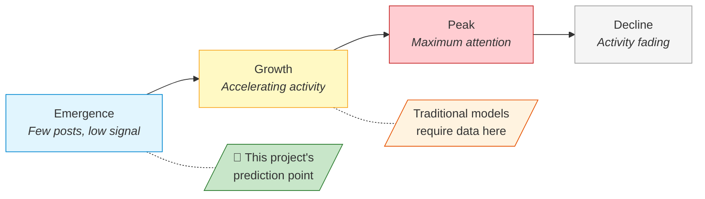
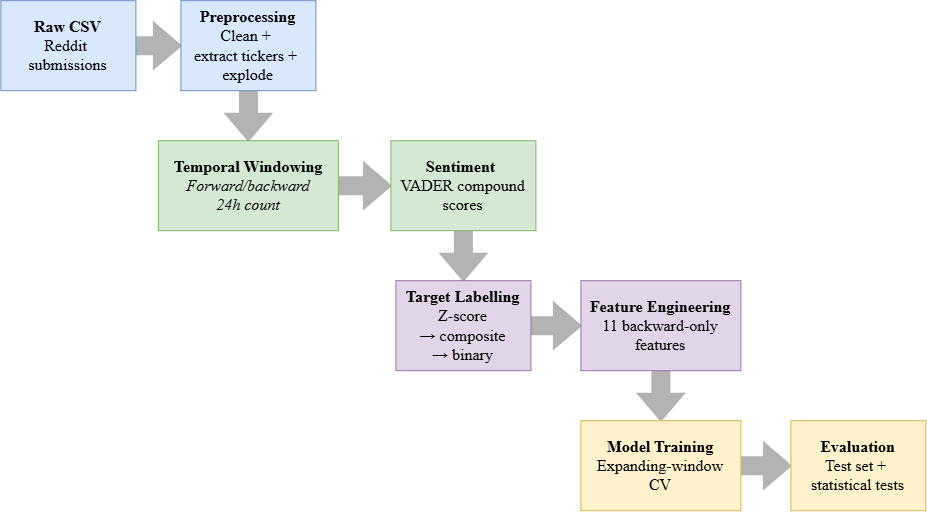
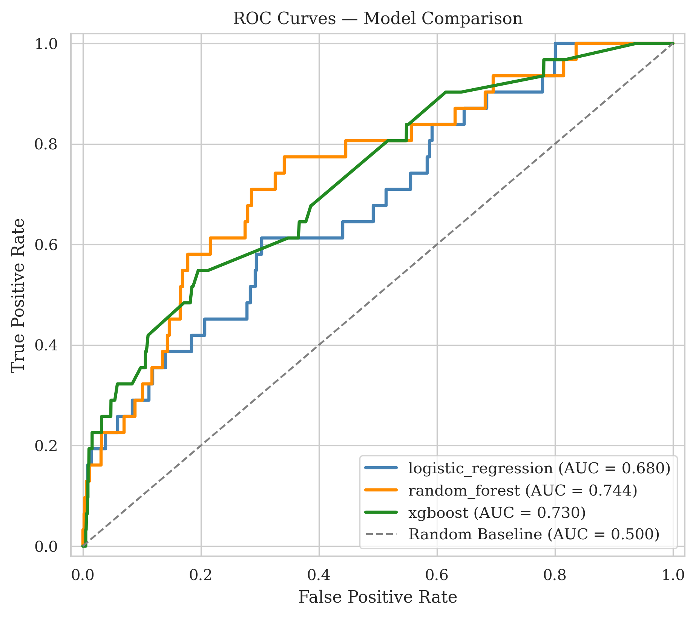

# Predicting Posting-Volume Surges on Reddit Financial Communities Using Machine Learning
—
## Abstract

Social media discussions in online financial communities can shift from quiet to frenzied within hours, yet predicting these posting-volume surges before they fully develop remains largely unaddressed. A recurring methodological weakness compounds the gap: many prior approaches inadvertently use future information, making reported results unreliable. The central question is: *can surges be predicted using only features that are genuinely available at observation time?* To answer this, a composite surge metric combining normalised volume growth with sentiment change was defined to capture multifaceted surges, and predictive features were engineered exclusively from information available at observation time. Three classifiers ranging from simple to complex (**Logistic Regression, Random Forest, and XGBoost**) were trained with expanding-window temporal cross-validation and tested on held-out future data from two subreddits at opposite ends of the density spectrum: the niche **r/pennystocks** (80,212 records) and the high-traffic **r/wallstreetbets** (1,293,981 records). The best model XGBoost achieved AUC-ROC of 0.892 on the high-volume community and Random Forest reached 0.753 on the sparse one, suggesting that data density, not model choice, is the binding constraint. All pairwise differences proved statistically significant (McNemar's test, p < 0.001 after Bonferroni correction), and cross-dataset transfer produced AUC of 0.684, useful but requiring community-specific recalibration. In short, our findings highlight that machine learning models can predict surges using only past signals, where success is driven by data availability rather than architectural complexity. Furthermore, because this evaluation framework cleanly separates the past from the future at each step, it can easily be applied across other time-indexed platforms.

---

## 1. Introduction

### 1.1 Project Concept and Objectives

This project follows the **CM3005 Data Science** project template, *Predictive Modelling of Social Media Trend Emergence*. The template asks whether data-driven models can predict when trends emerge on social media platoformss; this project instantiates that brief by targeting posting-volume surges on Reddit financial communities. It builds a machine learning system that predicts whether a stock ticker's Reddit discussion is about to surge, using only backward-looking features available at observation time. Three classifiers (Logistic Regression, Random Forest, and XGBoost) are trained and compared on this task.

The project has three objectives:

- Build a predictive model from early-stage discussion features (temporal patterns, activity frequency, sentiment) that can forecast per-ticker surges before they happen
- Compare multiple ML approaches to find out whether more complex models actually improve prediction over simpler baselines
- Confirm that predictions hold up on unseen future time periods by using temporal evaluation protocols that prevent data leakage, a common methodological weakness in social media prediction studies

The underlying hypothesis is that backward-looking temporal and textual features carry sufficient signal to discriminate surges from baseline activity, and that predictive performance scales with data density rather than model complexity.

### 1.2 Problem Statement and Motivation

Stock-related discussions on Reddit can go from quiet to frenzied within hours. A ticker attracting two posts yesterday might appear in fifty today, triggered by earnings surprises, speculative momentum, or coordinated retail interest. These surges develop too quickly for manual monitoring, particularly across forums where thousands of tickers are discussed daily.

This is primarily a research question: Can we spot a social media surge before it happens by looking at early discussion patterns? The answer holds practical value for financial analysts seeking early warning of emerging narratives, surveillance teams watching for manipulation, and quantitative researchers studying how how attention spreads through digital communities. For instance, a compliance team monitoring covered stocks could use an automated system to flag early surge signals, allowing analysts to focus on the top five or ten high-risk tickers instead of manually scanning thousands of threads.

Previous research focuses on related but different problems: forecasting eventual content reach rather than a sudden surge, or predicting price movements rather than social media dynamics themselves. Current research rarely addresses how to predict sudden, short-term spikes in volume and sentiment for specific stock tickers (see Section 2.6).

This project examines whether upcoming surges can be predicted from early discussion patterns. Standard rule-based heuristics, such as flagging a ticker when volume exceeds +2σ. They are insufficient for this task because they cannot capture non-linear interactions across diverse data streams. To overcome these limitations, we propose a learning-based approach that integrates temporal, textual, and sentiment features into a unified predictive framework.

### 1.3 Prediction Scope and Surge Definition

1.3 Prediction Scope and Surge Definition

The original project template uses the term "trend emergence," but trends can be gradual and sustained, making them difficult to label objectively within a fixed time window. This project specifically focuses on surges, defined as statistically significant, short-term spikes in both **posting volume** and **sentiment intensity** for a ticker **within a 24-hour window**. These events are identified using a composite metric that combines normalized volume growth with the magnitude of sentiment shift. Tracking volume metrics alone miss moments when discussion sentiment intensifies without a matching spike in post count. Blending both signals reveals a richer, more structured event (see Section 5.2.5). Because surges are discrete and quantifiable, they can be framed as a binary classification problem, providing a more practical way to model the concept of a 'trend'. Since surges mark the beginning of a trend, predicting a surge effectively means catching a trend right as it emerges.

The target is based on timestamped post volume rather than engagement metrics like upvotes, as post-hoc scores introduce look-ahead bias. To measure volume spikes consistently, features are standardized using Z-scores are calculated using training-set statistics alone to prevent data leakage. Section 3.3 outlines the formal definitions, weighting, and threshold choices.

### 1.4 Scope

This study evaluates binary surge classification across two archival 2021 Reddit datasets identified during separated exploratory data analysis: **r/pennystocks** (80,212 expanded records) and **r/wallstreetbets** (577,872 expanded records). Using strictly **backward-looking features**, we train and evaluate three classifier families (Logistic Regression, Random Forest, and XGBoost) to predict 24-hour ticker surges. Model performance is assessed using an 80/20 chronological holdout split alongside 4-fold expanding-window cross-validation, supported by statistical evaluations including bootstrap confidence intervals, McNemar's pairwise tests, and single-feature baselines. Finally, we assess model generalizability through cross-dataset transfer experiments between communities, using a fully deterministic pipeline with fixed seed values to ensure end-to-end reproducibility.

Several technical and analytical domains fall outside the scope of this work. The study excludes real-time data ingestion and production deployment, operating strictly on static historical datasets. Furthermore, all analyses are conducted at the ticker-record level; individual user behaviors, comment networks, and cross-platform channels (such as X or StockTwits) are not evaluated. Finally, the target is restricted to binary surge classification, explicitly excluding multi-class or regression targets, as well as trading signals, financial advice, or causal claims regarding market impact.

### 1.5 Report Structure

The remainder of this report is organised as follows. Section 2 reviews the literature on online attention prediction, financial sentiment, and Reddit-specific research, identifying the gaps this project addresses. Section 3 details the design: surge definition, feature engineering, model selection, and temporal validation. Section 4 describes the implementation, including code organisation and decisions driven by empirical findings. Section 5 presents results, statistical validation, critical analysis, and limitations. Section 6 concludes with key findings and future directions. The project timeline (Gantt chart) is provided in Appendix A.

---

## 2. Literature Review

### 2.1. The Predictability of Online Attention

Predicting trends broadly involves analyzing time-series data, applying deep learning sequence models, tracking how information spreads through networks, and detecting unscheduled events automatically. This review focuses specifically on supervised tabular classification using hand-crafted features to predict binary outcomes, distinguishing it from sequence modeling, graph methods, learned representations, and continuous trajectory forecasting. The seventeen sources reviewed here (Section 7) were selected because they directly inform the three decisions this project makes: *what to predict* (popularity and surge onset literature), *what signals to use* (sentiment and content features), and *how to evaluate rigorously* (temporal validation methods). A fourth strand, Reddit-specific financial research, confirms that this platform contains distinct, predictable signals.

The foundational question underlying this project, *can future surges in social media activity be predicted?*, was first addressed through research on **online popularity prediction**. This literature demonstrated that online attention is not random: *content that attracts early engagement tends to attract more, following patterns that are statistically detectable*.

Szabo and Huberman [1] produced the seminal result in this domain, demonstrating strong linear correlations between early and later popularity on YouTube and Digg. Their regression model showed that a content item's view count at time *t* predicts its eventual popularity with high accuracy. This established the core principle: early behavioural signals carry predictive information about future attention. However, because the model assumes a stationary growth process, it requires content to have already accumulated measurable engagement before prediction becomes possible. It cannot forecast at or near the time of posting.

Lerman and Hogg [2] extended this understanding by modelling the interaction between social network structure and content discovery, demonstrating that popularity depends on behavioural dynamics beyond simple cumulative counts. Their agent-based approach revealed that network position and user browsing patterns mediate how content gains visibility. Wang and Huberman [6] and Kong et al. [7] further characterised online attention as following identifiable temporal lifecycles (emergence, growth, peak, and decline) suggesting that content at different lifecycle stages exhibits different observable signatures. Kong et al. [7] specifically addressed *burst* detection for hashtags in real-time, but their approach operates at the hashtag level with contemporaneous features. It detects bursts as they happen rather than predicting them before onset, and works at a platform-wide granularity rather than per-entity (ticker) level.

The academic consensus that emerged from this first wave of research can be summarised as: *online attention is predictable from early signals, follows lifecycle dynamics, and is mediated by platform-specific network effects*. However, these models all require content to have already gained some traction before prediction is possible, and they target *eventual* popularity rather than the *onset* of rapid growth. Furthermore, a key tension exists within these findings: Szabo and Huberman [1] show that early popularity strongly predicts final outcome, yet Cheng et al. [5] later found that cascade prediction accuracy plateaus after the initial phase. This suggests that predictability diminishes once content leaves the emergence stage, which is precisely the window this project targets.


*Figure 1: Online attention lifecycle model [6][7]. Traditional popularity prediction requires content to have reached the growth phase before forecasting is possible. This project targets the emergence phase, predicting a surge before substantial engagement has accumulated.*

### 2.2. The Shift Toward Pre-Engagement Prediction

A second wave of research addressed the limitation that early popularity models require existing engagement data. Bandari et al. [3] demonstrated that content metadata such as source, category, subjectivity, named entities could predict popularity prior to engagement accumulates, achieving approximately 84% classification accuracy on news articles.This represented a key methodological shift: prediction could occur at or before publication rather than requiring an observation period.

Cheng et al. [5] achieved approximately 79.5% accuracy (AUC = 0.877) predicting whether Facebook photo cascades would double in size, using temporal features derived from early propagation speed and structural virality metrics. Their findings showed that the *rate* of initial spread, rather than its magnitude, carries predictive signal for sustained growth. Yuan and Li [8] extended this principle across information diffusion contexts, showing that early-stage propagation patterns contain sufficient signal to forecast long-term diffusion trajectory.

This body of work established a second consensus: prediction is achievable before substantial engagement accumulates, provided features capture content characteristics or early propagation dynamics. However, the prediction targets remained eventual outcomes, such as final popularity, total cascade size rather than *rapid onset* within a bounded time window. For example, an analyst monitoring a financial forum requires knowledge of whether discussion will surge within the sibsequent 24 hours, rather than whether it will eventually become popular. This temporal distinction represents a key gap unaddressed.

*Table 1: Evolution of online attention prediction, from post-engagement to pre-engagement approaches.*

| Study | Year | Platform | Prediction Target | Requires Existing Engagement? | Accuracy |
|-------|------|----------|-------------------|-------------------------------|----------|
| Szabo & Huberman [1] | 2010 | YouTube, Digg | Future view count | Yes (needs early views) | r² > 0.9 |
| Lerman & Hogg [2] | 2010 | Digg | Story popularity | Yes (needs network data) | N/A (model) |
| Bandari et al. [3] | 2012 | News articles | Popularity bin | **No** (content metadata only) | ~84% |
| Cheng et al. [5] | 2014 | Facebook | Cascade doubling | Partial (early reshares) | 79.5% (AUC = 0.877) |
| Yuan & Li [8] | 2019 | Weibo | Diffusion trajectory | Partial (early propagation) | N/A (descriptive) |

### 2.3. Sentiment as a Predictive Signal in Finance

Alongside popularity research, computational finance studies established that collective social media sentiment carries measurable predictive information. Bollen et al. [4] demonstrated that aggregate Twitter mood, particularly the "Calm" dimension measured by GPOMS, predicted Dow Jones movements with roughly 87.6% directional accuracy. Although limited by a short evaluation window, missing out-of-sample testing, and an unclear causal mechanism, their study proved pivotal in establishing that **social media textual sentiment can inform financial forecasting**.

The tools used for sentiment extraction have evolved alongside this finding. General-purpose lexicons like OpinionFinder lack domain specificity for financial language, where terms like "short," "bearish," or "moon" carry specialised meaning. To better capture online discourse, Hutto and Gilbert [12] developed VADER specifically for social media text, incorporating rules for punctuation emphasis, capitalisation, degree modifiers, and negation, and achieving F1=0.96 on social media benchmarks. Araci [13] later introduced FinBERT, a transformer model fine-tuned on financial corpora, capturing contextual meaning that rule-based tools miss. This progression from general lexicons, to social-media rules, to domain-specific deep learning highlights the field's consensus that sentiment analysis tools must be tailored to their specific domain

For this project, the key takeaway is that sentiment *change*, rather than absolute sentiment value, may serve as a leading indicator of activity surges: if a ticker's discussion becomes markedly more emotional before volume escalates, sentiment shift could provide early warning signal. This motivates including sentiment change magnitude in the composite surge metric.

*Table 2: Evolution of sentiment analysis tools relevant to financial social media.*

| Tool | Type | Domain | Strengths | Limitations for This Project |
|------|------|--------|-----------|------------------------------|
| OpinionFinder as used in [4] | Lexicon | General | Early adoption, widely cited | No social media conventions, no financial terms |
| VADER [12] | Rule-based | Social media | Handles capitalisation, emoticons, negation; F1=0.96 | No financial domain tuning ("short," "moon" misscored) |
| FinBERT [13] | Transformer | Financial text | Context-aware, domain-specific | Computationally expensive for 1M+ records |

### 2.4. Financial Discussion on Reddit

While the preceding research established foundational principles on platforms like YouTube, Digg, Facebook, and Twitter, recent studies examine whether these dynamics hold within Reddit's financial communities and how their unique structural features alter information flow.

Penny stocks (low-capitalisation equities trading below $5) occupy a distinctive position because their low liquidity and limited analyst coverage mean that social media discussion can constitute a disproportionate share of available information [9][10]. Unlike Twitter's ephemeral broadcast environment, Reddit's subreddit structure creates concentrated communities with persistent threads and shared behavioral norms.

Long et al. [9] demonstrated that r/WallStreetBets posting volume correlated with abnormal trading volume and returns for discussed stocks, with effects concentrated in small-cap equities. Their analysis showed that increased Reddit attention *preceded* trading activity in their sample, suggesting that discussion patterns carry predictive signal rather than merely reflecting market events. Costola et al. [10] examined the GameStop episode specifically, finding that consensus formation within r/WallStreetBets followed measurable patterns in posting frequency and sentiment alignment *before* reaching critical mass. A small number of committed users drove broader engagement through detectable temporal signatures. Extending this to security manipulation, Mancini et al. [11] constructed predictive models using the textual and temporal properties of forum posts. Their work confirmed that forum-derived text features significantly outperform chance baselines in forecasting anomalous stock activity.

These studies confirm that Reddit financial communities produce predictive signals, yet prior work exclusively targets market outcomes such as returns, volume, manipulation rather than platform dynamics. Notably, these findings align with general literature: Costola et al.'s consensus patterns [10] reflect Lerman and Hogg's network discovery dynamics [2], while Long et al.'s temporal precedence [9] echoes Cheng et al.'s early speed metrics [5]. However, predicting whether discussion itself will rapidly escalate, forecasting an imminent surge in posting volume, remains an open challenge. Addressing this gap is the central focus of this paper.

### 2.5. Methodological Weaknesses in Prior Work

Beyond the substantive gaps identified above, a critical methodological pattern cuts across the literature: a recurring absence of rigorous temporal evaluation protocols.

Szabo and Huberman [1] evaluate on data drawn from the same time period as training. Bandari et al. [3] use random train-test splits rather than temporal partitions, allowing models to be tested on articles published before some training data, a form of information leakage. Cheng et al. [5] randomly sample cascades for evaluation without preserving temporal ordering. Long et al. [9] and Costola et al. [10] analyse correlations across their full datasets without testing whether historical patterns generalise to later periods.

This methodological oversight is significant because Tashman [14] demonstrated that rolling-origin evaluation, where the forecasting origin advances forward through time, produces far more reliable accuracy estimates for temporal prediction tasks than fixed or random splits. Furthermore, Bergmeir and Benítez [15] showed empirically that random cross-validation overestimates predictive accuracy on time-dependent data, and recommended blocked or expanding-window schemes that preserve temporal ordering. Despite established best practices in time-series forecasting, they remain largely unadopted in social media prediction research.

Consequently, reported performance figures across the reviewed studies may be inflated by temporal leakage, and it remains uncertain whether models would generalise to genuinely unseen future periods. For any system intended for real-world deployment, including surge detection, this is a critical deficiency. As Fernández-Delgado et al. [16] noted in their large-scale classifier benchmark, evaluation methodology substantially affects reported performance rankings, reinforcing that how a model is evaluated matters as much as which model is selected.

*Table 3: Temporal evaluation practices across reviewed studies.*

| Study | Evaluation Method | Temporal Ordering Preserved? | Leakage Risk |
|-------|-------------------|------------------------------|--------------|
| Szabo & Huberman [1] | Same-period evaluation | No | High |
| Bandari et al. [3] | Random train-test split | No | High |
| Bollen et al. [4] | Fixed holdout (1 month) | Partial | Medium |
| Cheng et al. [5] | Random cascade sampling | No | High |
| Long et al. [9] | Full-dataset correlation | No | High |
| Costola et al. [10] | Full-dataset analysis | No | High |
| Mancini et al. [11] | Chronological split | Partial | Medium |

### 2.6. Research Gap and Project Position

The literature reviewed above establishes four cumulative findings:

- Early behavioural signals predict future online attention [1][5]
- Prediction is possible before engagement accumulates, using content and propagation features [3][5][8]
- Sentiment extracted from social media carries predictive value in financial contexts [4][12]
- Reddit financial communities generate measurable signals that precede market activity [9][10][11]

Four key gaps remain unaddressed:

1. **Prediction target:** All reviewed studies predict *eventual outcomes* (e.g., total popularity, cascade size, or market returns) rather than detecting the *onset* of rapid growth within a bounded time frame. Existing literature lacks a formulation for defining or predicting a composite volume-and-sentiment surge within a fixed short-term window for individual entities.

2. **Signal integration:** Each research strand demonstrates one feature category's value in isolation such as temporal [1], content [3], sentiment [4], or structural [5], but empirical integration of multiple signal types into a unified predictive framework remains limited, despite evidence that they interact during trend formation [2][7].

3. **Domain specificity:** General social media prediction research [1][3][5] neglects the distinct dynamics of financial discussions such as event-driven reactions, domain-specific language, and speculative behaviour. Conversely, Reddit financial research [9][10][11] predicts market consequences of surges rather than predicting whether surges *will occur*.

4. **Temporal validity:** The use of random or unspecified evaluation splits across the literature [1][3][5][9] means reported results may not reflect real-world predictive performance. Rigorous temporal evaluation methods exist [14][15] but remain unadopted in this domain.

This project addresses these gaps directly. First, the composite surge metric (Section 3.3) defines a binary onset target evaluated within a strict 24-hour window (Gap 1). Second, the feature set (Section 3.4) combines temporal, activity-frequency, sentiment, and textual signals (Gap 2). The pipeline is applied to Reddit financial communities using two subreddits at opposite ends of the data density spectrum (Gap 3) to evaluate domain-specific applicability. Finally, model evaluation strictly utilizes expanding-window temporal cross-validation ensures that no future information leaks into training (Gap 4). Whether this integration yields meaningful predictive performance is the empirical question examined in Section 5.

---

## 3. Design

### 3.1 System Architecture

The prediction system is structured as a six-stage linear processing pipeline. Each stage consumes the previous stage's output and writes a well-defined intermediate artefact to disk, enabling downstream components to be re-executed independently without recomputing expensive upstream operations.

1. **Data Loading and Preprocessing**: Ingests raw CSV data, perform text cleaning, executes regex-based ticker extraction, and explodes multi-entity records into unique record–ticker pairs
2. **Temporal Windowing**: Computes per-ticker forward and backward 24-hour posting volume using vectorized binary search operations over chronological index boundaries.
3. **Sentiment Computation**: Calculates VADER compound sentiment scores per record, implementing a title-fallback mechanism when selftext is absent.
4. **Target Labelling**: Establishes a temporal train/test split (80/20), calculates z-score normalization parameters strictly from training-partition statistics, and derives binary classification targets via composite metric thresholding.
5. **Feature Engineering**: Extracts eleven backward-looking temporal, text, and sentiment features (Section 3.4) over historical observation windows.
6. **Model Training and Evaluation**: Performs expanding-window temporal cross-validation, hyperparameter tuning, holdout test-set evaluation, and statistical hypothesis testing across model baselines.

<figure align="center">
  
  <figcaption>Figure 2: Data pipeline architecture.</figcaption>
</figure>
*Figure 2: Pipeline architecture. Shading indicates critical design points: target labelling (leakage prevention), model training (temporal validation), and evaluation (statistical rigour).*

The foundational architectural constraint is that **no stage may access information from the future relative to the observation time of any record**. Sentiment uses only the record's own text, features use backward-looking windows exclusively, z-scores are frozen from training-partition statistics, and validation folds are strictly time-ordered.

### 3.2 Data Selection and Characteristics

Reddit was selected as the primary data source because its subreddit structure concentrates stock discussion into retrievable, topically focused communities; its posts are publicly archived for reproducible research; and its threaded format yields timestamped submissions with text suitable for temporal and sentiment feature extraction.

Two subreddits were chosen to represent opposite ends of the data density spectrum:

- **r/pennystocks** is a sparse niche community (80,212 exploded records) focused on low-capitalisation equities. This dataset evaluates whether the proposed methodology degrades gracefully under data scarcity.

- **r/wallstreetbets** is a high-volume mainstream forum (577,872 exploded records). This dataset evaluates whether the pipeline scales effectively and isolates predictive signals within high-noise environments.

This dual-dataset strategy directly addresses Gap 3 (domain specificity) by testing model robustness across varying signal-to-noise ratios and enables subsequent cross-dataset transfer evaluation.

*Table 4: Dataset characteristics.*

| Property | r/pennystocks | r/wallstreetbets |
|----------|---------------|------------------|
| Raw records | 304,524 | 1,293,981 |
| Date range | 2021-01-01 to 2021-12-31 | 2021-01-01 to 2021-12-31 |
| After ticker extraction (exploded) | 80,212 | 577,872 |
| Usable records (post-exclusion) | 24,827 | 457,072 |
| Train / Test split | 21,549 / 3,278 | 388,149 / 68,923 |
| Test surges | 31 | 2,582 |
| Test imbalance ratio | 105:1 | 26:1 |

Both datasets are static CSV exports from the Reddit Finance Data collection on Kaggle [17], covering the full 2021 calendar year. It spans the January GameStop episode through subsequent normalisation. Utilizing static archival CSVs ensure exact reproducibility, whereas live API scraping would introduce temporal variability between runs and complicate replication. Each record contains a Unix timestamp, post title, optional selftext, and engagement fields (score, num_comments) that are retained for transparency but not used as features.

**Ethical considerations:** All underlying data consists of publicly posted, non-sensitive forum submissions; analysis is aggregated at the ticker level with no attempt to identify individual users. This project is academic research only; no trading decisions were made from model outputs.

**Known limitations:** The archival dataset exhibits survivorship bias (deleted/moderated posts are absent), engagement metrics are frozen at collection time, and results are bound to the 2021 period.

### 3.3 Surge Definition (Target Variable)

A fixed posting-count threshold fails because tickers have different baselines. What matters is whether current activity is *statistically unusual* for that ticker's history. The solution is a composite metric that normalises volume growth relative to the training distribution and combines it with sentiment change:

For each record mentioning ticker *X* at time *t*, the pipeline:

1. Extract volume: counts posts mentioning ticker $X$ within a backward window $[t - 24\text{h}, t)$ and a forward window $(t, t+24h]$
2. Computes volume growth: computes relative growth rate $$\Delta V = \frac{C_{\text{fwd}}}{\max(C_{\text{bwd}}, 1)} - 1$$where $C_{\text{fwd}}$ and $C_{\text{bwd}}$ represent the post counts mentioning ticker $X$ in the forward $(t, t + 24\text{h}]$ and backward $(t - 24\text{h}, t]$ observation windows, respectively.
3. Sentiment Shift: Computes the magnitude of sentiment change between the forward window mean and current post sentiment: $$\Delta S = \vert{}\bar{S}_{\text{fwd}} - s_t\vert{}$$where $\bar{S}_{\text{fwd}}$ is the mean VADER compound sentiment score across all posts in the forward window, and $s_t$ is the compound sentiment score of the current post at timestamp $t$.
4. Z-Score Normalization: Standardizes $\Delta V$ and $\Delta S$ using training-partition parameters exclusively: $$Z(\Delta V) = \frac{\Delta V - \mu_{\Delta V,\text{train}}}{\sigma_{\Delta V,\text{train}}}, \quad Z(\Delta S) = \frac{\Delta S - \mu_{\Delta S,\text{train}}}{\sigma_{\Delta S,\text{train}}}$$where $\mu_{\text{train}}$ and $\sigma_{\text{train}}$ denote the sample mean and standard deviation estimated strictly from the training partition.
5. Composite Thresholding: Combines normalized metrics into a unified composite score:$$\text{Composite} = w_1 \cdot Z(\Delta V) + w_2 \cdot Z(\Delta S)$$where $w_1$ and $w_2$ are weighting parameters controlling the relative importance of volume growth and sentiment shift, respectively. A binary target $y \in \{0, 1\}$ is assigned if $\text{Composite} > \tau$, where $\tau$ is the decision threshold.

By standardizing volume and sentiment shifts into $z$-scores, this composite metric identifies activity bursts that are statistically unusual regardless of an individual ticker's typical volume. Calculating $\mu_{\text{train}}$ and $\sigma_{\text{train}}$ strictly within the training partition guarantees that information about test-set distributions does not leak into the ground-truth target labels.

Two key architectural choices govern this formulation: the length of the observation window and the inclusion of the sentiment component. 

**Observation window duration:** The 24-hour observation window was selected to align with daily trading cycles, capturing overnight-to-open discussion dynamics that precede next-day attention shifts. Shorter windows (e.g., 6 hours) yield sparse post counts per ticker, leading to unstable statistics in lower-density subreddits. Conversely, longer windows (e.g., 72 hours) obscure the onset of a surge by blending initial acceleration with sustained activity, diminishing the label's utility as an early-warning indicator. Section 5.4.2 will explore these trade-offs via sensitivity analysis and identifies multi-scale windows as a candidate for future research. 

**Sentiment weighting:** Incorporating sentiment shift ($\Delta S$) accounts for scenarios where community discussion grows distinctly polarized or agitated without an immediate spike in posting frequency [4, 10]. Defining surges solely by volume yields noisier target labels that prove harder to predict: setting $w_2 = 0$ reduces the metric to a volume-only definition, which degrades classification performance on r/wallstreetbets from $\text{AUC} = 0.892$ (Phase 2) down to $\text{AUC} = 0.710$ (Phase 1; Section 5.2.5).

*Table 5: Threshold sensitivity on r/wallstreetbets*

| $\tau$ | Surge Count | Surge Rate | Imbalance Ratio |
|---|-------------|------------|-----------------|
| $0.5$ | 80,455 | 17.6% | 4.7:1 |
| $\mathbf{1.0}$ | **22,384** | **4.9%** | **19.4:1** |
| $1.5$ | 6,602 | 1.4% | 68.2:1 |
| $2.0$ | 2,873 | 0.6% | 158:1 |
| $2.5$ | 1,348 | 0.3% | 338:1 |

**Threshold selection ($\tau$):** A decision threshold of $\tau = 1.0$ standard deviations was selected for primary model evaluation. This threshold isolates instances rare enough to represent true statistical anomalies while maintaining sufficient sample density (e.g., $2,582$ test-set surge instances on r/wallstreetbets) for statistically reliable performance estimation. A secondary evaluation run at $\tau = 1.5$ on r/pennystocks tests model resilience and performance under conditions of severe class imbalance. 

**Two-phase metric validation:** To isolate the empirical contribution of sentiment, target labeling is evaluated in two phases: Phase 1 ($w_1 = 1.0, w_2 = 0.0$): Evaluates a baseline volume-only target. Phase 2 ($w_1 = 0.5, w_2 = 0.5$): Evaluates an equal-weight composite target incorporating both volume growth and sentiment shift. Comparing model performance across these phases determines whether incorporating sentiment shift yields a measurably more predictable and meaningful surge target. Additionally, a full weight hyperparameter sweep ($w_2 \in \{0.0, 0.25, 0.50, 0.75, 1.00\}$) is reported in Section 3.8 as supplementary sensitivity analysis.

### 3.4 Feature Engineering

To maintain strict temporal validity, all eleven engineered features satisfy a backward-looking constraint: each feature is derived strictly from information available at or prior to observation timestamp $t$. Post-hoc engagement metrics, specifically Reddit post score (upvotes) and num_comments, are explicitly excluded from the feature space. Because these metrics accumulate dynamically after publication, their inclusion would introduce lookahead bias by incorporating the very engagement trajectories the system aims to predict.


*Table 6: Feature definitions. All features use backward-looking or concurrent information only.*

| | Feature | Category | Definition |
|-|---------|----------|------------|
|1| `sentiment_score` | Content | VADER compound sentiment of the post text |
|2| `word_count` | Content | Words in selftext (0 if absent) |
|3| `title_length` | Content | Character count of title |
|4| `num_tickers_mentioned` | Content | Distinct tickers extracted from the post |
|5| `hour_of_day` | Temporal | Hour of post creation (UTC) |
|6| `day_of_week` | Temporal | Day of post creation (Monday=0) |
|7| `time_since_previous` | Activity | Seconds since previous same-ticker post |
|8| `ticker_post_rate_24h` | Activity | Same-ticker posts in preceding 24 hours |
|9| `ticker_post_acceleration` | Activity | Rate ratio: count in preceding 12h ÷ count | in 12h before that |
|10| `word_count_x_hour` | Interaction | word_count × hour_of_day |
|11| `accel_x_time_since_prev` | Interaction | ticker_post_acceleration × time_since_previous |

The feature set is structured into four functional categories:
- **Content features:** Encode textual characteristics, emotional valence, and post effort (e.g., emotional intensity, character length, selftext presence).
- **Temporal features:** Capture cyclical and market-aligned posting patterns tied to financial trading hours (e.g., hour of day, day of week, market-session flags).
- **Activity features:** Draw upon established popularity prediction literature [1, 5] to measure discussion momentum, where accelerating posting rates serve as early indicators of surge formation.
- **Interaction features:** Combine multimodal signals to capture cross-feature dynamics. These were introduced following ablation experiment, where manually engineered interaction terms yielded a $+1.4$ percentage point increase in Random Forest AUC on r/pennystocks.

### 3.5 Methodological Scope: Techniques Adopted and Excluded

The project template identifies several core technique families as relevant to social media trend prediction: time-series forecasting (ARIMA, LSTM), network analysis (centrality measures, community detection), natural language processing (sentiment analysis, topic modelling, word embeddings), machine learning (classification, regression), and data visualisation. Based on the operational definition of the surge prediction task, this project adopts a subset of these technique families.

**Adopted techniques:**

- *Sentiment analysis* (NLP): Employs VADER compound scoring to extract emotional intensity from post titles and body text. Sentiment scores contribute directly to both the composite target variable ($\Delta S$) and the predictive feature set, providing the primary mechanism for detecting shifts in community valence prior to surge onset.
- *Machine learning classification*: Deploys three distinct model families: Logistic Regression, Random Forest, and XGBoost, to predict the binary surge target ($y \in \{0, 1\}$). Supervised classification represents the most natural framework for answering the operational decision question: will a ticker experience a surge within the next 24 hours?
- *Temporal feature engineering*: Adapts principles from time-series forecasting [1, 5] by constructing per-record activity rates, acceleration ratios, and inter-arrival time metrics. Converting sequential temporal dynamics into tabular feature representations captures time-dependent momentum without requiring a computationally heavy forecasting architecture.
- *Data visualisation*: Utilizes Receiver Operating Characteristic (ROC) curves, confusion matrices, feature importance rankings, and threshold sensitivity charts to evaluate model performance, interpret feature contributions, and assess stability under class imbalance.

**Excluded techniques and rationale:**

- *Time-series forecasting (ARIMA, LSTM)*: Time-series models predict continuous sequential trajectories over time (e.g., forecasting absolute post volume for ticker $X$ over $t+1$). In contrast, this study addresses a per-record binary classification task (will a surge occur within the next 24 hours?). Temporal dynamics are successfully captured via engineered features, such as historical posting rates and volume acceleration ratios, fed directly into supervised classifiers. This feature-based approach is better suited for binary onset detection than fitting separate time-series models per ticker, particularly given that LSTMs require dense, uninterrupted sequence inputs that are infeasible for long-tail tickers with sparse posting histories.
- *Network analysis (centrality, community detection)*: Graph-based techniques require explicit interaction structures, such as user reply trees, mention networks, or cross-posting links. The archival dataset consists exclusively of top-level submissions without comment-level reply graphs or user interaction metadata. Constructing a valid network would require either comment-level data (absent from the dataset) or cross-referencing user submission histories, which would introduce user-level tracking outside this project's ticker-level scope. While network analysis is well-suited for tracking how information diffuses through a social graph, surge onset prediction (whether a surge will occur) is effectively captured through aggregate temporal and sentiment signals.
- *Topic modelling and word embeddings*: Topic models extract latent thematic clusters across a corpus, characterizing what is discussed rather than predicting when volume will intensify. Furthermore, dense vector representations or transformer embeddings (e.g., FinBERT) introduce heavy computational overhead when scaled across more than 1.3 million records, with uncertain marginal gains over lightweight sentiment features that already dominate feature importance rankings. These techniques remain promising future extensions (Section 5.4.2), but were deprioritized in favor of depth in temporal validation, rigorous statistical testing, and multi-experiment sensitivity analysis.

The overarching design principle prioritizing depth over breadth: rather than applying multiple techniques superficially, this project pairs supervised classification with rigorous temporal evaluation protocols, robust hypothesis testing, and multi-experiment sensitivity analysis. The excluded methods remain valuable to the broader problem domain and are contextualized as future research directions in Section 5.4.2.

### 3.6 Model Selection

**Why binary classification?** The prediction objective is framed as a supervised binary classification task ($y \in \{0, 1\}$), where the target indicates whether a given ticker experiences a composite surge within the subsequent 24-hour window. Regression formulations (predicting continuous surge magnitude) introduce unnecessary target variance when the primary operational decision is binary onset detection. Multi-class discretization scheme (e.g., low/medium/high surge buckets) requires arbitrary threshold boundaries and exacerbates class imbalance. Unsupervised anomaly detection is likewise rejected because it ignores historical labeled training data and flags all low-frequency events regardless of whether they exhibit predictive structure.

Three classifier families, spanning the model complexity spectrum, are deployed to evaluate whether model complexity actually helps improve predictive performance:

- **Logistic Regression (LR)** serves as an interpretable linear baseline, fitted with Elastic Net regularisation ($L_1 + L_2$). Strong baseline performance would indicate that the underlying surge feature space is approximately linearly separable.
- **Random Forest (RF)** represents bagged decision tree ensembles. It captures non-linear relationships through tree splits and handles noisy features gracefully. Fernández-Delgado et al. [16] demonstrated that random forests consistently achieve top-tier performance across extensive tabular benchmark comparisons.
- **XGBoost** represents gradient-boosted decision trees. Each tree corrects the mistakes of the previous ensemble, with leaf-weight regularisers ($L_1 / L_2$) to control overfitting. Gradient boosting dominates recent tabular data competitions and consistently achieves state-of-the-art results on structured tabular datasets.

**Primary metric: AUC-ROC:** Due to severe class imbalance (surge rates ranging between $1\text{--}5\%$), raw classification accuracy is uninformative, as a naive model predicting "no surge" achieves $95\text{--}99\%$ accuracy while offering zero decision utility. AUC-ROC serves as the primary evaluation metric because it measures a model's ability to rank surge-bound instances above non-surge instances across all decision thresholds. Precision, Recall, $F_1$-score, and Precision-Recall AUC (PR-AUC) are reported as secondary metrics evaluated at both the default threshold ($0.5$) and validation-optimized decision thresholds.

**Handling class imbalance:** Synthetic oversampling techniques such as SMOTE are fundamentally unsuitable for time-dependent data, as synthetic instances lack meaningful chronological timestamps and risk introducing local data leakage. Instead, class imbalance is addressed directly via cost-sensitive learning within the loss function: utilizing `class_weight='balanced'` for Logistic Regression and Random Forest, and setting `scale_pos_weight` (the negative-to-positive class ratio) for XGBoost.

### 3.7 Temporal Validation Design

Standard $k$-fold cross-validation fundamentally violates chronological sequence integrity, as it permits models to train on future observations (e.g., October) while validating on past observations (e.g., March). As Bergmeir and Benítez [15] demonstrated empirically, this introduces temporal lookahead bias and systematically overestimates predictive performance. To guarantee strict temporal validity, the evaluation pipeline employs a hierarchical two-level temporal partitioning scheme:

**Level 1: Train/test split (80/20 by timestamp):** Raw records are sorted strictly by observation timestamp ($t$). The earliest $80\%$ of records constitute the training partition used for feature scaling, parameter estimation, and hyperparameter tuning. The final $20\%$ of records form the held-out test set, which remains strictly isolated and is evaluated exactly once to generate final performance figures.

**Level 2: Expanding-window CV within training ($k=4$):** Model selection and hyperparameter optimization are conducted exclusively within the $80\%$ training partition using a $4$-fold expanding-window cross-validation scheme.

```mermaid
gantt
    title Expanding-Window Temporal CV (k=4)
    dateFormat X
    axisFormat %s

    section Fold 1
    Train     :done, 0, 25
    Val       :active, 25, 50

    section Fold 2
    Train     :done, 0, 50
    Val       :active, 50, 75

    section Fold 3
    Train     :done, 0, 75
    Val       :active, 75, 100
```


*Figure 3: Expanding-window CV. The training partition is divided into four temporal blocks, producing three validation splits. Each fold trains on all data up to a cutoff and validates on the next block, mimicking deployment where more history accumulates over time.*

The core design guarantee of this scheme is that every validation instance occurs strictly downstream in time from all corresponding training instances. Across the four evaluation folds, the training origin expands forward in time, incorporating historical data from prior blocks while validating on the immediate subsequent chronological block (yielding approximately $2.5$-month validation windows). A fold count of $k = 4$ was selected to ensure that each validation window contains a sufficient density of positive surge instances for stable AUC-ROC estimation while maintaining a large enough initial training block ($t_1$) for meaningful model fitting.

Following hyperparameter optimization, decision thresholds optimizing the $F_1$-score are derived and locked on these inner validation folds. These frozen hyperparameter configurations and decision thresholds are then applied directly to the held-out test set without modification, ensuring that test evaluation remains entirely uncontaminated.Temporal non-stationarity, such as shifting community behavior and market regimes across 2021, represents a known structural risk in social media forecasting. The expanding-window design mitigates this by maximizing historical training depth at each fold, though it remains bounded by regime shifts occurring within the test window. Empirical evidence regarding temporal stability and concept drift is detailed in Section 5.3.4.

### 3.8 Evaluation Framework

The empirical evaluation is designed to answer four primary research questions: 
1. Do the proposed models predict surge onset significantly better than trivial baselines?
2. Do non-linear ensemble methods (RF, XGBoost) yield statistically significant performance gains over linear baselines (Logistic Regression)?
3. How confident are the reported metric point estimates?
4. Does the learned surge representation generalize across social media communities with different data densities and posting dynamics?

*Table 7a: Success tiers.*

| Tier | AUC-ROC | Interpretation |
|------|---------|----------------|
| Minimum | > 0.60 | Weak but above-chance discrimination |
| Target | > 0.70 | Moderate; practically useful for ranking |
| Stretch | > 0.80 | Strong; reliably separates surges from non-surges |

**Baselines and Literature Context:** Performance is evaluated against two baseline tiers: a uniform random baseline ($\text{AUC} = 0.50$) and eleven univariate Logistic Regression models trained on each feature in isolation. Evaluating single-feature baselines determines whether multi-feature signal integration (Gap 2) outperforms the single best predictor. Notably, reported performance targets in this study are conservative relative to prior cascade prediction literature (e.g., Cheng et al. [5], who reported $\text{AUC} = 0.877$), as earlier works relied on post-hoc engagement features and non-temporal evaluation protocols that systematically inflate performance estimates.

**Statistical robustness:** Metric uncertainty is quantified using non-parametric bootstrapping: 1,000 resamples are drawn from the held-out test set to construct $95\%$ confidence intervals via the $2.5^{\text{th}}$ and $97.5^{\text{th}}$ percentiles. To determine whether performance differences between model families are statistically significant, McNemar's test for paired binary classification outcomes is conducted on test-set predictions. A Bonferroni-corrected significance threshold of $\alpha = 0.017$ ($\alpha_{\text{global}} = 0.05 / 3$) is enforced across the three pairwise comparisons (LR vs. RF, LR vs. XGBoost, and RF vs. XGBoost). Primary evaluation centers on AUC-ROC, with Precision, Recall, and $F_1$-scores reported at both the default threshold ($0.5$) and the validation-optimized decision threshold.

*Table 7b: Evaluation metrics.*

| Metric | Role |
|--------|------|
| AUC-ROC | Primary; threshold-independent ranking quality |
| Precision | Proportion of predicted surges that are real |
| Recall | Proportion of actual surges detected |
| F1-Score | Harmonic mean of precision and recall |

**Cross-dataset transfer:** To evaluate domain generalization (Gap 3), models trained on one subreddit are deployed directly onto the held-out test set of the other without fine-tuning or retraining. Because baseline surge rates differ substantially between communities ($3.75\%$ on r/wallstreetbets vs. $0.95\%$ on r/pennystocks), AUC-ROC serves as the primary transfer metric, as it remains invariant to operating point shifts. A transfer $\text{AUC-ROC} > 0.60$ is established as the benchmark for identifying shared, cross-community surge structures.

**Sensitivity analysis:** Model robustness is systematically stress-tested via two hyperparameter sweeps. Threshold Sensitivity ($\tau \in \{0.5, 1.0, 1.5, 2.0, 2.5\}$): Evaluates how performance degrades as the surge definition moves from common bursts to extreme, high-magnitude anomalies. Sentiment Weight Sensitivity ($w_2 \in \{0.0, 0.25, 0.50, 0.75, 1.00\}$): Measures the incremental predictive utility of sentiment shift relative to pure volume-based target definitions.

---

## 4. Implementation

### 4.1 Code Organisation

The pipeline is packaged as a standard Python 3.10+ library (`surge-pipeline`, built with setuptools) depending on `pandas` (≥2.0), `scikit-learn` (≥1.3), `XGBoost` (≥2.0), `vaderSentiment` (≥3.3.2), and `NumPy` (≥1.24). Exact pinned versions are recorded in `requirements.txt` and logged with each experiment run for full reproducibility. 

All source code resides under `src/`, split into a core library modules and executable CLI scripts:

```
src/
├── surge_pipeline/              # Core library (15 modules, ~4,250 LOC)
│   ├── config.py                # PipelineConfig dataclass + JSON serialisation
│   ├── loader.py                # CSV ingestion, ticker extraction, record explosion
│   ├── windowing.py             # Per-ticker forward/backward 24h counts (searchsorted)
│   ├── sentiment.py             # VADER compound scoring with title-fallback
│   ├── labelling.py             # Temporal split, z-scores, composite metric, thresholding
│   ├── normalisation.py         # Z-score parameter persistence (train-only stats)
│   ├── features.py              # 11 backward-only ML features
│   ├── training.py              # Multi-model training with expanding-window CV
│   ├── evaluation.py            # Metrics, bootstrap CI, McNemar's, tier validation
│   ├── evaluation_figures.py    # Confusion matrices, ROC curves, importance plots
│   ├── experiment_log.py        # Append-only JSONL experiment tracker
│   └── pipeline.py              # Orchestrator: chains stages, manages outputs
├── tests/                       # 10 test modules (pytest)
├── run_labeling.py              # CLI: full labelling pipeline (stages 1–4)
├── run_training.py              # CLI: model training + evaluation (stages 5–6)
└── run_cross_validation.py      # CLI: cross-dataset transfer evaluation
```
*Figure 5: Source code organisation. The `surge_pipeline/` package contains one module per pipeline stage, enforcing separation of concerns. Each module has a corresponding test file. CLI entry points orchestrate multi-stage runs without embedding logic themselves.*

Each pipeline stage maps  directly to one or two library modules. This modular separation ensures that changes to one stage (e.g., swapping out the sentiment backend) cannot touch another's logic, and any stage can be unit-tested in isolation.

Executable commands are exposed via entry-point CLI scripts to streamline individual stages and end-to-end runs.

*Table 8: CLI entry points.*

| Command | Purpose |
|---------|---------|
| `surge-label` | Run the labelling pipeline (load → window → sentiment → label → threshold sweep) |
| `surge-train` | Train all three models and produce the full evaluation report |
| `surge-cross-val` | Test whether a model trained on one subreddit transfers to the other |
| `surge-figures` | Regenerate publication figures from saved evaluation artefacts |

Pipeline behavior is controlled centrally via a `PipelineConfig` dataclass, which holds every tuneable parameter and can be overridden via configuration files. To guarantee determinism across runs, a fixed global seed (default 42) is systematically set across Python's native random module, NumPy, and all scikit-learn estimators.

### 4.2 Data Loading and Preprocessing

The data loader module  (`loader.py`) ingest raw Reddit submission exports and transforms them into the core unit of analysis (one row per record-ticker pair, sorted chronologically) in four steps:

**Step 1: Text Cleaning**

Moderation placeholders (such as `[deleted]`, `[removed]`) and `null` are replaced with empty strings. Each row in the raw archival dataset maps to a unique Reddit submission ID, so no deduplication is needed. Figure 6a shows the implementation:

```python
# Clean selftext: replace [deleted], [removed], NaN with empty string
df["selftext"] = df["selftext"].fillna("")
df["selftext"] = df["selftext"].replace({"[deleted]": "", "[removed]": ""})

# Clean title: fill NaN with empty string
df["title"] = df["title"].fillna("")
```
*Figure 6a: Text cleaning (from `loader.py`). Moderation-redacted content and null values are normalised to empty strings before downstream extraction, ensuring regex patterns operate on consistent input without raising exceptions on missing data.*

**Step 2: Ticker Extraction** 

Tickers are extracted from submission text using two prioritized regex patterns: (1) Dollar-sign tickers (e.g., `\$([A-Za-z]{1,5})` for `$AMC`, `$TSLA`), which carry the highest confidence since the dollar prefix is an explicit marker in financial communities; (2) Standalone 2–5 character uppercase words `(\b[A-Z]{2,5}\b)`, which cast a broader net. Extracted matches are filtered against a curated stopword lexicon of 297 terms across eight categories (common English, Reddit slang, finance abbreviations, etc.), developed through iterative error analysis on early runs. A stopword filter was selected over a closed universe of exchange-listed tickers because penny stocks and emerging tickers rotate frequently; the worst-case failure mode is a false-positive adding minor noise to one record, whereas an outdated master ticker list would silently drop posts about unknown stocks. Figure 6b shows the extraction logic:

```python
# Extract tickers from combined title + selftext
combined_text = f"{title} {selftext}"

# 1. Dollar-sign pattern (highest priority always included)
dollar_matches = _DOLLAR_SIGN_PATTERN.findall(combined_text)
for match in dollar_matches:
    ticker = match.upper()
    if ticker not in TICKER_STOPWORDS:
        tickers.add(ticker)

# 2. Uppercase word pattern (filtered against stopwords)
word_matches = _UPPERCASE_WORD_PATTERN.findall(combined_text)
for match in word_matches:
    ticker = match.upper()
    if ticker not in TICKER_STOPWORDS:
        tickers.add(ticker)
```
*Figure 6b: Ticker extraction with dual regex priority cascade and stopword filtering (from `loader.py`). The dollar-sign pattern (`\$([A-Z]{1,5})`) captures explicit financial references with high precision; the uppercase pattern (`\b[A-Z]{2,5}\b`) broadens recall at the cost of precision, mitigated by a 297-term stopword lexicon spanning eight categories.*

**Step 3: Timestamp Normalisation**

Raw timestamps (Unix epoch integers or ISO datetime strings) are normalised to standard `datetime64[ns, UTC]` and sorted. This chronological ordering is a hard precondition for the binary-search windowing that follows. Figure 6c shows the implementation:

```python
# Parse timestamps: handle both epoch-second and datetime-string formats
if "created_utc" in df.columns:
    df["created_utc"] = pd.to_datetime(df["created_utc"], unit="s", utc=True)
elif "created" in df.columns:
    df["created_utc"] = pd.to_datetime(df["created"], utc=True)
    df = df.drop(columns=["created"])
else:
    raise ValueError(
        "Dataset must contain either 'created_utc' (epoch) or "
        "'created' (datetime string) column."
    )

df = df.sort_values("created_utc").reset_index(drop=True)
```
*Figure 6c: Timestamp normalisation and chronological sorting (from `loader.py`). The loader accepts two timestamp formats, Unix epoch integers (common in Reddit API exports) and ISO datetime strings (common in Kaggle archives), unifying both into timezone-aware `datetime64[ns, UTC]`. The sort establishes the chronological invariant required by all downstream stages.*

**Step 4: Ticker Explosion & Filtering** 

Multi-ticker posts (e.g., "comparing `$AMC` vs `$GME`") are exploded into separate record–ticker rows using pandas.explode(). Records that yield zero valid tickers after filtering are dropped from the pipeline. Figure 6d shows the implementation:

```python
# Exclude records with missing/empty tickers
df["tickers"] = df["tickers"].astype(str).str.strip()
df["tickers"] = df["tickers"].replace({"": np.nan, "nan": np.nan, "None": np.nan})
mask_has_tickers = df["tickers"].notna()
df = df[mask_has_tickers].reset_index(drop=True)

# Explode multi-ticker records: one row per (record_id, ticker) pair
df["tickers"] = df["tickers"].str.split(",")
df = df.explode("tickers", ignore_index=True)

# Clean individual ticker values
df["tickers"] = df["tickers"].str.strip().str.upper()
df = df[df["tickers"].str.len() > 0].reset_index(drop=True)
df = df.rename(columns={"tickers": "ticker"})
```
*Figure 6d: Ticker explosion and filtering (from `loader.py`). The comma-separated ticker string is split into a list and exploded via `pandas.explode()`, converting one multi-ticker post into multiple rows, one per (record, ticker) pair. This transforms the unit of analysis from "post" to "post-about-a-specific-ticker", enabling per-ticker temporal windowing in subsequent stages.*

*Table 9: Loader-stage attrition.*

| Step | r/pennystocks | r/wallstreetbets |
|------|---------------|------------------|
| Raw records loaded | 304,524 | 1,293,981 |
| Excluded (no tickers found) | 224,312 (73.7%) | 716,109 (55.3%) |
| After explosion (record-ticker pairs) | 80,212 | 577,872 |

### 4.3 Feature Engineering

Eleven features feed the classifiers. The governing constraint is that every feature must be computable from data *at or before* the current record's timestamp. Nothing may peek into the future.

*Table 10: Feature engineering detail. Each row specifies what the feature captures and how it is computed, including the responsible function.*
| # | Feature | Category | Computation Method |
|---|---------|----------|--------------------|
| 1 | `ticker_post`<br>`_rate_24h` | Activity | Reuses `backward_count` produced by `windowing.compute_windowed_counts()`. For each record mentioning ticker $X$ at time $t$, counts all other posts mentioning $X$ with timestamps in the half-open interval $(t - 24\text{h},\; t)$. Counting is performed via `np.searchsorted` on the chronologically sorted per-ticker timestamp array, yielding $O(n \log n)$ complexity per ticker group. The self-post is excluded by using `side='left'` at the right boundary. |
| 2 | `time_since_`<br>`previous_post` | Activity | Computed by `features._compute_time_`<br>`since_previous()`. For each record at time $t$, identifies the immediately preceding post mentioning the same ticker by iterating through the chronologically sorted per-ticker group (`groupby('ticker')`). Computes elapsed hours: $(t - t_{\text{prev}}) / 3600$. Returns $-1$ for the first occurrence of a ticker (no prior history). Uses epoch-second conversion for numeric subtraction. |
| 3 | `ticker_post_`<br>`acceleration` | Activity | Computed by `features._compute_ticker_`<br>`post_acceleration()`. Splits the backward 24 h window into two 12 h halves: recent $(t - 12\text{h},\; t]$ and older $(t - 24\text{h},\; t - 12\text{h}]$. Counts posts in each half using `np.searchsorted` (4 boundary lookups per record, $O(n \log n)$ per ticker group). Computes ratio: `count_recent / max(count_older, 1)`. Values $> 1.0$ indicate accelerating discussion; values $< 1.0$ indicate deceleration. The `max(..., 1)` denominator guard prevents division by zero when no posts exist in the older half. Boundary semantics: `side='right'` for inclusive-left boundaries, `side='left'` for exclusive-right. |
| 4 | `sentiment_`<br>`score` | Content | Reuses `sentiment_polarity` produced by `sentiment.compute_sentiment()` via `_compute_polarity_vader()`. VADER's `polarity_scores()` is applied to the post's selftext; if selftext is empty or absent, the title is used as fallback. The compound score ranges from $-1$ (most negative) to $+1$ (most positive). Computed strictly from the record's own text at creation time, no forward window information. |
| 5 | `word_count` | Content | Computed inline in `features.compute_features()`. Concatenates `title + " " + selftext`, splits on whitespace (`str.split().str.len()`), counts resulting tokens. Empty/null selftext is replaced with empty string before concatenation. Measures post effort/depth as a proxy for informational content. |
| 6 | `title_length` | Content | Computed inline in `features.compute_features()`. Splits title on whitespace (`str.split().str.len()`) and counts tokens. Captures headline effort independently of body length. Null titles treated as empty string (0 tokens). |
| 7 | `num_tickers_`<br>`mentioned` | Content | Computed by `features._compute_num_`<br>`tickers_mentioned()`. Groups the exploded DataFrame by original post `id` and counts distinct ticker values per group using `groupby('id')['ticker']`<br>`.transform('nunique')`. A post mentioning 3 tickers will have value 3 in all its exploded rows. Captures whether a post is ticker-specific or broad market commentary. |
| 8 | `hour_of_`<br>`day` | Temporal | Computed inline in `features.compute_`<br>`features()`. Extracts UTC hour (0–23) from `created_utc` via `pd.to_datetime(..., utc=True)`<br>`.dt.hour`. Captures intraday cyclicality aligned with US market hours (pre-market activity typically spikes 13:00–14:00 UTC). |
| 9 | `day_of_week` | Temporal | Computed inline in `features.compute_`<br>`features()`. Extracts day-of-week index (Monday=0, Sunday=6) from `created_utc` via `.dt.dayofweek`. Captures weekly periodicity: weekday posts cluster near market sessions; weekend posts are predominantly speculative. |
| 10 | `word_count_`<br>`x_hour` | Interaction | Computed inline in `features.compute_`<br>`features()` via element-wise multiplication: `word_count × hour_of_`<br>`day`. Encodes the hypothesis that long analytical posts at peak trading hours (high word count × high hour value in UTC afternoon) are stronger surge precursors than either signal alone. Gives tree models an explicit split surface without requiring deep multi-level branching. |
| 11 | `accel_x_time_`<br>`since_prev` | Interaction | Computed inline in `features.compute_`<br>`features()`. Multiplicative interaction: `ticker_post_acceleration × time_`<br>`since_previous`. Captures the pattern of sudden acceleration after prolonged silence, a ticker dormant for many hours that suddenly attracts rapid posting. For first-occurrence records (`time_since_previous = -1`), the value is clamped to 0 via `np.where(tsp < 0, 0, tsp)` to avoid spurious negative products. Ablation (Experiment B2) confirmed +1.4 pp AUC lift from including both interaction terms. |

The most algorithmically involved feature is `ticker_post_acceleration`. It splits the backward 24-hour window into two 12-hour halves (a recent half covering $(t - 12\text{h}, t]$ and an older half covering $(t - 24\text{h}, t - 12\text{h}]$ and then computes the ratio: $$\text{ticker\_post\_acceleration} = \frac{\text{count}_{\text{recent}}}{\max(\text{count}_{\text{older}}, 1)}$$

Values above 1.0 indicate accelerating discussion volume. By leveraging pre-sorted timestamp arrays per ticker group, the implementation uses NumPy's searchsorted to perform interval counting in $O(n \log n)$ time:

```python
# Count posts in recent half (t-12h, t] excluding self
recent_left = np.searchsorted(times, times - 12H_SECONDS, side="right")
recent_right = np.searchsorted(times, times, side="left")
count_recent = recent_right - recent_left

# Count posts in older half (t-24h, t-12h]
older_left = np.searchsorted(times, times - 24H_SECONDS, side="right")
older_right = np.searchsorted(times, times - 12H_SECONDS, side="right")
count_older = older_right - older_left

acceleration = count_recent / np.maximum(count_older, 1)
```
*Figure 7a: Ticker post acceleration via split-window binary search (from `features.py`). The backward 24-hour window is bisected into recent and older halves. Four `searchsorted` calls per ticker group compute counts in each half; the ratio detects whether posting is accelerating (>1.0) or decelerating (<1.0). The `max(..., 1)` guard prevents division by zero when the older half is empty.*

The two interaction terms (`word_count_x_hour` and `accel_x_time_since_prev`) provide models with an explicit signal for combined dynamic, such as a sudden surge in post volume following a period of silence, without requiring multi-level decision tree splits to discover the interaction. An ablation study confirmed a consistent +1.4pp AUC lift from including these terms.

### 4.4 Surge Labelling

The labelling module converts raw windowing and sentiment outputs into binary surge/no-surge labels while enforcing strict temporal isolation.

**Temporal Split** 

Records are partitioned chronologically at the 80th percentile of timestamps (sorted by time without shuffling).  All records occurring at or before the cutpoint are assigned to the training set; the rest to test.

**Z-score Normalisation** 

The mean ($\mu$) and standard deviation ($\sigma$) for both the volume growth ratio and sentiment shift are computed exclusively from training set records. These frozen parameters are then applied to standardise both partitions: $$z = \frac{x - \mu_{\text{train}}}{\sigma_{\text{train}}}$$

Measuring the test set against training-derived distributions prevents future data leakage into historical baselines.

**Composite Metric and Thresholding.** 

The surge composite score combines the standardized metrics:

$$\text{composite} = (w_{\text{volume}} \cdot z_{\text{volume}}) + (w_{\text{sentiment}} \cdot z_{\text{sentiment}})$$

A record is labelled as a surge ($y = 1$) if its composite score exceeds threshold $\tau$, and non-surge ($y = 0$) otherwise. 

```python
# Step 1: Temporal split at 80th percentile timestamp
epoch_seconds = to_epoch_seconds(df["created_utc"])
split_ts = np.percentile(epoch_seconds, ratio * 100)
partitions = np.where(epoch_seconds <= split_ts, "train", "test")

# Step 2: Compute μ/σ from training partition ONLY
train_volume = df.loc[train_mask, "posting_volume_growth"].values.astype(np.float64)
train_sentiment = np.abs(
    df.loc[train_mask, "sentiment_change"].values.astype(np.float64)
)
mu_vol = float(np.mean(train_volume))
sigma_vol = float(np.std(train_volume, ddof=0))   # population std
mu_sent = float(np.mean(train_sentiment))
sigma_sent = float(np.std(train_sentiment, ddof=0))

# Step 3: Z-score normalise ALL records using frozen training stats
z_volume = (all_volume - mu_vol) / sigma_vol
z_sentiment = (all_sentiment - mu_sent) / sigma_sent

# Step 4: Composite metric and binary labelling
composite = (w1 * z_volume) + (w2 * z_sentiment)
surge_label = np.where(composite > tau, 1.0, 0.0)
```
*Figure 8: Surge labelling pipeline (from `labelling.py`). Steps 1–2 establish the leakage-prevention mechanism: μ and σ are estimated exclusively from the training partition, then applied unchanged to all records including the test set. Steps 3–4 combine the normalised volume growth and sentiment shift into a weighted composite and threshold it into a binary target. Because test-set records are normalised against a distribution they never contributed to, the target labels encode no future information. Note: population standard deviation (`ddof=0`) is used because the training partition constitutes the entire reference population for normalisation, not a sample drawn from a larger one.*


Records are excluded as unlabellable under two conditions:
1. The 24-hour forward window contains fewer than two same-ticker posts (preventing division-by-zero or meaningless growth ratios).
2. The record's forward window extends beyond the dataset's final timestamp boundary.

These filtering rules account for the dataset attrition from 577,872 exploded records to 457,072 usable records on WSB (Table 4). For sensitivity analysis, sweep_thresholds() evaluates $\tau \in \{0.5, 1.0, 1.5, 2.0, 2.5\}$ in a single vectorised pass. Setting $w_{\text{sentiment}} = 0$ yields the volume-only variant evaluated in the Phase 1 ablation.

### 4.5 Model Training

**Expanding-window Cross-validation** 

The training partition is divided into four chronological blocks to construct three expanding validation splits:
1. Split 1: Train on Block 1; validate on Block 2
2. Split 2: Train on Blocks 1–2; validate on Block 3
3. Split 3: Train on Blocks 1–3; validate on Block 4

An explicit temporal check enforces $\max(t_{\text{train}}) < \min(t_{\text{val}})$ in every split to prevent lookahead bias. Figure 9a shows the split construction and temporal validation framework:

```python
def get_expanding_window_splits(folds):
    """Convert sequential folds into expanding-window train/val splits."""
    splits = []
    for i in range(1, len(folds)):
        train_idx = np.concatenate(folds[:i])
        val_idx = folds[i]
        splits.append((train_idx, val_idx))
    return splits

def _verify_temporal_ordering(df, folds, splits):
    """Verify that all splits respect chronological ordering."""
    epoch = to_epoch_seconds(df["created_utc"])
    for i, (train_idx, val_idx) in enumerate(splits):
        max_train = epoch[train_idx].max()
        min_val = epoch[val_idx].min()
        if max_train > min_val:
            raise ValueError(
                f"Temporal ordering violated in split {i}: "
                f"max(train_ts)={max_train} > min(val_ts)={min_val}"
            )
```
*Figure 9a: Expanding-window split construction and temporal verification (from `training.py`). The expanding window concatenates all preceding folds as training data, validating on the immediately subsequent fold. The hard assertion `max_train > min_val` triggers a `ValueError` if any split violates chronological ordering, making lookahead leakage a crash rather than a silent corruption.*

Hyperparameters are tuned via grid search across each model class (see Table 11 for complete search spaces).

*Table 11: Hyperparameter search spaces.*

| Model | Parameters Searched | Grid Size |
|-------|--------------------|-----------| 
| Logistic Regression | C ∈ {0.01, 0.1, 1, 10, 100}, l1_ratio ∈ {0, 1} | 10 |
| Random Forest | n_estimators ∈ {50, 100, 200}, max_depth ∈ {3, 5, 10, None}, min_samples_leaf ∈ {1, 2, 5} | 36 |
| XGBoost | n_estimators ∈ {50, 100, 200}, max_depth ∈ {3, 5, 7}, learning_rate ∈ {0.01, 0.1, 0.3}, scale_pos_weight ∈ {1, ratio/2, ratio} | ≤50 |

To eliminate validation leakage, a `StandardScaler` is fitted exclusively on the training fold of each split before transforming the validation fold. Figure 9b shows the inner training loop:

```python
for params in param_grid:
    fold_aucs = []
    for train_idx, val_idx in splits:
        # Fit scaler on training fold ONLY, prevents validation leakage
        scaler = StandardScaler()
        X_fold_train = scaler.fit_transform(X_train_full[train_idx])
        X_fold_val = scaler.transform(X_train_full[val_idx])
        y_fold_train = y_train_full[train_idx]
        y_fold_val = y_train_full[val_idx]

        model = make_model_fn(params, random_seed)
        model.fit(X_fold_train, y_fold_train)

        y_prob = model.predict_proba(X_fold_val)[:, 1]
        auc = roc_auc_score(y_fold_val, y_prob)
        fold_aucs.append(auc)

    mean_auc = np.mean(fold_aucs)
    if mean_auc > best_mean_auc:
        best_mean_auc = mean_auc
        best_params = params

# Retrain winner on full training partition
final_scaler = StandardScaler()
X_train_scaled = final_scaler.fit_transform(X_train_full)
final_model = make_model_fn(best_params, random_seed)
final_model.fit(X_train_scaled, y_train_full)
```
*Figure 9b: Grid search with per-fold scaler isolation (from `training.py`). Each fold fits a fresh `StandardScaler` on training indices only, then transforms the validation fold using those frozen statistics. This prevents mean/variance leakage across the temporal boundary. The best configuration is retrained on the entire training partition before test-set evaluation, maximising the data available to the final model.*

**Model Instantiation and Class Imbalance Handling**

Each model family is constructed via a factory function that injects the class-imbalance strategy directly into the loss function. Figure 9c shows the three model constructors:

```python
def _make_lr(params, random_seed):
    return LogisticRegression(
        C=params["C"],
        l1_ratio=params["l1_ratio"],
        solver="saga",              # supports Elastic Net (L1 + L2)
        class_weight="balanced",    # inversely weight classes by frequency
        random_state=random_seed,
        max_iter=5000,
    )

def _make_rf(params, random_seed):
    return RandomForestClassifier(
        n_estimators=params["n_estimators"],
        max_depth=params["max_depth"],
        min_samples_leaf=params["min_samples_leaf"],
        class_weight="balanced",    # per-tree class reweighting
        random_state=random_seed,
        n_jobs=-1,
    )

def _make_xgb(params, random_seed):
    return XGBClassifier(
        n_estimators=params["n_estimators"],
        max_depth=params["max_depth"],
        learning_rate=params["learning_rate"],
        scale_pos_weight=params["scale_pos_weight"],  # neg/pos ratio
        random_state=random_seed,
        eval_metric="logloss",
        verbosity=0,
    )
```
*Figure 9c: Model factory functions (from `training.py`). All three models handle class imbalance through cost-sensitive learning rather than synthetic oversampling. Logistic Regression and Random Forest use `class_weight='balanced'` (sklearn automatically computes inverse frequency weights). XGBoost uses `scale_pos_weight`, which is grid-searched over {1, ratio/2, ratio} where ratio = n_negative / n_positive (typically 19:1 to 105:1 in this dataset). This approach avoids SMOTE's fundamental incompatibility with temporal data, where synthetic records lack meaningful timestamps.*

The base ratio $r$ for `scale_pos_weight` is computed dynamically from the training partition's actual class distribution:$$r = \frac{N_{\text{negative}}}{N_{\text{positive}}}$$

```python
n_positive = int(np.sum(y_train_full == 1))
n_negative = int(np.sum(y_train_full == 0))
imbalance_ratio = float(n_negative) / max(n_positive, 1)

# Grid searches over: no reweighting, moderate, and full reweighting
weight_values = sorted(set([1.0, imbalance_ratio / 2, imbalance_ratio]))
```
The hyperparameter configuration yielding the highest mean validation Area Under the ROC Curve (AUC) across all three splits is selected as the winning model. This optimal configuration is then retrained on the entire 80% training partition, using a freshly fitted `StandardScaler`, prior to generating final predictions on the held-out test set.

### 4.6 Implementation Decisions Driven by Empirical Findings

Iterative development uncovered several dataset and pipeline edge cases, driving key architectural decisions:

**Timestamp Unit Mismatch & Temporal Integrity** 

An early timestamp conversion error during temporal splitting caused an unintended 89% record exclusion, leaving only 7 positive surge instances in the test set. Beyond fixing the unit bug, this failure mode prompted the inclusion of explicit automated assertions, such as enforcing $\max(t_{\text{train}}) < \min(t_{\text{val}})$, directly inside the expanding-window training pipeline to guarantee data integrity.

**Data Sparsity and Dataset Scaling** 

Initial experiments on `r/pennystocks` (~80,000 records) produced as few as 7 positive test examples at higher threshold settings ($\tau \ge 1.5$), rendering AUC estimates highly sensitive to noise. Scaling up data ingestion to `r/wallstreetbets` (577,872 records produced 2,582 test surges) provided stable metric estimation and enabled robust cross-dataset transfer experiments.

**Class Imbalance and Decision Boundary Calibration** 

At $\tau = 1.5$, extreme class imbalance (1.44% surge rate; 102:1 ratio) led XGBoost to achieve a high AUC of 0.888 while predicting zero positive surges at the standard 0.5 decision threshold. This was identified as a probability calibration issue rather than a structural model failure. Lowering $\tau = 1.0$ (~5% surge rate) and adding XGBoost's scale_pos_weight parameter to the hyperparameter search grid successfully restored probability alignment and recall.

### 4.7 Implementation Status

All six core pipeline stages are fully implemented and execute end-to-end to generate reproducible artifacts. Table 12 summarizes the implementation status and outputs for each stage.

*Table 12: Pipeline implementation stages, status, and corresponding primary outputs.*

| Stage | Status | Key Output |
|-------|--------|------------|
| 1. Data Loading | Complete | Exploded DataFrame (~80,000 / 577,872 records) |
| 2. Temporal Windowing | Complete | Forward/backward counts per ticker |
| 3. Sentiment | Complete | VADER polarity + forward-window means |
| 4. Target Labelling | Complete | Binary surge labels + threshold sweep |
| 5. Feature Engineering | Complete | 11-feature matrix |
| 6. Training & Evaluation | Complete | 3 trained models + full evaluation JSON |

Both the `r/pennystocks` and `r/wallstreetbets` datasets process completely through the pipeline with deterministic results. Execution runtime (from target labelling through final evaluation) is approximately 8 minutes for `r/pennystocks` and 19 minutes for `r/wallstreetbets` on a standard laptop CPU, with VADER sentiment computation accounting for the majority of compute time.

Determinism was verified empirically by running configuration A1 (seed=42) one week apart (July 13 and July 19), producing byte-identical output with AUC 0.753 in both cases. Results are also stable across seed choices: five seeds (42, 123, 456, 789, 2024) on r/pennystocks yielded AUC between 0.734 and 0.753, a range of just 0.019. Every run is tracked via an append-only experiment log recording full configuration JSONs, Git commit SHAs, and timestamped output paths (30+ logged runs to date).

Beyond core training and evaluation, the pipeline supports cross-dataset transfer evaluation, 1,000-sample bootstrap confidence intervals, and McNemar's pairwise significance tests, all of which are used in the results reported in Section 5.
### 4.8 Testing Strategy

Pipeline stability, software health, and correctness claims are maintained through a 10-module `pytest` suite, strict static type checking (`mypy`), and automated linting (`ruff`), all passing with zero errors. The test suite mirrors the library's module structure, using analytically hand-computed edge cases to verify mathematical and temporal invariants across each pipeline stage.

*Table 13: Test modules and the invariants they verify.*

| Test Module | Pipeline Stage | Key Invariants Tested |
|-------------|---------------|----------------------|
| `test_loader.py` | Data Loading | Ticker regex extracts known patterns; stopword filter blocks false positives; explosion produces correct row count |
| `test_windowing.py` | Temporal Windowing | Forward/backward counts match hand-computed values; boundary inclusion/exclusion semantics; per-ticker independence |
| `test_sentiment.py` | Sentiment | VADER scores match reference; title-fallback activates when selftext is empty |
| `test_labelling.py` | Target Labelling | Z-scores use training-only μ/σ; composite formula correctness; threshold labelling at known values |
| `test_features.py` | Feature Engineering | No feature accesses future data; `score`/`num_comments` excluded; `time_since_previous` is backward-only |
| `test_training.py` | Model Training | Temporal folds are chronologically ordered; expanding-window splits respect `max(train) < min(val)`; grid sizes ≤ 50 |
| `test_evaluation_`<br>`significance.py` | Evaluation | McNemar's test produces correct χ² for known contingency tables; bootstrap CIs have expected coverage |
| `test_config.py` | Configuration | JSON serialisation round-trip preserves all parameters |
| `test_pipeline_`<br>`integration.py` | End-to-end | Full pipeline produces identical output across two runs (determinism) |
| `test_evaluation_`<br>`figures.py` | Figures | Figure generation completes without error on synthetic data |

**Temporal Leakage Prevention**

The most critical test module (`test_labelling.py`) verifies that normalization statistics do not leak future information into historical records. The test constructs synthetic data with distinct training ($\mu = 5.0, \sigma = 5.0$) and test ($\mu = 17.5, \sigma = 2.5$) distributions, then asserts that test-set $z$-scores are derived exclusively using the training parameters:

```python
class TestZScoreNormalisation:
    def test_test_set_uses_training_stats_not_own(self, base_timestamp):
        """Critical: test-set records are normalised with TRAINING statistics."""
        # Training [0..7]: values = [0,0,0,0,10,10,10,10] → μ=5, σ=5
        # Test [8..9]: values = [15, 20]
        volumes = [0,0,0,0, 10,10,10,10, 15, 20]
        ...
        result = apply_labelling(df, config)

        # Test z-scores MUST use training stats: z(15)=(15-5)/5=2.0
        assert result.df["z_volume"].iloc[8] == approx(2.0)
        assert result.df["z_volume"].iloc[9] == approx(3.0)

        # If they wrongly used test-only stats (μ=17.5, σ=2.5):
        # z(15) would be -1.0, verify this is NOT the case
        assert result.df["z_volume"].iloc[8] != approx(-1.0)
```
*Figure 12: Leakage-prevention test (from `test_labelling.py`). The test constructs data with known training and test distributions, then asserts that test-set z-scores are computed using training parameters (μ=5, σ=5) rather than test-set parameters (μ=17.5, σ=2.5). A negative assertion confirms the wrong computation does not occur.*

**Feature Time-Boundary Contracts**

A second critical test suite (`test_features.py`) enforces strict backward-only feature calculation. It programmatically validates that:
- Inter-arrival features (e.g., time_since_previous) depend strictly on preceding timestamps $t' \le t$.
- Post-hoc engagement signals (e.g., upvotes or comments accumulated after publication time $t$) are structurally excluded from the feature design matrix.

```python
class TestNoFutureLeakage:
    def test_time_since_previous_is_backward_only(self, base_timestamp):
        """time_since_previous should only look at records before t."""
        # AAPL at t=0h, t=6h, t=12h
        result = compute_features(df)

        # Record 0: first occurrence → -1 (no prior history)
        assert result["time_since_previous"].iloc[0] == -1.0
        # Record 1: 6 hours since record 0 (looks backward only)
        assert result["time_since_previous"].iloc[1] == approx(6.0)
        # Record 2: 6 hours since record 1 (not 12h since record 0)
        assert result["time_since_previous"].iloc[2] == approx(6.0)

    def test_features_exclude_score_and_num_comments(self, labelled_df):
        """Post-hoc engagement metrics must NOT appear in features."""
        assert "score" not in FEATURE_COLUMNS
        assert "num_comments" not in FEATURE_COLUMNS
```
*Figure 13: Backward-only feature contract tests (from `test_features.py`). The first test verifies that `time_since_previous` computes inter-arrival time using only preceding records. The second test asserts that post-hoc engagement metrics (which accumulate after publication) are structurally excluded from the feature set.*

These unit tests execute on synthetic datasets and run automatically prior to every experiment. They provide continuous assurance that refactoring or parameter changes cannot silently introduce temporal leakage.

---

## 5. Evaluation

### 5.1 Evaluation Against Project Objectives

This section revisits the three objectives from Section 1.1 and measures each against experimental results. Full results are tabulated in Section 5.2; this section summarizes their meaning against project objectives

#### 5.1.1 Objective 1: Predict Posting-Volume Surges

The central question was whether backward-looking features carry enough signal to forecast surges. The answer depends on data density.

On r/wallstreetbets (68,923 test records, 0.97% surge rate at the composite threshold used for final evaluation), both tree-based models cleared the stretch tier: XGBoost reached AUC-ROC 0.892 [95% CI: 0.881–0.902] and Random Forest 0.880 [0.869–0.890]. Both exceed the best single-feature predictor (`word_count` alone scores 0.805). Logistic Regression achieved 0.707, clearing target but falling short of that single-feature baseline, which indicates the linear model struggles to combine features effectively.

On the sparser r/pennystocks (3,278 test records, 0.95% surge rate), Random Forest achieved 0.753 [0.673–0.824], meeting target. The best single feature (`hour_of_day`) manages only 0.591, so multi-feature combination is essential.

In short: surges are predictable from observation-time features. The binding constraint is data density, not methodology.

#### 5.1.2 Objective 2: Compare Multiple ML Approaches

On WSB, complexity pays clearly: XGBoost (0.892) > Random Forest (0.880) > Logistic Regression (0.707), all pairwise differences statistically significant (McNemar's test, p < 0.001 after Bonferroni correction). The 18.5-point gap between LR and XGBoost is operationally meaningful.

On pennystocks, Random Forest leads (0.753), followed by XGBoost (0.734) and LR (0.680). The inversion, where boosting underperforms bagging, is itself a finding analysed in Section 5.3.1. All pairwise comparisons remain significant (p < 0.001).

Takeaway: model complexity helps when data is abundant but is not guaranteed under scarcity.

#### 5.1.3 Objective 3: Demonstrate Temporal Validity

The held-out 20%, comprising the final months of 2021 and never seen during training or threshold selection, produced AUC 0.892 on WSB and 0.753 on pennystocks. These represent performance against genuinely unseen future data. Cross-dataset transfer (Section 5.2.3) provides further evidence: models trained on one community still discriminate surges in another's held-out future.

The temporal protocol also reveals how standard validation overstates performance. Random Forest's validation-fold F1 on WSB was 0.911; on the test set it dropped to 0.145. This gap is the methodology working as intended. Without the strict temporal holdout, the inflated figure would have been reported.

No future information leaked at any stage: z-score parameters are frozen from training-partition statistics, features use only backward-looking windows, and temporal ordering was verified programmatically before every run.

### 5.2 Results

All metrics come from the held-out test partition (final 20% chronologically), never seen during training or threshold selection.

#### 5.2.1 Model Performance

*Table 14: Test-set performance at default threshold (0.5). 95% bootstrap CIs from 1,000 resamples.*

| Dataset | Model | AUC-ROC [95% CI] | Precision | Recall | F1 | Tier |
|---------|-------|-------------------|-----------|--------|-----|------|
| WSB (68,923 records, 668 surges, 0.97% rate) | LR | 0.707 [0.684–0.729] | 0.013 | 0.801 | 0.026 | Target |
| | RF | 0.880 [0.869–0.890] | 0.095 | 0.311 | 0.145 | Stretch |
| | XGB | 0.892 [0.881–0.902] | 0.043 | 0.819 | 0.081 | Stretch |
| Pennystocks (3,278 records, 31 surges, 0.95% rate) | LR | 0.680 [0.588–0.778] | 0.013 | 0.645 | 0.025 | Minimum |
| | RF | 0.753 [0.673–0.824] | 0.068 | 0.194 | 0.101 | Target |
| | XGB | 0.734 [0.641–0.821] | 0.000 | 0.000 | 0.000 | Target† |

XGBoost achieves Target-tier AUC (ranking ability) but produces no positive predictions at the 0.5 threshold due to extreme class imbalance saturating its logistic output near zero. Threshold tuning (Table 15) recovers predictions. Note that the pennystocks confidence intervals for RF [0.673, 0.824] and XGB [0.641, 0.821] overlap substantially, so model rankings on this dataset are not statistically distinguishable by CI overlap alone, though McNemar's test confirms they differ in prediction pattern (Section 5.2.2).

With sub-1% surge rates, the default 0.5 threshold produces near-zero precision. The models rank surges correctly, but their probability outputs sit far below 0.5 because the learned prior is overwhelmingly "not a surge." Threshold tuning selects the threshold that maximises F1 on the validation fold. Note that the tuned thresholds in Table 15 represent the *predicted probability of being the positive class*. Values above 0.5 mean the tuner found that only very high-confidence predictions should be flagged as surges, reflecting the extreme imbalance:

*Table 15: Metrics at validation-tuned thresholds.*

| Dataset | Model | Tuned Threshold | Precision | Recall | F1 | F1 Δ |
|---------|-------|-----------------|-----------|--------|-----|------|
| WSB | LR | 0.81 | 0.058 | 0.280 | 0.097 | +0.071 |
| | RF | 0.88 | 0.180 | 0.051 | 0.079 | −0.066 |
| | XGB | 0.85 | 0.217 | 0.235 | 0.226 | +0.145 |
| Pennystocks | LR | 0.67 | 0.085 | 0.194 | 0.118 | +0.093 |
| | RF | 0.79 | 0.200 | 0.097 | 0.130 | +0.030 |
| | XGB | 0.16 | 0.114 | 0.129 | 0.121 | +0.121 |

After tuning, XGBoost on WSB reaches F1 = 0.226. XGBoost on pennystocks needs threshold 0.16 to predict any surges at all. Random Forest on WSB shows a negative F1 Δ (−0.066) because its validation-optimal threshold (0.88) is highly conservative: it gains precision but sacrifices so much recall that the net F1 drops below the default-threshold value.

*Table 16: Confusion matrix for the best model at tuned threshold.*

| Dataset | Model | Threshold | TP | FP | FN | TN |
|---------|-------|-----------|-----|------|------|-------|
| WSB | XGBoost | 0.85 | 157 | 565 | 511 | 67,690 |
| Pennystocks | Random Forest | 0.79 | 3 | 12 | 28 | 3,235 |

Figure 10 shows the combined ROC curves for all three models on the r/wallstreetbets test set. The random baseline (dashed diagonal) represents AUC = 0.5; all three trained models sit well above it, confirming that the feature set carries genuine predictive signal for surge events.



*Figure 10: ROC curves, model comparison on r/wallstreetbets test partition.*

#### 5.2.2 Statistical Validation

*Table 17: McNemar's pairwise significance tests (default 0.5 threshold, Bonferroni-adjusted α = 0.017).*

| Dataset | Model Pair | χ² | p-value | Significant? |
|---------|------------|-----|---------|--------------|
| WSB | LR vs RF | 36,664 | < 0.001 | Yes |
| WSB | LR vs XGB | 24,246 | < 0.001 | Yes |
| WSB | RF vs XGB | 9,208 | < 0.001 | Yes |
| Pennystocks | LR vs RF | 1,406 | < 0.001 | Yes |
| Pennystocks | LR vs XGB | 1,486 | < 0.001 | Yes |
| Pennystocks | RF vs XGB | 66 | < 0.001 | Yes |

All comparisons are significant. The large WSB χ² values reflect 68,923 paired predictions and opposing model strategies at the default threshold.

*Table 18: Multi-feature models vs. baselines (AUC-ROC).*

| Dataset | Random Baseline | Best Single Feature | Best Model | Δ over Single Feature |
|---------|-----------------|---------------------|------------|----------------------|
| WSB | 0.500 | 0.805 (word_count) | 0.892 (XGB) | +0.087 |
| Pennystocks | 0.500 | 0.591 (hour_of_day) | 0.753 (RF) | +0.162 |

The best single-feature predictor is equivalent to a threshold rule on one signal. On WSB it reaches 0.805, which is already strong, but the multi-feature models add another 8.7 AUC points by combining signals that no single rule can integrate. On pennystocks the gap is even wider (+0.162), where the best individual feature barely clears 0.591 and multi-feature combination is what makes the task solvable at all.

#### 5.2.3 Cross-Dataset Transfer

*Table 19: Cross-dataset transfer AUC-ROC (no retraining).*

| Direction | LR | RF | XGBoost |
|-----------|------|------|---------|
| WSB-trained → Pennystocks test | 0.652 | 0.676 | 0.684 |
| Pennystocks-trained → WSB test | 0.753 | 0.842 | 0.871 |

A pennystocks-trained model transfers upward at 0.871 (2.1 points below native), while WSB models going downward manage only 0.684. Section 5.3.3 explains this asymmetry.

#### 5.2.4 Feature Importance

*Table 20: Top-5 permutation importances (10 repeats, scoring=roc_auc) for tree-based models.*

| Rank | WSB – RF | WSB – XGB | Pennystocks – RF | Pennystocks – XGB |
|------|--------------------:|-------------:|----------------:|------------------:|
| 1 | sentiment (+0.146) | sentiment (+0.203) | sentiment (+0.112) | sentiment (+0.166) |
| 2 | post_rate_24h (+0.045) | post_rate_24h (+0.067) | time_since_prev (+0.076) | time_since_prev (+0.054) |
| 3 | word_count (+0.010) | word_count (+0.027) | word_count (+0.031) | post_rate_24h (+0.017) |
| 4 | time_since_prev (+0.005) | time_since_prev (+0.003) | title_length (+0.015) | word_count (+0.009) |
| 5 | accel_x_time (+0.005) | day_of_week (+0.002) | num_tickers (+0.014) | num_tickers (+0.005) |

`sentiment_score` dominates everywhere (+0.112 to +0.203). Activity features fill the top three. Interaction terms never exceed +0.005.


*Figure 11: Feature importance comparison (permutation importance, test set).*

#### 5.2.5 Sentiment Contribution (Phase 1 vs Phase 2)

*Table 21: Volume-only (w₂=0) vs composite (w₁=w₂=0.5), XGBoost AUC-ROC.*

| Dataset | Phase 1 (volume only) | Phase 2 (composite) | Δ AUC |
|---------|-----------------------|--------------------:|------:|
| WSB | 0.710 | 0.892 | +0.182 |
| Pennystocks | 0.685 | 0.734 | +0.049 |

Changing the weight also changes surge rate (0.53% → 1.44% on WSB), so the improvement reflects both richer signal and a slightly easier target. The weight sweep shows this granularly:

*Table 22: Weight sensitivity, XGBoost AUC-ROC on r/wallstreetbets (τ=1.5).*

| w₂ | w₁ | AUC-ROC | Surge Rate | Tier |
|----|-----|---------|------------|------|
| 0.00 | 1.00 | 0.710 | 0.53% | Target |
| 0.25 | 0.75 | 0.708 | 1.01% | Target |
| 0.50 | 0.50 | 0.892 | 1.44% | Stretch |
| 0.75 | 0.25 | 0.861 | 4.30% | Stretch |
| 1.00 | 0.00 | 0.872 | 9.62% | Stretch |

The +0.184 AUC jump between w₂=0.25 and w₂=0.50 is disproportionate to the accompanying 0.43 percentage-point surge-rate increase, suggesting genuine predictive structure from sentiment.

### 5.3 Critical Analysis

#### 5.3.1 Model Complexity vs Data Density

XGBoost leads on WSB (0.892 vs RF's 0.880); Random Forest leads on pennystocks (0.753 vs XGBoost's 0.734). Three factors explain the inversion:

First, XGBoost's sequential boosting requires sufficient positive examples to distinguish signal from noise. WSB provides 5,649 training surges; pennystocks ~606. With fewer positives, later boosting rounds chase noise, a form of overfitting that Random Forest's bagging resists by averaging independent trees.

Second, Random Forest distributes splits broadly across features (Gini importances: day_of_week 0.166, ticker_post_rate_24h 0.205), providing robustness when individual feature signals are unreliable in sparse data.

Third, XGBoost's probability calibration fails more severely under extreme imbalance. At 105:1 (pennystocks), its logistic output saturates near zero, predicting no surges at the default threshold. Random Forest's vote-fraction probabilities produce less extreme skew.

Practical implication: for communities with fewer than ~5,000 positive training examples, Random Forest is the safer choice.

#### 5.3.2 The Sentiment Signal

`sentiment_score` as a standalone feature achieves only AUC 0.559–0.587, yet dominates permutation importance (+0.146 to +0.203). The resolution is that permutation importance measures contribution *in context of all other features*. Sentiment becomes discriminative when paired with activity-rate information, because accelerating discussion combined with elevated emotional tone is a stronger surge precursor than either alone.

This also explains the Phase 1 vs Phase 2 results. When sentiment is excluded from the target (w₂=0), volume-only surges are more random and harder to predict. When sentiment enters the target (w₂≥0.50), surges have more structured precursors. Part of the +18.2 AUC gain reflects changed task difficulty, but the disproportionate magnitude suggests genuine predictive structure.

The signal ceiling is constrained by VADER's limitations: it misses financial semantics ("short" as bearish, "moon" as bullish) and sarcasm. A domain-aware model (FinBERT [13]) could produce substantial gains.

#### 5.3.3 Cross-Community Transfer and Generalisability

The transfer asymmetry (Table 19) is counterintuitive: the pennystocks-trained model (21,549 records) transfers to WSB at 0.871, while the WSB-trained model (388,149 records) manages only 0.684 downward. Conventional wisdom holds that more training data produces more generalisable models, yet here the opposite occurs.

Distributional mismatch explains the result. On WSB, `word_count` alone achieves AUC 0.805, reflecting a community culture of lengthy due-diligence posts before surges. On pennystocks it scores only 0.573. Models trained on WSB over-rely on this community-specific pattern, which fails to transfer. By contrast, models trained under pennystocks' scarcity cannot lean on any dominant feature and instead learn more universal patterns (sentiment + activity rate) that generalise well.

For cross-community deployment, the implication is to train on the most constrained community or retrain on community-specific data.

#### 5.3.4 Temporal Stability and Operational Concerns

Two results raise deployment concerns.

First, precision at the best operating point (XGBoost, threshold 0.85) is 0.217, meaning four of five flags are false alarms. With sub-1% surge rates, even a strong ranker produces many false positives in binary decisions. In a screening context monitoring 500 tickers daily, this operating point would produce roughly 20 flags of which ~4 correspond to real surges, a manageable review load for a human analyst, but unsuitable for fully automated action. Probability calibration (Platt scaling or isotonic regression) could help without retraining.

Second, the validation-test gap (RF val_F1 = 0.911 vs test F1 = 0.145) suggests temporal non-stationarity, where surge dynamics shifted as the post-GameStop wave subsided. Importantly, AUC remains high (0.880) on the test set, indicating that ranking ability transfers intact; the F1 collapse reflects threshold miscalibration under distribution shift rather than wholesale model failure. This distinction matters: overfitting would degrade both AUC and F1, whereas a shift in class balance or surge characteristics affects only the calibrated threshold. A deployed system would need periodic retraining or adaptive threshold selection. However, cross-dataset transfer at 0.871 suggests core patterns are stable enough to cross community boundaries; instability is concentrated in threshold calibration rather than underlying ranking.

### 5.4 Limitations and Proposed Improvements

#### 5.4.1 Limitations

**Sample size on pennystocks**: 31 test surges yield bootstrap CIs spanning ±0.08–0.09 in AUC with overlap between models, so conclusions from pennystocks alone are tentative.

**Single calendar year** (2021) including the GameStop episode: the model may have learned regime-specific patterns. The 2021 dataset includes an unprecedented retail speculation event; models may underperform on calmer periods where surges are rarer, less structured, and not reinforced by the same level of coordinated retail enthusiasm. Running on 2020 or 2022 data would test generality.

**Structural correlation between target and top feature**: `sentiment_score` dominates importance, but sentiment change is part of the composite target. The feature uses *current* sentiment while the target uses *forward-window* shift. This is not leakage, but it is a circularity that likely inflates sentiment's apparent importance. Phase 1 results provide a partial control: when sentiment is removed from the target definition entirely (w₂=0), XGBoost still achieves AUC 0.710 on WSB (Table 21), demonstrating that the pipeline retains predictive power without any sentiment component. A conclusive test would require a feature set that excludes sentiment entirely while keeping the composite target, and comparing that AUC to the full-feature result.

Smaller concerns: **survivorship bias** (deleted posts absent from archive); **fixed temporal split** (~June 2021) makes test difficulty regime-dependent; **training variance** only partially characterised (0.019 AUC range across 5 seeds captures seed sensitivity but not full model uncertainty).

#### 5.4.2 Proposed Improvements

| Improvement | Motivation (from results) | Effort | Priority |
|-------------|---------------------------|--------|----------|
| FinBERT for sentiment | Top feature (+0.203) but VADER misses financial semantics (Section 5.3.2) | Medium | High |
| Multi-scale windows (6h, 12h, 24h, 72h) | Fixed 24h window may miss faster/slower surges | Medium | High |
| Probability calibration (Platt/isotonic) | Precision collapse at default threshold is a calibration problem | Low | High |
| Known-ticker validation list | Ticker heuristics admit false positives diluting activity counts | Low | Medium |
| Additional time periods (2020, 2022) | Single-year limitation | Medium | Medium |
| Additional subreddits (r/stocks, r/investing) | Tests density gradient more granularly | Medium | Low |

---

## 6. Conclusion

### 6.1 Current Achievements

The core question driving this project was one the existing literature had not directly tackled: can posting-volume surges in Reddit financial communities be predicted from information that is genuinely available at the moment a post is made, and nothing more? That framing ruled out the shortcut most prior work had taken, whether deliberately or not, of letting future engagement data bleed into training. Answering it properly meant building a pipeline that treats temporal ordering not as a convenience but as a hard constraint, one that runs from how surges are defined all the way through to how model comparisons are reported.

What came out of that effort is a system that goes from raw Reddit data to evaluated, statistically-tested classifiers without ever peeking ahead. Two communities, three models, and more than thirty experimental runs later, the question turned out to have a real answer, and the methodology makes that answer worth trusting. In summary, the project contributes a leakage-free methodology, a composite surge metric, and empirical evidence that data density is the binding constraint on prediction quality.

### 6.2 Key Findings

The short answer to the central research question is yes: surges can be predicted from backward-looking signals alone. How well depends almost entirely on how much data the community generates. On r/wallstreetbets, where surges are relatively frequent, XGBoost and Random Forest both reached the stretch tier (AUC = 0.892 and 0.880). On the sparser r/pennystocks, Random Forest managed 0.753, which clears the target tier but comes with wide confidence intervals. There were only 31 test surges to evaluate against, so the result is real but tentative.

Three things came out of the experiments that were not obvious going in:

**Having more data matters more than having a better model.** The gap between the two datasets (13 to 14 AUC points) is larger than the gap between any two models on the same dataset. For anyone thinking about deploying surge detection on a smaller community, this is the most useful takeaway: spend effort on data collection before spending it on model tuning.

**The advantage of more complex models is not guaranteed.** On WSB, gradient boosting earns its complexity, with XGBoost leading, then Random Forest, then Logistic Regression. On pennystocks the picture flips: Random Forest beats XGBoost. With only a few hundred positive examples, boosting's sequential correction rounds tend to fit noise, while averaging independent trees is more forgiving.

**Sentiment does more than add a useful feature; it changes what a surge is.** When sentiment is stripped from the target definition, leaving only volume growth, XGBoost's AUC on WSB drops 18 points. Sentiment is consistently the most important feature by permutation importance, yet a poor predictor alone. The signal it carries is interactive: accelerating discussion combined with rising emotional intensity is a meaningful pattern, but either one on its own is not.

Cross-dataset transfer revealed an asymmetry. Training on pennystocks and testing on WSB yields AUC 0.871, nearly matching the native result, but training on WSB and testing on pennystocks yields only 0.684. WSB models lean heavily on word count as a feature, because long analytical posts tend to precede surges there, and that pattern simply does not exist in the other community. Models trained on sparse data, despite lower absolute performance on their own community, spread their reliance across weaker signals and end up learning something closer to universal.

For teams monitoring financial communities, the practical takeaway is to invest in data coverage before model sophistication. A sparse community needs more history, not a better algorithm.

### 5.5 Originality and Contribution

This project makes three contributions.

First, a **leakage-free methodology applied where neglected**. The literature review (Section 2.5, Table 3) shows temporal leakage is the norm in social media prediction studies. This project applies established temporal evaluation principles [14][15] end-to-end and shows resulting performance (AUC = 0.753–0.892) is both achievable and trustworthy. The framework is reusable for any timestamped prediction problem.

Second, a **composite surge metric** integrating normalised volume growth with sentiment change, fully parameterised by threshold and weights. The Phase 1 vs Phase 2 experiment (Table 21) confirms it captures a richer phenomenon than volume alone (+0.182 AUC on WSB).

Third, **empirical evidence that data density is the binding constraint**. Same pipeline, same models, different community size: the gap between datasets (0.753 vs 0.892) and asymmetric transfer (sparse→dense at 0.871; dense→sparse at 0.684) demonstrate this clearly. Model complexity is secondary; data availability comes first.

Direct comparison with published baselines is not possible, as no reviewed study predicts surges on the same datasets with the same temporal protocol. For context, the AUC range achieved here (0.753–0.892) sits alongside Cheng et al.'s 0.877 for cascade prediction [5] and Bandari et al.'s ~84% classification accuracy [3], but protocol differences (random splits, engagement-based features, different targets) make any direct ranking invalid. The methodology itself is the contribution: demonstrating that rigorous evaluation (bootstrap CIs, McNemar's tests, sensitivity sweeps) is both feasible and necessary for social media prediction tasks. These are incremental contributions, combining established techniques into a coherent framework for a problem prior work has not directly addressed, with each claim grounded in quantified evidence rather than isolated numbers. See Figure 10 (ROC curves) and Figure 11 (feature importance) for visual summaries of the key results.

### 6.3 Limitations and Future Work

Four limitations bound the current conclusions. All three objectives were met (Section 5.1), but the pennystocks results rest on only 31 test surges and should be treated as tentative rather than definitive. Likewise, the methodology has been validated for retrospective prediction but not for deployment under live conditions, which would introduce latency, missing data, and distribution drift that the current evaluation cannot capture.

**The pennystocks evaluation rests on thin ground.** Thirty-one test surges produce confidence intervals wide enough that model rankings could shift with a different test period. Lowering the surge threshold would bring more positive cases into the test set at some cost to definitional precision.

**It is unclear whether 2021 is representative.** The data includes the GameStop episode, one of the most unusual periods of retail speculation in memory. Running the pipeline on 2020 or 2022 data would matter more for credibility than any model improvement.

**VADER does not speak Reddit finance.** It misreads terms that carry precise meaning in these communities. "Short" is not negative sentiment, "moon" is not geography. FinBERT [13] would handle domain-specific language, though applying it across 1.3 million records would require GPU infrastructure the current pipeline does not use.

**The models rank surges well but flag them poorly.** At extreme class imbalance the probability outputs are so compressed that useful thresholds sit near 0.16. Post-training calibration via Platt scaling or isotonic regression would make the scores directly interpretable without changing their discriminative power.

Two directions would take the methodology somewhere it has not been:

**Multi-scale temporal windows.** The system uses a single 24-hour lookback and 24-hour lookahead. Surges do not all operate on the same timescale. Adding parallel windows at 6h, 12h, and 72h would let the model match its prediction horizon to the type of surge it is trying to catch, and would reveal whether the current findings are partly an artefact of how one window size aligns with daily posting rhythms.

**Testing predictions against live data.** Everything here is retrospective, a simulation of prediction rather than prediction itself. Connecting the pipeline to a live stream, where predictions are recorded before outcomes are known, would produce the kind of evidence that retrospective evaluation, however carefully designed, cannot provide.

In deployment, the pipeline would ingest a rolling stream of posts, recompute features hourly, and flag tickers whose predicted surge probability crosses a tuned threshold, functioning as a screening layer that reduces thousands of tickers to a manageable watchlist for human review. Building that system is beyond the present scope, but nothing in the architecture prevents it.

The question this project set out to answer, whether surges can be predicted without future information, has been answered. What remains is finding out how far that answer extends.

---

## 7. References

[1] Gabor Szabo and Bernardo A. Huberman. 2010. Predicting the popularity of online content. *Commun. ACM* 53, 8 (August 2010), 80–88. https://doi.org/10.1145/1787234.1787254

[2] Kristina Lerman and Tad Hogg. 2010. Using a model of social dynamics to predict popularity of news. In *Proceedings of the 19th International Conference on World Wide Web (WWW '10)*. ACM, New York, NY, USA, 621–630. https://doi.org/10.1145/1772690.1772754

[3] Roja Bandari, Sitaram Asur, and Bernardo A. Huberman. 2012. The pulse of news in social media: Forecasting popularity. In *Proceedings of the 6th International AAAI Conference on Weblogs and Social Media (ICWSM '12)*. AAAI Press, 26–33.

[4] Johan Bollen, Huina Mao, and Xiaojun Zeng. 2011. Twitter mood predicts the stock market. *J. Comput. Sci.* 2, 1 (March 2011), 1–8. https://doi.org/10.1016/j.jocs.2010.12.007

[5] Justin Cheng, Lada Adamic, P. Alex Dow, Jon M. Kleinberg, and Jure Leskovec. 2014. Can cascades be predicted? In *Proceedings of the 23rd International Conference on World Wide Web (WWW '14)*. ACM, New York, NY, USA, 925–936. https://doi.org/10.1145/2566486.2567997

[6] Fang Wang and Bernardo A. Huberman. 2013. Quantifying long-term scientific impact. *Science* 342, 6154 (October 2013), 127–132. https://doi.org/10.1126/science.1237825

[7] Shoubin Kong, Qiaozhu Mei, Ling Feng, Fei Ye, and Zhe Zhao. 2014. Predicting bursts and popularity of hashtags in real-time. In *Proceedings of the 37th International ACM SIGIR Conference on Research and Development in Information Retrieval (SIGIR '14)*. ACM, New York, NY, USA, 927–930. https://doi.org/10.1145/2600428.2609476

[8] Chao Yuan and Wentao Li. 2019. Forecasting the development trend of early-stage information diffusion based on empirical data. *Physica A* 524 (June 2019), 157–167. https://doi.org/10.1016/j.physa.2019.04.053

[9] Cathy Long, Brian Lucey, and Larisa Yarovaya. 2023. I just like the stock: The role of Reddit sentiment in the GameStop share rally. *Financ. Rev.* 58, 1 (February 2023), 19–37. https://doi.org/10.1111/fire.12328

[10] Michele Costola, Matteo Iacopini, and Carlo R. M. A. Santagiustina. 2022. Self-induced consensus of Reddit users to characterise the GameStop short squeeze. *Sci. Rep.* 12, 1 (August 2022), Article 13780. https://doi.org/10.1038/s41598-022-17925-2

[11] Adriano Mancini, Aldo Desiderio, Brendan Marafino, and Alessandro Navigli. 2024. Detecting pump and dump stock market manipulation from online forums. *Digital Finance* 6 (2024), 365–393. https://doi.org/10.1007/s42521-024-00113-6

[12] Clayton J. Hutto and Eric Gilbert. 2014. VADER: A parsimonious rule-based model for sentiment analysis of social media text. In *Proceedings of the 8th International AAAI Conference on Weblogs and Social Media (ICWSM '14)*. AAAI Press, Ann Arbor, MI, 216–225.

[13] Dogu Araci. 2019. FinBERT: Financial sentiment analysis with pre-trained language models. Retrieved from https://arxiv.org/abs/1908.10063

[14] Leonard J. Tashman. 2000. Out-of-sample tests of forecasting accuracy: An analysis and review. *Int. J. Forecast.* 16, 4 (October–December 2000), 437–450. https://doi.org/10.1016/S0169-2070(00)00065-0

[15] Christoph Bergmeir and José M. Benítez. 2012. On the use of cross-validation for time series predictor evaluation. *Inf. Sci.* 191 (May 2012), 192–213. https://doi.org/10.1016/j.ins.2011.12.028

[16] Manuel Fernández-Delgado, Eva Cernadas, Senén Barro, and Dinani Amorim. 2014. Do we need hundreds of classifiers to solve real world classification problems? *J. Mach. Learn. Res.* 15, 1 (January 2014), 3133–3181.

[17] Leukipp. 2021. Reddit Finance Data. Kaggle. Retrieved from https://www.kaggle.com/datasets/leukipp/reddit-finance-data

---

## Appendix A: Project Timeline

<figure align="center">
  
  <figcaption>Figure A1: Project Timeline (Gantt Chart).</figcaption>
</figure>
