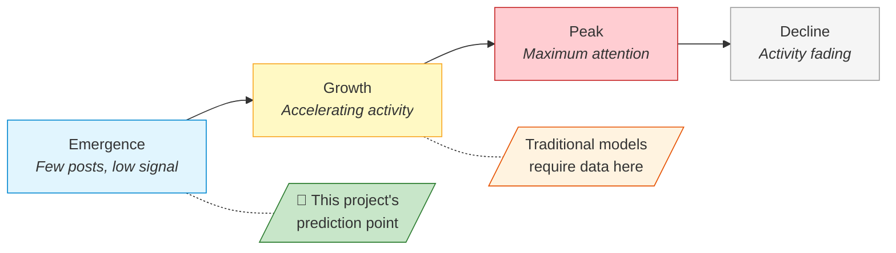

```mermaid
graph LR
    A[Emergence<br/><i>Few posts, low signal</i>] --> B[Growth<br/><i>Accelerating activity</i>]
    B --> C[Peak<br/><i>Maximum attention</i>]
    C --> D[Decline<br/><i>Activity fading</i>]

    A -.- E[/"🎯 This project's<br/>prediction point"/]
    B -.- F[/"Traditional models<br/>require data here"/]

    style A fill:#e1f5fe,stroke:#0288d1
    style B fill:#fff9c4,stroke:#f9a825
    style C fill:#ffcdd2,stroke:#c62828
    style D fill:#f5f5f5,stroke:#9e9e9e
    style E fill:#c8e6c9,stroke:#2e7d32
    style F fill:#fff3e0,stroke:#e65100
```