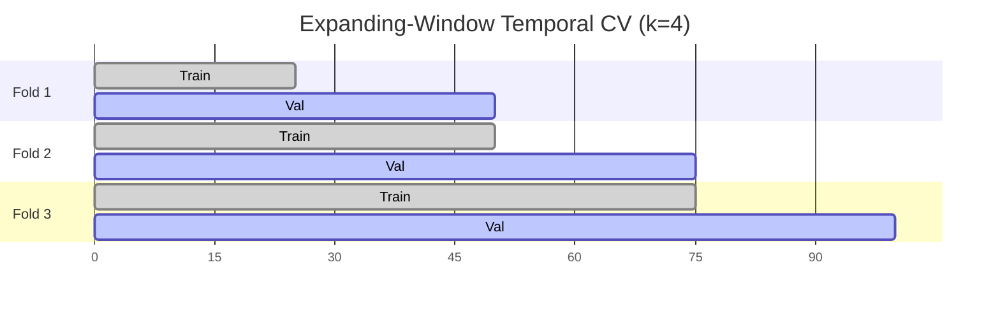

```mermaid
gantt
    title Expanding-Window Temporal CV (k=4)
    dateFormat X
    axisFormat %s

    section Fold 1
    Train     :done, 0, 25
    Val       :active, 25, 50

    section Fold 2
    Train     :done, 0, 50
    Val       :active, 50, 75

    section Fold 3
    Train     :done, 0, 75
    Val       :active, 75, 100
```