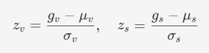
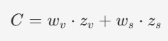
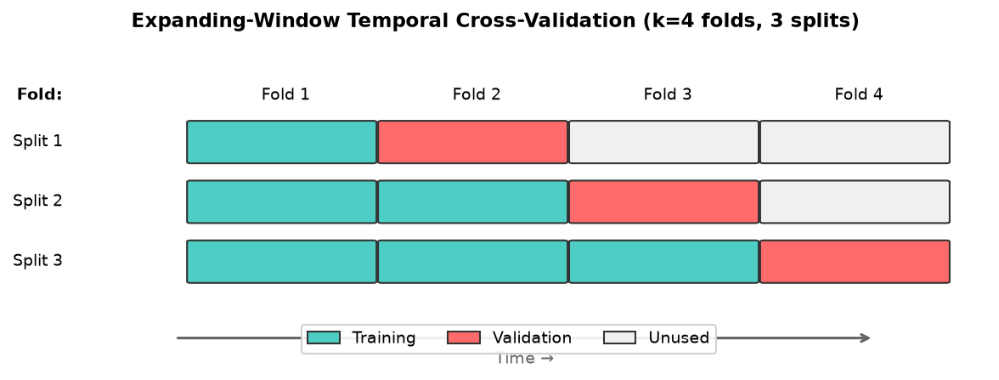
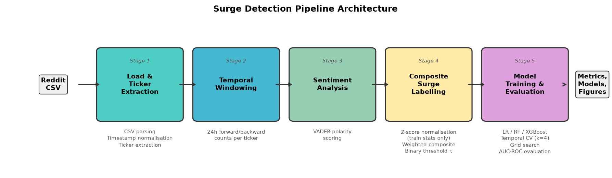
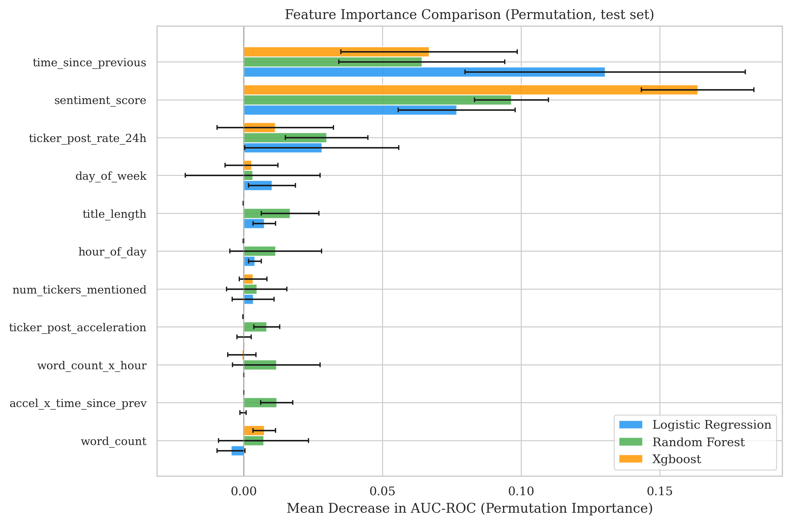
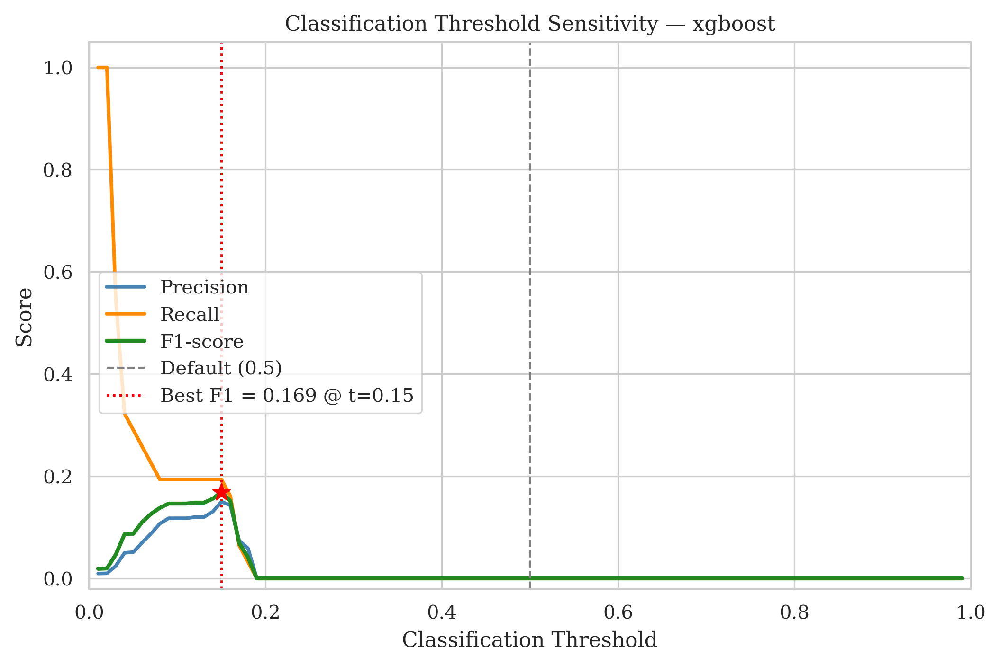

# Prototype Surge Detection Pipeline for Reddit Financial Communities

**Template:** CM3005 Data Science Project Idea: Predictive Modelling of Social Media Trend Emergence

## 1. Project Overview

This project builds a machine learning pipeline to detect emerging attention surges in Reddit penny stock communities. It works with historical submissions from r/wallstreetbets (1.29M posts) and r/pennystocks (80k posts), computing temporal and sentiment features to predict whether a ticker mention marks the beginning of a coordinated spike in community interest.

The pipeline is the project's core deliverable — a complete system from raw data ingestion through model evaluation. It addresses the research question: *Can social media posting patterns predict emerging surge behaviour in penny stock communities, and does incorporating sentiment alongside volume improve detection accuracy?*

## 2. Features Implemented

The pipeline runs in five stages:

1. **Data Loading and Ticker Extraction** — parses Reddit CSV exports, normalises timestamps, and extracts ticker symbols from titles.
2. **Temporal Windowing** — counts posts in configurable forward/backward windows (24h) per ticker.
3. **Sentiment Analysis** — scores each post with VADER to produce polarity values at observation time.
4. **Composite Surge Labelling** — z-score normalises volume and sentiment using training-set statistics only, then combines them into a composite score thresholded at τ for binary classification.
5. **Model Training and Evaluation** — trains three classifiers (Logistic Regression, Random Forest, XGBoost) with expanding-window temporal CV, bootstrap confidence intervals, McNemar's pairwise tests, and threshold tuning.

### 2.1. Prediction Features (11 total)

All 11 ML features are strictly backward-looking — they use only information available at or before the observation timestamp, ruling out temporal leakage:

| # | Feature | Description |
|---|---------|-------------|
| 1 | `sentiment_score` | VADER polarity at observation time |
| 2 | `hour_of_day` | Hour (0–23) of post creation |
| 3 | `day_of_week` | Day (0=Mon–6=Sun) of post creation |
| 4 | `time_since_previous` | Hours since last post mentioning same ticker |
| 5 | `ticker_post_rate_24h` | Backward 24h post count for the ticker |
| 6 | `ticker_post_acceleration` | Ratio of recent-12h to older-12h activity |
| 7 | `word_count` | Token count of title + body text |
| 8 | `title_length` | Token count of title only |
| 9 | `num_tickers_mentioned` | Distinct tickers in the original post |
| 10 | `word_count_x_hour` | Interaction: word_count × hour_of_day |
| 11 | `accel_x_time_since_prev` | Interaction: acceleration × time since previous |

Features 1–9 capture temporal, textual, and community signals. Features 10–11 are interaction terms that model combined effects — long posts at peak hours, or rapid acceleration after a period of silence.

## 3. Algorithms, Techniques and Methods

### 3.1. Composite Surge Metric

The labelling mechanism uses z-score normalisation followed by a weighted composite score. Given a record's volume growth $g_v$ and sentiment change $g_s$, training-partition statistics $\mu_v, \sigma_v, \mu_s, \sigma_s$ produce:

<!-- 
$$z_v = \frac{g_v - \mu_v}{\sigma_v}, \quad z_s = \frac{g_s - \mu_s}{\sigma_s}$$
 -->


These are combined with configurable weights:
<!-- 
$$C = w_v \cdot z_v + w_s \cdot z_s$$
 -->



A record is labelled as a surge if $C > \tau$, where $\tau$ is the threshold parameter (default 1.5). Normalisation statistics come from the training partition only — no test-set information leaks into the labelling process.

### 3.2. Expanding-Window Temporal Cross-Validation

Standard k-fold CV breaks down with time-series data — it lets future information leak into training. Instead, the training data is split into k=4 chronological folds. Each split trains on all preceding folds and validates on the next one, producing 3 expanding-window splits that respect temporal ordering.



*Figure 2: Expanding-window temporal CV scheme. Each split uses all prior folds for training and the next fold for validation, ensuring no future data leaks into training.*

### 3.3. Class Imbalance Handling

Surges are rare — just 1.4% of WSB records and 2.8% of pennystocks. Two mechanisms handle this imbalance: Logistic Regression and Random Forest use `class_weight="balanced"` (inverse frequency weighting), while XGBoost uses `scale_pos_weight` to amplify the minority class's contribution to the loss.

### 3.4. Classification Threshold Tuning

Rather than using the default 0.5 probability threshold, the pipeline sweeps thresholds from 0.01 to 0.99 on a validation fold and picks the operating point that maximises F1-score. This matters because extreme class imbalance makes the default threshold produce near-zero precision.

## 4. Code Explanation

### 4.1. Composite Surge Metric Computation

The labelling code mirrors the math directly: compute μ and σ from training records only, then z-score normalise everything. The leakage boundary is explicit — `train_mask` controls which records contribute to normalisation statistics:

```python
# Step 2: Compute μ/σ from training partition ONLY
train_volume = df.loc[train_mask, "posting_volume_growth"].values.astype(np.float64)
train_sentiment = np.abs(
    df.loc[train_mask, "sentiment_change"].values.astype(np.float64)
)

mu_vol = float(np.mean(train_volume))
sigma_vol = float(np.std(train_volume, ddof=0))  # population std
mu_sent = float(np.mean(train_sentiment))
sigma_sent = float(np.std(train_sentiment, ddof=0))

# Step 3: Z-score normalise ALL records using training stats only
z_volume = _compute_z_scores(all_volume, mu_vol, sigma_vol)
z_sentiment = _compute_z_scores(all_sentiment, mu_sent, sigma_sent)

# Step 4: Composite metric — weighted combination
w1 = config.weight_volume
w2 = config.weight_sentiment
composite = (w1 * z_volume) + (w2 * z_sentiment)

# Step 5: Binary labelling at threshold τ
surge_label = np.where(composite > tau, 1.0, 0.0)
```

This directly implements $C = w_v \cdot z_v + w_s \cdot z_s$ with the label assigned as $\mathbb{1}[C > \tau]$. The `ddof=0` (population standard deviation) is deliberate — the training partition is treated as the full reference population, not a sample from a larger distribution.

### 4.2. Backward-Only Feature Engineering (Leakage Prevention)

The pipeline's key design constraint is that every prediction feature looks only backward — nothing from after observation time $t$ can influence a prediction. The `ticker_post_acceleration` feature shows this most clearly. It computes the ratio of posting activity in the recent 12 hours versus the prior 12 hours, using `searchsorted` on pre-sorted per-ticker timestamps for $O(n \log n)$ computation:

```python
def _compute_ticker_post_acceleration(df, created_utc):
    """acceleration = count_in_(t-12h, t] / max(count_in_(t-24h, t-12h], 1)"""
    for ticker, group in df.groupby("ticker", sort=False):
        idx = group.index.values
        times = epoch_seconds[idx]

        # Count posts in (t-12h, t]: recent activity
        recent_left = np.searchsorted(times, times - _12H_SECONDS, side="right")
        recent_right = np.searchsorted(times, times, side="left")
        count_recent = recent_right - recent_left

        # Count posts in (t-24h, t-12h]: older baseline
        older_left = np.searchsorted(times, times - _24H_SECONDS, side="right")
        older_right = np.searchsorted(times, times - _12H_SECONDS, side="right")
        count_older = older_right - older_left

        # Acceleration = recent / max(older, 1)
        denominator = np.maximum(count_older, 1)
        acceleration = count_recent.astype(np.float64) / denominator.astype(np.float64)
        result[idx] = acceleration
```

Both half-open intervals `(t−12h, t]` and `(t−24h, t−12h]` are bounded by the current timestamp — no future information leaks in. The `side="left"` on `recent_right` ensures the current record excludes itself from its own count. The `max(older, 1)` denominator prevents division-by-zero when a ticker has no history in the 12–24h window, treating silence as a baseline of 1 (so acceleration equals the raw recent count).

### 4.3. Temporal Cross-Validation and Model Training

The training module runs grid search across all hyperparameter sets using the expanding-window splits. For each configuration, it trains on each expanding window and averages validation AUC:

```python
for params in param_grid:
    fold_aucs = []
    for train_idx, val_idx in splits:
        scaler = StandardScaler()
        X_fold_train = scaler.fit_transform(X_train_full[train_idx])
        X_fold_val = scaler.transform(X_train_full[val_idx])

        model = make_model_fn(params, random_seed)
        model.fit(X_fold_train, y_fold_train)

        y_prob = model.predict_proba(X_fold_val)[:, 1]
        auc = roc_auc_score(y_fold_val, y_prob)
        fold_aucs.append(auc)

    mean_auc = np.mean(fold_aucs)
    if mean_auc > best_mean_auc:
        best_mean_auc = mean_auc
        best_params = params
```

The best configuration is then retrained on the full training partition before final test-set evaluation — the model sees all available training data, while hyperparameters were selected without any test-set contamination.

### 4.4. Statistical Evaluation

McNemar's pairwise test compares models at the record level. It builds a 2×2 contingency table of correct/incorrect predictions for each model pair, with Bonferroni correction for multiple comparisons:

```python
# Record-level correct/incorrect comparison
correct_a = (predictions[name_a] == y_true)
correct_b = (predictions[name_b] == y_true)

# Cells: b = A wrong & B right; c = A right & B wrong
b = int(((~correct_a) & correct_b).sum())
c = int((correct_a & (~correct_b)).sum())
```

<div style="page-break-after: always;"></div>

## 5. Results

### 5.1. Pipeline Architecture



*Figure 1: End-to-end pipeline architecture showing the five processing stages from raw Reddit CSV to model evaluation. Each stage produces intermediate outputs for auditability.*

### 5.2. Model Performance

The pipeline was evaluated on two Reddit communities across 14 experiments on 3 machines:

| Dataset | Model | AUC-ROC | Tier |
|---------|-------|---------|------|
| r/wallstreetbets (τ=1.5) | XGBoost | 0.892 | Stretch |
| r/wallstreetbets (τ=1.5) | Random Forest | 0.880 | Stretch |
| r/wallstreetbets (τ=1.0) | XGBoost | 0.862 | Stretch |
| r/wallstreetbets (τ=1.0) | Random Forest | 0.854 | Stretch |
| r/pennystocks (τ=1.5) | Random Forest | 0.753 | Target |
| r/pennystocks (τ=1.5) | XGBoost | 0.734 | Target |

All models significantly outperform the random baseline (AUC=0.50) with p < 0.001 (McNemar's test, Bonferroni-corrected).


*Figure 3: Combined ROC curves for all three models on the r/wallstreetbets test set (experiment A2, τ=1.5). XGBoost (AUC=0.892) and Random Forest (AUC=0.880) both hit the stretch tier (>0.80). The dashed diagonal represents a random classifier.*

### 5.3. Cross-Dataset Transfer

Models trained on WSB and evaluated on pennystocks (D1) achieved AUC 0.684, showing partial generalisability. The reverse transfer (D2: pennystocks→WSB) performed better at AUC 0.871, suggesting patterns learned from the sparse community transfer well to the dense one.

### 5.4. Robustness

Multi-seed experiments (5 seeds: 42, 123, 456, 789, 2024) produced a standard deviation of 0.008, confirming stable results.

### 5.5. Key Finding: Sentiment Improves Detection

Comparing Phase 1 (volume-only) against Phase 2 (composite volume+sentiment) shows sentiment adds +0.182 AUC on WSB, validating the composite approach. A weight sensitivity sweep confirmed that balanced 50/50 weighting works best.

> **Note:** Additional figures (threshold sensitivity plots per model) are stored in `output/figures/evaluation/` and included on following pages.


*Figure 4: Confusion matrix for XGBoost on r/wallstreetbets (experiment A2). The extreme class imbalance is visible — surges represent only 1.4% of test records, making precision inherently challenging despite strong AUC-ROC.*



*Figure 5: Permutation-based feature importance across all three models. `ticker_post_rate_24h` dominates for tree-based models, while Logistic Regression distributes weight more evenly across temporal features.*



*Figure 6: Classification threshold sensitivity for XGBoost on r/wallstreetbets. Precision and recall trade off sharply — the tuned threshold (0.85) sacrifices recall to achieve practical precision, while the default (0.5) produces near-zero precision due to extreme class imbalance.*

## 6. Evaluation and Improvements

### 6.1. Successes

The prototype hits the project's "stretch" success criterion (AUC > 0.80) on r/wallstreetbets with both XGBoost (0.892) and Random Forest (0.880). Threshold tuning proves essential: for XGBoost, moving from the default 0.5 to the tuned 0.85 raises precision from 4.3% to 21.7% — a fivefold improvement — while F1 improves from 0.081 to 0.226. The pipeline is fully reproducible through configuration serialisation, fixed seeds, and timestamped outputs, enabling exact replication of any experiment across machines.

Cross-dataset transfer tells an interesting story: a model trained on the smaller r/pennystocks (80k records) scores AUC 0.871 on WSB — only 0.021 below in-domain performance. Surge patterns from sparse communities apparently generalise well to dense ones, which is promising for bootstrapping detectors in new communities with limited data.

### 6.2. Limitations

#### 6.2.1. Precision Remains Impractical Despite Strong AUC

The extreme class imbalance (1.4% surge rate on WSB) means that even at the tuned threshold of 0.85, XGBoost produces 565 false positives for every 157 true positives — a positive predictive value of only 21.7%. In practice, roughly 4 out of 5 flagged posts would be false alarms. That's substantially better than the default threshold (12,296 false positives alongside 547 true positives, yielding 4.3% precision), but still too noisy for an unmonitored alert system. The confusion matrix shows the core tension: at 0.85, the model catches only 157 of 668 actual surges (23.5% recall), meaning 76.5% of genuine surges go undetected just to maintain this modest precision.

#### 6.2.2. VADER Misreads Financial Community Language

VADER was designed for general social media sentiment, and it systematically gets WSB-specific language wrong. Two failure modes stand out:

- **Bullish language scored as negative:** The post *"DNUT. Rocket is leaving soon, no shares left to buy because of mandatory diamond hands"* — a textbook bullish WSB post using community slang ("rocket", "diamond hands") — gets a VADER score of −0.97, near the floor of the scale. VADER reads "no shares left to buy" as negative, but the community meaning is supply exhaustion signalling a price increase.
- **Neutral scores for price-action posts:** Posts like *"DWAC is now a buy"* and *"DWACW up 488% / DWAC up 26% premarket"* both get VADER scores of exactly 0.0. These are clearly high-conviction bullish posts that signal early community attention — exactly the surges the system aims to detect — yet VADER assigns no sentiment signal because they contain no lexicon-matched terms.

Here's what's strange: despite these failures, `sentiment_score` is XGBoost's most important feature (permutation importance 0.203, more than 3× the next feature `ticker_post_rate_24h` at 0.067). The model appears to exploit VADER's systematic biases as a proxy — strongly negative VADER scores correlate with WSB-specific language ("rocket", "moon", "diamond hands", "tendies"), which in turn correlates with surges. VADER's miscalibration accidentally becomes a community-language detector. It works, but it's fragile and unlikely to transfer to communities with different slang.

#### 6.2.3. Asymmetric Cross-Domain Transfer

Transfer from WSB-trained models to pennystocks (D1: AUC 0.684) degrades substantially more than the reverse (D2: AUC 0.871). The asymmetry suggests r/wallstreetbets contains community-specific patterns — rapid-fire meme posting, extreme language, coordinated pump behaviour — that don't appear in the more measured r/pennystocks community. The D1 model encounters surge patterns it never learned: smaller, slower-building attention waves typical of a community with 16× fewer posts.

### 6.3. Improvements Addressing Observed Failure Modes

#### 6.3.1. Domain-Specific Sentiment (addresses Limitation 6.2.2)

Replace VADER with a financial sentiment model like FinBERT, or build a custom lexicon that incorporates WSB terminology. The prediction examples show that correctly scoring "rocket is leaving soon" as bullish (+0.8 instead of −0.97) and "DWAC up 488%" as strongly bullish (+0.9 instead of 0.0) would give the model a genuine sentiment signal rather than a noisy proxy. Given that `sentiment_score` already dominates feature importance despite systematic miscalibration, a model receiving accurate sentiment could plausibly improve both precision and recall.

#### 6.3.2. Threshold Tuning as a First-Class Pipeline Stage (addresses Limitation 6.2.1)

The experiments show that threshold tuning improves XGBoost F1 from 0.081 to 0.226 (+0.145). However, the tuned threshold was selected on a single validation fold. A more robust approach would perform threshold selection across the full expanding-window CV, picking the operating point that maximises a user-specified metric (F1, precision-at-recall-k, or a cost-weighted combination). This should be configurable per deployment: a human-in-the-loop system can tolerate lower precision (favouring recall at threshold ~0.3), while an automated alert system needs higher precision (threshold ~0.9).

#### 6.3.3. Community-Adaptive Features (addresses Limitation 6.2.3)

The cross-dataset transfer gap points to the need for features that adapt to community characteristics. Candidates include: normalised post rate (ticker posts relative to subreddit daily baseline), cross-ticker momentum (fraction of active tickers experiencing simultaneous acceleration), and community participation breadth (unique authors posting about a ticker in the backward window). These would make surge detection relative to community norms rather than absolute thresholds, improving transfer between communities of different sizes and activity levels.

#### 6.3.4. Real-Time Streaming Inference

The batch pipeline processes historical data retrospectively. Extending to streaming Reddit data (via the Reddit API or Pushshift) would enable live early-warning alerts. The backward-only feature design already ensures compatibility with streaming — all 11 features can be computed from data available at observation time. The main engineering challenge is maintaining efficient per-ticker state (rolling windows, last-post timestamps) across a high-throughput event stream.
