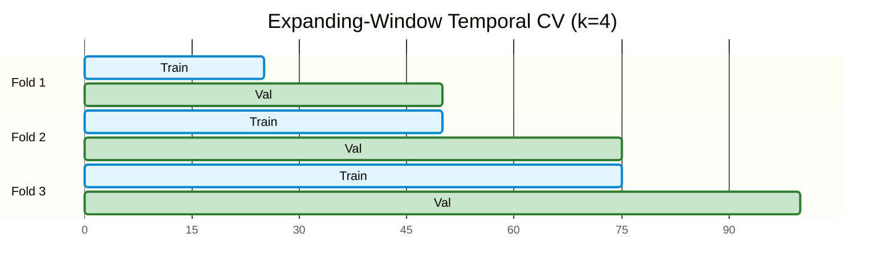

```mermaid
%%{init: {'theme': 'base', 'themeVariables': {
    'taskBkgColor': '#e1f5fe',
    'taskBorderColor': '#0288d1',
    'activeTaskBkgColor': '#c8e6c9',
    'activeTaskBorderColor': '#2e7d32',
    'doneTaskBkgColor': '#e1f5fe',
    'doneTaskBorderColor': '#0288d1',
    'critBkgColor': '#ffcdd2',
    'critBorderColor': '#c62828',
    'gridColor': '#9e9e9e',
    'todayLineColor': '#e65100',
    'sectionBkgColor': '#fff9c4',
    'altSectionBkgColor': '#fff3e0',
    'taskTextColor': '#000000',
    'taskTextDarkColor': '#000000'
}}}%%
gantt
    title Expanding-Window Temporal CV (k=4)
    dateFormat X
    axisFormat %s

    section Fold 1
    Train     :done, 0, 25
    Val       :active, 25, 50

    section Fold 2
    Train     :done, 0, 50
    Val       :active, 50, 75

    section Fold 3
    Train     :done, 0, 75
    Val       :active, 75, 100
```
