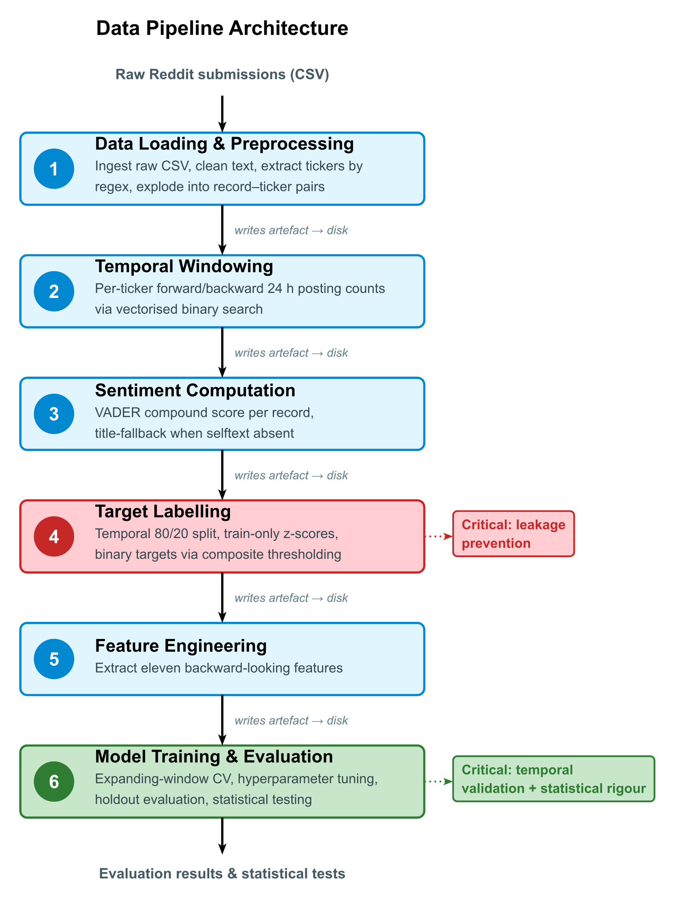
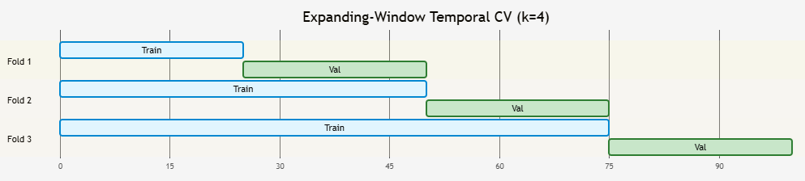

---
# pandoc-crossref configuration (auto-numbering for tables, figures, sections)
figureTitle: "Figure"
tableTitle: "Table"
listingTitle: "Listing"
figPrefix: "Figure"
tblPrefix: "Table"
lstPrefix: "Listing"
secPrefix: "Section"
numberSections: true
linkReferences: true
nameInLink: true

# bibliography configuration (automatic citation numbering + reference list).
# NOTE: the `bibliography:` metadata key is intentionally NOT set here. Setting it
# makes the Pandoc Typst template append its own untitled #bibliography at the very
# end of the document, which renders as an empty "Bibliography" section after the
# Appendix. Instead the reference list is placed explicitly under the "# References"
# heading via a raw #bibliography(...) block (see sec:ref). Typst resolves every
# @key citation against that single call, so numbering and the list stay automatic.
link-citations: true
---

```{=typst}
// Page setup — ACM-style margins and font
#set page(margin: 2.54cm)
#set text(font: "Times New Roman", size: 11pt)
#set par(justify: true, leading: 0.55em)

// Heading styles
#show heading.where(level: 1): it => {
  set text(size: 14.4pt, weight: "bold")
  set align(left)
  v(0.5cm)
  it
  v(0.3cm)
}

#show heading.where(level: 2): set text(size: 12pt, weight: "bold")
#show heading.where(level: 3): set text(size: 11pt, weight: "bold", style: "italic")

// Caption handling: pandoc-crossref already writes "Table N:" / "Figure N:" into
// the caption text, so suppress Typst's own automatic figure prefix to avoid
// doubling (e.g. "Table 1: Table 1: ...").
#show figure.caption: it => it.body
#show figure: set figure(supplement: none, numbering: none)

// Table styling
#show figure.where(kind: table): set block(breakable: true)

#show table: set table(
  stroke: (x, y) => (
    top: if y == 0 { 0.4pt + rgb("#eeeeee") } else { none },
    bottom: if y == 0 { 1pt + rgb("#cccccc") } else { 0.4pt + rgb("#eeeeee") },
    left: if x > 0 { 0.4pt + rgb("#f0f0f0") } else { none },
    right: if x < 1 { 0.4pt + rgb("#f0f0f0") } else { none }
  ),
  fill: (col, row) => if row == 0 { rgb("#fafafa") } else { none },
  inset: 7pt,
  align: (col, row) => left + horizon
)

// Code block styling
#show raw.where(block: true): it => block(
  stroke: 0.5pt + rgb("#cccccc"),
  radius: 4pt,
  inset: 10pt,
  fill: rgb("#fcfcfc"),
  width: 100%,
  it
)
```

```{=typst}
#align(center)[
  #text(size: 17pt, weight: "bold")[
    Predicting Volume and Sentiment Surges in Reddit Financial Communities Using Machine Learning
  ]
  #v(0.3cm)
  #text(size: 14pt, weight: "bold")[\*\*\*]
]
#v(0.6cm)
```

```{=typst}
#pagebreak()
#outline(depth: 2, indent: auto)
#pagebreak()
```

---

# Introduction

## Background and Context {#sec:background}

This project adapts the template of **CM3005 Data Science** (Predictive Modelling of Social Media Trend Emergence) to financial forums. On social media, a trend takes off when crowd attention suddenly converges on a specific topic or entity. This dynamic is especially intense in stock-market communities, where an obscure ticker can explode in popularity overnight, often signalling unusual trading activity before it happens [@long2023stock]. Yet most current tracking tools only flag a trend once it is already widespread, by which point the chance to analyse, act on, or moderate the movement has usually passed. Anticipating these shifts before they peak is far more valuable than confirming them afterwards, but also harder, because it means recognising subtle patterns before the main surge arrives.

Turning that objective into a concrete task requires deciding both where to look and exactly what to predict. It focuses on Reddit's financial communities, which uniquely combine public, archived, timestamped discussions tied to named stock tickers, so activity can be tracked at the level of an individual asset rather than the market wide. The core problem then comes down to this: given what a community has said about a ticker up to a given moment, *can we predict an imminent spike in its discussion?* Framed as a supervised classification task, the project forecasts short-term surges in ticker discussion before they peak.

## Problem Statement and User Needs {#sec:problem-motivation}

What makes this prediction worth attempting is also what makes it hard. These spikes stem from earnings surprises, speculative momentum, or organized retail activity. Because they unfold over mere hours across thousands of daily tickers, manual tracking is nearly impossible.

This tension motivates the central **research question**: *can a social-media surge be predicted before it happens from early discussion patterns alone?* The answer matters to three user groups. **Market surveillance and compliance teams** would prioritise which tickers warrant investigation for unusual or potentially coordinated activity [@finra2025socialmedia]. **Quantitative researchers** would select a small set of tickers for deeper financial and textual analysis. **Platform moderators** would position monitoring capacity before discussion spikes. Across all three the system is a *prioritisation tool* that reduces a large candidate universe to a reviewable shortlist, not an autonomous decision-maker [@fawcett2006roc]. Their error tolerances differ, however: surveillance and moderation need broad coverage (high recall), whereas research can accept a smaller, higher-precision shortlist. These differing needs are formalised as acceptance criteria in [@sec:operational-criteria] and tested in [@sec:operational-precision].

Beneath these differences lies one structural problem common to all three: candidate tickers vastly outnumber the capacity to review them, and surges develop faster than manual monitoring can react. [@tbl:pain-points] sets out the specific pain point each group faces and why current practice falls short.

| User group | Pain point | Current workaround and its limit |
|----------|----------------------|--------------------------|
| Market surveillance / compliance | Thousands of tickers are discussed daily; potentially coordinated or unusual activity must be triaged, but surges develop too fast for manual review [@finra2025socialmedia] | Rule-based volume alerts (e.g. $+2\sigma$) miss non-linear, multi-signal precursors and cannot rank candidates by likelihood |
| Quantitative researchers | A small set of tickers must be selected for deeper analysis from a large, noisy universe | Manual scanning is slow, subjective, and tends to surface tickers only after they have already become prominent |
| Platform moderators | Monitoring and moderation capacity must be positioned *before* discussion spikes, not after | Reactive moderation begins once a spike is already underway, when intervention is hardest |

: End-user pain points and the shortcomings of current practice. {#tbl:pain-points}

The shared need is therefore an *early, ranked shortlist* that compresses the candidate universe into a reviewable queue, leaving causal judgement and action to the human reviewer. This motivates the discrete, rankable target in [@sec:surge-definition] and the throughput-derived criteria in [@sec:operational-criteria].

Meeting this need is not straightforward. Simple volume rules (e.g. $+2\sigma$) cannot capture non-linear signal interactions or rank candidates, and prior work has mostly targeted adjacent questions such as eventual reach or price movement, not short-term spikes in per-ticker discussion (Section 2). This project therefore takes a learning-based approach, integrating temporal, textual, and sentiment signals into one predictive framework.

## Aim, Objectives and Contributions {#sec:aim}

To answer this question, the **aim** is to build and rigorously evaluate a system predicting per-ticker Reddit surges over a 24-hour horizon from only backward-looking features available at observation time. Three objectives, each with an explicit success test, follow ([@tbl:objectives]).

| # | Objective | - | Success test |
|---|-----|-------------|-------------|
| O1 | **Predict surges** | Build a model from early-stage discussion features (temporal, activity, sentiment) that forecasts surges before they occur | Model clears the target AUC-ROC tier ([@tbl:success-tiers]) on held-out future data |
| O2 | **Compare approaches** | Establish whether more complex models improve prediction over simpler baselines | Model differences are quantified with uncertainty and significance ([@sec:statistical-validation]) |
| O3 | **Validate temporally** | Establish whether predictions hold on unseen future periods under leakage-free evaluation | No feature, label, or statistic draws on future data, and results are reported on a chronological holdout ([@sec:eval-objectives]) |

: Project objectives and their success tests. {#tbl:objectives}

The **contributions** are a leakage-free forecasting methodology, a composite volume-and-sentiment surge metric, and evidence that data density constrains performance more than model complexity (Section 6).

## Prediction Target {#sec:prediction-target}

The template uses "trend emergence," but trends can be gradual and sustained, making them hard to label objectively. This project instead targets *surges*: significant short-term spikes in both **posting volume** and **sentiment intensity** for a ticker **within a 24-hour window**, captured by a composite metric combining normalised volume growth with sentiment-shift magnitude ([@sec:surge-definition]). Because surges are discrete and quantifiable, prediction becomes binary classification. The target uses timestamped post volume, not post-hoc engagement metrics like upvotes (which introduce look-ahead bias), with z-scores computed from training statistics alone to prevent leakage. The underlying hypothesis is that backward-looking signal suffices to discriminate surges from baseline activity, and that performance scales with data density rather than model complexity.

## Study Scope and Exclusions

The study evaluates binary surge classification on two archival 2021 Reddit datasets, `r/pennystocks` and `r/wallstreetbets` (hereafter **WSB**), chosen as sparse and dense communities. Three classifiers, Logistic Regression (**LR**), Random Forest (**RF**), and XGBoost (**XGB**), are trained on backward-looking features and evaluated on a chronological holdout with expanding-window cross-validation, bootstrap intervals, McNemar's tests, single-feature baselines, and cross-dataset transfer, under a deterministic, seeded pipeline.

Excluded from scope: real-time ingestion and production deployment; user behaviours, comment networks, and cross-platform channels; multi-class or regression targets; and trading signals, financial advice, or causal claims about market impact.

## Assumptions {#sec:assumptions}

The project's conclusions hold under the explicit assumptions in [@tbl:assumptions], ordered from strongest to weakest. Stating them clarifies the boundary conditions for interpreting the results and signals where the analysis is most exposed.

| # | Assumption | Basis and where addressed |
|---|--------------------|-------------------|
| 1 | Human-in-the-loop deployment: the system prioritises candidates for a reviewer, not autonomous action | Underpins the acceptance criteria ([@sec:operational-criteria]); automation would need far higher precision and calibration |
| 2 | Bounded analyst throughput of ~20–30 flagged tickers per day | Anchors the daily-alert-volume criterion; a different capacity shifts the operating point, not the model |
| 3 | Ticker mentions proxy genuine discussion of a stock | Stopword-filtered regex extraction ([@sec:feature-engineering]) trades precision for recall, accepting minor mention noise |
| 4 | A 24-hour horizon is operationally relevant | Design choice aligned to the daily cycle, not an optimised horizon; multi-scale alternatives are future work ([@sec:proposed-improvements]) |
| 5 | Backward-looking signal is sufficient, and performance scales with data density over model complexity | The core hypothesis, tested directly in [@sec:eval-objectives] |
| 6 | The 2021 archive is informative beyond its window | Weakest assumption; treated as a limitation ([@sec:proposed-improvements]) and in the conclusion |
| 7 | Public forum text is usable in aggregate | Records are public submissions, analysed at ticker level with no individual user identification |
| 8 | Static, complete, well-ordered input data | Features and frozen statistics assume gap-free, chronologically ordered input with a stable schema, as in the archival dataset; a production stream (missing or late posts, schema drift, vocabulary shift) would require re-ingestion safeguards and periodic recalibration ([@sec:temporal-stability]) |

: Explicit project assumptions and where each is addressed. {#tbl:assumptions}

## Report Structure

Section 2 reviews the literature on online attention prediction, financial sentiment, and Reddit-specific research. Section 3 details the design: data selection, data preprocessing, surge definition, feature engineering, model selection, and temporal validation. Section 4 describes implementation. Section 5 presents results, statistical validation, critical analysis, and limitations. Section 6 concludes with key findings and future directions.

---

# Literature Review

## The Predictability of Online Attention

Trend prediction spans many methods, from sequence and graph models to trajectory forecasting; this review focuses on the strand nearest to the project, supervised tabular classification from hand-crafted features. The sources reviewed here ([@sec:ref]) were selected because they directly inform the decisions this project makes: *what to predict* (popularity and surge-onset literature), *what signals to use* (sentiment and content features), *how to model* (classifier families and their trade-offs), and *how to evaluate rigorously* (temporal validation methods). A further strand, Reddit-specific financial research, confirms that this platform contains distinct, predictable signals.

The foundational question underlying this project, *can future surges in social media activity be predicted?*, was first addressed through research on **online popularity prediction**. This literature demonstrated that online attention is not random: *content that attracts early engagement tends to attract more, following patterns that are statistically detectable*.

Szabo and Huberman [@szabo2010predicting] produced the seminal result in this domain, demonstrating strong linear correlations between early and later popularity on YouTube and Digg. Their regression model showed that a content item's view count at time *t* predicts its eventual popularity with high accuracy. This established the core principle: early behavioural signals carry predictive information about future attention. However, because the model assumes a stationary growth process, it requires content to have already accumulated measurable engagement before prediction becomes possible. It cannot forecast at or near the time of posting.

Lerman and Hogg [@lerman2010social] extended this understanding by modelling the interaction between social network structure and content discovery, demonstrating that popularity depends on behavioural dynamics beyond simple cumulative counts. Their agent-based approach revealed that network position and user browsing patterns mediate how content gains visibility. Wang and Huberman [@wang2013quantifying] and Kong et al. [@kong2014predicting] further characterised online attention as following identifiable temporal lifecycles (emergence, growth, peak, and decline), suggesting that content at different lifecycle stages exhibits different observable signatures. Kong et al. [@kong2014predicting] specifically addressed *burst* detection for hashtags in real-time, but their approach operates at the hashtag level with contemporaneous features. It detects bursts as they happen rather than predicting them before onset, and works at a platform-wide granularity rather than per-entity (ticker) level.

The academic consensus that emerged from this first wave of research can be summarised as: *online attention is predictable from early signals, follows lifecycle dynamics, and is mediated by platform-specific network effects*. However, these models all require content to have already gained some traction before prediction is possible, and they target *eventual* popularity rather than the *onset* of rapid growth. Furthermore, a key tension exists within these findings: Szabo and Huberman [@szabo2010predicting] show that early popularity strongly predicts final outcome, yet Cheng et al. [@cheng2014cascades] later found that cascade prediction accuracy plateaus after the initial phase. This suggests that predictability diminishes once content leaves the emergence stage, which is precisely the window this project targets.

![Online attention lifecycle model [@wang2013quantifying; @kong2014predicting]. Traditional popularity prediction requires content to have reached the growth phase before forecasting is possible. This project targets the emergence phase, predicting a surge before substantial engagement has accumulated.](figures/1-online-attention-lifecycle-model.png){#fig:lifecycle}

## The Shift Toward Pre-Engagement Prediction

A second wave of research addressed the limitation that early popularity models require existing engagement data. Bandari et al. [@bandari2012pulse] demonstrated that content metadata such as source, category, subjectivity, and named entities could predict popularity before engagement accumulates, achieving approximately 84% classification accuracy on news articles. This represented a key methodological shift: prediction could occur at or before publication rather than requiring an observation period.

Cheng et al. [@cheng2014cascades] achieved approximately 79.5% accuracy (AUC = 0.877) predicting whether Facebook photo cascades would double in size, using temporal features derived from early propagation speed and structural virality metrics. Their findings showed that the *rate* of initial spread, rather than its magnitude, carries predictive signal for sustained growth. Yuan and Li [@yuan2019forecasting] extended this principle across information diffusion contexts, showing that early-stage propagation patterns contain sufficient signal to forecast long-term diffusion trajectory.

This body of work established a second consensus: prediction is achievable before substantial engagement accumulates, provided features capture content characteristics or early propagation dynamics. However, the prediction targets remained eventual outcomes, such as final popularity or total cascade size, rather than *rapid onset* within a bounded time window. For example, an analyst monitoring a financial forum needs to know whether discussion will surge within the subsequent 24 hours, not whether it will eventually become popular. This temporal distinction represents a key unaddressed gap.

Taken together, the two waves point to a small set of signal families with predictive value, but the evidence for each is uneven and not all of them are usable under this project's leakage constraint. [@tbl:signal-families] synthesises which signals prior work supports, how strong that evidence is, and which are admissible here (available strictly before the surge, computed from backward-looking data only).

| Signal family | Evidence from prior work | Strength | Fit for this project |
|------------|----------------------------|---------|------------------------|
| Volume / activity rate | Early view and post counts predict later attention [@szabo2010predicting; @long2023stock] | Strong | Included as backward-looking counts ([@sec:feature-engineering]) |
| Growth / acceleration | Early *rate* of spread predicts sustained growth better than magnitude [@cheng2014cascades; @yuan2019forecasting] | Strong | Included as lagged growth and acceleration features |
| Content metadata | Source, category, named entities predict popularity pre-engagement [@bandari2012pulse] | Moderate | Partially included (word/title counts, ticker counts) |
| Sentiment | Aggregate social sentiment informs financial forecasting [@bollen2011twitter] | Moderate | Included as sentiment level and change ([@sec:sentiment-contribution]) |
| Network / diffusion structure | Network position and reshare structure mediate visibility [@lerman2010social; @cheng2014cascades] | Moderate | Excluded: requires cross-user graph data outside the per-ticker, per-post scope |
| Post-hoc engagement (upvotes, comments) | Correlates with popularity but accumulates *after* posting [@szabo2010predicting] | Strong but unusable | Excluded: future information, would leak the target ([@sec:surge-definition]) |

: Predictive signal families, the strength of prior evidence, and their admissibility under this project's backward-looking constraint. {#tbl:signal-families}

## Sentiment as a Predictive Signal in Finance

Alongside popularity research, computational finance studies established that collective social media sentiment carries measurable predictive information. Bollen et al. [@bollen2011twitter] demonstrated that aggregate Twitter mood, particularly the "Calm" dimension measured by the Google-Profile of Mood States (GPOMS), predicted Dow Jones movements with about 87% directional accuracy. Although limited by a short evaluation window, missing out-of-sample testing, and an unclear causal mechanism, their study proved pivotal in establishing that **social media textual sentiment can inform financial forecasting**.

The tools used for sentiment extraction have evolved alongside this finding. General-purpose lexicons like OpinionFinder lack domain specificity for financial language, where terms like "short," "bearish," or "moon" carry specialised meaning. To better capture online discourse, Hutto and Gilbert [@hutto2014vader] developed VADER specifically for social media text, incorporating rules for punctuation emphasis, capitalisation, degree modifiers, and negation, and achieving F1=0.96 on social media benchmarks. Araci [@araci2019finbert] later introduced FinBERT, a transformer model fine-tuned on financial corpora, capturing contextual meaning that rule-based tools miss. This progression from general lexicons, to social-media rules, to domain-specific deep learning highlights the field's consensus that sentiment analysis tools must be tailored to their specific domain.

For this project, the key takeaway is that sentiment *change*, rather than absolute sentiment value, may serve as a leading indicator of activity surges: if a ticker's discussion becomes markedly more emotional before volume escalates, sentiment shift could provide an early warning signal. This motivates including sentiment change magnitude in the composite surge metric.

| Tool | Type | Domain | Strengths | Limitations for This Project |
|----------|----------|--------|---------------|--------------|
| OpinionFinder as used in [@bollen2011twitter] | Lexicon | General | Early adoption, widely cited | No social media conventions, no financial terms |
| VADER [@hutto2014vader] | Rule-based | Social media | Handles capitalisation, emoticons, negation; F1=0.96 | No financial domain tuning ("short," "moon" mis-scored) |
| FinBERT [@araci2019finbert] | Transformer | Financial text | Context-aware, domain-specific | Computationally expensive for 1M+ records |

: Evolution of sentiment analysis tools relevant to financial social media. {#tbl:sentiment-tools}

## Modelling Approaches for Attention Prediction {#sec:modelling-review}

How the prediction problem is *framed* varies across the literature, and the framing dictates the model family. Szabo and Huberman [@szabo2010predicting] treat it as regression onto a continuous future count; Bandari et al. [@bandari2012pulse] and Cheng et al. [@cheng2014cascades] frame it as classification into popularity or cascade-growth classes; Kong et al. [@kong2014predicting] and Yuan and Li [@yuan2019forecasting] adopt time-series or diffusion-trajectory formulations. Because this project predicts a discrete event, namely whether a surge occurs within a fixed window, binary classification is the natural framing, aligning it with the Bandari and Cheng strand rather than with continuous forecasting.

Within classification, prior work spans a complexity spectrum. Linear and regression models [@szabo2010predicting; @bandari2012pulse] are interpretable and cheap to fit, but assume roughly additive effects and can underfit interacting signals. Tree ensembles occupy the middle ground: bagging (Random Forest) averages independent trees to reduce variance, which is robust when positives are scarce, while boosting (gradient-boosted trees) fits residual errors sequentially and typically leads on structured tabular data when enough labelled examples exist. Fernández-Delgado et al. [@fernandezdelgado2014classifiers] found, across 121 datasets, that ensemble tree methods are consistently among the strongest general-purpose tabular classifiers, while also cautioning that no single family dominates and that evaluation methodology materially affects the ranking. Deep sequence models (e.g. the recurrent approaches implicit in trajectory work [@kong2014predicting; @yuan2019forecasting]) can capture richer temporal structure but demand large labelled datasets and sacrifice interpretability, which is ill-suited to a sparse, highly imbalanced surge target where reviewers must be able to inspect why a ticker was flagged.

Two implications follow for this project. First, an interpretable linear model (Logistic Regression) is the appropriate baseline: if it performs well, the surge signal is largely additive; if a more complex model beats it, the margin quantifies what non-linear structure is worth. Second, tree ensembles (Random Forest and XGBoost) are the natural improved models, spanning the bagging/boosting contrast and letting the project test *empirically* whether added complexity pays off under scarce positives, rather than assuming the most complex model is best. These choices are set out in [@sec:model-selection] and the complexity-versus-data-density question is examined directly in [@sec:complexity-density].

## Financial Discussion on Reddit

While the preceding research established foundational principles on platforms like YouTube, Digg, Facebook, and Twitter, recent studies examine whether these dynamics hold within Reddit's financial communities and how their unique structural features alter information flow.

Penny stocks (low-capitalisation equities trading below $5) occupy a distinctive position because their low liquidity and limited analyst coverage mean that social media discussion can constitute a disproportionate share of available information [@long2023stock; @costola2022selfinduced]. Unlike Twitter's ephemeral broadcast environment, Reddit's subreddit structure creates concentrated communities with persistent threads and shared behavioural norms.

Long et al. [@long2023stock] demonstrated that `WSB` posting volume correlated with abnormal trading volume and returns for discussed stocks, with effects concentrated in small-cap equities. Their analysis showed that increased Reddit attention *preceded* trading activity in their sample, suggesting that discussion patterns carry predictive signal rather than merely reflecting market events. Costola et al. [@costola2022selfinduced] examined the GameStop episode specifically, finding that consensus formation within `WSB` followed measurable patterns in posting frequency and sentiment alignment *before* reaching critical mass. A small number of committed users drove broader engagement through detectable temporal signatures. Extending this to security manipulation, Mancini et al. [@mancini2024pumpdump] constructed predictive models using the textual and temporal properties of forum posts. Their work confirmed that forum-derived text features significantly outperform chance baselines in forecasting anomalous stock activity.

These studies confirm that Reddit financial communities produce predictive signals, yet prior work exclusively targets market outcomes such as returns, volume, or manipulation, rather than platform dynamics. Notably, these findings align with general literature: Costola et al.'s consensus patterns [@costola2022selfinduced] reflect Lerman and Hogg's network discovery dynamics [@lerman2010social], while Long et al.'s temporal precedence [@long2023stock] echoes Cheng et al.'s early speed metrics [@cheng2014cascades]. However, predicting whether the discussion itself will rapidly escalate, that is, forecasting an imminent surge in posting volume, remains an open challenge. Addressing this gap is the central focus of this paper.

## Methodological Weaknesses in Prior Work {#sec:methodological-weaknesses}

Beyond the substantive gaps identified above, a critical methodological pattern cuts across the literature: a recurring absence of rigorous temporal evaluation protocols.

This pattern recurs across the reviewed studies, as [@tbl:temporal-practices] catalogues: same-period evaluation, random train-test splits, random cascade sampling, and full-dataset correlation all break chronological ordering, allowing each model to be tested on data that would not have existed at prediction time.

This methodological oversight is significant because Tashman [@tashman2000outofsample] demonstrated that rolling-origin evaluation, where the forecasting origin advances forward through time, produces far more reliable accuracy estimates for temporal prediction tasks than fixed or random splits. Furthermore, Bergmeir and Benítez [@bergmeir2012crossvalidation] showed empirically that random cross-validation overestimates predictive accuracy on time-dependent data, and recommended blocked or expanding-window schemes that preserve temporal ordering. Despite established best practices in time-series forecasting, they remain largely unadopted in social media prediction research.

Consequently, reported performance figures across the reviewed studies may be inflated by temporal leakage, and it remains uncertain whether models would generalise to genuinely unseen future periods. For any system intended for real-world deployment, including surge detection, this is a critical deficiency. As Fernández-Delgado et al. [@fernandezdelgado2014classifiers] noted in their large-scale classifier benchmark, evaluation methodology substantially affects reported performance rankings, reinforcing that how a model is evaluated matters as much as which model is selected.

| Study | Evaluation Method | Temporal Ordering Preserved? | Specific flaw | Leakage Risk |
|---------------|----------------|-----------|----------------------|---------|
| Szabo & Huberman [@szabo2010predicting] | Same-period evaluation | No | Train and test drawn from the same period | High |
| Bandari et al. [@bandari2012pulse] | Random train-test split | No | Tests on articles published before some training data | High |
| Bollen et al. [@bollen2011twitter] | Fixed holdout (1 month) | Partial | Short window, no out-of-sample testing | Medium |
| Cheng et al. [@cheng2014cascades] | Random cascade sampling | No | Cascades sampled without preserving time order | High |
| Long et al. [@long2023stock] | Full-dataset correlation | No | No test of generalisation to later periods | High |
| Costola et al. [@costola2022selfinduced] | Full-dataset analysis | No | No test of generalisation to later periods | High |
| Mancini et al. [@mancini2024pumpdump] | Chronological split | Partial | Partial ordering; limited holdout | Medium |

: Temporal evaluation practices across reviewed studies, with the specific flaw each introduces. {#tbl:temporal-practices}

## Research Gap and Project Position {#sec:research-gap}

The literature reviewed above establishes four cumulative findings:

- Early behavioural signals predict future online attention [@szabo2010predicting; @cheng2014cascades]
- Prediction is possible before engagement accumulates, using content and propagation features [@bandari2012pulse; @cheng2014cascades; @yuan2019forecasting]
- Sentiment extracted from social media carries predictive value in financial contexts [@bollen2011twitter; @hutto2014vader]
- Reddit financial communities generate measurable signals that precede market activity [@long2023stock; @costola2022selfinduced; @mancini2024pumpdump]

Against these findings, four key gaps remain unaddressed, each of which this project targets directly ([@tbl:research-gaps]).

| # | Gap | What prior work lacks | How this project addresses it |
|---|---------|-----------------------------|--------------------|
| 1 | Prediction target | Studies predict *eventual outcomes* (total popularity, cascade size, market returns), not the *onset* of rapid growth in a bounded window; no formulation for a composite volume-and-sentiment surge per entity | Composite surge metric defines a binary onset target within a strict 24-hour window ([@sec:surge-definition]) |
| 2 | Signal integration | Each strand shows one feature category in isolation, temporal [@szabo2010predicting], content [@bandari2012pulse], sentiment [@bollen2011twitter], structural [@cheng2014cascades], with little empirical integration, despite evidence they interact [@lerman2010social; @kong2014predicting] | Feature set combines temporal, activity-frequency, sentiment, and textual signals ([@sec:feature-engineering]) |
| 3 | Domain specificity | General research [@szabo2010predicting; @bandari2012pulse; @cheng2014cascades] neglects financial dynamics (event-driven reactions, domain language, speculation); Reddit finance work [@long2023stock; @costola2022selfinduced; @mancini2024pumpdump] predicts market consequences, not whether surges *occur* | Pipeline applied to two Reddit financial communities at opposite ends of the data-density spectrum |
| 4 | Temporal validity | Random or unspecified splits [@szabo2010predicting; @bandari2012pulse; @cheng2014cascades; @long2023stock] may inflate reported performance; rigorous temporal methods [@tashman2000outofsample; @bergmeir2012crossvalidation] remain unadopted in this domain | Expanding-window temporal cross-validation ensures no future information leaks into training |

: The four research gaps and the design response to each. {#tbl:research-gaps}

Whether this integration yields meaningful predictive performance is the empirical question examined in Section 5.

---

# Design

## Context, Requirements, and Acceptance Criteria {#sec:requirements}

Before any design detail, this subsection fixes what the system must achieve. Everything flows from the operational context: it sets the requirements, which in turn set a measurable acceptance bar.

### Operational Context {#sec:operational-context}

The system is a daily screening tool, not an autonomous decision-maker: each cycle it ranks active tickers by predicted surge probability and surfaces the top-$k$ for human review, as classifiers do in fraud detection and medical screening [@fawcett2006roc; @vickers2006decision]. This serves the three user groups ([@tbl:pain-points]) and the research question ([@sec:problem-motivation]). Together with the objectives and assumptions ([@tbl:assumptions]), it sets two kinds of requirement: functional and data-science.

### Requirements {#sec:design-goals}

*Functional* requirements fix what the system does. *Data-science* requirements govern how it learns and is judged, chief among them that no feature, label, or statistic may draw on future data ([@sec:methodological-weaknesses]). [@tbl:design-goals] consolidates both into six goals, tracing each from need, through requirement, to design response; the targets they are judged against follow in [@tbl:success-tiers] and [@tbl:acceptance-criteria].

| # | User / domain need | Requirement | Design response |
|---|------------------|---------------|-----------------|
| G1 | Moderators must act before spikes; researchers and surveillance need lead time, not hindsight ([@tbl:pain-points]) | **Early prediction.** Forecast a surge in the next 24 hours using only signals available when a post is scored | Forward-looking composite target over a 24-hour horizon ([@sec:surge-definition]) |
| G2 | Prior work is undermined by temporal leakage ([@sec:methodological-weaknesses]); predictions must hold on genuinely unseen future data | **No future information.** No feature, label, or statistic may draw on data later than the record being scored | Backward-only features ([@sec:feature-engineering]), train-frozen z-scores ([@sec:surge-definition]), time-ordered validation ([@sec:temporal-validation]) |
| G3 | Reviewers must triage a shortlist and trust why each ticker was flagged ([@sec:operational-criteria]) | **Ranked, interpretable output.** Emit a per-ticker surge probability for ranking, on a transparent, inspectable feature basis | Probability ranking with top-$k$ review, an interpretable baseline model, and permutation importance ([@sec:model-selection], [@sec:operational-criteria]) |
| G4 | A shortlist is only useful if it fits a reviewer's daily capacity and catches enough genuine surges to be worth the effort | **Operational usefulness.** Meet the ranking, recall, precision, and alert-volume targets tied to analyst throughput | Acceptance criteria derived from workflow constraints ([@tbl:acceptance-criteria]) |
| G5 | Third parties must be able to verify the results | **Reproducibility.** Reproduce byte-identically from a fixed, public data snapshot and fixed seeds | Static archival dataset ([@sec:eda]) and a deterministic, seeded pipeline (Section 4) |
| G6 | Objective 2 needs to know whether complexity actually helps, and by how much it could vary | **Robust evaluation.** Compare models against baselines with quantified uncertainty and significance on a chronological holdout | Expanding-window CV, bootstrap intervals, McNemar's tests, and single-feature baselines ([@sec:temporal-validation], [@sec:evaluation-framework]) |

: Design goals, each tracing a user or domain need through the requirement it imposes to the design response that satisfies it. {#tbl:design-goals}

The goals are not equally binding. **G2 (no future information) is the most important**: it is built into every stage, forbidding post-hoc engagement features, forcing training-only normalisation, and ruling out random cross-validation. The remaining goals fix what is predicted and how it is used (G1, G3), the bar for useful enough (G4), and how the result is produced and judged (G5, G6).

### Acceptance Criteria {#sec:operational-criteria}

G4 sets operational usefulness as a goal; the concrete bar follows from the reviewer's workflow. A surveillance analyst can review only a bounded number of flagged tickers per day, taken here as roughly 20–30 (Assumption 2, [@tbl:assumptions]). On `WSB`, where hundreds of distinct tickers are discussed daily (577,872 ticker mentions across 2021, [@tbl:dataset-characteristics]), the system must therefore compress that universe by at least an order of magnitude. [@tbl:acceptance-criteria] turns this constraint into measurable targets.

| Criterion | Requirement | Rationale |
|--------------|-------|----------------------|
| Ranking quality (AUC-ROC) | ≥ 0.80 | True surges must appear near the top of the ranked list [@fawcett2006roc] |
| Recall at operating threshold | ≥ 0.50 | Catch at least half of genuine surges [@he2009imbalanced] |
| Precision at operating threshold | ≥ 0.10 | At least 1 real surge per 10 flags (≤ 9 false alarms per true positive); precision-recall analysis is the right lens under severe imbalance [@saito2015precisionrecall] |
| Daily alert volume | 20–30 flags | Matches analyst throughput |

: Operational acceptance criteria, derived from the reviewer's workflow (Assumption 2, [@tbl:assumptions]) and the user scenarios ([@sec:problem-motivation]). {#tbl:acceptance-criteria}

These criteria are shaped by two considerations. First, errors are asymmetric: a missed surge costs more than an unnecessary review. A compliance team that misses a pump-and-dump faces regulatory risk, whereas investigating a benign ticker costs only analyst-hours. This favours recall-oriented thresholds and cost-sensitive learning [@elkan2001costsensitive; @he2009imbalanced]. Second, the prediction is deliberately narrow: a high surge probability means discussion is likely to escalate within 24 hours, not that price will move or manipulation is occurring, so the system flags candidates while humans judge cause and response [@vickers2006decision]. The criteria therefore assume human-in-the-loop review; fully automated action would demand precision ≥ 0.80 and formal probability calibration. Whether the built system meets even the human-in-the-loop bar is tested in [@sec:operational-precision].

With the context, requirements, and acceptance bar established, the remaining subsections work through the design in pipeline order, each returning to the goal it serves. One prerequisite comes first: the design can only be built on data that actually exists and can support a surge label, so [@sec:eda] establishes that data before the architecture is settled.

## Data Selection Plan {#sec:eda}

The design assumes a specific dataset, so before any of it is fixed the project must establish what data is actually reachable and whether it can support a surge label at all. This is settled in a dedicated data-understanding phase (Phase 3, [@tbl:timeline]) of exploratory data analysis (EDA). It is a project activity that feeds the design rather than a stage of the running system: kept separate from the pipeline, it is a screening aid that answers three questions in turn and records why rejected options failed. Its tooling and results are reported in [@sec:eda-tooling]. [@tbl:eda-decisions] sets out each decision, the criteria applied, and what disqualifies a candidate.

| Decision | Criteria applied | Disqualifies a candidate |
|--------|-----------------------|-----------------------|
| Which platform | Public (no auth), sub-hourly timestamps, per-ticker attribution, sufficient per-ticker volume, static archival snapshot | No engagement fields or ticker attribution, so no surge label is possible, whatever the size (rules out Twitter/X vs Reddit) |
| Which communities | Two communities at opposite posting densities (for abundance-vs-scarcity and cross-dataset transfer); screened on ticker diversity, volume surviving extraction, selftext availability | Long-form posting that defeats per-ticker extraction, or single-ticker focus that makes the design trivial |
| Whether a surge signal exists | Viability gate: surge-label fields present and at least one candidate definition yields a learnable positive class; data quality, coverage, and sentiment reliability recorded | No surge-label fields, or no definition yields a viable positive class |

: EDA screening decisions, the criteria applied, and what disqualifies a candidate. {#tbl:eda-decisions}

The viability gate uses a deliberately simple surge heuristic on sampled data, distinct from the leakage-free composite target used for actual labelling ([@sec:surge-definition]), so its sample-level statistics differ from the pipeline's full-run figures.

**Ethics and known limitations.** All data is publicly posted forum submissions, analysed only at ticker level with no individual user identified. The main limitations are inherited from the source: deleted posts are absent (survivorship bias), engagement metrics are frozen at their final values, and findings are tied to the 2021 period the archive covers.

## Overall Pipeline Architecture

With the dataset established in [@sec:eda], the prediction system is designed as a six-stage linear pipeline ([@tbl:pipeline-stages]) that ingests those selected Reddit submissions. Each stage consumes the previous stage's output and writes intermediate artefacts to disk, enabling independent re-execution without recomputing upstream operations.

| # | Stage | Responsibility |
|---|-------|----------------|
| 1 | Data Loading and Preprocessing | Ingest raw CSV, clean text, extract tickers by regex, explode multi-ticker records into record–ticker pairs |
| 2 | Temporal Windowing | Compute per-ticker forward and backward 24-hour posting counts via vectorised binary search |
| 3 | Sentiment Computation | Compute VADER compound scores per record, with title-fallback when selftext is absent |
| 4 | Target Labelling | Temporal 80/20 split, z-score parameters from training statistics only, binary targets via composite thresholding |
| 5 | Feature Engineering | Extract eleven backward-looking features ([@sec:feature-engineering]) |
| 6 | Model Training and Evaluation | Expanding-window cross-validation, hyperparameter tuning, holdout evaluation, statistical testing |

: Six pipeline stages and their responsibilities. {#tbl:pipeline-stages}

{#fig:pipeline}

Every stage honours goal G2: no stage may access future information relative to a record's observation time. How this is enforced at each stage, backward-only windows, train-frozen z-scores, and time-ordered folds, is detailed in the subsections that follow.

## Data Representation and Preprocessing Design {#sec:data-representation}

With the source dataset selected ([@sec:eda]), the first design step is to fix how a raw submission from it becomes a modelling unit, before any target is defined on it. A single post can mention several tickers, but a surge is defined *per ticker*, so the **unit of analysis is the record–ticker pair**: a post naming three tickers becomes three rows, each carrying the post's text, timestamp, and the one ticker it is attributed to. This makes per-ticker windowing and labelling well defined and keeps a multi-ticker post from being forced into a single entity. Four further representation choices follow from this unit, each resolving how a specific aspect of a raw submission is encoded ([@tbl:data-representation]).

| Aspect | Design choice | Rationale and trade-off |
|-------|---------------------|--------------------|
| Temporal granularity | Keep native sub-hourly timestamps; measure windows relative to each record's own observation time ($[t-24\text{h},\,t)$ backward, $(t,\,t+24\text{h}]$ forward) | Event-centred rather than grid-centred, so no arbitrary calendar bin splits a surge and one 24-hour definition applies to dense and sparse tickers alike |
| Entity identification | Extract tickers from post text (the archive carries no ticker field); treat a mention as a *proxy* for genuine discussion (Assumption 3, [@tbl:assumptions]) | Text extraction is noisy, but trading precision for recall keeps emerging or rotating tickers from being silently dropped |
| Missing periods | Do not impute gaps; an absent interval contributes a zero to a backward or forward count. Records whose forward window holds fewer than two same-ticker posts are excluded from labelling ([@sec:surge-definition]) | A zero is the honest representation of "no discussion" and avoids inventing activity; too-sparse forward windows cannot define a meaningful growth ratio, so they are excluded rather than guessed at |
| Text, sentiment, engagement | Normalise text (moderation placeholders and nulls emptied) before extraction; represent sentiment as one per-record VADER compound score with title-fallback; exclude engagement fields (upvotes, comments) from features | Title-fallback gives every record a defined value without a separate imputation step; engagement is post-hoc and would leak future information, so it informs only dataset selection, never the model |

: Representation choices for encoding a raw submission, each with its rationale and trade-off. {#tbl:data-representation}

Taken together, per record–ticker pair, event-relative windows, one sentiment scalar, and no engagement, this is the minimal representation that supports a leakage-free per-ticker surge label while remaining computable at scoring time.

## Surge Definition (Target Variable) {#sec:surge-definition}

A single fixed posting-count cutoff cannot compare surges across tickers, because the same absolute count means different things for different baselines: twenty posts in an hour is explosive for an obscure penny stock but routine for a heavily discussed ticker. The target therefore measures *relative* volume growth, normalised against the training distribution, and combines it with sentiment change into a composite score. For each record mentioning ticker *X* at time *t*, the pipeline computes the composite in five steps ([@tbl:surge-steps]).

| Step | Operation | Definition |
|----|-------|------------------|
| 1 | Window counts | Count posts mentioning ticker $X$ in the backward window $[t - 24\text{h}, t)$ and forward window $(t, t+24\text{h}]$, giving $C_{\text{bwd}}$ and $C_{\text{fwd}}$ |
| 2 | Volume growth | $\Delta V = C_{\text{fwd}} / \max(C_{\text{bwd}}, 1) - 1$ |
| 3 | Sentiment shift | $\Delta S = \lvert \bar{S}_{\text{fwd}} - s_t \rvert$, where $\bar{S}_{\text{fwd}}$ is the mean VADER score over forward-window posts and $s_t$ the current post's score |
| 4 | Standardise | $Z(\Delta V), Z(\Delta S)$ using training-partition $\mu, \sigma$ exclusively |
| 5 | Composite + label | $\text{Composite} = w_1 Z(\Delta V) + w_2 Z(\Delta S)$; label surge ($y=1$) if $\text{Composite} > \tau$ |

: The five-step composite surge computation. {#tbl:surge-steps}

Computing $\mu_{\text{train}}$ and $\sigma_{\text{train}}$ strictly from the training partition (step 4) prevents test-set distribution information from leaking into the target labels.

![Observation, prediction, and surge-label windows. Every feature is computed only from the backward observation window $[t-k, t]$; the forward window $(t, t+h]$ is used solely to determine the surge label $y \in \{0,1\}$ and is never visible to the model. This separation is what makes the target leakage-free.](figures/5-observation-prediction-label-windows.png){#fig:label-windows}

The definition has three free parameters, set once and held fixed across the pipeline ([@tbl:surge-parameters]).

| Parameter | Value | Rationale |
|-------|-----|-----------------|
| Observation window | 24 h | Aligns with daily trading cycles. Shorter (6h) is expected to give sparse, unstable counts and longer (72h) to blur surge onset; these are design rationales, not tested outcomes, and multi-scale windows are future work ([@sec:proposed-improvements]) |
| Weights $w_1, w_2$ | $0.5, 0.5$ (composite) | $\Delta S$ is included to catch discussion that grows polarised before volume spikes [@elkan2001costsensitive; @bandari2012pulse]; whether it earns its place is tested against a volume-only target ($w_2 = 0$) in [@sec:sentiment-contribution], and the VADER signal behind $\Delta S$ is screened in the EDA ([@sec:eda-tooling]) |
| Threshold $\tau$ | $1.5$ (primary), $1.0$ (secondary) | $\tau$ trades anomaly purity against class balance: higher isolates rarer, clearer surges but leaves fewer positives. $\tau = 1.5$ balances the two; the EDA viability gate ([@sec:eda]) confirms a workable positive class survives, and surge counts across $\tau$ appear in [@sec:eval-objectives] |

: The three parameters of the surge definition and their fixed values. {#tbl:surge-parameters}

## Feature Engineering {#sec:feature-engineering}

All eleven features satisfy a strict backward-looking constraint: each is derived exclusively from information available at or before observation timestamp $t$. Post-hoc engagement metrics (Reddit score, num_comments) are excluded because they accumulate after publication and would introduce lookahead bias.

| # | Feature | Category | Definition |
|---|------------|-----|--------------------|
|1| `sentiment_score` | Content | VADER compound sentiment of the post text |
|2| `word_count` | Content | Words in selftext (0 if absent) |
|3| `title_length` | Content | Character count of title |
|4| `num_tickers_mentioned` | Content | Distinct tickers extracted from the post |
|5| `hour_of_day` | Temporal | Hour of post creation (UTC) |
|6| `day_of_week` | Temporal | Day of post creation (Monday=0) |
|7| `time_since_previous` | Activity | Seconds since previous same-ticker post |
|8| `ticker_post_rate_24h` | Activity | Same-ticker posts in preceding 24 hours |
|9| `ticker_post_acceleration` | Activity | Rate ratio: count in preceding 12h ÷ count in 12h before that |
|10| `word_count_x_hour` | Interaction | word_count × hour_of_day |
|11| `accel_x_time_since_prev` | Interaction | ticker_post_acceleration × time_since_previous |

: Feature definitions. All features use backward-looking or concurrent information only. {#tbl:feature-definitions}

The four categories (content, temporal, activity, interaction) draw on the signal families supported by the literature ([@tbl:signal-families]); activity features in particular operationalise the popularity-prediction evidence that early volume and growth rate predict later attention [@szabo2010predicting; @cheng2014cascades]. The two interaction terms are cross-feature products that give the models an explicit signal for combined dynamics, such as long analytical posts arriving at peak trading hours, without relying on deep tree splits to discover them; their empirical value is assessed by ablation ([@sec:feature-implementation]).

{#fig:feature-architecture}

## Model Selection {#sec:model-selection}

The prediction objective is a supervised binary classification task ($y \in \{0, 1\}$): whether a ticker experiences a composite surge within the subsequent 24 hours. Three classifier families spanning the complexity spectrum ([@tbl:model-families]) evaluate whether architectural sophistication improves prediction.

| Model | Role | Rationale |
|-----|------|-------------|
| Logistic Regression (LR) | Interpretable linear baseline (Elastic Net, $L_1+L_2$) | Strong performance would indicate approximate linear separability of the surge feature space |
| Random Forest (RF) | Bagged tree ensemble | Captures non-linear relationships; consistent top-tier tabular performance [@fernandezdelgado2014classifiers] |
| XGBoost | Gradient-boosted trees ($L_1/L_2$ leaf-weight regularisation) | Each tree corrects prior errors; boosting is among the strongest tabular families when labelled positives are sufficient [@fernandezdelgado2014classifiers] |

: Three classifier families spanning the complexity spectrum. {#tbl:model-families}

**Primary metric (AUC-ROC):** At the sub-1% to ~5% surge rates the target actually produces ([@tbl:dataset-characteristics], [@tbl:weight-sensitivity]), accuracy is uninformative, a naive "no surge" predictor scores 95–99%. AUC-ROC measures ranking quality across all thresholds. Precision, Recall, $F_1$, and PR-AUC are reported as secondary metrics at default and validation-optimised thresholds.

**Handling class imbalance:** SMOTE is unsuitable for temporal data because synthetic instances lack meaningful timestamps and risk local data leakage. Instead, imbalance is addressed via cost-sensitive learning: `class_weight='balanced'` for LR and RF, and `scale_pos_weight` (negative-to-positive ratio) for XGBoost.

## Temporal Validation Design {#sec:temporal-validation}

Standard $k$-fold cross-validation violates chronological ordering by permitting models to train on future observations while validating on past ones, systematically overestimating performance [@bergmeir2012crossvalidation]. The evaluation pipeline employs the two-level temporal partitioning scheme in [@tbl:temporal-partitioning].

| Level | Scheme | Partitioning | Temporal guarantee |
|---|--------|---------------------|-----------------|
| 1 | Train/test split (80/20 by timestamp) | Records sorted by observation timestamp; earliest 80% form the training partition, final 20% the held-out test set, evaluated exactly once | Every test record occurs strictly after every training record |
| 2 | Expanding-window CV within training ($k=4$) | Training partition split into four chronological blocks, producing three validation splits; each fold trains on all preceding blocks and validates on the next | Every validation instance occurs strictly after all training instances in its fold |

: Two-level temporal partitioning scheme. {#tbl:temporal-partitioning}

{#fig:expanding-cv}

A fold count of $k = 4$ is chosen to balance two competing needs: enough positive surge instances per validation window for stable AUC estimation, and adequate initial training depth in the first fold. Following hyperparameter optimisation, $F_1$-optimised decision thresholds are locked on validation folds and applied unchanged to the test set, ensuring uncontaminated final evaluation. Temporal non-stationarity (shifting community behaviour across 2021) is mitigated by the expanding-window design but remains a structural risk; empirical evidence is detailed in [@sec:temporal-stability].

[@fig:model-development] situates this two-level partitioning within the end-to-end development workflow: models are developed and tuned using only the training partition and its expanding-window folds, the single winning configuration is retrained on the full training partition, and it is then scored exactly once on the strictly-later held-out test set before analysis.

![Chronological model development and evaluation workflow. The 80/20 split and expanding-window CV (levels 1 and 2 of [@tbl:temporal-partitioning]) feed a develop → select and tune → retrain → test-once → analyse pipeline. Every test record occurs strictly after every training record (goal G2), so no future information leaks into training, tuning, or threshold selection.](figures/7-chronological-model-development.png){#fig:model-development}

## Evaluation Framework {#sec:evaluation-framework}

This subsection specifies the protocol by which the built system is judged (the detailed form of goal G6), applied to the held-out test set in Section 5. It fixes four evaluation questions and the method that answers each ([@tbl:eval-questions]).

| # | Question | Method | Reported |
|---|----------|------------|------|
| Q1 | Do models beat trivial baselines? | Compare against a random baseline (AUC 0.50) and eleven single-feature Logistic Regression models | [@sec:statistical-validation] |
| Q2 | Do ensembles beat the linear baseline? | McNemar's pairwise test, Bonferroni-corrected $\alpha = 0.017$ ($0.05/3$) | [@sec:statistical-validation] |
| Q3 | How confident are the estimates? | 1,000 bootstrap resamples of the test set for 95% confidence intervals | [@tbl:perf-default] |
| Q4 | Does it generalise across communities? | Train on one subreddit, test on the other without retraining; a chosen transfer threshold of AUC > 0.60 (comfortably above the 0.50 chance level) is read as evidence of shared structure | [@sec:cross-community] |

: Evaluation questions and the method answering each. {#tbl:eval-questions}

Ranking quality is scored against the tiers in [@tbl:success-tiers], using the metrics in [@tbl:eval-metrics]. These tiers gauge *research-level* discrimination and are distinct from the stricter, workflow-derived acceptance criteria ([@sec:operational-criteria]), which gauge *operational* usefulness. Robustness is further stress-tested by two sweeps: threshold ($\tau \in \{0.5, 1.0, 1.5, 2.0, 2.5\}$) and sentiment weight ($w_2 \in \{0.0, 0.25, 0.50, 0.75, 1.00\}$).

| Tier | AUC-ROC | Interpretation |
|------|---------|----------------|
| Minimum | > 0.60 | Weak but above-chance discrimination |
| Target | > 0.70 | Moderate; practically useful for ranking |
| Stretch | > 0.80 | Strong; reliably separates surges from non-surges |

: Success tiers. {#tbl:success-tiers}

| Metric | Role |
|--------|------|
| AUC-ROC | Primary; threshold-independent ranking quality |
| Precision | Proportion of predicted surges that are real |
| Recall | Proportion of actual surges detected |
| F1-Score | Harmonic mean of precision and recall |

: Evaluation metrics. {#tbl:eval-metrics}

## Experiment Plan {#sec:experiment-plan}

The framework above fixes *how* a run is judged; this subsection fixes *which* runs are performed. The study is a matrix of configurations, each varying one factor (dataset, sentiment weight, threshold, seed, or transfer direction) around a fixed baseline, so every result is attributable to a deliberate change. Each carries a short code that the Implementation and Evaluation sections cite when reporting results ([@tbl:experiment-plan]).

| Group | Config(s) | Held fixed / varied | Question it answers |
|--------|---------------|-----------------|--------------------|
| Baselines | A1 (`r/pennystocks`), A2 (`WSB`) | Default settings ($\tau=1.5$, $w_1=w_2=0.5$, seed 42); dataset varied | Can surges be predicted on sparse vs dense data? (O1, [@sec:eval-objectives]) |
| Sentiment contribution | B1/B3 (volume-only, $w_2=0$) vs baselines | Weight varied to $w_2=0$ on each dataset | Does sentiment in the target improve over volume alone? ([@sec:sentiment-contribution]) |
| Weight sensitivity | Baseline + G-series ($w_2 \in \{0,0.25,0.5,0.75,1.0\}$ on `WSB`) | Sentiment weight swept; dataset and $\tau$ fixed | How does the volume/sentiment balance affect predictability? ([@tbl:weight-sensitivity]) |
| Threshold sensitivity | C1 (`WSB`), C2 (`r/pennystocks`), $\tau=1.0$ | Threshold lowered from 1.5 to 1.0 | How does the surge threshold affect class balance and performance? ([@sec:eval-objectives]) |
| Robustness | Baseline + 4 additional seeds (`r/pennystocks`) | Seed varied over {42, 123, 456, 789, 2024} | Are results stable across random seeds? ([@sec:reproducibility]) |
| Cross-dataset transfer | D1 (`WSB`→`r/pennystocks`), D2 (`r/pennystocks`→`WSB`) | Train community and test community swapped, no retraining | Do surge patterns generalise across communities? (Q4, [@sec:cross-community]) |

: Planned experiment matrix, grouped by the question each set of runs answers. {#tbl:experiment-plan}

Where groups overlap (the volume-only and full weight sweep coincide at $w_2=0$), the shared point is reused rather than re-run. All runs use the same seeded, deterministic pipeline (Section 4), each logged with its configuration and Git commit for traceability ([@sec:reproducibility]).

## Design Trade-offs and Alternatives {#sec:design-alternatives}

Several plausible design choices were considered and deliberately not taken. [@tbl:design-alternatives] records each alternative, why it was rejected, and the constraint that drove the decision, so the chosen design is legible as a set of trade-offs rather than defaults. The unifying theme is feasibility under a fixed archival dataset, a strict no-leakage requirement, and a single-developer time and compute budget: where an option added capability at the cost of leakage risk, scope creep, or data the archive cannot supply, it was set aside.

| Alternative considered | Why not chosen | Governing constraint |
|-------------------|-----------------------|-----------------|
| Real-time ingestion / live dashboard | Adds streaming infrastructure orthogonal to the research question; retrospective evaluation answers it more cleanly | Scope, time; deferred to future work ([@sec:proposed-improvements]) |
| Network / diffusion features (user graphs, reshare cascades) | Archive has no reliable user-interaction graph; would break the per-ticker, per-post unit of analysis | Data availability, scope ([@tbl:signal-families]) |
| LSTM / sequence or time-series models | Sparse, highly imbalanced positives; large labelled-data and compute demands; opacity conflicts with the interpretability requirement | Data density, compute, interpretability ([@sec:modelling-review]) |
| SMOTE / synthetic oversampling | Synthetic points lack meaningful timestamps and risk local temporal leakage | No-leakage requirement ([@sec:model-selection]) |
| Post-hoc engagement features (upvotes, comments) | Accumulate after posting; using them would leak the outcome | No-leakage requirement ([@sec:data-representation]) |
| Volume-only surge target | Misses cases where emotional charge rises before volume; tested but retained only as a phase-1 control | Answered empirically, not assumed ([@sec:sentiment-contribution]) |
| Longer / shorter windows (6h, 72h) or multi-scale | 6h expected too sparse for stable statistics; 72h expected to blur onset; multi-scale adds tuning surface beyond budget | Statistical stability, time ([@sec:surge-definition], [@sec:proposed-improvements]) |
| Closed exchange-listed ticker universe | Penny and emerging tickers rotate frequently; a fixed list silently drops unknown stocks | Recall over precision ([@sec:data-representation]) |
| Multiple platforms (Twitter/X, StockTwits) | No engagement/attribution fields to support a surge label; would fragment the study | Data availability ([@sec:eda]) |

: Design alternatives considered and the constraints behind rejecting each. {#tbl:design-alternatives}

Taken together, the design trades breadth for defensibility: a narrower, fully leakage-free, reproducible pipeline on two contrasting communities is preferred over a broader system whose results could not be trusted or reproduced. The most consequential trade-off is the exclusion of network and post-hoc engagement signals; both are known-predictive in prior work but inadmissible here, which bounds the achievable performance and is revisited in the limitations ([@sec:proposed-improvements]).

## Development Plan

[@tbl:timeline] outlines the main project phases, activities, and expected deliverables.

| Id | Phase | Key Activities | Deliverables |
|----|-----------|---------------|-----------|
| Phase 1 | Business Understanding & Scoping | Define problem, users, research question, scope and success criteria | Project definition and requirements |
| Phase 2 | Literature Review | Review trend prediction, engagement prediction and sentiment analysis research | Literature review and research gap |
| Phase 3 | Data Understanding | Dataset investigation, exploratory analysis and quality assessment | Dataset profile and EDA results |
| Phase 4 | System Design | Design prediction pipeline, feature set, surge definition and evaluation strategy | System architecture and design specification |
| Phase 5 | Prototype Development | Implement baseline pipeline and Logistic Regression model | Feasibility prototype |
| Phase 6 | Full Pipeline Implementation | Preprocessing, feature engineering and advanced models | Complete predictive system |
| Phase 7 | Evaluation & Analysis | Model comparison, cross-validation, error analysis and feature importance analysis | Evaluation results |
| Phase 8 | Refinement | Improve models and address identified weaknesses | Refined prototype |
| Phase 9 | Final Report & Demonstration | Final documentation and demonstration video | Final report and video |

: Project timeline and deliverables. {#tbl:timeline}

The plan is derived from the CRISP-DM data-mining process model, whose stages (business understanding, data understanding, modelling, evaluation) map directly onto Phases 1–9; this grounding ensures the schedule follows an established methodology rather than an ad-hoc ordering. The phases are sequenced by dependency: scoping and the literature review (Phases 1–2) fix the research question and success criteria that the system design (Phase 4) must satisfy, and data understanding (Phase 3) constrains the surge definition and feature set before any modelling begins. A feasibility prototype (Phase 5) is scheduled ahead of full implementation specifically to de-risk the approach, validating the leakage-free labelling and a single baseline model before committing effort to the complete pipeline. The process is iterative rather than strictly linear: evaluation (Phase 7) feeds refinement (Phase 8), which loops back through implementation and re-evaluation as weaknesses such as threshold miscalibration and data sparsity are identified and addressed. This design allocates the most time to the implementation and evaluation phases, where the project's technical risk is concentrated. The corresponding schedule is shown as a Gantt chart in [@fig:gantt].

---

# Implementation

## Code Organisation

The pipeline is packaged as a standard Python 3.10+ library (`surge-pipeline`, built with setuptools via `pyproject.toml`). Dependencies are declared as minimum-version ranges in both `pyproject.toml` and `requirements.txt` (listed in full in [@sec:appendix-dependencies]), and the resolved environment is logged with each experiment run so a run can be reproduced against the versions actually used.

The pipeline source resides under `src/`, split into core library modules and executable CLI scripts. Alongside it, a separate top-level `eda/` directory holds the standalone data-selection notebooks (kept outside the pipeline package; see [@sec:eda-tooling]):

```default {#lst:source-org caption="Repository code organisation. The \`surge_pipeline/\` package contains one module per pipeline stage (plus a few shared-utility and data-contract modules), enforcing separation of concerns. Each stage module has a corresponding test file. CLI entry points orchestrate multi-stage runs without embedding logic themselves. The \`eda/\` notebooks sit outside \`src/\` and share no code with the pipeline package."}
eda/                             # Standalone EDA notebooks
├── 01_discovery.ipynb           # Candidate discovery (Kaggle + HuggingFace APIs)
├── 02_highlevel_eval.ipynb      # High-level comparative profiling
├── 03_deep_assessment.ipynb     # Deep viability assessment
├── input/                       # Manually downloaded candidate datasets
└── output/                      # Screening CSVs + figures
src/
├── surge_pipeline/              # Core library (16 modules, ~4,450 LOC)
│   ├── config.py                # Configuration dataclass + JSON I/O
|   └── data/                    #
|       └── ticker_stopwords.txt # stopword lexicon (NLTK base + supplement)
│   ├── loader.py                # CSV ingestion, ticker extraction, explosion
│   ├── windowing.py             # Per-ticker 24h counts (searchsorted)
│   ├── sentiment.py             # VADER scoring with title-fallback
│   ├── labelling.py             # Temporal split, z-scores, thresholding
│   ├── normalisation.py         # Z-score parameter persistence
│   ├── features.py              # 11 backward-only features
│   ├── training.py              # Expanding-window CV + grid search
│   ├── training_models.py       # Training result / model-container dataclasses
│   ├── evaluation.py            # Metrics, bootstrap CI, McNemar's
│   ├── evaluation_models.py     # Evaluation result dataclasses + tier constants
│   ├── evaluation_figures.py    # ROC curves, confusion matrices, plots
│   ├── experiment_log.py        # Append-only JSONL tracker
│   ├── timestamps.py            # Portable datetime -> epoch-seconds conversion
│   ├── cli_logging.py           # Tee-style console + log-file output
│   ├── pipeline.py              # Orchestrator: chains all stages
├── tests/                       # 10 test modules (pytest)
├── run_labeling.py              # CLI: full labelling pipeline (stages 1–4)
├── run_training.py              # CLI: model training + evaluation (stages 5–6)
├── run_cross_validation.py      # CLI: cross-dataset transfer evaluation
├── generate_figures.py          # CLI: regenerate figures from saved artefacts
├── generate_prediction_examples.py  # CLI: worked prediction examples
└── build_stopwords.py           # Regenerates ticker_stopwords.txt
```

Each pipeline stage maps directly to one or two library modules, with a few small modules holding shared utilities (`timestamps.py`, `cli_logging.py`) and data contracts (`training_models.py`, `evaluation_models.py`). This modular separation ensures that changes to one stage (e.g., swapping out the sentiment backend) cannot touch another's logic, and any stage can be unit-tested in isolation.

Executable commands are exposed via entry-point CLI scripts (declared in `pyproject.toml`) to streamline individual stages and end-to-end runs.

| Command | Purpose |
|---------|-----------------------------|
| `surge-label` | Run the labelling pipeline (load -> window -> sentiment -> label -> threshold sweep) |
| `surge-train` | Train all three models and produce the full evaluation report |
| `surge-cross-val` | Test whether a model trained on one subreddit transfers to the other |
| `surge-figures` | Regenerate publication figures from saved evaluation artefacts |
| `surge-examples` | Generate worked per-record prediction examples |

: CLI entry points. {#tbl:cli-entry-points}

Pipeline behaviour is controlled centrally via a `PipelineConfig` dataclass, which holds every tuneable parameter and can be overridden via configuration files. To guarantee determinism across runs, a fixed global seed (default 42) is systematically set across Python's native random module, NumPy, and all scikit-learn estimators.

## Exploratory Data Analysis Tooling {#sec:eda-tooling}

The dataset-selection decisions in [@sec:eda] are backed by a separate toolset kept outside the pipeline package: three Jupyter notebooks under `eda/`, run in sequence, that import nothing from `surge_pipeline` and produce no artefacts the pipeline consumes. Each re-implements inline the little shared logic it needs (ticker extraction, VADER scoring), so the screening stays reproducible on its own, and each writes a standalone CSV (plus figures, for the last) to `eda/output/`. [@tbl:eda-notebooks] lists the three; the stages below map them onto the decisions in [@sec:eda].

| Notebook | Screening stage | Input | Output artefact |
|--------------|-----------|-----------|---------------|
| `01_discovery.ipynb` | Candidate discovery | Kaggle + HuggingFace dataset APIs | `candidates.csv` |
| `02_highlevel_eval` \ `.ipynb` | High-level comparative profiling | Shortlisted CSVs (20k-row sample each) | `highlevel_` \ `comparison.csv` |
| `03_deep_assessment` \ `.ipynb` | Deep viability assessment | Selected Reddit datasets (up to 100k rows) | `deep_assessment` \ `.csv` + figures |

: EDA notebooks, in run order, with their inputs and outputs. All three are standalone and share no code with the pipeline package. {#tbl:eda-notebooks}

**Stage 1: candidate discovery** (`01_discovery.ipynb`). The notebook queries the Kaggle and HuggingFace dataset APIs for financial social-media data ("twitter finance", "reddit finance") and returns 47 raw candidates (37 Kaggle, 10 HuggingFace). Since these APIs rarely expose column schemas, completeness is inferred coarsely from titles and tags, and candidates are ranked by a score blending that inferred completeness with log-scaled download popularity. This is a deliberately coarse funnel: its output is a draft shortlist, not a decision, and it degrades gracefully to an empty result when the APIs or credentials are unavailable. The `leukipp/reddit-finance-data` archive [@leukipp2021reddit] appears in the shortlist alongside several Twitter and tweet-based alternatives.

**Stage 2: high-level comparative profiling** (`02_highlevel_eval.ipynb`). The shortlisted, manually-downloaded datasets are profiled side by side on cheap properties: column schema, date span, per-column missingness, sampled ticker diversity, bullish/bearish ratio, and a `surge_label_ready` flag for whether the fields a surge label needs (text, timestamp, engagement) are present. Profiling reads a 20,000-row sample per dataset (ticker diversity and the sentiment ratio use smaller 5,000- and 2,000-row sub-samples) and writes `highlevel_comparison.csv`. The result ([@tbl:eda-highlevel]) settles the platform decision from [@sec:eda]: the two Reddit submission datasets carry engagement fields and are surge-label-ready, whereas the Twitter and tweet-based datasets carry none and cannot support a surge label whatever their ticker vocabulary.

| Dataset | Records (sampled) | Date span | Engagement fields | Surge-label ready |
|--------------------------|------------|---------------------|---------|---------|
| `r/pennystocks` submissions | 20,000 | 2021-01-01 to 2021-02-16 | Yes | Yes |
| `WSB` submissions | 20,000 | 2021-01-01 to 2021-01-19 | Yes | Yes |
| `financial-tweets` (stockerbot) | 20,000 | 2018-02-23 to 2018-07-19 | No | No |
| `sentiment-analysis-financial-tweets` | 20,000 | 2018-02-23 to 2018-07-19 | No | No |

: High-level dataset comparison from the EDA screening. Profiled on a 20,000-row sample per dataset; the Twitter-derived datasets are excluded because they carry no engagement fields and cannot support a surge label. {#tbl:eda-highlevel}

The `leukipp/reddit-finance-data` archive bundles several financial subreddits. A preliminary screening of these against the subreddit criteria from [@sec:eda], done ahead of and outside the committed notebooks, narrowed the field to the two most suitable: `WSB` (high-density) and `r/pennystocks` (sparse). This pair spans opposite ends of the posting-density spectrum, serving the abundance-versus-scarcity and cross-dataset-transfer goals; single-ticker or mostly long-form communities were set aside as unfit for the per-ticker surge design. The profiling above ([@tbl:eda-highlevel]) is therefore reported for this pair, with full-run sizes given later in [@tbl:loader-attrition].

**Stage 3: deep viability assessment** (`03_deep_assessment.ipynb`). The two surviving Reddit datasets are deep-dived on a larger sample (up to 100,000 rows). The notebook measures data quality (duplicates, high-risk columns), temporal coverage and gaps, and VADER-versus-TextBlob sentiment agreement (on a 3,000-row sample) as a reliability check, then runs a surge-viability sweep across nine candidate definitions crossing three volume percentiles (0.90, 0.95, 0.99) with three standard-deviation multipliers (0.5, 1.0, 1.5). A dataset is recommended `suitable` only when the surge-label fields exist and at least one definition puts over 2% of posts in the positive class. Both pass ([@tbl:eda-deep]): `r/pennystocks` with full-year coverage and stronger sentiment agreement, `WSB` with far higher volume inside a narrower sampled window.

| Property | `r/pennystocks` | `WSB` |
|----------------|------------|------------|
| Records assessed | 54,785 | 100,000 |
| Date range (sampled) | 2021-01-01 to 2021-12-31 | 2021-01-01 to 2021-01-28 |
| Coverage / gaps (>7 days) | 364 days / 0 | 27 days / 0 |
| Sentiment agreement (VADER vs TextBlob) | 0.723 (good) | 0.661 (moderate) |
| Viable surge definitions (>2% positive) | 4 / 9 | 3 / 9 |
| Best (loosest-definition) positive rate | 5.8% | 5.0% |
| Recommendation | Suitable | Suitable |

: Deep viability assessment from the EDA screening. A definition is viable when over 2% of posts qualify; the "best" rate is the maximum across the sweep, at the loosest definition (percentile 0.90, multiplier 0.5). Both datasets clear the bar, confirming a workable positive class before any pipeline development. {#tbl:eda-deep}

[@fig:eda-viability] shows the `WSB` sweep and how the positive-class rate shrinks as the definition tightens, while [@fig:eda-cross-dataset] sets the two communities side by side on the properties behind the sparse-versus-dense framing used throughout the evaluation.

{#fig:eda-viability}

{#fig:eda-cross-dataset}

These figures are screening artefacts, not pipeline results: the sampling caps and the deliberately simple sweep heuristic ([@sec:surge-definition]) mean the EDA's counts and labels differ from the full-run pipeline's ([@tbl:dataset-characteristics]).

## Data Loading and Preprocessing

The data loader (`loader.py`) turns raw submission exports into the unit of analysis (one row per record-ticker pair, sorted chronologically) in four steps.

**Step 1: Text Cleaning.** Moderation placeholders (`[deleted]`, `[removed]`) and nulls in `selftext` and `title` become empty strings so the regex sees consistent input. Each row has a unique submission ID, so no deduplication is needed.

**Step 2: Ticker Extraction.** Two prioritised regex patterns are applied: dollar-sign tickers (`\$([A-Z]{1,5})`, e.g. `$AMC`), the highest-confidence marker, and standalone 2–5 character uppercase words (`\b[A-Z]{2,5}\b`), a broader net. Matches are filtered against a stopword lexicon that is *derived* rather than hand-coded, for transparent provenance: an **English base** taken mechanically from the NLTK `stopwords` corpus (upper-cased, restricted to 1–5 character tokens) is unioned with a curated, categorised **domain supplement** of finance/Reddit/market terms that resemble tickers (`DD`, `YOLO`, `NASDAQ`, `CEO`) plus everyday words NLTK omits (`HUGE`, `TECH`, `STOCK`). The supplement grew from iterative error analysis on early runs (inspect frequent uppercase false positives, categorise, repeat). A build script (`src/build_stopwords.py`) writes the lexicon to a self-documenting reference file (`input/reference/ticker_stopwords.txt`) that the loader reads at startup. A stopword filter beats a closed exchange-listed universe because tickers rotate frequently: its worst case is minor per-record noise, whereas a stale master list would silently drop unknown stocks. [@lst:ticker-extraction] shows the logic:

```python {#lst:ticker-extraction caption="Ticker extraction with dual regex priority cascade and stopword filtering (from loader.py). The dollar-sign pattern captures explicit financial references with high precision; the uppercase pattern broadens recall at the cost of precision, mitigated by a stopword lexicon derived from an NLTK English base plus a curated domain supplement (see `src/build_stopwords.py`)."}
# Extract tickers from combined title + selftext
combined_text = f"{title!s} {selftext!s}"

# 1. Dollar-sign pattern (highest priority — always included)
dollar_matches = _DOLLAR_SIGN_PATTERN.findall(combined_text)
for match in dollar_matches:
    ticker = match.upper()
    if ticker not in TICKER_STOPWORDS:
        tickers.add(ticker)

# 2. Uppercase word pattern (filtered against stopwords)
word_matches = _UPPERCASE_WORD_PATTERN.findall(combined_text)
for match in word_matches:
    ticker = match.upper()
    if ticker not in TICKER_STOPWORDS:
        tickers.add(ticker)
```

**Step 3: Timestamp Normalisation.** Both archive formats (Unix epoch integers and ISO datetime strings) are unified into timezone-aware `datetime64[ns, UTC]` and sorted chronologically, a hard precondition for the binary-search windowing that follows. A missing timestamp column raises an explicit error rather than failing silently.

**Step 4: Ticker Explosion & Filtering.** Multi-ticker posts are split and exploded via `pandas.explode()` into one row per record–ticker pair ([@sec:data-representation]); records with zero valid tickers are dropped.

| Step | r/pennystocks | WSB |
|------|---------------|------------------|
| Raw records loaded | 304,524 | 1,293,981 |
| Excluded (no tickers found) | 224,312 (73.7%) | 716,109 (55.3%) |
| After explosion (record-ticker pairs) | 80,212 | 577,872 |

: Loader-stage attrition. {#tbl:loader-attrition}

After the remaining stages (labelling also drops records whose forward window is too sparse or runs past the dataset boundary, [@sec:surge-definition]), the datasets resolve to the characteristics in [@tbl:dataset-characteristics]. These full-run figures, not the capped EDA samples ([@sec:eda-tooling]), are used throughout the evaluation.

| Property | r/pennystocks | WSB |
|----------|---------------|------------------|
| Raw records | 304,524 | 1,293,981 |
| Date range | 2021-01-01 to 2021-12-31 | 2021-01-01 to 2021-12-31 |
| After ticker extraction (exploded) | 80,212 | 577,872 |
| Usable records (post-exclusion) | 24,827 | 457,072 |
| Train / Test split | 21,549 / 3,278 | 388,149 / 68,923 |
| Test surges | 31 | 668 |
| Test imbalance ratio | 105:1 | 102:1 |

: Dataset characteristics. {#tbl:dataset-characteristics}

## Feature Engineering (Implementation) {#sec:feature-implementation}

The eleven design features ([@tbl:feature-definitions]) are computed here under one constraint: each must be derivable from information available *at or before* the record's timestamp $t$, never from the forward window that builds the label. Content features (`sentiment_score`, `word_count`, `title_length`, `num_tickers_mentioned`) read only the record's own text and temporal features (`hour_of_day`, `day_of_week`) come straight from `created_utc`, so both are trivially backward-safe. The activity features and their interaction terms are where the constraint bites: they count and compare *prior* same-ticker posts, which the windowing and boundary logic below enforces. Post-hoc engagement metrics (Reddit `score`, `num_comments`) are excluded entirely, as verified by [@lst:feature-contract].

| # | Feature | Produced by | Computation |
|---|--------|-------------|--------------------------|
| 1 | `ticker_post` \ `_rate_24h` | `windowing.compute` \ `_windowed_counts()` (reused) | `np.searchsorted` count over $(t-24\text{h},\,t)$; `side='left'` at $t$ excludes the self-post |
| 2 | `time_since` \ `_previous` | `features._compute` \ `_time_since_` \ `previous()` | Per-ticker `np.diff(times)`; $-1$ for a ticker's first occurrence |
| 3 | `ticker_post_` \ `acceleration` | `features._compute` \ `_ticker_post_` \ `acceleration()` | Recent/older 12h split counted by binary search (see below) |
| 4 | `sentiment_` \ `score` | `sentiment.compute` \ `_sentiment()` (reused) | VADER on own text only, title-fallback when selftext empty |
| 5 | `word_count` | `features.compute` \ `_features()` inline | Token count of own `title + selftext` |
| 6 | `title_length` | `features.comput` \ `e_features()` inline | Token count of own title |
| 7 | `num_tickers` \ `_mentioned` | `features._compute_` \ `num_tickers_` \ `mentioned()` | `groupby('id')['ticker'].transform('nunique')` on the record's own post |
| 8 | `hour_of` \ `_day` | `features.compute` \ `_features()` inline | `created_utc.dt.hour` |
| 9 | `day_of` \ `_week` | `features.compute` \ `_features()` inline | `created_utc.dt.dayofweek` |
| 10 | `word_count` \ `_x_hour` | `features.compute` \ `_features()` inline | Element-wise product of `word_count` and `hour_of_day` |
| 11 | `accel_x_time` \ `_since_prev` | `features.compute` \ `_features()` inline | Element-wise product of `ticker_post_acceleration` and `time_since_previous` (clamped to 0) |

: How each feature is produced and computed. Definitions and categories are given in the design ([@tbl:feature-definitions]); this table records the implementation. {#tbl:feature-detail}

Three points are worth drawing out; the remaining features are direct column operations.

**Acceleration is the most involved computation.** `ticker_post_acceleration` splits the backward 24-hour window into a recent half $(t-12\text{h},\,t)$ and an older half $(t-24\text{h},\,t-12\text{h}]$ and takes the ratio of their post counts, so a value above 1.0 marks accelerating discussion. On pre-sorted per-ticker timestamp arrays, four `np.searchsorted` calls count both halves in $O(n \log n)$ per ticker group, avoiding a per-record loop:

```python {#lst:acceleration caption="Ticker post acceleration via split-window binary search (from features.py). The backward 24-hour window is bisected into recent and older halves. Four searchsorted calls per ticker group compute counts in each half; the ratio detects whether posting is accelerating (>1.0) or decelerating (<1.0). The max(..., 1) guard prevents division by zero when the older half is empty."}
# Count posts in recent half (t-12h, t) excluding self
recent_left = np.searchsorted(times, times - _12H_SECONDS, side="right")
recent_right = np.searchsorted(times, times, side="left")
count_recent = recent_right - recent_left

# Count posts in older half (t-24h, t-12h]
older_left = np.searchsorted(times, times - _24H_SECONDS, side="right")
older_right = np.searchsorted(times, times - _12H_SECONDS, side="right")
count_older = older_right - older_left

acceleration = count_recent / np.maximum(count_older, 1)
```

**Boundary conventions make the backward-only guarantee exact.** `side='left'` at the right edge ($t$) excludes the record's own post, so a feature never sees the event it predicts; `side='right'` at the left edge gives an exclusive-left boundary. The `max(count_older, 1)` guard prevents division by zero when the older half is empty, common for a newly discussed ticker. The same count, computed once in `windowing.py`, is reused for `ticker_post_rate_24h` rather than recomputed, keeping a single source of truth.

**Interaction terms are a deliberate design choice.** `word_count_x_hour` and `accel_x_time_since_prev` are explicit products (long analytical posts at peak trading hours; sudden acceleration after silence) given to the models rather than left for deep tree splits to reconstruct. Since `time_since_previous` is $-1$ for a ticker's first occurrence, it is clamped to 0 before forming `accel_x_time_since_prev` so a missing history never becomes a spurious negative product. An ablation confirmed a consistent +1.4pp AUC lift from both terms.

## Surge Labelling

The labelling module turns windowing and sentiment outputs into binary surge labels under strict temporal isolation.

**Temporal Split.** Records are split chronologically at the 80th-percentile timestamp (no shuffling): those at or before the cutpoint go to training, the rest to test. Ties are resolved to training, the leakage-safe choice when many per-second timestamps share the split instant, so the realised train fraction can drift slightly from 0.80.

**Z-score Normalisation.** The mean ($\mu$) and standard deviation ($\sigma$) of both the volume growth ratio and the sentiment shift are computed from training records only, then applied unchanged to both partitions: $$z = \frac{x - \mu_{\text{train}}}{\sigma_{\text{train}}}$$ Standardising the test set against training-derived distributions prevents future data leaking into historical baselines.

**Composite Metric and Thresholding.** The composite combines the standardised metrics:

$$\text{composite} = (w_{\text{volume}} \cdot z_{\text{volume}}) + (w_{\text{sentiment}} \cdot z_{\text{sentiment}})$$

where $z_{\text{sentiment}}$ standardises the *absolute* shift $|\Delta S|$ ([@sec:surge-definition]), so a surge tracks how much sentiment moves, not its direction. A record is labelled a surge ($y = 1$) when its composite exceeds threshold $\tau$, else non-surge ($y = 0$). 

```python {#lst:surge-labelling caption="Surge labelling pipeline (from labelling.py). Steps 1-2 establish the leakage-prevention mechanism: mean and standard deviation are estimated exclusively from the training partition, then applied unchanged to all records including the test set. Steps 3-4 combine the normalised volume growth and sentiment shift into a weighted composite and threshold it into a binary target. Because test-set records are normalised against a distribution they never contributed to, the target labels encode no future information. Population standard deviation (ddof=0) is used because the training partition constitutes the entire reference population for normalisation, not a sample drawn from a larger one. Normalisation is delegated to a helper (`_compute_z_scores`) that returns zeros when a standard deviation is zero, and excluded records are marked NaN rather than dropped."}
# Step 1: Temporal split at 80th percentile timestamp
epoch_seconds = to_epoch_seconds(df["created_utc"])
split_ts = np.percentile(epoch_seconds, ratio * 100)
partitions = np.where(epoch_seconds <= split_ts, "train", "test")

# Step 2: Compute μ/σ from training partition ONLY
train_volume = df.loc[train_mask, "posting_volume_growth"].values.astype(np.float64)
train_sentiment = np.abs(
    df.loc[train_mask, "sentiment_change"].values.astype(np.float64)
)
mu_vol = float(np.mean(train_volume))
sigma_vol = float(np.std(train_volume, ddof=0))   # population std
mu_sent = float(np.mean(train_sentiment))
sigma_sent = float(np.std(train_sentiment, ddof=0))

# Step 3: Z-score normalise ALL records using frozen training stats.
# _compute_z_scores() guards the σ=0 edge case by returning zeros.
z_volume = _compute_z_scores(all_volume, mu_vol, sigma_vol)
z_sentiment = _compute_z_scores(all_sentiment, mu_sent, sigma_sent)

# Step 4: Composite metric and binary labelling
composite = (w1 * z_volume) + (w2 * z_sentiment)
surge_label = np.where(composite > tau, 1.0, 0.0)
```


A record is excluded as unlabellable when its forward window holds fewer than two same-ticker posts (avoiding meaningless growth ratios) or extends past the dataset's final timestamp. Excluded records are not dropped: their z-scores, composite, and label are set to `NaN` and skipped in class-distribution tallies, so exclusion never adds a spurious non-surge. These rules drive the attrition from 577,872 exploded records to 457,072 usable ones on `WSB` ([@tbl:dataset-characteristics]). For sensitivity analysis, `sweep_thresholds()` evaluates $\tau \in \{0.5, 1.0, 1.5, 2.0, 2.5\}$ in one vectorised pass; setting $w_{\text{sentiment}} = 0$ gives the volume-only Phase 1 variant.

## Model Training

Training tunes each model family on past-only validation, then locks a decision threshold before the test set is touched, following the develop → tune → retrain → test-once workflow of [@fig:model-development]. The blocks below cover cross-validation, class-imbalance handling, and the retrain-and-lock step.

**Expanding-window Cross-validation** 

The training partition is split into four chronological blocks, giving three expanding validation splits ([@tbl:expanding-splits-impl]).

| Split | Train | Validate |
|-------|------------|---------|
| 1 | Block 1 | Block 2 |
| 2 | Blocks 1–2 | Block 3 |
| 3 | Blocks 1–3 | Block 4 |

: Expanding-window validation splits. {#tbl:expanding-splits-impl}

Every split enforces $\max(t_{\text{train}}) < \min(t_{\text{val}})$ to prevent lookahead bias ([@lst:expanding-splits]):

```python {#lst:expanding-splits caption="Expanding-window split construction and temporal verification (from training.py). The expanding window concatenates all preceding folds as training data, validating on the immediately subsequent fold. The hard assertion max_train > min_val triggers a ValueError if any split violates chronological ordering, making lookahead leakage a crash rather than a silent corruption."}
def get_expanding_window_splits(folds):
    """Convert sequential folds into expanding-window train/val splits."""
    splits = []
    for i in range(1, len(folds)):
        train_idx = np.concatenate(folds[:i])
        val_idx = folds[i]
        splits.append((train_idx, val_idx))
    return splits

def _verify_temporal_ordering(df, folds, splits):
    """Verify that all splits respect chronological ordering."""
    epoch = to_epoch_seconds(df["created_utc"])
    for i, (train_idx, val_idx) in enumerate(splits):
        max_train = epoch[train_idx].max()
        min_val = epoch[val_idx].min()
        if max_train > min_val:
            raise ValueError(
                f"Temporal ordering violated in split {i}: "
                f"max(train_ts)={max_train} > min(val_ts)={min_val}"
            )
```

Hyperparameters are tuned by grid search per model class ([@tbl:hyperparams]).

| Model | Parameters Searched | Grid Size |
|-------------|--------------------|--------| 
| Logistic Regression | $C \in \{0.01, 0.1, 1, 10, 100\}$, $\text{l1\_ratio} \in \{0, 1\}$ | 10 |
| Random Forest | $\text{n\_estimators} \in \{50, 100, 200\}, \text{max\_depth} \in \{3, 5, 10, \text{None}\}, \text{min\_samples\_leaf} \in \{1, 2, 5\}$ | 36 |
| XGBoost | $\text{n\_estimators} \in \{50, 100, 200\}$, $\text{max\_depth} \in \{3, 5, 7\}$, $\text{learning\_rate} \in \{0.01, 0.1, 0.3\}$, $\text{scale\_pos\_weight} \in \{1, \text{ratio}/2$, $\text{ratio}\}$ | $\le50$ |

: Hyperparameter search spaces. {#tbl:hyperparams}

The XGBoost grid ($3 \times 3 \times 3 \times 2\text{–}3$ = 54–81 configs, fewer when ratio/2 collides with 1) is truncated to 50 to bound search time.

A `StandardScaler` is fitted on each split's training fold only, then applied to its validation fold, preventing leakage ([@lst:grid-search]):

```python {#lst:grid-search caption="Grid search with per-fold scaler isolation (from training.py). Each fold fits a fresh StandardScaler on training indices only, then transforms the validation fold using those frozen statistics. This prevents mean/variance leakage across the temporal boundary. The best configuration is retrained on the entire training partition before test-set evaluation, maximising the data available to the final model."}
for params in param_grid:
    fold_aucs = []
    for train_idx, val_idx in splits:
        # Fit scaler on training fold ONLY, prevents validation leakage
        scaler = StandardScaler()
        X_fold_train = scaler.fit_transform(X_train_full[train_idx])
        X_fold_val = scaler.transform(X_train_full[val_idx])
        y_fold_train = y_train_full[train_idx]
        y_fold_val = y_train_full[val_idx]

        # Under severe imbalance a fold may hold no positives; AUC is
        # then undefined, so score it as chance (0.5) and skip.
        if len(np.unique(y_fold_val)) < 2:
            fold_aucs.append(0.5)
            continue

        model = make_model_fn(params, random_seed)
        model.fit(X_fold_train, y_fold_train)

        y_prob = model.predict_proba(X_fold_val)[:, 1]
        auc = roc_auc_score(y_fold_val, y_prob)
        fold_aucs.append(auc)

    mean_auc = np.mean(fold_aucs)
    if mean_auc > best_mean_auc:
        best_mean_auc = mean_auc
        best_params = params

# Retrain winner on full training partition
final_scaler = StandardScaler()
X_train_scaled = final_scaler.fit_transform(X_train_full)
final_model = make_model_fn(best_params, random_seed)
final_model.fit(X_train_scaled, y_train_full)
```

**Model Instantiation and Class Imbalance Handling**

A factory function per model injects the class-imbalance strategy into training ([@lst:model-factory]):

```python {#lst:model-factory caption="Model factory functions (from training.py). All three models handle class imbalance through cost-sensitive learning rather than synthetic oversampling. Logistic Regression and Random Forest use class_weight balanced (sklearn automatically computes inverse frequency weights). XGBoost uses scale_pos_weight, grid-searched over {1, ratio/2, ratio} where ratio = n_negative / n_positive (typically 19:1 to 105:1 in this dataset). This avoids SMOTE incompatibility with temporal data, where synthetic records lack meaningful timestamps."}
def _make_lr(params, random_seed):
    return LogisticRegression(
        C=params["C"],
        l1_ratio=params["l1_ratio"],
        solver="saga",              # supports Elastic Net (L1 + L2)
        class_weight="balanced",    # inversely weight classes by frequency
        random_state=random_seed,
        max_iter=5000,
    )

def _make_rf(params, random_seed):
    return RandomForestClassifier(
        n_estimators=params["n_estimators"],
        max_depth=params["max_depth"],
        min_samples_leaf=params["min_samples_leaf"],
        class_weight="balanced",    # per-tree class reweighting
        random_state=random_seed,
        n_jobs=-1,
    )

def _make_xgb(params, random_seed):
    return XGBClassifier(
        n_estimators=params["n_estimators"],
        max_depth=params["max_depth"],
        learning_rate=params["learning_rate"],
        scale_pos_weight=params["scale_pos_weight"],  # neg/pos ratio
        random_state=random_seed,
        eval_metric="logloss",
        verbosity=0,
    )
```

That factory's `scale_pos_weight` grid is anchored on the base ratio $r$ from the training partition's class distribution:$$r = \frac{N_{\text{negative}}}{N_{\text{positive}}}$$

```python {#lst:imbalance-ratio caption="Dynamic imbalance ratio computation (from training.py). The negative-to-positive ratio is calculated from the actual training partition class distribution, then used to construct a three-level grid for XGBoost scale_pos_weight: no reweighting (1.0), moderate (ratio/2), and full (ratio). This data-driven approach adapts automatically to different surge thresholds and datasets without manual tuning."}
n_positive = int(np.sum(y_train_full == 1))
n_negative = int(np.sum(y_train_full == 0))
imbalance_ratio = float(n_negative) / max(n_positive, 1)

# Grid searches over: no reweighting, moderate, and full reweighting
weight_values = sorted(set([1.0, imbalance_ratio / 2, imbalance_ratio]))
```

The configuration with the highest mean validation AUC across the three splits ([@sec:temporal-validation]) wins, and is retrained on the full 80% training partition with a freshly fitted `StandardScaler`. The operating point is fixed here too: the retrained model scores the last validation fold to pick an $F_1$-maximising threshold ([@sec:eval-pipeline]), applied unchanged to the test set. Each model is serialised to a versioned `.joblib` (estimator, scaler, best parameters, threshold) with a `latest_models.json` manifest, so evaluation and cross-dataset transfer load a run without retraining.

## Evaluation Pipeline Implementation {#sec:eval-pipeline}

So that every reported number and plot derives from a single re-runnable path rather than ad-hoc analysis, evaluation is implemented as a reusable set of functions (`evaluation.py`), figure generators (`evaluation_figures.py`), and an append-only run tracker (`experiment_log.py`).

**Metric computation.** For each trained model, held-out predictions are scored for AUC-ROC (the primary metric), plus precision, recall, $F_1$, and PR-AUC at both the default 0.5 threshold and the validation-tuned threshold (fixed during training, [@sec:temporal-validation]). Uncertainty is quantified by 1,000 bootstrap resamples of the test set, yielding 95% confidence intervals for every metric, and pairwise model differences are tested with McNemar's test under a Bonferroni-corrected $\alpha$.

**Experiment orchestration.** A run is fully specified by a `PipelineConfig` (dataset, weights $w_1/w_2$, threshold $\tau$, seed). The CLI entry points ([@tbl:cli-entry-points]) execute a run end-to-end; each writes its resolved configuration, metrics, and environment to a timestamped directory and appends one line to a JSONL log recording the config, the Git commit SHA, and the output path. Because a run is reproducible from its config and seed, model comparisons, threshold sweeps ($\tau$), and sentiment-weight sweeps ($w_2$) are executed by re-running with different configs rather than by editing code, and the cross-dataset transfer experiment simply loads a model trained on one community and scores it on the other's test set.

**Artefacts and figures.** Each run emits machine-readable JSON (metrics, confidence intervals, per-model confusion counts) alongside the figures used in Section 5: ROC curves, confusion matrices, threshold-sensitivity and feature-importance plots, regenerated deterministically from the saved evaluation JSON by `surge-figures`. Separating figure generation from metric computation means the reported tables and plots cannot diverge: both read the same artefacts.

## Implementation Decisions Driven by Empirical Findings

Iterative development surfaced three failures serious enough to reshape the design; each is recorded here with the diagnosis and the safeguard it produced:

**Timestamp Unit Mismatch & Temporal Integrity** 

A timestamp-unit conversion error during temporal splitting silently excluded 89% of records, leaving just 7 positive surges in the test set. Beyond fixing the bug, the scare motivated automated assertions, such as $\max(t_{\text{train}}) < \min(t_{\text{val}})$, baked into the training pipeline ([@lst:expanding-splits]) so any future violation crashes rather than corrupts.

**Data Sparsity and Dataset Scaling** 

Early `r/pennystocks` runs (~80,000 records) yielded as few as 7 positive test examples at stricter thresholds ($\tau \ge 2.0$), leaving AUC estimates at the mercy of noise. Scaling up to `WSB` (577,872 records, 668 test surges at $\tau = 1.5$) stabilised the metrics and made the cross-dataset transfer experiments viable.

**Class Imbalance and Decision Boundary Calibration** 

At $\tau = 1.5$, extreme imbalance (1.44% surge rate; 102:1) led an early XGBoost run to a strong AUC of 0.888 (near the final 0.892) yet zero positive predictions at the 0.5 threshold, a calibration issue, not a model failure. Lowering $\tau$ to 1.0 (~5% surge rate) and adding scale_pos_weight to the search grid ([@lst:imbalance-ratio]) restored both probability alignment and recall.

## Implementation Status

All six pipeline stages ([@tbl:pipeline-stages]) execute end-to-end on both datasets to produce reproducible artefacts, directly serving goal G5. Execution runtime (from target labelling through final evaluation) is approximately 8 minutes for `r/pennystocks` and 19 minutes for `WSB` on a standard laptop CPU, with VADER sentiment computation accounting for the majority of compute time.

Determinism was verified empirically: running the `r/pennystocks` baseline (configuration A1, [@tbl:experiment-plan], seed 42) on July 13 and July 19 produced identical AUC values (0.753) and byte-identical execution logs. Results are robust to seed choice across the five robustness seeds (42, 123, 456, 789, 2024) on `r/pennystocks`, with AUC scores spanning 0.734 to 0.753 (a 0.019 margin). All 30+ experimental runs across the planned matrix ([@tbl:experiment-plan]) are fully trackable via logged configuration JSONs, Git commit SHAs, and timestamped output paths, so any reported result can be traced back to the exact configuration and code revision that produced it.

## Testing Strategy

Pipeline stability, software health, and correctness claims are maintained through a 10-module `pytest` suite, strict static type checking (`mypy`), and automated linting (`ruff`), all passing with zero errors. The test suite mirrors the library's module structure, using analytically hand-computed edge cases to verify mathematical and temporal invariants across each pipeline stage.

| Test Module | Pipeline Stage | Key Invariants Tested |
|-------------|---------------|----------------------|
| `test_loader.py` | Data Loading | Ticker regex extracts known patterns; stopword filter blocks false positives; explosion produces correct row count |
| `test_windowing.py` | Temporal Windowing | Forward/backward counts match hand-computed values; boundary inclusion/exclusion semantics; per-ticker independence |
| `test_sentiment.py` | Sentiment | VADER scores match reference; title-fallback activates when selftext is empty |
| `test_labelling.py` | Target Labelling | Z-scores use training-only μ/σ; composite formula correctness; threshold labelling at known values |
| `test_features.py` | Feature Engineering | No feature accesses future data; `score`/`num_comments` excluded; `time_since_previous` is backward-only |
| `test_training.py` | Model Training | Temporal folds are chronologically ordered; expanding-window splits respect `max(train) < min(val)`; grid sizes $\le50$ |
| `test_evaluation_significance.py` | Evaluation | McNemar's test produces correct $\chi^2$ for known contingency tables; bootstrap CIs have expected coverage |
| `test_config.py` | Configuration | JSON serialisation round-trip preserves all parameters |
| `test_pipeline_integration.py` | End-to-end | Full pipeline produces identical output across two runs (determinism) |
| `test_evaluation_figures.py` | Figures | Figure generation completes without error on synthetic data |

: Test modules and the invariants they verify. {#tbl:test-modules}

**Temporal Leakage Prevention**

The most critical test module (`test_labelling.py`) verifies that normalisation statistics do not leak future information into historical records. The test constructs synthetic data with distinct training ($\mu = 5.0, \sigma = 5.0$) and test ($\mu = 17.5, \sigma = 2.5$) distributions, then asserts that test-set $z$-scores are derived exclusively using the training parameters:

```python {#lst:leakage-test caption="Leakage-prevention test (from test_labelling.py). The test constructs data with known training and test distributions, then asserts that test-set z-scores are computed using training parameters (mean=5, sd=5) rather than test-set parameters (mean=17.5, sd=2.5). A negative assertion confirms the wrong computation does not occur."}
class TestZScoreNormalisation:
    def test_test_set_uses_training_stats_not_own(self, base_timestamp):
        """Critical: test-set records are normalised with TRAINING statistics."""
        # Training [0..7]: values = [0,0,0,0,10,10,10,10] -> μ=5, σ=5
        # Test [8..9]: values = [15, 20]
        volumes = [0,0,0,0, 10,10,10,10, 15, 20]
        ...
        # Multi-ticker explosion expands these into more rows, so the
        # test-set records land at iloc 11 and 15 in the labelled frame.
        result = apply_labelling(df, config)

        # Test z-scores MUST use training stats: z(15)=(15-5)/5=2.0
        assert result.df["z_volume"].iloc[11] == approx(2.0)
        assert result.df["z_volume"].iloc[15] == approx(3.0)

        # If they wrongly used test-only stats (μ=17.5, σ=2.5):
        # z(15) would be -1.0, verify this is NOT the case
        assert result.df["z_volume"].iloc[11] != approx(-1.0)
```

**Feature Time-Boundary Contracts**

A second critical test suite (`test_features.py`) enforces strict backward-only feature calculation. It programmatically validates that:
- Inter-arrival features (e.g., time_since_previous) depend strictly on preceding timestamps $t' \le t$.
- Post-hoc engagement signals (e.g., upvotes or comments accumulated after publication time $t$) are structurally excluded from the feature design matrix.

```python {#lst:feature-contract caption="Engagement-exclusion contract test (from test_features.py). The test asserts that post-hoc engagement metrics, which accumulate after publication time $t$, are structurally excluded from the feature set. The backward-only inter-arrival check is verified by a companion test in the same suite."}
class TestNoFutureLeakage:
    def test_features_exclude_score_and_num_comments(self, labelled_df):
        """Post-hoc engagement metrics must NOT appear in features."""
        assert "score" not in FEATURE_COLUMNS
        assert "num_comments" not in FEATURE_COLUMNS
```

These unit tests execute on synthetic datasets and run automatically prior to every experiment. They provide continuous assurance that refactoring or parameter changes cannot silently introduce temporal leakage.

---

# Evaluation

## Evaluation Against Project Objectives {#sec:eval-objectives}

The three objectives ([@tbl:objectives]) were each assessed against their success test on the held-out data. [@tbl:objective-verdicts] records the verdict and points to the evidence that supports it, developed in the Results and Critical Analysis that follow; the detailed figures are not restated here.

| # | Objective | Verdict | Key evidence |
|---|------|-----|-----------------------|
| O1 | **Predict surges** | Met | Both tree models clear the stretch tier on `WSB` and target on `r/pennystocks`, well above the best single feature; the binding constraint is data density, not methodology ([@tbl:perf-default], [@tbl:baselines]) |
| O2 | **Compare approaches** | Met | All pairwise model differences are significant; complexity helps under abundance but inverts under scarcity ([@sec:statistical-validation], [@sec:complexity-density]) |
| O3 | **Temporal validity** | Met | Reported on a chronological holdout with leakage prevented at every stage; the large validation-to-test F1 gap shows the protocol exposing what random splits would have hidden ([@sec:temporal-stability]) |

: Verdicts against the three project objectives, with pointers to supporting evidence. {#tbl:objective-verdicts}

## Results

All performance metrics are reported on the chronologically held-out test partition (the final 20% of data), which was isolated from training and threshold selection.

### Dataset and Target Analysis

Before the model results, it is worth stating precisely what prediction problem the final labelling produced, because its difficulty bounds everything that follows. At the primary threshold ($\tau = 1.5$, $w_1 = w_2 = 0.5$), the composite target is severely imbalanced: `WSB` yields 668 surges in 68,923 test records (0.97%, a 102:1 negative-to-positive ratio) and `r/pennystocks` 31 surges in 3,278 records (0.95%, 105:1) ([@tbl:dataset-characteristics]). Both communities therefore pose a sub-1% positive-rate problem, where a trivial "never surge" classifier scores 99% accuracy, so accuracy is uninformative and ranking metrics are essential.

Two properties make the problem genuinely hard rather than merely imbalanced. First, the positive count on `r/pennystocks` (31 test surges) is small enough that metric estimates carry wide uncertainty, a limitation revisited in [@sec:complexity-density] and the limitations. Second, the target is defined chronologically, so the test surges fall in the later part of 2021, after the post-GameStop peak; if surge dynamics shifted over the year, the test problem is not identically distributed to training, which is exactly the distribution-shift risk examined in [@sec:temporal-stability]. The label counts are consistent with the EDA viability screening ([@sec:eda-tooling]), which found comparable positive-class rates on sampled data, confirming the full-run labels are neither degenerate nor trivially separable.

### Model Performance

On `WSB`, XGBoost achieved AUC-ROC 0.892 [0.881–0.902] and Random Forest 0.880 [0.869–0.890], both clearing the stretch tier. On `r/pennystocks`, Random Forest led at 0.753 [0.673–0.824], meeting target.

| Dataset | Model | AUC-ROC [95% CI] | Precision | Recall | F1 | Tier |
|----------------|-------|----------------|--------|-------|-----|------|
| WSB (68,923 records, 668 surges, 0.97% rate) | LR | 0.707 [0.684–0.729] | 0.013 | 0.801 | 0.026 | Target |
| | RF | 0.880 [0.869–0.890] | 0.095 | 0.311 | 0.145 | Stretch |
| | XGB | 0.892 [0.881–0.902] | 0.043 | 0.819 | 0.081 | Stretch |
| pennystocks (3,278 records, 31 surges, 0.95% rate) | LR | 0.680 [0.588–0.778] | 0.013 | 0.645 | 0.025 | Minimum |
| | RF | 0.753 [0.673–0.824] | 0.068 | 0.194 | 0.101 | Target |
| | XGB | 0.734 [0.641–0.821] | 0.000 | 0.000 | 0.000 | Target |

: Test-set performance at default classification threshold (0.5). 95% bootstrap CIs from 1,000 resamples. {#tbl:perf-default}

AUC scores are strong but precision is near zero everywhere at the default 0.5 threshold. With sub-1% surge rates, probability outputs cluster far below 0.5, models rank surges correctly but the threshold is too conservative. This is a calibration problem, not a discrimination failure. On pennystocks, RF and XGB confidence intervals overlap substantially; McNemar's test ([@sec:statistical-validation]) nonetheless confirms significant prediction differences.

Decision thresholds were optimised on the last validation fold via F1-maximisation:

| Dataset | Model | Tuned Threshold | Precision | Recall | F1 | F1 $\Delta$ |
|---------|-------|-----------------|-----------|--------|-----|------|
| WSB | LR | 0.81 | 0.058 | 0.280 | 0.097 | +0.071 |
| | RF | 0.88 | 0.180 | 0.051 | 0.079 |-0.066 |
| | XGB | 0.85 | 0.217 | 0.235 | 0.226 | +0.145 |
| pennystocks | LR | 0.67 | 0.085 | 0.194 | 0.118 | +0.093 |
| | RF | 0.79 | 0.200 | 0.097 | 0.130 | +0.030 |
| | XGB | 0.16 | 0.114 | 0.129 | 0.121 | +0.121 |

: Metrics at validation-tuned thresholds. {#tbl:perf-tuned}

After tuning, XGBoost on `WSB` achieves the best $F_1 = 0.226$ at threshold 0.85. Notably, XGBoost on pennystocks requires threshold 0.16 to produce any positive predictions, while RF on `WSB` selects 0.88 that sacrifices recall for precision (net $\Delta F_1 = -0.066$).

| Dataset | Model | Threshold | TP | FP | FN | TN |
|---------|-------|-----------|-----|------|------|-------|
| WSB | XGBoost | 0.85 | 157 | 565 | 511 | 67,690 |
| pennystocks | Random Forest | 0.79 | 3 | 12 | 28 | 3,235 |

: Confusion matrix for the best model at tuned threshold. {#tbl:confusion}

At the best operating point on WSB, XGBoost identifies 157 of 668 surges with 565 false alarms (~1 true positive per 4.6 flags), manageable for human review but unsuitable for automation.

{#fig:confusion-matrix}

{#fig:roc-curves}

### Statistical Validation {#sec:statistical-validation}

All pairwise comparisons show statistically significant differences ($p < 0.001$). 

| Dataset | Model Pair | $\chi^2$ | p-value | Significant? |
|---------|------------|-----|---------|--------------|
| WSB | LR vs RF | 36,664 | < 0.001 | Yes |
| WSB | LR vs XGB | 24,246 | < 0.001 | Yes |
| WSB | RF vs XGB | 9,208 | < 0.001 | Yes |
| pennystocks | LR vs RF | 1,406 | < 0.001 | Yes |
| pennystocks | LR vs XGB | 1,486 | < 0.001 | Yes |
| pennystocks | RF vs XGB | 66 | < 0.001 | Yes |

: McNemar's pairwise significance tests (default 0.5 threshold, Bonferroni-adjusted α = 0.017). {#tbl:mcnemar}

The large $\chi^2$ values on the `WSB` test partition reflect both the substantial sample size ($N = 68,923$) and distinct error profiles across models, such as XGBoost predicting strictly negative instances at the 0.5 threshold while Random Forest makes selective positive predictions.

To evaluate the utility of combining multiple signals, model performance was benchmarked against the single strongest predictive feature ([@sec:operational-criteria]). On `WSB`, the top single-feature heuristic achieves an AUC of 0.805; combining features in the full models yields a 0.087 gain in AUC, demonstrating that multi-feature integration successfully captures complex signal interactions.

| Dataset | Random Baseline | Best Single Feature | Best Model | $\Delta$ over Single Feature |
|---------|-----------------|---------------------|------------|----------------------|
| WSB | 0.500 | 0.805 (word_count) | 0.892 (XGB) | +0.087 |
| pennystocks | 0.500 | 0.591 (hour_of_day) | 0.753 (RF) | +0.162 |

: Multi-feature models vs. baselines (AUC-ROC). {#tbl:baselines}

The benefit of multi-feature modelling is even more pronounced on `r/pennystocks`, where the strongest individual feature achieves an AUC of just 0.591. Here, multi-feature models improve performance by +0.162 AUC, turning an otherwise weak signal into a viable predictive one.

### Cross-Dataset Transfer

Models were evaluated on the other community's test set without retraining ([@tbl:transfer]). Transfer is strongly asymmetric, and XGBoost transfers best in both directions; the asymmetry is analysed in [@sec:cross-community].

| Direction | LR | RF | XGBoost |
|-----------|------|------|---------|
| WSB-trained to pennystocks test | 0.652 | 0.676 | 0.684 |
| pennystocks-trained to WSB test | 0.753 | 0.842 | 0.871 |

: Cross-dataset transfer AUC-ROC (no retraining). {#tbl:transfer}

### Feature Importance

| Rank | WSB – RF | WSB – XGB | pennystocks – RF | pennystocks – XGB |
|------|--------------------:|-------------:|----------------:|------------------:|
| 1 | sentiment (+0.146) | sentiment (+0.203) | sentiment (+0.113) | sentiment (+0.165) |
| 2 | post_rate_24h (+0.045) | post_rate_24h (+0.067) | time_since_prev (+0.086) | time_since_prev (+0.069) |
| 3 | word_count (+0.010) | word_count (+0.027) | word_count (+0.029) | post_rate_24h (+0.015) |
| 4 | time_since_prev (+0.005) | time_since_prev (+0.003) | post_rate_24h (+0.023) | word_count (+0.008) |
| 5 | accel_x_time (+0.005) | day_of_week (+0.002) | word_count_x_hour (+0.017) | num_tickers (+0.006) |

: Top-5 permutation importances (10 repeats, scoring=roc_auc) for tree-based models. {#tbl:feature-importance}

`sentiment_score` dominates everywhere (+0.113 to +0.203). On WSB, activity features fill ranks 2–3; on pennystocks, `time_since_previous` rises to second (+0.086), reflecting reliance on temporal gaps when volume is low. Interaction terms remain negligible on WSB (≤+0.005) but `word_count_x_hour` reaches +0.017 on pennystocks RF.

![Permutation feature importance (mean decrease in AUC-ROC, 10 repeats) for the three models on the WSB held-out test set. Sentiment score dominates for both tree models, with activity features (`ticker_post_rate_24h`) next; the cross-community comparison against pennystocks is given in [@tbl:feature-importance].](../../output/figures/evaluation/20260905_A2/13_feature_importance_comparison.png){#fig:feature-importance}

### Sentiment Contribution (Phase 1 vs Phase 2) {#sec:sentiment-contribution}

| Dataset | Phase 1 (volume only) | Phase 2 (composite) | $\Delta$ AUC |
|---------|-----------------------|--------------------:|------:|
| WSB | 0.710 | 0.892 | +0.182 |
| pennystocks | 0.685 | 0.734 | +0.049 |

: Volume-only ($w_{2}=0$) vs composite ($w_{1}=w_{2}=0.5$), XGBoost AUC-ROC. {#tbl:phase-comparison}

Adjusting the target weight also alters the base surge rate (0.53% to 1.44% on `WSB`), so the gain reflects both richer signal and slightly higher class balance. The full weight sweep:

| $w_{2}$ | $w_{1}$ | AUC-ROC | Surge Rate | Tier |
|----|-----|---------|------------|------|
| 0.00 | 1.00 | 0.710 | 0.53% | Target |
| 0.25 | 0.75 | 0.708 | 1.01% | Target |
| 0.50 | 0.50 | 0.892 | 1.44% | Stretch |
| 0.75 | 0.25 | 0.861 | 4.30% | Stretch |
| 1.00 | 0.00 | 0.872 | 9.62% | Stretch |

: Weight sensitivity, XGBoost AUC-ROC on WSB ($\tau = 1.5$). {#tbl:weight-sensitivity}

The +0.184 AUC jump between $w_2 = 0.25$ (0.708) and $w_2 = 0.50$ (0.892) is disproportionate to the 0.43pp surge-rate increase over the same step, providing strong evidence of genuine predictive structure from sentiment. The relationship is non-monotonic: pure sentiment ($w_2 = 1.0$, AUC 0.872) outperforms $w_2 = 0.75$ (0.861), indicating volume contributions are most effective at equal balance.

## Critical Analysis

### Model Complexity vs Data Density {#sec:complexity-density}

XGBoost leads on `WSB` (0.892 vs. RF's 0.880), whereas Random Forest leads on `r/pennystocks` (0.753 vs. XGBoost's 0.734). Three factors explain this inversion:

First, XGBoost's sequential boosting requires sufficient positive examples to distinguish signal from noise. `WSB` provides 5,934 training surges versus 667 in pennystocks; with fewer positives, later boosting iterations fit noise, a risk bagging mitigates by averaging independent trees.

Second, Random Forest distributes splits more evenly across features. On pennystocks, Gini importances span six features above 0.06 with none exceeding 0.21, offering robustness when individual signals are unreliable.

Third, XGBoost's probability calibration degrades under extreme imbalance. At 31:1 training ratio in pennystocks (105:1 in test), its logistic output saturates near zero, yielding zero positive predictions at threshold 0.5. RF's vote-fraction probabilities produce less extreme skew.

On this evidence, below roughly 5,000 positive training instances Random Forest was the more robust choice than gradient boosting.

### The Sentiment Signal {#sec:sentiment-signal}

As a standalone feature, `sentiment_score` achieves modest AUC (0.559–0.587), yet dominates permutation importance (+0.146 to +0.203). This discrepancy arises because permutation importance measures contribution *in context of other features*. Sentiment becomes highly discriminative when conditioned on activity rates: accelerating volume combined with elevated emotional tone is a stronger surge precursor than either signal alone.

This also explains Phase 1 vs Phase 2 divergence. With sentiment excluded from the target ($w_2 = 0$), volume-only surges exhibit higher variance and prove harder to forecast. Incorporating sentiment ($w_2 \ge 0.50$) yields surges with more structured precursors. While part of the +0.182 AUC gain stems from altered task difficulty, its disproportionate magnitude evidences genuine predictive structure.

The performance ceiling is constrained by VADER's limitations: it fails on domain-specific semantics ("short" as bearish, "moon" as bullish) and sarcasm. FinBERT [@araci2019finbert] represents a promising improvement avenue.

### Error Analysis {#sec:error-analysis}

At the best `WSB` operating point (XGBoost, threshold 0.85), the errors split into 511 missed surges (false negatives) and 565 false alarms (false positives) against 157 true positives ([@tbl:confusion]). The two error types have distinct causes.

*False negatives (missed surges)* concentrate where the backward signal is weakest. A surge that arrives abruptly, from a ticker with little or no prior 24-hour activity, gives the model almost nothing to condition on: `time_since_previous` is undefined or large, `ticker_post_rate_24h` and `ticker_post_acceleration` are near zero, and the sentiment features carry the entire prediction. These cold-start surges, plausibly driven by external news breaking outside the forum, are structurally invisible to a purely backward-looking, forum-only feature set, and are the dominant missed case given recall of just 0.235.

*False positives (false alarms)* concentrate where precursors resemble a surge but no surge follows: a burst of accelerating, emotionally charged discussion that fizzles out. Because the model ranks such precursor patterns highly, they surface near the top of the ranked list, which is why precision stays near 0.22 even at a strict threshold. A share of false positives also stems from ticker-extraction noise (Assumption 3): common uppercase tokens mis-read as tickers dilute a ticker's activity counts.

These patterns are systematic rather than random, and they point back to specific design limits: cold-start misses reflect the deliberate exclusion of external-news and network signals ([@tbl:signal-families]), while precursor-driven false alarms reflect the intrinsic difficulty of separating a surge from an aborted build-up with backward features alone. Both bound what any single-threshold operating point can achieve here, motivating the rank-based deployment argued in [@sec:operational-precision].

### Cross-Community Transfer and Generalisability {#sec:cross-community}

The pennystocks-trained model (21,549 records) transfers upward to `WSB` at AUC 0.871, whereas the WSB-trained model (388,149 records) achieves only 0.684 downward. This contradicts the assumption that larger datasets yield better transferability.

Distributional mismatch explains the asymmetry. On `WSB`, `word_count` alone achieves AUC 0.805, reflecting community culture where surges are preceded by lengthy "due diligence" posts. On pennystocks, `word_count` yields only 0.573. WSB-trained models heavily leverage this community-specific artefact, causing performance drops when transferred. Conversely, pennystocks-trained models cannot rely on a single dominant feature; they learn broader representations combining sentiment and activity metrics that generalise across domains.

This suggests that, for cross-community use, training on the more signal-constrained community forces broader feature reliance and transfers better than training on the larger one; the practical implication for deployment is taken up in [@sec:proposed-improvements].

### Operational Precision and False Alarm Rate {#sec:operational-precision}

The best operating point (XGBoost, threshold 0.85 on `WSB`) is evaluated against the acceptance criteria defined in [@sec:operational-criteria]:

| Criterion | Requirement | Achieved | Met? |
|-----------|-------------|----------|------|
| AUC-ROC | ≥ 0.80 | 0.892 | Yes |
| Recall | ≥ 0.50 | 0.235 | No |
| Precision | ≥ 0.10 | 0.217 | Yes |
| Daily alert volume | 20–30 | ~10.5 flags/day* | Partial |

: Best model evaluated against operational acceptance criteria ([@sec:operational-criteria]). {#tbl:acceptance-eval}

\* Computed from 722 total flags (157 TP + 565 FP) over the 68-day test period – 10.6 flags per day.

The system meets ranking quality and precision requirements but catches only 23.5% of surges rather than the targeted 50%. Lowering the threshold to achieve recall ≥ 0.50 (at default 0.50: recall = 0.819) produces ~584 flags/day, operationally unusable. No single threshold simultaneously satisfies all three criteria at 102:1 class imbalance.

{#fig:threshold-sensitivity}

**Implications by user scenario.** *Compliance teams*: insufficient as standalone surveillance, but complementary to rule-based volume alerts. *Quantitative researchers*: well-suited, ~2 genuine surges surfaced daily among 10 flags. *Platform moderators*: rank-based deployment (top-$k$ tickers daily) avoids the threshold problem entirely.

**Why ranking matters more than binary decisions.** The model ranks surges effectively (AUC = 0.892) but struggles to produce calibrated binary predictions at any single threshold, a mathematical consequence of the base rate, not a model failure [@he2009imbalanced]. Saito and Rehmsmeier [@saito2015precisionrecall] demonstrated that under severe imbalance, precision-recall analysis reveals limitations that ROC curves mask. PR-AUC of approximately 0.14 (14× above random) confirms this: strong discrimination across the full score range, but false alarms dominate at any threshold permissive enough for reasonable recall.

The operationally correct deployment is rank-based: sort tickers by predicted probability, review the top-$k$ daily, and accept that some surges fall outside the review window [@fawcett2006roc]. Full automation, which as [@sec:operational-criteria] noted would demand far higher precision and formal calibration, is not supported by these results ([@sec:proposed-improvements]).

### Temporal Stability and Distribution Shift {#sec:temporal-stability}

The validation-test gap for Random Forest (val_F1 = 0.911 at tuned threshold vs test F1 = 0.210 at that same threshold) suggests temporal non-stationarity, where surge dynamics shifted as the post-GameStop wave subsided. The gap is even starker at the default threshold (test F1 = 0.145). Importantly, AUC remains high (0.880) on the test set, indicating that ranking ability transfers intact; the F1 collapse reflects threshold miscalibration under distribution shift rather than wholesale model failure. This distinction matters: overfitting would degrade both AUC and F1, whereas a shift in class balance or surge characteristics affects only the calibrated threshold. A deployed system would need periodic retraining or adaptive threshold selection. However, cross-dataset transfer at 0.871 suggests core patterns are stable enough to cross community boundaries; instability is concentrated in threshold calibration rather than underlying ranking.

## Limitations and Proposed Improvements

### Limitations

**Sample size on pennystocks**: 31 test surges yield bootstrap CIs spanning ±0.08–0.09 in AUC with overlap between models, so conclusions from pennystocks alone are tentative.

**Single calendar year** (2021) including the GameStop episode: models may have learned regime-specific patterns. Running on 2020 or 2022 data would test generality.

**Structural correlation between target and top feature**: `sentiment_score` dominates importance, but sentiment change is part of the composite target. The feature uses *current* sentiment while the target uses *forward-window* shift, not leakage, but a circularity that likely inflates sentiment's apparent importance. Phase 1 provides a partial control: with $w_2 = 0$, XGBoost still achieves AUC 0.710 ([@tbl:phase-comparison]).

**Smaller concerns**: survivorship bias (deleted posts absent); fixed temporal split (~June 2021) makes test difficulty regime-dependent; training variance only partially characterised (0.019 AUC range across 5 seeds).

**Class imbalance as deployment constraint**: The 102:1 ratio fundamentally constrains what the system can deliver. Even a perfect ranker (AUC = 1.0) faces a precision ceiling when forced into binary decisions at sub-1% prevalence. Surge prediction at this level must operate as either (a) a ranking layer with human top-$k$ review, or (b) a first-stage filter combined with a higher-precision second stage [@saito2015precisionrecall; @he2009imbalanced]. Neither metric alone captures operational value; both must be reported with deployment context. For communities with higher surge prevalence (e.g., $\tau = 1.0$ producing ~5% surge rate), precision constraints relax substantially, suggesting the "right" surge definition should be co-designed with end-users based on alert-handling capacity.

### Proposed Improvements {#sec:proposed-improvements}

| Improvement | Motivation (from results) | Effort | Priority |
|-------------|---------------------------|--------|----------|
| FinBERT for sentiment | Top feature (+0.203) but VADER misses financial semantics ([@sec:sentiment-signal]) | Medium | High |
| Multi-scale windows (6h, 12h, 24h, 72h) | Fixed 24h window may miss faster/slower surges | Medium | High |
| Probability calibration (Platt/isotonic) | Precision collapse at default threshold is a calibration problem | Low | High |
| Known-ticker validation list | Ticker heuristics admit false positives diluting activity counts | Low | Medium |
| Additional time periods (2020, 2022) | Single-year limitation | Medium | Medium |
| Additional subreddits (r/stocks, r/investing) | Tests density gradient more granularly | Medium | Low |

: Proposed improvements, ranked by priority. {#tbl:improvements}

---

# Conclusion

## Current Achievements

The core question driving this project addresses a critical gap in the existing literature: can volume and sentiment surges in Reddit financial communities be predicted using only information available at the exact moment of post creation? To prevent the future-engagement feature leakage common in prior work, such as reliance on post-hoc upvote or comment counts, the proposed pipeline enforces strict temporal ordering across surge definition, feature extraction, and model evaluation.

The resulting framework evaluates raw Reddit data through statistically validated classifiers across two communities, three models, and over thirty experimental runs spanning the planned matrix ([@tbl:experiment-plan]). Ultimately, this work provides three core contributions: a rigorous leakage-free forecasting methodology, a composite surge metric, and empirical evidence identifying data density as the primary constraint on predictive performance.

## Originality and Contribution

This project makes three contributions.

First, a **leakage-free methodology applied where neglected**. The literature review ([@sec:methodological-weaknesses], [@tbl:temporal-practices]) shows temporal leakage is the norm in social media prediction studies. This project applies established temporal evaluation principles [@tashman2000outofsample; @bergmeir2012crossvalidation] end-to-end, showing that performance of AUC = 0.753–0.892 is both achievable and trustworthy. The framework is reusable for any timestamped prediction problem.

Second, a **composite surge metric** integrating normalised volume growth with sentiment change, fully parameterised by threshold and weights. The Phase 1 vs Phase 2 experiment ([@tbl:phase-comparison]) confirms it captures a richer phenomenon than volume alone (+0.182 AUC on WSB).

Third, **empirical evidence that data density is the binding constraint**. Same pipeline, same models, different community size: the gap between datasets (0.753 vs 0.892) and asymmetric transfer (sparse to dense at 0.871; dense to sparse at 0.684) demonstrate this clearly.

Direct comparison with published baselines is not possible, as no reviewed study predicts surges on the same datasets with the same temporal protocol. These are incremental contributions, combining established techniques into a coherent framework for a problem prior work has not directly addressed, with each claim grounded in quantified evidence.

## Key Findings

The short answer to the central research question is yes: surges can be predicted from backward-looking signals alone. How well depends almost entirely on how much data the community generates. On WSB, XGBoost and Random Forest both reached the stretch tier (AUC = 0.892 and 0.880). On sparser r/pennystocks, Random Forest managed 0.753, clearing target but with wide confidence intervals over only 31 test surges.

Three findings were not obvious going in:

**Having more data matters more than having a better model.** The gap between datasets (13–14 AUC points) is larger than the gap between any two models on the same dataset. For surge detection on smaller communities, invest in data collection before model tuning.

**The advantage of more complex models is not guaranteed.** On WSB, gradient boosting earns its complexity. On pennystocks the picture flips: Random Forest beats XGBoost. With only a few hundred positive examples, boosting's sequential corrections fit noise, while averaging independent trees is more forgiving.

**Sentiment does more than add a useful feature; it changes what a surge is.** When sentiment is stripped from the target definition, XGBoost's AUC on `WSB` drops 18 points. Sentiment is the most important feature by permutation importance, yet poor alone. The signal is interactive: accelerating discussion combined with rising emotional intensity is a meaningful pattern, but either one alone is not.

Cross-dataset transfer revealed an asymmetry. Training on pennystocks and testing on `WSB` yields AUC 0.871, nearly matching the native result, but training on `WSB` and testing on pennystocks yields only 0.684. `WSB` models lean heavily on word count, long analytical posts precede surges there, and that pattern does not exist in the other community. Models trained on sparse data spread reliance across weaker signals and learn something closer to universal.

For teams monitoring financial communities, the practical takeaway is to invest in data coverage before model sophistication.

## Limitations and Future Work

All three objectives were met ([@sec:eval-objectives]), but four limitations bound the conclusions.

**The pennystocks evaluation rests on thin ground.** Thirty-one test surges produce confidence intervals wide enough that model rankings could shift with a different test period.

**2021 may not be representative.** The GameStop episode makes this one of the most unusual periods of retail speculation in memory. Running on 2020 or 2022 data would matter more for credibility than any model improvement.

**VADER does not speak Reddit finance.** It misreads domain-specific terms ("short" as negative, "moon" as neutral). FinBERT [@araci2019finbert] would handle this, though applying it across 1.3M records requires GPU infrastructure.

**The models rank surges well but flag them poorly.** At extreme imbalance, probability outputs compress so much that useful thresholds sit near 0.16. Post-training calibration (Platt scaling or isotonic regression) would make scores interpretable without changing discriminative power.

Two directions would extend the methodology:

**Multi-scale temporal windows.** Adding parallel windows at 6h, 12h, and 72h would let the model match its horizon to surge timescale and reveal whether findings are partly an artefact of the 24-hour alignment with daily posting rhythms.

**Live prediction testing.** Everything here is retrospective. Connecting the pipeline to a live stream, where predictions are recorded before outcomes are known, would produce evidence that retrospective evaluation cannot. In deployment, the system would ingest posts in a rolling stream, recompute features hourly, and surface top-$k$ tickers for human review. Building that system is beyond current scope, but nothing in the architecture prevents it.

---

# References {#sec:ref}

```{=typst}
#bibliography("references.bib", title: none, style: "association-for-computing-machinery")
```

---

# Appendices {#sec:appendcies}

## Project Timeline {#sec:appendix-timeline}

{#fig:gantt}

## Software Dependencies {#sec:appendix-dependencies}

[@tbl:dependencies] lists the declared dependencies of the `surge-pipeline` package, taken from `pyproject.toml` and `requirements.txt`. All are specified as minimum-version constraints; the exact resolved versions are captured in each run's experiment log ([@sec:eval-pipeline]). The project targets Python $\ge 3.10$ and is built with setuptools ($\ge 68.0$).

| Package | Constraint | Group | Role |
|--------|-----|-----|----------------|
| `pandas` | $\ge 2.0$ | Runtime | DataFrame ingestion, windowing, and labelling |
| `numpy` | $\ge 1.24$ | Runtime | Vectorised counts, z-scores, array operations |
| `scikit-learn` | $\ge 1.3$ | Runtime | Logistic Regression, Random Forest, metrics, scaling |
| `xgboost` | $\ge 1.7$ | Runtime | Gradient-boosted tree classifier |
| `scipy` | $\ge 1.10$ | Runtime | Statistical tests (McNemar's) and distributions |
| `vaderSentiment` | $\ge 3.3$ | Runtime | Rule-based sentiment scoring |
| `textblob` | $\ge 0.17$ | Runtime | Secondary sentiment signal for EDA agreement check |
| `matplotlib` | $\ge 3.7$ | Runtime | Figure generation (ROC, confusion matrices) |
| `seaborn` | $\ge 0.12$ | Runtime | Statistical plotting |
| `joblib` | $\ge 1.2$ | Runtime | Model persistence |
| `tqdm` | $\ge 4.60$ | Runtime | Progress reporting for long-running stages |
| `kaggle` | $\ge 1.6$ | EDA | Dataset discovery via the Kaggle API |
| `huggingface_hub` | $\ge 0.20$ | EDA | Dataset discovery via the HuggingFace API |
| `pytest` | $\ge 7.0$ | Dev | Test suite execution |
| `mypy` | $\ge 1.10$ | Dev | Static type checking |
| `ruff` | $\ge 0.4$ | Dev | Linting and formatting |
| `pandas-stubs` | $\ge 2.0$ | Dev | Type stubs for `pandas` |
| `nltk` | $\ge 3.8$ | Dev | Build-time only: English base of the ticker stopword lexicon |

: Declared software dependencies of the `surge-pipeline` package, from `pyproject.toml` and `requirements.txt`. {#tbl:dependencies}

